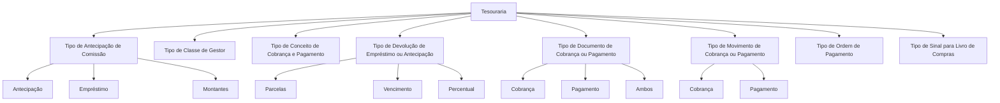

# Tipos de Tesouraria: Classificações para Cobro, Pago, Antecipos e Gestão

## 1. Metadados do Documento
- **Arquivo de Origem:** Não identificado
- **Tipo de Documento:** Especificação Técnica
- **Domínio / Sistema:** Tesouraria
- **Público-Alvo:** Desenvolvedores, Analistas Funcionais, Operação e Negócio
- **Data/Versão Identificada:** Não identificada

---

## 2. Resumo Executivo & Contexto de Negócio

O documento define classificações de tipos utilizadas no domínio de **Tesouraria**, especialmente para operações de antecipos de comissão, empréstimos, cobrança, pagamento, ordens de pagamento e registro no livro de compras.

As classificações permitem identificar a natureza de uma operação financeira, como antecipação, empréstimo ou montante, e determinar como empréstimos ou antecipos de comissão serão devolvidos: por número de parcelas, vencimento ou percentual.

O conteúdo também estabelece categorias para gestores, conceitos de cobrança e pagamento, documentos financeiros, movimentos e ordens de pagamento. Essas categorias distinguem, por exemplo, cobrança de pagamento, documentos que atendem ambos os usos e o âmbito funcional de conceitos ligados a sinistros, resseguro, cosseguro, comissões de agentes e vida.

O documento não apresenta contratos de API, estruturas de banco de dados, interfaces, métodos HTTP, regras de cálculo monetário, integrações externas ou fluxos operacionais detalhados. O foco é estritamente o catálogo de tipos e suas descrições funcionais.

---

## 3. Arquitetura, Componentes & Tecnologias Envolvidas

O documento não descreve arquitetura de software, microsserviços, tecnologias, ambientes, servidores ou integrações. A estrutura identificada é um conjunto de classificações funcionais do domínio de Tesouraria.



> **Nota de Análise:** O documento lista tipos funcionais de Tesouraria, mas não detalha quais sistemas, serviços, tabelas, APIs ou processos persistem e consomem essas classificações.

---

## 4. Regras de Negócio, Especificações Funcionais & Processos

### Tipo de antecipação de comissão
O tipo de antecipação de comissão identifica o tipo de operação de antecipação que está sendo executada. As operações disponíveis são:

- **1 — ANTECIPACIÓN:** operação de antecipação.
- **2 — PRESTAMO:** operação de empréstimo.
- **3 — MONTOS:** operação associada a montantes.

### Tipo de classe de gestor
O tipo de classe de gestor determina as atividades de terceiros com as quais o gestor será validado. A classificação também permite identificar quando um recibo passa ao processo de inadimplência.

As classes de gestor listadas são: agente, banco, cobrador, débito automático em conta, gestor direto, gestor piloto cosseguro, escritório comercial, débito com cartão de crédito e gestor de inadimplência.

### Tipo de conceito de cobrança e pagamento
O tipo de conceito de cobrança e pagamento identifica a classificação à qual pertence determinado conceito de cobrança ou pagamento. A classificação determina o âmbito de utilização do conceito.

Os âmbitos listados são: sinistros, resseguro, cosseguro cedido, cosseguro aceito, cobranças e pagamentos diversos, comissões de agentes e conceitos de vida.

### Tipo de devolução de empréstimo ou antecipação de comissão
O tipo de devolução identifica a forma pela qual um empréstimo ou antecipação de comissão será devolvido. As modalidades são:

1. Por número de parcelas.
2. Por vencimento.
3. Por percentual.

### Tipo de documento de cobrança ou pagamento
O tipo de documento determina se um documento pode ser utilizado em operações de cobrança, em operações de pagamento ou em ambas.

- **C — COBRO:** documento utilizável em cobranças.
- **P — PAGO:** documento utilizável em pagamentos.
- **A — AMBOS:** documento utilizável em cobranças e/ou pagamentos.

### Tipo de movimento de cobrança ou pagamento
O tipo de movimento identifica se a operação financeira é uma cobrança ou um pagamento.

- **C — COBRO:** movimento de cobrança.
- **P — PAGO:** movimento de pagamento.

### Tipo de ordem de pagamento
O tipo de ordem de pagamento classifica ordens de pagamento nos seguintes domínios: Tesouraria, Sinistros, Remessas de Resseguro, Remessas de Cosseguro, Comissões de Agentes, Devolução de Prêmios e Vida.

### Tipo de sinal para livro de compras
O tipo de sinal para livro de compras identifica se um documento é registrado no livro de compras com sinal positivo ou negativo, considerando se o documento corresponde a pagamento ou cobrança.

> **Nota de Análise:** O documento associa os códigos `P` e `C` a pagamento e cobrança, respectivamente, mas não explicita qual dos dois códigos representa sinal positivo ou negativo.

---

## 5. Tabelas de Parâmetros, Ambientes e Estruturas de Dados

| Item / Parâmetro | Descrição / Função | Tipo / Valores / Formato | Ambiente / Observações |
| :--- | :--- | :--- | :--- |
| Tipo de antecipação de comissão | Identifica o tipo de operação de antecipação executada. | `1` = ANTECIPACIÓN; `2` = PRESTAMO; `3` = MONTOS | Tesouraria |
| Tipo de classe de gestor | Determina atividades de terceiros para validar o gestor e identifica quando um recibo entra em processo de inadimplência. | Valores numéricos de `1` a `8` e `10` | Tesouraria |
| Tipo de conceito de cobrança e pagamento | Identifica a classificação de um conceito de cobrança ou pagamento e determina seu âmbito de uso. | `SI`, `RE`, `CC`, `CA`, `CP`, `AC`, `VI` | Tesouraria |
| Tipo de devolução de empréstimo ou antecipação de comissão | Identifica a forma de devolução de empréstimo ou antecipação de comissão. | `1`, `2`, `3` | Tesouraria |
| Tipo de documento de cobrança ou pagamento | Determina se um documento pode ser usado para cobrança, pagamento ou ambos. | `C`, `P`, `A` | Tesouraria |
| Tipo de movimento de cobrança ou pagamento | Identifica se uma operação é cobrança ou pagamento. | `C`, `P` | Tesouraria |
| Tipo de ordem de pagamento | Classifica a ordem de pagamento por domínio operacional. | `T`, `S`, `R`, `C`, `A`, `D`, `V` | Tesouraria |
| Tipo de sinal para livro de compras | Identifica o sinal de registro de um documento no livro de compras conforme pagamento ou cobrança. | `P` = PAGO; `C` = COBRO | O sinal positivo ou negativo não é explicitado |

### Valores do tipo de classe de gestor

| Item / Parâmetro | Descrição / Função | Tipo / Valores / Formato | Ambiente / Observações |
| :--- | :--- | :--- | :--- |
| Classe de gestor `1` | Gestor classificado como agente. | `1` = AGENTE | Utilizado para validação do gestor |
| Classe de gestor `2` | Gestor classificado como banco. | `2` = BANCO | Utilizado para validação do gestor |
| Classe de gestor `3` | Gestor classificado como cobrador. | `3` = COBRADOR | Utilizado para validação do gestor |
| Classe de gestor `4` | Gestor classificado como débito automático em conta. | `4` = DEBITO AUTOMATICO EN CUENTA | Utilizado para validação do gestor |
| Classe de gestor `5` | Gestor classificado como gestor direto. | `5` = GESTOR DIRECTO | Utilizado para validação do gestor |
| Classe de gestor `6` | Gestor classificado como gestor piloto cosseguro. | `6` = GESTOR PILOTO COASEGURO | Utilizado para validação do gestor |
| Classe de gestor `7` | Gestor classificado como escritório comercial. | `7` = OFICINA COMERCIAL | Utilizado para validação do gestor |
| Classe de gestor `8` | Gestor classificado como débito com cartão de crédito. | `8` = DEBITO CON TARJETA DE CREDITO | Utilizado para validação do gestor |
| Classe de gestor `10` | Gestor classificado como gestor de inadimplência. | `10` = GESTOR DE IMPAGOS | Relacionado ao processo de inadimplência |

### Valores do tipo de conceito de cobrança e pagamento

| Item / Parâmetro | Descrição / Função | Tipo / Valores / Formato | Ambiente / Observações |
| :--- | :--- | :--- | :--- |
| Conceito de cobrança e pagamento | Classificação para o âmbito de sinistros. | `SI` = SINIESTROS | Tesouraria |
| Conceito de cobrança e pagamento | Classificação para o âmbito de resseguro. | `RE` = REASEGURO | Tesouraria |
| Conceito de cobrança e pagamento | Classificação para o âmbito de cosseguro cedido. | `CC` = COASEGURO CEDIDO | Tesouraria |
| Conceito de cobrança e pagamento | Classificação para o âmbito de cosseguro aceito. | `CA` = COASEGURO ACEPTADO | Tesouraria |
| Conceito de cobrança e pagamento | Classificação para cobranças e pagamentos diversos. | `CP` = COBROS Y PAGOS VARIOS | Tesouraria |
| Conceito de cobrança e pagamento | Classificação para comissões de agentes. | `AC` = AGENTES COMISIONES | Tesouraria |
| Conceito de cobrança e pagamento | Classificação para conceitos de vida. | `VI` = CONCEPTOS VIDA | Tesouraria |

### Valores do tipo de ordem de pagamento

| Item / Parâmetro | Descrição / Função | Tipo / Valores / Formato | Ambiente / Observações |
| :--- | :--- | :--- | :--- |
| Tipo de ordem de pagamento | Ordem relacionada à Tesouraria. | `T` = TESORERIA | Tesouraria |
| Tipo de ordem de pagamento | Ordem relacionada a Sinistros. | `S` = SINIESTROS | Tesouraria |
| Tipo de ordem de pagamento | Ordem relacionada a remessas de resseguro. | `R` = REMESAS DE REASEGURO | Tesouraria |
| Tipo de ordem de pagamento | Ordem relacionada a remessas de cosseguro. | `C` = REMESAS DE COASEGURO | Tesouraria |
| Tipo de ordem de pagamento | Ordem relacionada a comissões de agentes. | `A` = COMISIONES AGENTES | Tesouraria |
| Tipo de ordem de pagamento | Ordem relacionada à devolução de prêmios. | `D` = DEVOLUCION DE PRIMAS | Tesouraria |
| Tipo de ordem de pagamento | Ordem relacionada ao domínio de vida. | `V` = VIDA | Tesouraria |

---

## 6. Bateria de Perguntas & Respostas para RAG (FAQ Sintético)

### P1: Quais são os códigos disponíveis para o tipo de antecipação de comissão?
**R:** O tipo de antecipação de comissão possui três valores: `1` para **ANTECIPACIÓN**, `2` para **PRESTAMO** e `3` para **MONTOS**. Essa classificação identifica qual operação de antecipação está sendo executada.

### P2: Como um gestor é classificado como gestor de inadimplência?
**R:** Um gestor é classificado como gestor de inadimplência pelo código `10`, correspondente a **GESTOR DE IMPAGOS**. O documento informa que a classe de gestor também permite identificar quando um recibo passa ao processo de inadimplência.

### P3: Qual código representa débito automático em conta na classe de gestor?
**R:** O código `4` representa **DEBITO AUTOMATICO EN CUENTA** no tipo de classe de gestor.

### P4: Quais modalidades de devolução existem para empréstimo ou antecipação de comissão?
**R:** Existem três modalidades: `1` para devolução **POR NUMERO DE CUOTAS**, `2` para devolução por **VENCIMIENTO** e `3` para devolução por **PORCENTAJE**.

### P5: O que significa o código `A` no tipo de documento de cobrança ou pagamento?
**R:** O código `A` significa **AMBOS (COBRO Y/O PAGO)**. Um documento com esse tipo pode ser utilizado tanto em operações de cobrança quanto em operações de pagamento.

### P6: Qual é a diferença entre tipo de documento e tipo de movimento de cobrança ou pagamento?
**R:** O tipo de documento determina se o documento pode ser usado em cobrança, pagamento ou ambos, usando os códigos `C`, `P` e `A`. O tipo de movimento identifica a natureza da operação efetivamente realizada e aceita apenas `C` para cobrança e `P` para pagamento.

### P7: Qual código de conceito de cobrança e pagamento deve ser utilizado para cosseguro cedido?
**R:** O código `CC` corresponde a **COASEGURO CEDIDO**. O documento informa que o tipo de conceito define a classificação e o âmbito de uso do conceito de cobrança ou pagamento.

### P8: Qual código de conceito de cobrança e pagamento corresponde a comissões de agentes?
**R:** O código `AC` corresponde a **AGENTES COMISIONES**, classificado como conceito de cobrança e pagamento para o âmbito de comissões de agentes.

### P9: Quais códigos de ordem de pagamento estão relacionados a resseguro e cosseguro?
**R:** O código `R` representa **REMESAS DE REASEGURO** e o código `C` representa **REMESAS DE COASEGURO** no tipo de ordem de pagamento.

### P10: Qual código de ordem de pagamento representa devolução de prêmios?
**R:** O código `D` representa **DEVOLUCION DE PRIMAS** no tipo de ordem de pagamento.

### P11: O documento informa se o código `P` ou `C` corresponde a sinal positivo no livro de compras?
**R:** Não. O documento informa que o tipo de sinal para livro de compras distingue `P` como **PAGO** e `C` como **COBRO**, considerando registros com sinal positivo ou negativo. Entretanto, não associa explicitamente cada código ao sinal positivo ou ao sinal negativo.

### P12: Existem detalhes de APIs, URLs ou ambientes para os tipos de Tesouraria?
**R:** Não. O documento não apresenta APIs, URLs, ambientes, servidores, métodos HTTP, contratos JSON ou detalhes de integração. O conteúdo limita-se às classificações e descrições funcionais dos tipos de Tesouraria.

---

## 7. Glossário de Termos, Siglas & Conceitos-Chave

- **Tesouraria / TESORERÍA:** Domínio ao qual pertencem as classificações documentadas.
- **ANTECIPACIÓN:** Tipo de operação de antecipação de comissão.
- **PRESTAMO:** Tipo de operação de empréstimo.
- **MONTOS:** Tipo de operação listado para antecipação de comissão.
- **Gestor:** Entidade cuja classe é validada com base em atividades de terceiros.
- **IMPAGOS:** Processo de inadimplência mencionado para recibos.
- **COBRO:** Cobrança.
- **PAGO:** Pagamento.
- **SINIESTROS:** Classificação funcional utilizada em conceitos de cobrança e pagamento e em ordens de pagamento.
- **REASEGURO:** Classificação para resseguro.
- **COASEGURO CEDIDO:** Classificação para cosseguro cedido.
- **COASEGURO ACEPTADO:** Classificação para cosseguro aceito.
- **REMESAS:** Remessas, utilizadas nas categorias de resseguro e cosseguro.
- **PRIMAS:** Prêmios, utilizados no contexto de devolução de prêmios.
- **VIDA:** Classificação relacionada a conceitos ou ordens de pagamento de vida.
- **SI:** Código para SINIESTROS.
- **RE:** Código para REASEGURO.
- **CC:** Código para COASEGURO CEDIDO.
- **CA:** Código para COASEGURO ACEPTADO.
- **CP:** Código para COBROS Y PAGOS VARIOS.
- **AC:** Código para AGENTES COMISIONES.
- **VI:** Código para CONCEPTOS VIDA.

---

## 8. Notas Críticas, Riscos & Limitações

- O documento não identifica arquivo de origem, autor, versão, data de publicação ou responsável pela manutenção das classificações.
- Não há definição de sistemas consumidores, fontes de dados, APIs, tabelas de banco de dados ou regras de validação técnica dos códigos.
- Não são apresentados fluxos operacionais detalhados para criação, alteração, descontinuação ou auditoria das classificações.
- A descrição do tipo de sinal para livro de compras menciona sinais positivo e negativo, mas não explicita a correspondência entre sinal e os códigos `P` e `C`.
- O termo **MONTOS** é listado como tipo de antecipação de comissão, sem detalhamento funcional adicional.
- As siglas de conceitos de cobrança e pagamento são apresentadas com seus rótulos, mas o documento não define critérios de seleção quando mais de uma classificação puder ser aplicável.

---

## 9. Conteúdo Bruto Estruturado (Referência Fiel)

```text
--- [PÁGINA 1 DE 4] ---

TIPOS (TESORERÍA)
TIPO DE ANTICIPO DE COMISIÓN
Identifica el tipo de operación de anticipo que se está ejecutando.
TIPO DESCRIPCIÓN
1 ANTICIPO
2 PRESTAMO
3 MONTOS
TIPO DE CLASE DE GESTOR
Determina las actividades de tercero con las que se validará el gestor, además de identificar cuando
un recibo pasa al proceso de impagos.
TIPO DESCRIPCIÓN
1 AGENTE
2 BANCO
3 COBRADOR
4 DEBITO AUTOMATICO EN CUENTA
5 GESTOR DIRECTO
 / 
 RS
Inicio Soluciones APIs Documentación Zeus
ES


--- [PÁGINA 2 DE 4] ---

TIPO DESCRIPCIÓN
6 GESTOR PILOTO COASEGURO
7 OFICINA COMERCIAL
8 DEBITO CON TARJETA DE CREDITO
10 GESTOR DE IMPAGOS
TIPO DE CONCEPTO DE COBRO Y PAGO
Identifica la clasificación a la que pertenece el concepto de cobro y pago, esta clasificación determina
el ámbito de uso del mismo.
TIPO DESCRIPCIÓN
SI SINIESTROS
RE REASEGURO
CC COASEGURO CEDIDO
CA COASEGURO ACEPTADO
CP COBROS Y PAGOS VARIOS.
AC AGENTES COMISIONES
VI CONCEPTOS VIDA
TIPO DE DEVOLUCIÓN DEL PRÉSTAMO O ANTICIPO DE
COMISIÓN
Identifica la forma en la que se va a devolver un préstamo o un anticipo de comisión.


--- [PÁGINA 3 DE 4] ---

TIPO DESCRIPCIÓN
1 POR NUMERO DE CUOTAS
2 VENCIMIENTO
3 PORCENTAJE
TIPO DE DOCUMENTO DE COBRO O PAGO
Determina si el documento se puede utilizar en operaciones de cobro o en operaciones de pago.
TIPO DESCRIPCIÓN
C COBRO
P PAGO
A AMBOS (COBRO Y/O PAGO)
TIPO DE MOVIMIENTO DE COBRO O PAGO
Identifica si la operación es un cobro o un pago.
TIPO DESCRIPCIÓN
C COBRO
P PAGO
TIPO DE ORDEN DE PAGO
TIPO DESCRIPCIÓN
T TESORERIA
S SINIESTROS


--- [PÁGINA 4 DE 4] ---

TIPO DESCRIPCIÓN
R REMESAS DE REASEGURO
C REMESAS DE COASEGURO
A COMISIONES AGENTES
D DEVOLUCION DE PRIMAS
V VIDA
TIPO DE SIGNO PARA LIBRO DE COMPRAS
Identifica si un documento se registra el libro de compras con signo positivo o negativo, atendiendo a
que se trate de un pago o un cobro.
TIPO DESCRIPCIÓN
P PAGO
C COBRO
```
