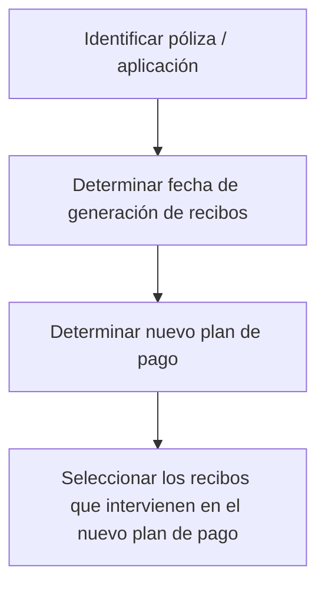
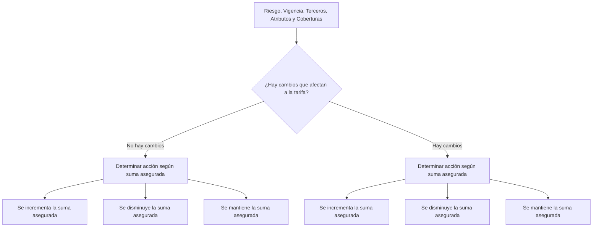

# Guia de Documentação, Operações e Estruturas do Reef.core

## 1. Metadados do Documento
- **Arquivo de Origem:** Não identificado
- **Tipo de Documento:** Apresentação Executiva / Guia de Documentação
- **Domínio / Sistema:** Reef.core; seguros, emissão, sinistros, tesouraria e contabilidade
- **Público-Alvo:** Desenvolvedores, Arquitetos, Operação e Negócio
- **Data/Versão Identificada:** Não identificada

---

## 2. Resumo Executivo & Contexto de Negócio

O documento apresenta uma estrutura de documentação para o ecossistema Reef.core, incluindo conteúdos funcionais, técnicos, de operação, certificação, desenvolvimento e implantação. A apresentação organiza tópicos relacionados a dicionários comuns, terceiros, emissão, sinistros, tesouraria, contabilidade, casos de teste, desenvolvimento e recursos de documentação.

No domínio de seguros, o material referencia operações de emissão de apólices, alteração de plano de pagamento, definição de ramo e franquia, gestão de riscos, vigências, terceiros, atributos, coberturas e recibos. Também apresenta um fluxo visual para identificar uma apólice ou aplicação, determinar a data de geração de recibos, determinar um novo plano de pagamento e selecionar os recibos envolvidos.

A estrutura de conhecimento do Reef.core contempla definições corporativas compartilhadas, tais como companhia, moeda, estrutura comercial, estrutura de produto, canal, quadro de comissão, agente, conceito econômico, documentos de entrada/saída, controle técnico e Platea. Essas definições são declaradas como necessárias para suportar definições que não pertencem exclusivamente ao módulo de emissão.

O documento também comunica pontos de acesso para documentação, vídeos, módulos do Reef.core, certificação de funcionalidade e código, integrações com ferramentas e informações para uma nova implantação. Entretanto, o conteúdo não detalha URLs completas, contratos técnicos, tecnologias de implementação, métodos HTTP, modelos de dados ou regras completas de cálculo.

---

## 3. Arquitetura, Componentes & Tecnologias Envolvidas

### Componentes e áreas citadas

| Componente / Área | Papel descrito no documento |
| :--- | :--- |
| Reef.core | Sistema/plataforma principal referenciado pela documentação. |
| Común | Nível de definições não exclusivas do módulo de emissão. |
| Terceros | Área que inclui definição de proveedores e definição de agentes intermediários. |
| Emisión | Área com termos de emissão, tipos de emissão, introdução, definição de ramo, franquia, emissão de apólice e alteração de plano de pagamento. |
| Siniestros | Área com definição IQRF, operações IQRF, definição SINI, operações SINI, certificação SINI, introdução SINI e formação de causas-cons. |
| Tesorería | Área com introdução e operações para criar anticipo-comisión e definir conceito de cobro-pago. |
| Contabilidad | Área com introdução à contabilidade. |
| Casos de Prueba | Conteúdo de casos de teste. |
| Desarrollo | Área que apresenta ícones para criar, modificar, apagar, inabilitar e consulta. |
| Zeus | Referenciado em “Inicio Soluciones APIs Documentación Zeus”. |
| Platea | Aplicação para a qual existe uma definição necessária de integração. |
| Reef.calidad.es | Referência textual para certificação de funcionalidade e código Reef. |
| Reef.core.es / Reef.core.en | Referências textuais para módulos e funcionalidades do Reef.core. |

### Fluxo funcional identificado



### Fluxo de análise de alterações de tarifa identificado



> **Nota de Análise:** O documento mostra as etapas e decisões do fluxo de tarifa, mas não descreve qual ação deve ser executada para incremento, redução ou manutenção da soma segurada.

---

## 4. Regras de Negócio, Especificações Funcionais & Processos

### Fluxo para novo plano de pagamento

O documento apresenta a seguinte sequência de processo:

1. Identificar a apólice ou aplicação.
2. Determinar a data de geração dos recibos.
3. Determinar o novo plano de pagamento.
4. Selecionar os recibos que intervêm no novo plano de pagamento.

O material não define os critérios de identificação da apólice/aplicação, as regras para determinar a data de geração, os tipos possíveis de plano de pagamento nem os critérios de seleção dos recibos.

### Avaliação de mudanças que afetam a tarifa

O processo considera os seguintes elementos:

- Risco.
- Vigência.
- Terceiros.
- Atributos.
- Coberturas.

Após avaliar esses elementos, o documento distingue dois cenários:

- Não há mudanças que afetam a tarifa.
- Há mudanças que afetam a tarifa.

Em ambos os cenários, devem ser determinadas ações conforme a variação da soma segurada:

- A soma segurada é incrementada.
- A soma segurada é reduzida.
- A soma segurada é mantida.

> **Nota de Análise:** A apresentação não informa regras de cálculo de tarifa, percentuais, fórmulas, impactos financeiros ou ações específicas para cada condição da soma segurada.

### Definições comuns necessárias ao processo de emissão

O nível **Común** contém definições que não são exclusivas do módulo de emissão, mas são necessárias para realizar definições relacionadas à emissão. O documento cita companhia, moeda, estrutura comercial, estrutura de produto, canal, quadro de comissão, agente, conceito econômico, documentos de entrada/saída, controle técnico e Platea.

### Operações e domínios citados

| Domínio | Operações ou conteúdos mencionados |
| :--- | :--- |
| Emissão | Termos de emissão, tipos de emissão, introdução, definição de ramo, definição de franquia, emitir apólice, emitir apólice-cobertura e alterar plano de pagamento. |
| Sinistros | Definição IQRF, operações IQRF, definição SINI, operações SINI, certificação SINI, introdução SINI e formação de causas-cons. |
| Tesouraria | Introdução, criar anticipo-comisión e definição de conceito de cobro-pago. |
| Contabilidade | Introdução à contabilidade. |
| Qualidade | Certificação de funcionalidade e de código Reef. |
| Desenvolvimento | Normas e regras para desenvolver no Reef.core. |
| Implantação | Conteúdo necessário para realizar uma nova implantação de Reef. |

---

## 5. Tabelas de Parâmetros, Ambientes e Estruturas de Dados

| Item / Parâmetro | Descrição / Função | Tipo / Valores / Formato | Ambiente / Observações |
| :--- | :--- | :--- | :--- |
| Compañía | Entidade ou entidades com as quais serão criadas as apólices e, consequentemente, os demais elementos. | Definição organizacional | Nível Común. |
| Moneda | Divisas com as quais o Reef.core realizará as diferentes operações da companhia. | Definição de divisa | Nível Común. |
| Estructura Comercial | Forma de estabelecer a organização territorial da companhia. | Definição organizacional | Nível Común. |
| Estructura Producto | Forma de organização dos ramos comercializados. | Definição de produto | Nível Común. |
| Canal | Diferentes vias pelas quais a nova produção chegará à companhia. | Definição de canal | Nível Común. |
| Cuadro Comisión | Agrupadores que determinam as comissões a serem pagas aos agentes. | Definição de comissão | Nível Común. |
| Agente | Terceiros que exercem intermediação entre cliente e companhia. | Definição de terceiro | Nível Común. |
| Concepto Económico | Conceitos que farão parte das informações econômicas do recibo. | Definição econômica | Nível Común. |
| Documentos de Entrada/Salida | Documentos que devem ser emitidos em uma operação e documentos que devem ser solicitados para uma operação. | Definição documental | Nível Común. |
| Control Técnico | Parâmetros necessários para realizar validações que permitem ou não finalizar uma operação. | Parâmetros de validação | Nível Común. |
| Platea | Definição necessária para integração com essa aplicação. | Integração | Nível Común. |
| Riesgo | Elemento considerado na análise de mudanças de tarifa. | Elemento funcional | Sem detalhamento adicional. |
| Vigencia | Elemento considerado na análise de mudanças de tarifa. | Elemento funcional | Sem detalhamento adicional. |
| Terceros | Elemento considerado na análise de mudanças de tarifa. | Elemento funcional | Sem detalhamento adicional. |
| Atributos | Elemento considerado na análise de mudanças de tarifa. | Elemento funcional | Sem detalhamento adicional. |
| Coberturas | Elemento considerado na análise de mudanças de tarifa. | Elemento funcional | Sem detalhamento adicional. |
| Suma asegurada | Pode ser incrementada, reduzida ou mantida na análise de tarifa. | Condição de decisão | Ações resultantes não detalhadas. |
| Crear | Ícone de desenvolvimento. | Ação | Símbolo visual não identificado no texto bruto. |
| Modificar | Ícone de desenvolvimento. | Ação | Símbolo visual não identificado no texto bruto. |
| Borrar | Ícone de desenvolvimento. | Ação | Símbolo visual não identificado no texto bruto. |
| Inhabilitar | Ícone de desenvolvimento. | Ação | Símbolo visual não identificado no texto bruto. |
| Tiene consulta | Ícone de desenvolvimento. | Capacidade de consulta | Símbolo visual não identificado no texto bruto. |

---

## 6. Bateria de Perguntas & Respostas para RAG (FAQ Sintético)

### P1: Qual é a sequência apresentada para definir um novo plano de pagamento?
**R:** A sequência apresentada é: identificar a apólice ou aplicação, determinar a data de geração dos recibos, determinar o novo plano de pagamento e selecionar os recibos que intervêm no novo plano de pagamento.

### P2: Quais elementos devem ser considerados ao avaliar mudanças que afetam a tarifa?
**R:** O documento cita risco, vigência, terceiros, atributos e coberturas como elementos considerados na análise de mudanças que afetam a tarifa.

### P3: Quais são os cenários de variação da soma segurada indicados no fluxo de tarifa?
**R:** O fluxo apresenta três cenários: incremento da soma segurada, redução da soma segurada e manutenção da soma segurada.

### P4: O documento define as ações para aumento, redução ou manutenção da soma segurada?
**R:** Não. O documento indica que uma ação deve ser determinada para cada cenário, mas não informa quais ações, cálculos ou regras devem ser aplicados.

### P5: O que é a definição de Compañía no nível Común?
**R:** Compañía é a definição da entidade ou entidades com as quais serão criadas as apólices e, consequentemente, os demais elementos.

### P6: Qual é a finalidade do Cuadro Comisión?
**R:** O Cuadro Comisión define os agrupadores que determinam as comissões que serão pagas aos agentes.

### P7: Como o documento define Agente?
**R:** Agente é definido como os terceiros que exercerão o papel de intermediários entre o cliente e a companhia.

### P8: Qual é o propósito do Control Técnico?
**R:** Control Técnico define os parâmetros necessários para realizar validações que permitem ou impedem a finalização de uma operação.

### P9: Quais operações de emissão são mencionadas?
**R:** São mencionados termos de emissão, tipos de emissão, introdução, definição de ramo, definição de franquia, emissão de apólice, emissão de apólice-cobertura e alteração de plano de pagamento.

### P10: Quais conteúdos de sinistros são mencionados?
**R:** São mencionados definição IQRF, operações IQRF, definição SINI, operações SINI, certificação SINI, introdução SINI e formação de causas-cons.

### P11: O que o documento informa sobre Platea?
**R:** O documento informa apenas que Platea requer uma definição necessária para integração com essa aplicação. Não são detalhados contratos, interfaces, protocolos ou dados de integração.

### P12: Quais recursos de documentação e capacitação do Reef.core são citados?
**R:** O documento cita documentação sobre o que sustenta o Reef, arquitetura do Reef.core, desenvolvimento, documentação de projetos evolutivos e corretivos, normas e regras de desenvolvimento, certificação, módulos, integrações com ferramentas e implantação.

---

## 7. Glossário de Termos, Siglas & Conceitos-Chave

- **Reef.core:** Plataforma ou sistema central mencionado no documento.
- **Común:** Nível que contém definições compartilhadas, não exclusivas do módulo de emissão.
- **Emisión:** Área relacionada a emissão de apólices, coberturas, ramo, franquia e planos de pagamento.
- **Siniestros:** Área relacionada a sinistros; o documento referencia IQRF e SINI.
- **IQRF:** Sigla mencionada no contexto de definição e operações de sinistros; significado não detalhado.
- **SINI:** Sigla mencionada no contexto de definição, operações e certificação de sinistros; significado não detalhado.
- **Tesorería:** Área que inclui operações de antecipação de comissão e conceitos de cobrança/pagamento.
- **Contabilidad:** Área relacionada à contabilidade.
- **Póliza:** Apólice identificada no fluxo de plano de pagamento.
- **Recibos:** Recibos cuja geração e seleção são consideradas no novo plano de pagamento.
- **Ramo:** Elemento sujeito a definição no contexto de emissão.
- **Franquicia:** Elemento sujeito a definição no contexto de emissão.
- **Suma asegurada:** Valor cuja condição pode ser incremento, redução ou manutenção no fluxo de tarifa.
- **Platea:** Aplicação para a qual o documento exige definição de integração.
- **Zeus:** Nome citado na sequência “Inicio Soluciones APIs Documentación Zeus”; sem detalhamento adicional.

---

## 8. Notas Críticas, Riscos & Limitações

- O nome do arquivo, a data, a versão, o autor e a classificação formal do documento não foram identificados no conteúdo fornecido.
- O material apresenta predominantemente tópicos, rótulos de navegação, cartões e diagramas resumidos; não fornece detalhamento completo de regras operacionais.
- As referências `Reef.calidad.es`, `Reef.core.es` e `Reef.core.en` aparecem no texto, mas não há URLs completas ou conteúdo acessível para validação.
- Não há especificação de APIs, métodos HTTP, contratos JSON, esquemas de dados, tecnologias de infraestrutura, versões, ambientes, portas ou caminhos de log.
- As siglas IQRF e SINI não são expandidas nem definidas no texto.
- O fluxo de alterações de tarifa não informa efeitos, cálculos, regras de decisão ou ações concretas para cada variação da soma segurada.
- O documento lista o componente Platea, porém não detalha mecanismos, interfaces ou dependências de integração.

---

## 9. Conteúdo Bruto Estruturado (Referência Fiel)

```text
--- [PÁGINA 1 DE 6] ---

DICCIONARIO
DICCIONARIO
COMÚN
Compensación  Comunes old
TERCEROS
Definición Proveedores
EMISIÓN
Términos emisión  Tipos emisión  Introducción
DEFINICIÓN ramo  DEFINIR franquicia
EMITIR Póliza  EMITIR Póliza-cobertura  ALTERAR plan pago
SINIESTROS
DEFINICIÓN IQRF  OPERACIONES IQRF
DEFINICIÓN SINI  OPERACIONES SINI  CERTIFICACIÓN SINI
INTRODUCCIÓN SINI  FORMACIÓN CAUSAS-CONS
PRUEBA
 /
 RS
Inicio Soluciones APIs Documentación Zeus
ES


--- [PÁGINA 2 DE 6] ---

TESORERÍA
Introducción Tesorería  OPERACION-CREAR-anticipo-comision
CREAR-anticipo-comision  DEFINICION-Tesoreria-concepto-cobro-pago
CONTABILIDAD
Introducción Contabilidad
CASOS DE PRUEBA
DIAGRAMA
Identificar
póliza/aplicación
Determinar fecha de
generación de recibos
Determinar nuevo
plan de pago
Seleccionar los
recibos que intervienen
en el nuevo plan de pago
DIAGRAMA CON RELLENO
RIESGO
VIGENCIA TERCEROS ATRIBUTOS COBERTURAS
DIAGRAMAS CON RELLENO Y ENLACES ENTRE ELLOS
NO HAY CAMBIOS que afectan a la tarifaHAY CAMBIOS que afectan a la tarifa
Determinar acción
cuando se INCREMENTA
la suma asegurada
Determinar acción
cuando se DISMINUYE
la suma asegurada
Determinar acción
cuando se MANTIENE
la suma asegurada
Determinar acción
cuando se INCREMENTA
la suma asegurada
Determinar acción
cuando se DISMINUYE
la suma asegurada
Determinar acción
cuando se MANTIENE
la suma asegurada
LISTAS
ORDENADAS
1. Primer elemento
2. Segundo elemento
3. Tercer elemento


--- [PÁGINA 3 DE 6] ---

SIN ORDEN
Primer elemento
Segundo elemento
Tercer elemento
TARJETAS (CON ICONO)
Aquí podrás encontrar toda la información
relativa a aquello que sustenta a Reef
Here you can find all the information related to
what supports Reef
Encuentra la documentación que permite
adquirir conocimientos sobre la arquitectura
de Reef.core y como desarrollar con ella
Find the documentation that allows you to
acquire knowledge about the Reef.core
architecture and how to develop with it
Aprende como se documentan los proyectos,
evolutivos, correctivos, software y mucho más
en Reef
Learn how projects are documented,
evolutionary, corrective, software and much
more in Reef
Conoce las normas, reglas, de como
desarrollar en Reef.core
Know the norms, rules, how to develop in
Reef.core


--- [PÁGINA 4 DE 6] ---

[Descubre como se consigue la certificación
tanto de la funcionalidad como del código de
Reef][Reef.calidad.es]
[
  Accede][Reef.calidad.es]
Find out how to get certified for both the
functionality and the Reef code
[Descubre todos los módulos de Reef.core y
la funcionalidad que ofrece cada uno de ellos]
[Reef.core.es]
[
  Accede][Reef.core.es]
[Discover the Reef.core modules and the
functionality each of them offers]
[Reef.core.en]
[
  Access][Reef.core.en]
Comprueba aquellas herramientas con las
que Reef.core se integra y/o aportan mayor
funcionalidad a Reef
Check those tools with which Reef.core
integrates and/or provide greater functionality
to Reef
Encuentra todo lo necesario para realizar una
nueva implantación de Reef
Find everything you need to carry out a new
Reef implementation
TARJETAS CON ASTERISCO
COMÚN
En este nivel se encuentran definiciones que no son exclusivas del
módulo de emisión, pero son necesarias para poder realizar la
definición. Entre otras definiciones se encuentra:
COMPAÑÍA
Definición de la entidad o entidades con las
que se van a crear las pólizas y por
consiguiente el resto de elementos
MONEDA
Definición de las divisas con las que
Reef.core va a realizar las distintas
operaciones de la compañía


--- [PÁGINA 5 DE 6] ---

accede a la documentación
accede al vídeo
accede a la documentación
accede al vídeo
ESTRUCTURA COMERCIAL
Definición de como se va a establecer la
organización territorial de la compañía
ESTRUCTURA PRODUCTO
Definición de como estarán organizados los
ramos que se comercializan
CANAL
Definición de las distintas vías por las que
llegará la nueva producción a la compañía
CUADRO COMISIÓN
Definición de los agrupadores que determinan
las comisiones que se van a pagar a los
agentes
AGENTE
Definición de los terceros que ejercerán de
intermediarios entre el cliente y la compañía
CONCEPTO ECONÓMICO
Definición de los conceptos que formarán
parte de la información económica del recibo
DOCUMENTOS DE ENTRADA/SALIDA
Definición de los documentos que deben salir
cuando se realiza una operación y de los
documentos que son necesarios solicitar
cuando se realiza una operación
CONTROL TÉCNICO
Definición de los parámetros necesarios para
realizar validaciones que permitan o no
finalizar la operación
PLATEA
Definición necesaria para la integración con
esta aplicación
BOTÓN SIN IMAGEN
Texto del botón
BOTÓN CON IMAGEN


--- [PÁGINA 6 DE 6] ---

DESARROLLO
ICONOS
 CREAR ( )
 MODIFICAR ( )
 BORRAR ( )
 INHABILITAR ( )
 TIENE CONSULTA ( )
 accede
 accede
 accede
CASOS DE TRADUCCIÓN
El ramo está habilitado
La caja está descuadrada
```
