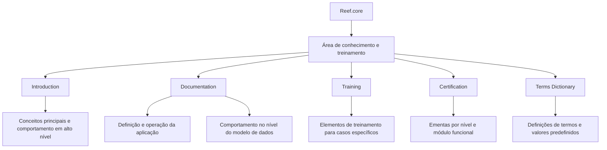

# Portal de Conhecimento, Treinamento e Certificação do Reef.core

## 1. Metadados do Documento
- **Arquivo de Origem:** Não identificado no conteúdo fornecido.
- **Tipo de Documento:** Manual Operacional / Apresentação de portal de conhecimento.
- **Domínio / Sistema:** Reef.core.
- **Público-Alvo:** Perfis funcionais e técnicos que precisam compreender, operar, documentar, treinar ou obter certificação relacionada ao Reef.core.
- **Data/Versão Identificada:** Não identificada.

---

## 2. Resumo Executivo & Contexto de Negócio

O conteúdo apresenta uma área denominada **TRAINING** associada ao sistema **Reef.core**. A finalidade declarada é disponibilizar documentação e cursos para aquisição de conhecimento funcional e técnico, incluindo materiais ligados à definição e à operação do sistema.

A informação do portal é organizada sob quatro perspectivas: **Introduction**, **Documentation**, **Training** e **Certification**. O conteúdo também apresenta uma seção adicional denominada **Terms Dictionary**, destinada às definições de termos e valores predefinidos utilizados pelo Reef.core.

A perspectiva **Introduction** reúne documentos para entendimento dos conceitos principais e do comportamento do Reef.core em alto nível. A perspectiva **Documentation** contém materiais para definir e operar a aplicação, além de apoiar o entendimento do comportamento do Reef.core no nível do modelo de dados.

A perspectiva **Training** disponibiliza elementos de treinamento voltados a casos específicos, com foco em conhecimento funcional e técnico. A perspectiva **Certification** disponibiliza a ementa de diferentes níveis de certificação, divididos por módulo funcional.

> *Nota de Análise: O conteúdo fornecido não descreve arquitetura de software, interfaces, contratos de API, fluxos operacionais detalhados, tecnologias de implementação, URLs completas ou critérios de certificação.*

---

## 3. Arquitetura, Componentes & Tecnologias Envolvidas

O conteúdo identifica o **Reef.core** como sistema central e apresenta as áreas de conteúdo do portal: Introduction, Documentation, Training, Certification e Terms Dictionary.

Também são exibidos os termos de navegação ou referências: **Home**, **Solutions**, **APIs**, **Documentation**, **Zeus**, **CF** e **EN**. O texto não detalha a função, a relação arquitetural ou o significado de Zeus, CF e EN.



> *Nota de Análise: O diagrama representa somente a organização conceitual explicitamente descrita. O documento não apresenta integração técnica entre componentes nem uma arquitetura de infraestrutura.*

---

## 4. Regras de Negócio, Especificações Funcionais & Processos

### Organização do conteúdo do portal

1. A seção **TRAINING** disponibiliza documentação para obtenção de conhecimento funcional e técnico.
2. A seção **TRAINING** também inclui cursos relacionados à definição e à operação do Reef.core.
3. A informação é organizada nas perspectivas **Introduction**, **Documentation**, **Training** e **Certification**.
4. A seção **Introduction** oferece documentos para compreender:
   - Os principais conceitos da aplicação.
   - O comportamento do Reef.core em alto nível.
5. A seção **Documentation** oferece documentos para:
   - Definir a aplicação.
   - Operar a aplicação.
   - Compreender o comportamento do Reef.core no nível do modelo de dados.
   - Apoiar diferentes perfis na compreensão do funcionamento do Reef.core.
6. A seção **Training** oferece elementos de treinamento orientados a casos específicos.
7. Os elementos da seção **Training** permitem adquirir conhecimento funcional e técnico do sistema.
8. A seção **Certification** disponibiliza as ementas dos diferentes níveis de certificação.
9. Os níveis de certificação são divididos por módulo funcional.
10. A seção **Terms Dictionary** contém definições de termos e valores predefinidos utilizados pelo Reef.core.

---

## 5. Tabelas de Parâmetros, Ambientes e Estruturas de Dados

| Item / Parâmetro | Descrição / Função | Tipo / Valores / Formato | Ambiente / Observações |
| :--- | :--- | :--- | :--- |
| Reef.core | Aplicação ou sistema abordado pelo portal de conhecimento. | Nome de sistema. | O documento não identifica versão, ambiente ou arquitetura. |
| Introduction | Área com documentos para compreender conceitos principais e comportamento em alto nível. | Perspectiva de conteúdo. | Não há detalhamento dos documentos disponíveis. |
| Documentation | Área com documentos sobre definição, operação e comportamento do Reef.core no modelo de dados. | Perspectiva de conteúdo. | Destinada a diferentes perfis. |
| Training | Área com documentação, cursos e elementos de treinamento para casos específicos. | Perspectiva de conteúdo. | Visa conhecimento funcional e técnico. |
| Certification | Área com ementas de níveis de certificação. | Perspectiva de conteúdo. | Dividida por módulo funcional. |
| Terms Dictionary | Área com definições de termos e valores predefinidos do Reef.core. | Perspectiva / dicionário. | Não são fornecidos termos ou valores concretos. |
| Home | Item exibido no conteúdo bruto. | Referência de navegação. | Função não detalhada. |
| Solutions | Item exibido no conteúdo bruto. | Referência de navegação. | Função não detalhada. |
| APIs | Item exibido no conteúdo bruto. | Referência de navegação. | O documento não fornece métodos, contratos ou endpoints. |
| Zeus | Item exibido no conteúdo bruto. | Termo ou referência de navegação. | Significado não detalhado. |
| CF | Item exibido no conteúdo bruto. | Sigla ou referência de navegação. | Significado não detalhado. |
| EN | Item exibido no conteúdo bruto. | Sigla ou seleção de idioma potencial. | O documento não confirma o significado. |

---

## 6. Bateria de Perguntas & Respostas para RAG (FAQ Sintético)

### P1: Qual é o objetivo da seção TRAINING do Reef.core?
**R:** A seção TRAINING disponibiliza documentação e cursos para aquisição de conhecimento funcional e técnico, incluindo conteúdos relacionados à definição e à operação do Reef.core.

### P2: Quais perspectivas organizam as informações do portal Reef.core?
**R:** As informações são organizadas nas perspectivas Introduction, Documentation, Training e Certification. O conteúdo também apresenta a seção Terms Dictionary.

### P3: Que tipo de conteúdo está disponível na área Introduction?
**R:** A área Introduction contém documentos para ajudar no entendimento dos principais conceitos da aplicação e do comportamento do Reef.core em alto nível.

### P4: O que a área Documentation permite compreender sobre o Reef.core?
**R:** A área Documentation disponibiliza documentos para definir e operar a aplicação, além de compreender o comportamento do Reef.core no nível do modelo de dados. O texto informa que diferentes perfis podem usar essa área para entender como o Reef.core funciona.

### P5: Para que servem os elementos da área Training?
**R:** Os elementos da área Training são orientados a casos específicos e permitem a aquisição de conhecimento funcional e técnico do sistema.

### P6: Como os níveis de certificação são organizados?
**R:** A área Certification contém a ementa dos diferentes níveis de certificação, divididos por módulo funcional.

### P7: O que contém o Terms Dictionary do Reef.core?
**R:** O Terms Dictionary contém definições dos termos e dos valores predefinidos utilizados pelo Reef.core.

### P8: O documento informa quais APIs do Reef.core estão disponíveis?
**R:** Não. Embora o termo “APIs” apareça no conteúdo bruto, o documento não informa endpoints, métodos HTTP, contratos, autenticação ou payloads das APIs.

### P9: O documento descreve a arquitetura técnica do Reef.core?
**R:** Não. O conteúdo descreve a organização de áreas de conhecimento, documentação, treinamento, certificação e dicionário de termos, mas não detalha componentes técnicos, infraestrutura, integrações ou tecnologias.

### P10: Há informações sobre versão ou data do Reef.core?
**R:** Não. O conteúdo fornecido não apresenta data, versão, edição ou histórico de alterações.

### P11: O conteúdo explica o significado de Zeus, CF e EN?
**R:** Não. Zeus, CF e EN aparecem no conteúdo bruto, mas o documento não fornece definições ou contexto adicional para esses termos.

### P12: Qual área deve ser consultada para entender o modelo de dados do Reef.core?
**R:** A área Documentation deve ser consultada, pois o texto informa que ela ajuda a compreender o comportamento do Reef.core no nível do modelo de dados.

---

## 7. Glossário de Termos, Siglas & Conceitos-Chave

- **Reef.core:** Aplicação ou sistema central mencionado no documento.
- **Introduction:** Perspectiva que reúne documentos sobre conceitos principais e comportamento do Reef.core em alto nível.
- **Documentation:** Perspectiva que reúne documentos sobre definição, operação e comportamento do Reef.core no nível do modelo de dados.
- **Training:** Perspectiva com elementos de treinamento para casos específicos e aquisição de conhecimento funcional e técnico.
- **Certification:** Perspectiva com ementas dos níveis de certificação, divididas por módulo funcional.
- **Terms Dictionary:** Seção com definições de termos e valores predefinidos utilizados pelo Reef.core.
- **APIs:** Termo exibido no conteúdo bruto; não há detalhamento de interfaces ou contratos.
- **Zeus:** Termo exibido no conteúdo bruto; significado não especificado.
- **CF:** Sigla exibida no conteúdo bruto; significado não especificado.
- **EN:** Sigla exibida no conteúdo bruto; significado não especificado.

---

## 8. Notas Críticas, Riscos & Limitações

- O conteúdo não identifica o nome do arquivo de origem, data, versão ou autor.
- O conteúdo não descreve arquitetura técnica, infraestrutura, tecnologias, integrações, ambientes, servidores, logs ou URLs.
- Não são apresentados métodos HTTP, contratos JSON, endpoints ou mecanismos de autenticação para o item “APIs”.
- O documento cita “Zeus”, “CF” e “EN”, mas não fornece significado ou contexto para esses termos.
- Não há detalhamento de módulos funcionais, critérios de certificação, cursos específicos ou documentos individuais.
- Não são fornecidas definições concretas dos termos e valores do Terms Dictionary.

---

## 9. Conteúdo Bruto Estruturado (Referência Fiel)

```text
--- [PÁGINA 1 DE 2] ---

TRAINING
 In this section you will find the documentation that allows you to acquire
both functional and technical knowledge, as well as different courses related to the
definition and operation with Reef.core. The information is organized into four
perspectives:
Introduction
Documentation
Training
Certification
Terms dictionary
INTRODUCTION
In this part you will find the documents that help you understand the main concepts of the application,
as well as knowing the behaviour of Reef.core at a high level.
DOCUMENTATION
Here you will find the documents that help define, operate with the application, as well as understand
the behaviour of Reef.core at the data model level. It is a place where different profiles can
understand how Reef.core works.
 / 
 CF
Home Solutions APIs Documentation Zeus
EN


--- [PÁGINA 2 DE 2] ---

TRAINING
Here you will find different training elements oriented to specific cases that allow you to acquire both
functional and technical knowledge of the system.
CERTIFICATION
Here you will find the syllabus of the different certification levels divided by functional module.
TERMS DICTIONARY
This section contains the different definitions of the terms and predefined values   used by Reef.core.
```
