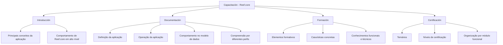

# Capacitação, Documentação, Formação e Certificação do Reef.core

## 1. Metadados do Documento
- **Arquivo de Origem:** Não informado
- **Tipo de Documento:** Procedimento / Material de capacitação
- **Domínio / Sistema:** Reef.core
- **Público-Alvo:** Perfis funcionais e técnicos
- **Data/Versão Identificada:** Não identificada

---

## 2. Resumo Executivo & Contexto de Negócio

O documento apresenta a área de **Capacitación** associada ao sistema **Reef.core**. Essa área centraliza documentação e cursos destinados à aquisição de conhecimentos funcionais e técnicos, além de conteúdos relacionados à definição e à operação do sistema.

A organização do conteúdo de capacitação é estruturada em quatro perspectivas: **Introducción**, **Documentación**, **Formación** e **Certificación**. Cada perspectiva possui finalidade própria, cobrindo desde conceitos iniciais e comportamento geral até modelo de dados, operação, casos concretos e trilhas de certificação.

A perspectiva de **Introducción** é destinada ao entendimento dos principais conceitos da aplicação e do comportamento de Reef.core em alto nível. A perspectiva de **Documentación** concentra materiais para definição e operação da aplicação, incluindo entendimento do comportamento de Reef.core no nível do modelo de dados.

A perspectiva de **Formación** reúne elementos formativos voltados a casuísticas concretas, com foco em conhecimento funcional e técnico. A perspectiva de **Certificación** disponibiliza temários de diferentes níveis de certificação, organizados por módulo funcional.

---

## 3. Arquitetura, Componentes & Tecnologias Envolvidas

O conteúdo não descreve arquitetura de software, integrações, tecnologias, ambientes, endpoints, protocolos ou microsserviços. O único sistema explicitamente citado é **Reef.core**.

A estrutura de informação apresentada é uma hierarquia de capacitação e documentação:



**Nota de Análise:** o documento não detalha componentes internos, métodos de integração, contratos, tecnologias, URLs de ambiente, topologia de infraestrutura ou modelos de dados específicos de Reef.core.

---

## 4. Regras de Negócio, Especificações Funcionais & Processos

1. A seção **Capacitación** disponibiliza documentação para aquisição de conhecimentos funcionais e técnicos.
2. A seção **Capacitación** também contém cursos relacionados à definição e à operação de Reef.core.
3. O conteúdo de capacitação é organizado em quatro perspectivas:
   - Introducción;
   - Documentación;
   - Formación;
   - Certificación.
4. A seção **Introducción** contém documentos voltados ao entendimento dos principais conceitos da aplicação.
5. A seção **Introducción** também permite conhecer o comportamento de Reef.core em alto nível.
6. A seção **Documentación** contém documentos que auxiliam na definição da aplicação.
7. A seção **Documentación** contém documentos que auxiliam na operação da aplicação.
8. A seção **Documentación** permite conhecer o comportamento de Reef.core no nível de modelo de dados.
9. A seção **Documentación** é destinada à compreensão do funcionamento de Reef.core por diferentes perfis.
10. A seção **Formación** contém elementos formativos orientados a casuísticas concretas.
11. Os elementos da seção **Formación** permitem adquirir conhecimentos funcionais e técnicos do sistema.
12. A seção **Certificación** contém temários para diferentes níveis de certificação.
13. Os temários de certificação são divididos por módulo funcional.

---

## 5. Tabelas de Parâmetros, Ambientes e Estruturas de Dados

| Item / Parâmetro | Descrição / Função | Tipo / Valores / Formato | Ambiente / Observações |
| :--- | :--- | :--- | :--- |
| Sistema | Aplicação referenciada pela documentação e pelos materiais de capacitação. | Reef.core | Não são informados ambiente, versão ou URL. |
| Capacitación | Área que reúne documentação e cursos para conhecimento funcional e técnico. | Seção de conteúdo | Organizada em quatro perspectivas. |
| Introducción | Materiais para compreender conceitos principais da aplicação e o comportamento de Reef.core em alto nível. | Perspectiva de capacitação | Não há detalhamento adicional. |
| Documentación | Materiais para definir e operar a aplicação e conhecer o comportamento no modelo de dados. | Perspectiva de capacitação | Voltada a diferentes perfis. |
| Formación | Elementos formativos para casuísticas concretas. | Perspectiva de capacitação | Abrange conhecimento funcional e técnico. |
| Certificación | Temários de certificação organizados por módulo funcional. | Perspectiva de capacitação | Existem diferentes níveis de certificação, sem especificação dos níveis. |
| Modelo de dados | Nível em que o comportamento de Reef.core pode ser conhecido por meio da documentação. | Conceito citado | Não há entidades, atributos ou relacionamentos descritos. |
| Navegação citada | Itens de navegação visíveis no conteúdo bruto. | Inicio, Soluciones, APIs, Documentación, Zeus, ES | Não há explicação funcional para esses itens. |

---

## 6. Bateria de Perguntas & Respostas para RAG (FAQ Sintético)

### P1: Qual é a finalidade da seção Capacitación do Reef.core?
**R:** A seção Capacitación reúne documentação e cursos para aquisição de conhecimentos funcionais e técnicos, incluindo conteúdos relacionados à definição e à operação do sistema Reef.core.

### P2: Quais são as quatro perspectivas de organização da capacitação em Reef.core?
**R:** A capacitação está organizada nas perspectivas Introducción, Documentación, Formación e Certificación.

### P3: O que é abordado na perspectiva Introducción?
**R:** A perspectiva Introducción reúne documentos que ajudam a entender os principais conceitos da aplicação e o comportamento de Reef.core em alto nível.

### P4: Onde encontrar materiais para definir ou operar a aplicação Reef.core?
**R:** Os materiais para definição e operação da aplicação estão na perspectiva Documentación.

### P5: A documentação do Reef.core aborda o modelo de dados?
**R:** Sim. A perspectiva Documentación permite conhecer o comportamento de Reef.core no nível de modelo de dados. Contudo, o documento não apresenta detalhes sobre entidades, campos ou relacionamentos desse modelo.

### P6: Para quem a perspectiva Documentación é destinada?
**R:** A perspectiva Documentación é destinada a distintos perfis que precisam compreender como Reef.core funciona, além de apoiar a definição, a operação e o entendimento do comportamento no modelo de dados.

### P7: Qual seção deve ser utilizada para aprendizado baseado em casos concretos?
**R:** A seção Formación contém elementos formativos orientados a casuísticas concretas, permitindo adquirir conhecimentos funcionais e técnicos do sistema.

### P8: Como os conteúdos de certificação são organizados?
**R:** A seção Certificación contém temários de diferentes níveis de certificação, divididos por módulo funcional.

### P9: O documento informa quais são os níveis de certificação disponíveis?
**R:** Não. O documento apenas afirma que existem distintos níveis de certificação; os nomes, requisitos ou critérios desses níveis não são detalhados.

### P10: O documento apresenta arquitetura técnica ou integrações do Reef.core?
**R:** Não. O conteúdo descreve a organização de materiais de capacitação, documentação, formação e certificação, sem detalhar arquitetura, integrações, tecnologias, ambientes ou contratos técnicos.

---

## 7. Glossário de Termos, Siglas & Conceitos-Chave

- **Reef.core:** Sistema ou aplicação referenciada pelo documento.
- **Capacitación:** Área que reúne documentação e cursos para aquisição de conhecimentos funcionais e técnicos relacionados a Reef.core.
- **Introducción:** Perspectiva de capacitação voltada aos conceitos principais da aplicação e ao comportamento de Reef.core em alto nível.
- **Documentación:** Perspectiva voltada à definição, operação e entendimento do comportamento de Reef.core no nível de modelo de dados.
- **Formación:** Perspectiva com elementos formativos orientados a casuísticas concretas.
- **Certificación:** Perspectiva que contém temários de diferentes níveis de certificação organizados por módulo funcional.
- **Modelo de dados:** Nível de entendimento do comportamento de Reef.core mencionado na seção Documentación.
- **Módulo funcional:** Unidade de organização dos temários de certificação; os módulos não são especificados no documento.
- **Casuísticas concretas:** Situações ou casos específicos aos quais os elementos de formação são orientados.

---

## 8. Notas Críticas, Riscos & Limitações

- O documento não informa o nome do arquivo de origem, data, versão, autor ou responsável pelo conteúdo.
- Não são especificados os módulos funcionais disponíveis para certificação.
- Não são detalhados os níveis de certificação, seus pré-requisitos, critérios de aprovação ou temários individuais.
- Não há descrição de arquitetura, tecnologias, microsserviços, APIs, URLs, ambientes, servidores, credenciais ou procedimentos operacionais.
- Embora o documento mencione o modelo de dados de Reef.core, não descreve entidades, relacionamentos, campos ou regras de integridade.
- Os itens de navegação “Inicio”, “Soluciones”, “APIs”, “Documentación”, “Zeus” e “ES” aparecem no conteúdo bruto, mas não possuem explicação contextual adicional.

---

## 9. Conteúdo Bruto Estruturado (Referência Fiel)

```text
--- [PÁGINA 1 DE 2] ---

CAPACITACIÓN
 En este apartado se encuentra la documentación que permite adquirir
conocimientos tanto funcionales como técnicos, así como distintos cursos
relacionados con la definición y operación con Reef.core. La información está
organizada en cuatro perspectivas:
Introducción
Documentación
Formación
Certificación
INTRODUCCIÓN
En esta parte se encuentran los documentos que ayudan a entender, los principales conceptos de la
aplicación, así como conocer el comportamiento de Reef.core a alto nivel.
DOCUMENTACIÓN
En este lugar se encuentran los documentos que ayudan a definir, operar con la aplicación, así como
conocer el comportamiento de Reef.core a nivel de modelo de datos. Es un lugar donde distintos
perfiles pueden comprender como Reef.core funciona.
 / 
 RS
Inicio Soluciones APIs Documentación Zeus
ES


--- [PÁGINA 2 DE 2] ---

FORMACIÓN
Aquí se encuentran distintos elementos formativos orientados a casuísticas concretas que permiten
adquirir tanto conocimientos funcionales como técnicos del sistema.
CERTIFICACIÓN
Aquí se encuentran los temarios de los distintos niveles de certificación divididos por módulo
funcional.
```
