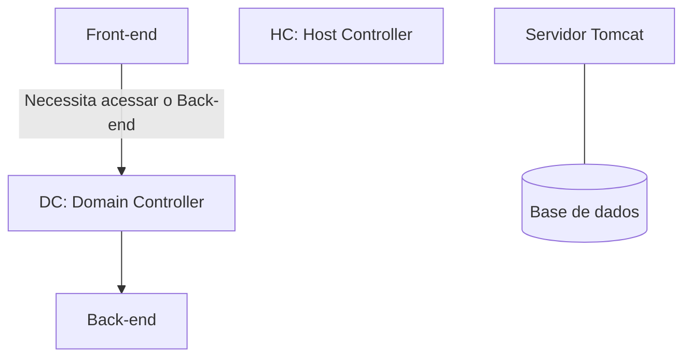
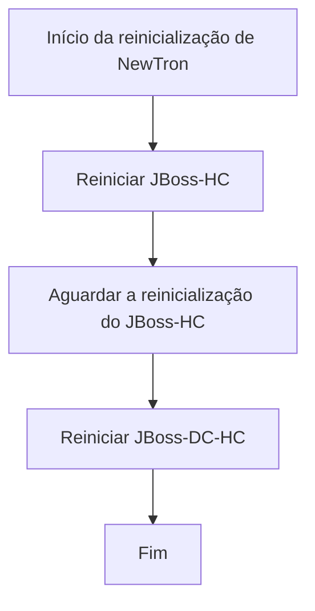
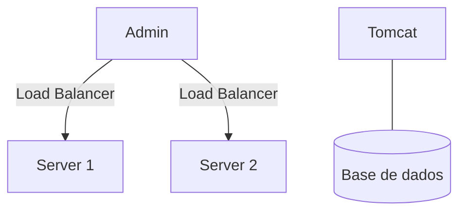
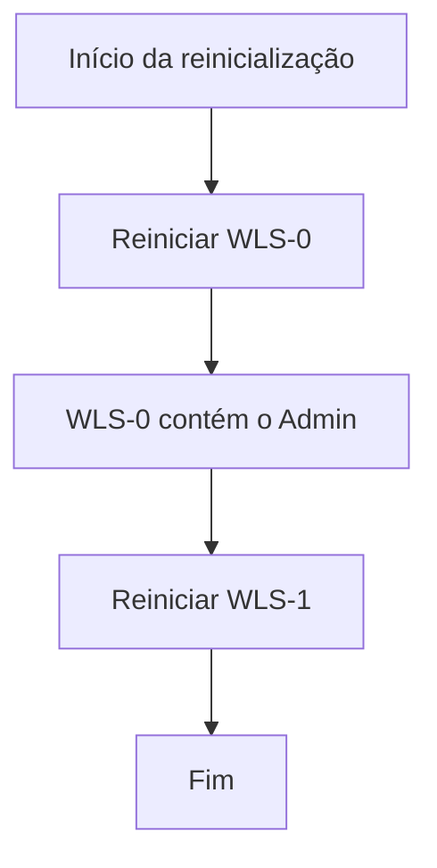

# Mapa de Infraestrutura: Ambientes REEF, Core e Diagramas JBoss/WebLogic

## 1. Metadados do Documento
- **Arquivo de Origem:** Não identificado no conteúdo fornecido
- **Tipo de Documento:** Arquitetura de Software
- **Domínio / Sistema:** REEF, Core, NewTron e ambientes corporativos
- **Público-Alvo:** Operação, desenvolvedores e arquitetos
- **Data/Versão Identificada:** Não identificada

---

## 2. Resumo Executivo & Contexto de Negócio

O documento apresenta um mapa de infraestrutura que organiza ambientes associados a REEF, Core, BPM e Activos Digitales. A estrutura abrange ambientes hospedados em OCI, AWS, Azure, Perú e Alcalá, além de referências a integrações, pré-produção e integração contínua do Core.

O conteúdo também registra uma relação de ambientes ou soluções, incluindo Reef Panamá, Reef Honduras, Teide, Baru, Galeras, RLS-2, Reef-academy, Dispersión, Objerator, Reef Uruguay e BPM. Contudo, o documento não detalha responsabilidades funcionais, URLs, servidores, versões, redes ou configurações específicas desses ambientes.

A seção de diagramas descreve aspectos operacionais de JBoss e WebLogic, especialmente comunicação entre Front-end e Back-end, independência dos servidores Tomcat — exceto pela dependência da base de dados — e procedimentos de reinicialização. Para JBoss, são citados Domain Controller (DC) e Host Controller (HC); para WebLogic, são citados Admin, Server 1, Server 2, WLS-0 e WLS-1.

O documento possui lacunas explícitas, como `TODO → ¿QUÉ ES REEF?, ¿de que se compone?` e `TODO Diagramas: 3 tipos de diagrama, kubernetes / CF`. Portanto, não há detalhamento suficiente para definir a composição de REEF, os três tipos de diagramas previstos, Kubernetes, CF, contratos de integração ou arquitetura completa dos ambientes.

---

## 3. Arquitetura, Componentes & Tecnologias Envolvidas

### Componentes, plataformas e ambientes citados

- **OCI:** plataforma que contém os ambientes Reef Panamá, Reef Honduras, ambientes de desenvolvimento de Core, Teide, Baru, Galeras, RLS-2, Reef-academy, Dispersión e Objerator.
- **AWS:** plataforma que contém Reef Uruguay e BPM.
- **Azure:** plataforma que contém Activos Digitales.
- **Core:** possui referências a ambientes de desenvolvimento, integração, pré-produção e integração contínua.
- **JBoss:** possui os elementos DC (Domain Controller) e HC (Host Controller).
- **WebLogic:** possui Admin, Server 1, Server 2, WLS-0 e WLS-1.
- **Tomcat:** servidor independente dos componentes apresentados, exceto pela base de dados.
- **NewTron:** sistema citado no procedimento de reinicialização de JBoss.
- **Kubernetes e CF:** mencionados em um item `TODO`, sem detalhamento adicional.
- **Home Solutions APIs Documentation Zeus:** expressão presente no conteúdo bruto, sem contextualização adicional.

### Fluxo JBoss descrito



### Fluxo operacional de reinicialização do JBoss



### Fluxo WebLogic descrito



### Fluxo operacional de reinicialização do WebLogic



> **Nota de Análise:** O documento menciona JBoss, WebLogic, Tomcat, Kubernetes e CF, mas não informa versões, topologia de rede, portas, protocolos, configurações de cluster ou contratos de integração.

---

## 4. Regras de Negócio, Especificações Funcionais & Processos

### Comunicação Front-end e Back-end no JBoss

1. O **DC (Domain Controller)** permite a comunicação entre o **Front-end** e o **Back-end**.
2. Quando o Front-end precisa acessar o Back-end, o acesso é realizado por meio do DC.
3. O documento não detalha protocolo, rota, endpoint, autenticação ou formato de dados usados nessa comunicação.

### Independência do Tomcat

1. O servidor **Tomcat** é independente de todos os demais componentes apresentados.
2. A exceção explicitamente indicada é a **base de dados**.
3. O documento informa que o Tomcat está presente para aproveitar espaço, entre outros motivos.
4. O documento não descreve aplicações implantadas no Tomcat, conexões com bancos de dados ou responsabilidades específicas.

### Procedimento de reinicialização do NewTron com JBoss

1. Para reiniciar o NewTron, reiniciar somente o **JBoss-HC** pode ser suficiente.
2. O documento recomenda reiniciar o **JBoss-DC-HC**, pois a reinicialização leva pouco tempo.
3. A recomendação busca evitar maior tempo de resolução caso ocorram problemas futuros.
4. É obrigatório aguardar o término da reinicialização do **JBoss-HC** antes de reiniciar o **JBoss-DC-HC**.

### Balanceamento e reinicialização no WebLogic

1. O componente **Admin** atua como **Load Balancer** entre o **Server 1** e o **Server 2**.
2. O **Tomcat** também é independente no cenário WebLogic, com exceção da base de dados.
3. O Tomcat é utilizado para economizar espaço, entre outros motivos.
4. A ordem de reinicialização é:
   1. Reiniciar **WLS-0** primeiro.
   2. Confirmar que WLS-0 foi reiniciado.
   3. Reiniciar **WLS-1**.
5. A prioridade de WLS-0 ocorre porque WLS-0 contém o componente **Admin**.

---

## 5. Tabelas de Parâmetros, Ambientes e Estruturas de Dados

| Item / Parâmetro | Descrição / Função | Tipo / Valores / Formato | Ambiente / Observações |
| :--- | :--- | :--- | :--- |
| Reef Panamá | Ambiente listado no mapa de infraestrutura | Nome de ambiente | OCI |
| Reef Honduras | Ambiente listado no mapa de infraestrutura | Nome de ambiente | OCI |
| Entornos de desarrollo de Core | Ambientes de desenvolvimento do Core | Nome de ambiente | OCI |
| Teide | Ambiente listado | Nome de ambiente | OCI |
| Baru | Ambiente listado | Nome de ambiente | OCI |
| Galeras | Ambiente listado | Nome de ambiente | OCI |
| RLS-2 | Ambiente listado | Nome de ambiente | OCI |
| Reef-academy | Ambiente listado | Nome de ambiente | OCI |
| Dispersión | Ambiente listado | Nome de ambiente | OCI |
| Objerator | Ambiente listado | Nome de ambiente | OCI |
| Reef Uruguay | Ambiente listado | Nome de ambiente | AWS |
| BPM | Ambiente listado | Nome de ambiente | AWS |
| Activos Digitales | Ambiente listado | Nome de ambiente | Azure |
| Entorno Perú | Ambiente listado | Nome de ambiente | Perú |
| Entornos en Alcalá | Ambientes listados | Nome de ambiente | Alcalá |
| Integración Core | Ambiente ou etapa listada | Nome de ambiente/integração | Core |
| Preproducción Core | Ambiente de pré-produção listado | Nome de ambiente | Core |
| Integración Continua Core (IC Core) | Ambiente ou processo de integração contínua listado | Nome de ambiente/processo | Core |
| DC | Domain Controller; permite comunicação entre Front-end e Back-end | Componente JBoss | O Front-end acessa o Back-end por meio do DC |
| HC | Host Controller | Componente JBoss | Utilizado no procedimento de reinicialização |
| JBoss-HC | Elemento de reinicialização do JBoss | Instância/componente citado | Deve ser reiniciado antes do JBoss-DC-HC |
| JBoss-DC-HC | Elemento de reinicialização recomendado | Instância/componente citado | Reiniciar após JBoss-HC estar reiniciado |
| Admin | Atua como Load Balancer entre Server 1 e Server 2 | Componente WebLogic | Está contido em WLS-0 |
| Server 1 | Servidor balanceado pelo Admin | Servidor | Cenário WebLogic |
| Server 2 | Servidor balanceado pelo Admin | Servidor | Cenário WebLogic |
| WLS-0 | Componente que contém o Admin | Instância/componente WebLogic | Deve ser reiniciado primeiro |
| WLS-1 | Instância/componente WebLogic | Instância/componente WebLogic | Deve ser reiniciado após WLS-0 |
| Tomcat | Servidor independente, exceto pela base de dados | Servidor de aplicações citado | Presente para aproveitar/economizar espaço, entre outros motivos |
| Base de dados | Exceção à independência do Tomcat | Dependência citada | Não há tecnologia, nome ou configuração informados |

---

## 6. Bateria de Perguntas & Respostas para RAG (FAQ Sintético)

### P1: Quais ambientes estão listados na plataforma OCI?
**R:** O documento lista em OCI os ambientes Reef Panamá, Reef Honduras, entornos de desarrollo de Core, Teide, Baru, Galeras, RLS-2, Reef-academy, Dispersión e Objerator.

### P2: Quais ambientes estão listados em AWS?
**R:** O documento lista Reef Uruguay e BPM como ambientes em AWS. Não há informações adicionais sobre arquitetura, servidores ou responsabilidades desses dois ambientes.

### P3: Qual ambiente é mencionado para Azure?
**R:** O ambiente mencionado em Azure é Activos Digitales. O documento não fornece detalhamento técnico adicional sobre esse ambiente.

### P4: Qual é o papel do DC no JBoss?
**R:** DC significa Domain Controller. Segundo o documento, o DC permite a comunicação entre Front-end e Back-end. Quando o Front-end precisa acessar o Back-end, o acesso ocorre por meio do DC.

### P5: O que significa HC no contexto do JBoss?
**R:** HC significa Host Controller. O documento o cita no procedimento de reinicialização do NewTron, indicando que JBoss-HC deve ser reiniciado antes de JBoss-DC-HC.

### P6: Qual é a sequência recomendada para reiniciar NewTron no ambiente JBoss?
**R:** O documento informa que reiniciar somente JBoss-HC pode ser suficiente para NewTron, mas recomenda reiniciar JBoss-DC-HC também. A sequência é reiniciar JBoss-HC, aguardar sua reinicialização terminar e, somente então, reiniciar JBoss-DC-HC.

### P7: Por que o documento recomenda reiniciar JBoss-DC-HC após JBoss-HC?
**R:** A recomendação é feita porque a reinicialização de JBoss-DC-HC leva pouco tempo e pode evitar maior tempo de resolução caso ocorram problemas futuros. O documento não apresenta métricas de tempo nem critérios adicionais para essa decisão.

### P8: Como o Admin atua no cenário WebLogic?
**R:** No cenário WebLogic, o Admin atua como Load Balancer entre o Server 1 e o Server 2. O documento não detalha o algoritmo de balanceamento, as verificações de saúde ou a configuração desse balanceamento.

### P9: Qual é a ordem de reinicialização dos componentes WebLogic?
**R:** Deve-se reiniciar WLS-0 primeiro, pois WLS-0 contém o Admin. Após a reinicialização de WLS-0, deve-se reiniciar WLS-1.

### P10: Qual é a relação do Tomcat com os demais componentes?
**R:** O documento afirma que o servidor Tomcat é independente de todos os componentes, exceto da base de dados. O Tomcat está presente para aproveitar ou economizar espaço, entre outros motivos. Não são informadas aplicações, bancos de dados ou parâmetros de conexão.

### P11: O documento explica o que é REEF ou como REEF é composto?
**R:** Não. O documento contém explicitamente o item `TODO → ¿QUÉ ES REEF?, ¿de que se compone?`, indicando que a definição e a composição de REEF ainda não foram detalhadas.

### P12: Quais ambientes relacionados ao Core são citados?
**R:** O documento cita entornos de desarrollo de Core, Integración Core, Preproducción Core e Integración Continua Core (IC Core). Não há detalhamento sobre objetivos, pipelines, ferramentas ou critérios de promoção entre esses ambientes.

---

## 7. Glossário de Termos, Siglas & Conceitos-Chave

- **Admin:** componente que atua como Load Balancer entre Server 1 e Server 2 no cenário WebLogic.
- **AWS:** plataforma na qual são listados Reef Uruguay e BPM.
- **Azure:** plataforma na qual é listado Activos Digitales.
- **BPM:** ambiente listado em AWS; o documento não expande a sigla.
- **CF:** termo mencionado em um `TODO` de diagramas, sem definição adicional.
- **Core:** domínio ou sistema com ambientes de desenvolvimento, integração, pré-produção e integração contínua.
- **DC:** *Domain Controller*; componente que permite a comunicação entre Front-end e Back-end no contexto JBoss.
- **Front-end:** componente que acessa o Back-end por meio do DC, conforme descrito no documento.
- **HC:** *Host Controller*; componente citado no contexto JBoss e no procedimento de reinicialização.
- **IC Core:** *Integración Continua Core*; ambiente ou processo listado para Core.
- **JBoss:** tecnologia ou ambiente que contém os elementos DC e HC no documento.
- **Kubernetes:** termo mencionado em um `TODO` de diagramas, sem detalhamento adicional.
- **Load Balancer:** função atribuída ao Admin entre Server 1 e Server 2.
- **NewTron:** sistema citado no procedimento de reinicialização de JBoss.
- **OCI:** plataforma na qual são listados diversos ambientes REEF e Core.
- **REEF:** sistema ou domínio mencionado no mapa de infraestrutura; a definição e composição não são apresentadas.
- **Tomcat:** servidor independente dos demais componentes apresentados, exceto pela base de dados.
- **WebLogic:** tecnologia ou ambiente que contém Admin, Server 1, Server 2, WLS-0 e WLS-1.
- **WLS-0:** componente WebLogic que contém o Admin e deve ser reiniciado primeiro.
- **WLS-1:** componente WebLogic que deve ser reiniciado após WLS-0.

---

## 8. Notas Críticas, Riscos & Limitações

- O documento não informa o que é REEF nem quais componentes formam REEF; existe um `TODO` explícito para esse conteúdo.
- Não são apresentados detalhes arquiteturais para os ambientes listados em OCI, AWS, Azure, Perú ou Alcalá.
- Não há URLs, endereços IP, portas, nomes de hosts, credenciais, versões de software, tecnologias de banco de dados ou parâmetros de observabilidade.
- O documento menciona uma seção de arquitetura detalhada de WebLogic, mas essa seção não foi incluída no conteúdo fornecido.
- Há referência a três tipos de diagramas, Kubernetes e CF em um `TODO`, sem especificação adicional.
- A reinicialização de JBoss depende da ordem operacional: JBoss-HC deve estar reiniciado antes de JBoss-DC-HC.
- A reinicialização de WebLogic depende da ordem operacional: WLS-0 deve ser reiniciado antes de WLS-1, pois WLS-0 contém o Admin.
- Não há critérios de validação pós-reinicialização, procedimentos de rollback, janelas de manutenção ou responsáveis operacionais definidos.

---

## 9. Conteúdo Bruto Estruturado (Referência Fiel)

```text
--- [PÁGINA 1 DE 5] ---

MAPA INFRAESTRUCTURA
Índice
Introducción
Entornos en OCI
- Reef Panamá
- Reef Honduras
- Entornos de desarrollo de Core
- Teide
- Baru
- Galeras
- RLS-2
- Reef-academy
- Dispersión
- Objerator
Entornos en AWS
- Reef Uruguay
- BPM
Entornos en Azure
- Activos Digitales
Diagramas
- JBoss
- WebLogic
// TODO Diagramas: 3 tipos de diagrama, kubernetes
 / 
 CF
Home Solutions APIs Documentation Zeus
EN


--- [PÁGINA 2 DE 5] ---

Introducción
// TODO → ¿QUÉ ES REEF?, ¿de que se compone?
Entornos en OCI
Reef Panamá
Si se desea conocer la arquitectura del servidor de aplicaciones WebLogic con detalle, se puede
consultar el siguiente apartado:
Arquitectura WebLogic
Reef Honduras
Entornos de desarrollo de Core
Teide
Baru
Galeras
RLS-2
Reef-academy


--- [PÁGINA 3 DE 5] ---

Dispersión
Objerator
Entornos en AWS
Reef Uruguay
BPM
Entornos en Azure
Activos Digitales
Entorno Perú
Entornos en Alcalá
Integración Core
Preproducción Core
Integración Continua Core (IC Core)
Diagramas


--- [PÁGINA 4 DE 5] ---

Jboss
DC: Domain Controller
HC: Host Controller
DC permite la comunicación entre el Front-end y el Back-end, cuando el Front-end necesita acceder
al Back-end lo hace mediante DC
El servidor Tomcat es independiente de todo (A excepción de la base de datos) , se encuentra ahí
para aprovechar espacio entre otros motivos.
A la hora de reiniciar NewTron, reiniciar Jboss-HC puede ser suficiente, pero merece la pena reiniciar
Jboss-DC-HC, ya que se tarda poco por si hay problemas futuros, se tardaría más.
Hay que esperar a que esté reiniciado Jboss-HC para reiniciar Jboss-DC-HC
Weblogic


--- [PÁGINA 5 DE 5] ---

En este caso, el admin hace de Load Balancer entre el Server 1 y el Server 2, Tomcat también es
independiente (a excepción de la base de datos) y se encuentra ahí para ahorrar espacio entre otros
motivos.
A la hora de reiniciar, reiniciar WLS-0 primero ya que contiene al Admin, y una vez reiniciado, reiniciar
WLS-1
```
