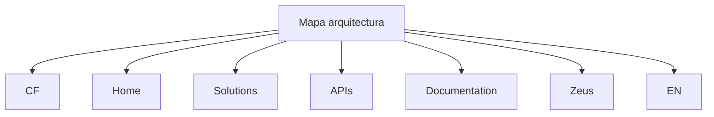

# Mapa de Arquitetura — Conteúdo Corporativo com Detalhamento Não Disponibilizado

## 1. Metadados do Documento
- **Arquivo de Origem:** Não identificado
- **Tipo de Documento:** Arquitetura de Software
- **Domínio / Sistema:** Não identificado; termos citados: CF, Home, Solutions, APIs, Documentation e Zeus
- **Público-Alvo:** Não identificado
- **Data/Versão Identificada:** Não identificada

---

## 2. Resumo Executivo & Contexto de Negócio

O conteúdo extraído apresenta o título ou rótulo **“Mapa arquitectura”**, indicando possível intenção de documentar uma arquitetura. Entretanto, não há descrição textual de componentes, responsabilidades, integrações, regras de negócio ou fluxos operacionais.

Os termos **CF**, **Home**, **Solutions**, **APIs**, **Documentation**, **Zeus** e **EN** aparecem no conteúdo. Pela disposição apresentada, esses termos podem corresponder a elementos de navegação, áreas funcionais, recursos documentais ou identificadores de sistema; o documento não fornece definição suficiente para classificá-los com precisão.

Não há informações sustentadas sobre objetivo de negócio, problema atendido, processos corporativos, ambientes, equipes responsáveis ou benefícios esperados. Portanto, esta referência preserva os termos encontrados sem inferir relações arquiteturais não documentadas.

> **Nota de Análise:** O conteúdo menciona “Mapa arquitectura”, mas não detalha camadas, serviços, APIs, protocolos, contratos, fluxos de dados ou tecnologias.

---

## 3. Arquitetura, Componentes & Tecnologias Envolvidas

Os únicos elementos identificados literalmente são:

- **CF**
- **Home**
- **Solutions**
- **APIs**
- **Documentation**
- **Zeus**
- **EN**

Não existem relações explícitas entre esses elementos. O diagrama abaixo representa apenas a coocorrência dos termos no conteúdo, sem afirmar integração, dependência ou fluxo técnico.



> **Nota de Análise:** O documento não especifica se CF, Zeus ou os demais termos representam aplicações, módulos, menus, domínios, ambientes ou tecnologias.

---

## 4. Regras de Negócio, Especificações Funcionais & Processos

Não foram identificadas regras de negócio, critérios de validação, parâmetros de cálculo, fluxos de processo, requisitos funcionais ou restrições técnicas no conteúdo fornecido.

O documento contém apenas a expressão **“Mapa arquitectura”** e uma sequência de termos: **CF**, **Home**, **Solutions**, **APIs**, **Documentation**, **Zeus** e **EN**.

---

## 5. Tabelas de Parâmetros, Ambientes e Estruturas de Dados

| Item / Parâmetro | Descrição / Função | Tipo / Valores / Formato | Ambiente / Observações |
| :--- | :--- | :--- | :--- |
| Mapa arquitectura | Título ou rótulo presente no conteúdo. | Texto | Não há detalhamento arquitetural adicional. |
| CF | Termo citado sem definição. | Texto | Não foi possível identificar significado ou responsabilidade. |
| Home | Termo citado sem definição. | Texto | Pode indicar navegação, mas o documento não confirma. |
| Solutions | Termo citado sem definição. | Texto | Não há componentes ou funcionalidades descritos. |
| APIs | Termo citado sem especificação de interfaces. | Texto | Não há métodos, endpoints, contratos ou protocolos. |
| Documentation | Termo citado sem descrição. | Texto | Não há referência a documentos ou repositórios específicos. |
| Zeus | Termo citado sem definição. | Texto | Não há informações sobre função, tecnologia ou integração. |
| EN | Termo citado sem definição. | Texto | Não há confirmação de que represente idioma ou ambiente. |

---

## 6. Bateria de Perguntas & Respostas para RAG (FAQ Sintético)

### P1: Qual é o título apresentado no conteúdo de origem?
**R:** O título apresentado no conteúdo é **“Mapa arquitectura”**.

### P2: O documento descreve a arquitetura de algum sistema com detalhes?
**R:** Não. Embora o conteúdo apresente o termo “Mapa arquitectura”, não há descrição de componentes, camadas, integrações, tecnologias, fluxos ou responsabilidades.

### P3: Quais termos são citados além de “Mapa arquitectura”?
**R:** O conteúdo cita os termos **CF**, **Home**, **Solutions**, **APIs**, **Documentation**, **Zeus** e **EN**.

### P4: O que significa a sigla ou termo CF no documento?
**R:** O documento apenas cita **CF** e não fornece expansão, definição, contexto funcional ou relação arquitetural para esse termo.

### P5: Existem APIs documentadas no conteúdo?
**R:** Não. O termo **APIs** aparece no conteúdo, mas não há endpoints, métodos HTTP, contratos de dados, autenticação, protocolos ou documentação técnica de APIs.

### P6: O documento explica a função de Zeus?
**R:** Não. **Zeus** é citado nominalmente, mas o conteúdo não especifica se Zeus é um sistema, módulo, componente, serviço ou outro tipo de entidade.

### P7: Há ambientes, URLs, servidores ou parâmetros técnicos identificados?
**R:** Não. O conteúdo não apresenta URLs, nomes de servidores, portas, variáveis, rotas de log, ambientes ou parâmetros de configuração.

### P8: O documento contém regras de negócio ou processos operacionais?
**R:** Não. Não foram identificadas regras de negócio, etapas de processo, validações, exceções ou critérios operacionais.

### P9: É possível estabelecer uma integração entre CF, Zeus e APIs?
**R:** Não com fidelidade documental. Os termos são citados, mas o conteúdo não descreve dependências, chamadas, fluxos de dados ou integração entre eles.

### P10: O que representa o termo EN?
**R:** O conteúdo cita **EN**, mas não define seu significado. Não é possível afirmar se representa idioma, ambiente, módulo ou outro identificador.

---

## 7. Glossário de Termos, Siglas & Conceitos-Chave

- **APIs:** Termo citado literalmente; o documento não fornece definição, contratos ou interfaces associadas.
- **CF:** Termo citado literalmente; significado não identificado no conteúdo.
- **Documentation:** Termo citado literalmente; não há detalhamento de documentação associada.
- **EN:** Termo citado literalmente; significado não identificado no conteúdo.
- **Home:** Termo citado literalmente; não há definição funcional.
- **Mapa arquitectura:** Expressão apresentada como título ou rótulo do conteúdo.
- **Solutions:** Termo citado literalmente; não há definição funcional ou técnica.
- **Zeus:** Termo citado literalmente; não há definição do papel no contexto arquitetural.

---

## 8. Notas Críticas, Riscos & Limitações

- O conteúdo extraído é extremamente reduzido e não permite reconstruir uma arquitetura de software factual.
- Não há informação sobre relações entre **CF**, **Home**, **Solutions**, **APIs**, **Documentation**, **Zeus** e **EN**.
- Não foram identificados diagramas, especificações técnicas, contratos de API, fluxos de negócio, ambientes ou configurações.
- Qualquer classificação dos termos citados como sistemas, menus, serviços ou tecnologias seria especulativa e foi intencionalmente evitada.

---

## 9. Conteúdo Bruto Estruturado (Referência Fiel)

```text
--- [PÁGINA 1 DE 1] ---

Mapa arquitectura
 /
 CF
Home Solutions APIs Documentation Zeus
EN
```
