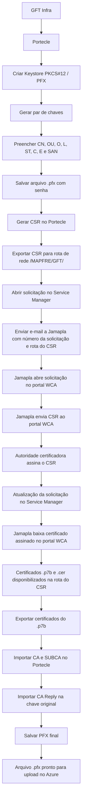
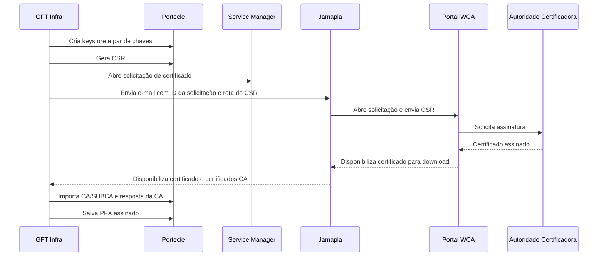

# Procedimento Operacional para Geração de Keystore PFX, CSR e Certificado PKI MAPFRE para NewTron

## 1. Metadados do Documento
- **Arquivo de Origem:** Não identificado no conteúdo fornecido
- **Tipo de Documento:** Manual Operacional / Procedimento Técnico
- **Domínio / Sistema:** Gestão de certificados PKI MAPFRE, NewTron, TRON, REEF, Azure e Service Manager
- **Público-Alvo:** Infraestrutura GFT, administradores de sistemas, equipes de operação, desenvolvedores e responsáveis por solicitações de certificados
- **Data/Versão Identificada:** Não identificada

---

## 2. Resumo Executivo & Contexto de Negócio

O documento descreve o procedimento para criar uma keystore no formato PFX/PKCS#12, gerar uma solicitação de assinatura de certificado (CSR — Certificate Signing Request), solicitar a assinatura do CSR por meio do Service Manager e importar a resposta assinada para disponibilizar um arquivo `.pfx` pronto para instalação no Azure.

O processo envolve a equipe GFT Infra, o portal Service Manager da MAPFRE, o portal WCA — acessível, segundo o documento, por Jamapla — e uma autoridade certificadora. Para certificados internos de Intranet, o procedimento indica o uso de PKI MAPFRE. Para certificados destinados à Internet e para ambientes de Produção, o documento indica DIGICERT como entidade emissora.

A ferramenta Portecle é utilizada para criar a keystore PKCS#12, gerar o par de chaves, preencher os dados de identidade do certificado, exportar o CSR, importar certificados CA e SUBCA e importar a resposta da CA. O arquivo PFX contém certificado digital, chave privada e, opcionalmente, certificados intermediários que constituem a cadeia de confiança.

A senha da keystore é um elemento operacional crítico: o documento exige que a senha seja guardada, pois será solicitada posteriormente, inclusive durante a instalação do certificado no Azure. Também recomenda registrar o alias do certificado, sua senha e uma data de expiração estimada em um ano após a geração.

O fluxo termina quando os arquivos recebidos da assinatura — mencionados como `.p7b` e `.cer` — são exportados e importados no Portecle. Após importar certificados confiáveis CA/SUBCA e a resposta de CA associada à chave criada, o arquivo `.pfx` é salvo e fica pronto para upload no Azure.

---

## 3. Arquitetura, Componentes & Tecnologias Envolvidas

| Componente / Tecnologia | Papel no processo |
| :--- | :--- |
| **GFT Infra** | Gera a keystore, exporta o CSR, solicita a assinatura, importa a cadeia de certificados e prepara o PFX. |
| **Portecle** | Aplicação utilizada para criar keystores, gerar pares de chaves, produzir CSRs e importar certificados. |
| **Keystore PFX / PKCS#12** | Arquivo criptografado que armazena certificado digital, chave privada e possivelmente certificados intermediários. |
| **CSR** | Solicitação de assinatura do certificado exportada a partir da keystore. |
| **Service Manager / SM** | Portal utilizado para abrir solicitações de certificado novo ou renovação de certificado. |
| **PKI MAPFRE** | Entidade emissora selecionada para ambientes não produtivos, conforme o documento. |
| **DIGICERT** | Entidade emissora indicada para certificados de ambientes de Produção e certificados para Internet. |
| **Jamapla** | Contato indicado para abrir solicitação no portal WCA, realizar upload do CSR e baixar o certificado assinado. |
| **Portal WCA** | Portal no qual, segundo o documento, Jamapla possui acesso para subir o CSR e baixar o certificado assinado. |
| **Azure** | Destino de instalação mencionado para o arquivo PFX final. |
| **NewTron** | Sistema citado no título e na descrição da solicitação de certificado. |
| **TRON / REEF** | Domínios e exemplos de nomes de certificado presentes no procedimento. |
| **CA / SUBCA** | Certificados de autoridade certificadora e subautoridade certificadora importados como certificados confiáveis. |
| **Arquivos `.p7b` e `.cer`** | Arquivos devolvidos após a assinatura do pedido de certificado. |



### Fluxo operacional de assinatura



---

## 4. Regras de Negócio, Especificações Funcionais & Processos

### 4.1 Processo completo de geração e assinatura

1. A GFT Infra deve gerar a keystore, descrita como contêiner de certificados, e exportar o CSR.
2. O CSR deve ser exportado para uma rota na unidade de rede `/MAPFRE/GFT/`.
3. Deve ser aberto um ticket no Service Manager para solicitar a assinatura do certificado.
4. Deve ser enviado e-mail a Jamapla com o número da solicitação no Service Manager, para que Jamapla abra uma solicitação no portal WCA e envie o CSR.
5. Quando a assinatura for concluída, a solicitação no Service Manager deve apresentar um comentário informando que o certificado foi assinado.
6. Deve ser enviado e-mail a Jamapla informando que a solicitação foi concluída e pedindo o certificado assinado.
7. Jamapla deve obter o certificado no portal WCA — no qual somente Jamapla possui permissões de download segundo o documento — e disponibilizar o certificado assinado, juntamente com os certificados de CA, na rota onde o CSR foi originalmente exportado.
8. A GFT Infra deve adicionar os certificados CA e o certificado resultante do CSR à keystore previamente criada.

### 4.2 Definição e composição da keystore PFX

Um keystore PFX, também chamado PKCS#12 ou arquivo `.pfx`, é um arquivo criptografado e seguro que armazena certificados digitais e chaves privadas.

| Elemento armazenado | Descrição |
| :--- | :--- |
| Certificado digital | Certificado público utilizado para identificar uma entidade, como servidor ou usuário, assinado por uma autoridade certificadora. |
| Chave privada | Chave correspondente ao certificado; é crítica para autenticação e criptografia e deve ser mantida em segredo. |
| Certificados intermediários | Elementos opcionais que permitem formar uma cadeia de confiança entre o certificado da entidade e a autoridade certificadora raiz. |

### 4.3 Criação de keystore e geração de chave

1. Abrir a aplicação **Portecle**.
2. Acessar a aba **File**.
3. Selecionar a opção **New Keystore**.
4. Selecionar o tipo **PKCS #12**.
5. Confirmar a seleção.
6. Acessar o menu **Tools**.
7. Selecionar **Generate Key Pair**.
8. Escolher o tamanho e o algoritmo para geração da chave.
9. Preencher os dados solicitados para a certificação.
10. Informar o e-mail do responsável no campo correspondente.
11. Confirmar os dados.
12. Definir um alias para a chave; o documento permite manter o alias padrão.
13. Salvar a keystore por meio de **File** > **Save Keystore As**.
14. Definir e guardar uma senha para a keystore.
15. Salvar o arquivo no formato `.pfx`, usando o nome do alias do certificado.
16. Criar uma cópia adicional do arquivo gerado para backup.

### 4.4 Dados de identidade apresentados para certificado interno de Intranet

O documento fornece os seguintes valores como referência para a criação de certificado interno de Intranet:

| Campo | Valor apresentado |
| :--- | :--- |
| CN | `tron-desa-ca.reef.mapfre.net` |
| OU | `MAPFRE` |
| O | `"MAPFRE, S.A."` |
| L | `Majadahonda` |
| ST | `Madrid` |
| C | `ES` |
| E | `jamapla@mapfre.com` |
| Subject Alternative DNS Name (SAN) | `tron-desa-ca.reef.mapfre.net` |

**Regra:** O Common Name (CN) e o Subject Alternative Name (SAN) podem ser diferentes conforme o certificado. O documento determina que esses dados sejam confirmados antes da criação do certificado.

### 4.5 Gestão de senha, alias, validade e backup

- A senha da keystore deve ser guardada obrigatoriamente.
- A senha será requerida em etapas posteriores e durante a instalação do certificado no Azure.
- A senha pode ser armazenada em um gestor de senhas.
- Recomenda-se guardar a senha junto ao alias do certificado.
- Recomenda-se registrar a expiração como um ano após a data de criação do certificado.
- Exemplo documentado: certificado gerado em `30-11-2022` deve ser registrado com expiração em `30-11-2023`.
- Recomenda-se criar uma cópia adicional do arquivo PFX como backup.

### 4.6 Geração do CSR

1. Continuar no Portecle após gerar a chave.
2. Clicar com o botão direito sobre a chave criada.
3. Selecionar **Generate Certification Request**.
4. Selecionar a localização na qual o CSR será salvo.
5. Confirmar a geração do arquivo.
6. Abrir a solicitação de certificado antes de pedir por e-mail que Jamapla abra a solicitação de assinatura do CSR.

### 4.7 Solicitação de certificado no Service Manager

O procedimento apresenta dois tipos de solicitação:

| Tipo de solicitação | Uso | URL apresentada |
| :--- | :--- | :--- |
| Portal Service Manager | Acesso inicial ao portal | `https://smaportal.mapfre.net/saw/ess?TENANTID=783319272` |
| Solicitação de certificado novo | Solicitar novo certificado da PKI | `https://smaportal.mapfre.net/sm/ess/offeringPage/IT SERVICES AND SECURITY_L1%23SECURITY_L2%23CERTIFICATE MANAGEMENT AND CODED SIGNATURE (CM)_L3%23REQUEST A CERTIFICATE FROM PKI (CM)_L4%23REQUEST A CERTIFICATE FROM PKI (CM)_L5_REQ?TENANTID=783319272` |
| Renovação de certificado | Solicitar renovação de certificado PKI | `https://smaportal.mapfre.net/sm/ess/offeringPage/IT SERVICES AND SECURITY_L1%23SECURITY_L2%23CERTIFICATE MANAGEMENT AND CODED SIGNATURE (CM)_L3%23CERTIFICATE RENEWAL OF PKI (CM)_L4%23CERTIFICATE RENEWAL OF PKI (CM)_L5_REQ?TENANTID=783319272` |

### 4.8 Regras para entidade emissora e lista de distribuição

- Para certificados destinados a ambientes de **Produção**, a entidade emissora deve ser **DIGICERT**.
- Para todos os demais ambientes, a entidade emissora deve ser **PKI MAPFRE**.
- Para certificados de Internet, o documento também indica o uso de **DIGIcert**.
- A lista de distribuição do grupo D.A. de Administração deve ser sempre `LTRONPDDESARROLLO@mapfre.com`.
- A lista de distribuição deve ser usada independentemente do ambiente e do sistema, incluindo exemplos como TronWeb, Newtron e Finametrix.

### 4.9 Campos de solicitação apresentados

| Campo | Valor ou instrução apresentada |
| :--- | :--- |
| Entidade emissora | `PKI MAPFRE` no exemplo; `DIGICERT` para Produção |
| Nome do certificado | `tron-desa-ca.reef.mapfre.net` |
| Tipo de certificado | `SSL` |
| Autorizadores | `DAVIJIM ; asanc35` |
| Lista de distribuição D.A. de Administração | `LTRONPDDESARROLLO@mapfre.com` |
| Nomes alternativos do certificado | `tron-desa-ca.reef.mapfre.net` |
| Tipo de servidor | `Unix/Linux`; é obrigatório anexar o CSR |
| Servidores de instalação | Alterar conforme o ambiente; exemplo: `wlDes-wls-0 ; wlDes-wls-1` |
| Exemplo alternativo de servidores | `wlInt-wls-0 ; wlInt-wls-1` |

### 4.10 Dados complementares da solicitação

| Campo | Valor apresentado |
| :--- | :--- |
| Título | `Solicitud certificado PKI Mapfre para instalar en servidores de NewTron` |
| Descrição | `Solicitud certificado PKI Mapfre para instalar en servidores de NewTron en entorno de Des, en máquinas Linux.` |
| Impacto de usuário | `2 - Sitio/Dpto.` |
| Necessitado para | Selecionar a data conveniente |
| Telefone temporário | `+34 973 28 40 52` |
| Horário de contato | `9:00-17:00h` |

### 4.11 Comunicação por e-mail e recebimento do certificado

O e-mail deve ser enviado aos seguintes destinatários e em cópia:

| Tipo | Endereço |
| :--- | :--- |
| Destinatário | `jamapla@mapfre.com` |
| Destinatário | `afizgar@mapfre.com` |
| Destinatário | `pabloh2@3p.mapfre.com` |
| Cópia | `mapfre.tron.cloud@gft.com` |

O e-mail deve informar a rota do CSR e incluir no título o número da solicitação criada.

**Formato de título apresentado:**

```text
Request con el CSR: Request Id is 12345678
```

**Exemplo de mensagem apresentado:**

```text
Hola,

La petición del certificado de ESPEJO-2 es SD04857255
El CSR está en la ruta: 
\\Es.mapfre.net\mapgen\Comun\JAMAPLA\GFT\__Keys\_Certificados\ESPEJO-2

Saludos,
```

### 4.12 Importação da resposta assinada

1. Após assinatura, são recebidos dois arquivos: `.p7b` e `.cer`.
2. Abrir o arquivo `.p7b`.
3. Navegar pelas pastas internas até localizar os certificados gerados.
4. Selecionar a opção **Export**.
5. Exportar todos os certificados necessários.
6. No Portecle, acessar **Tools** > **Import Trusted Certificate**.
7. Importar os certificados **CA** e **SUBCA**.
8. Clicar com o botão direito na chave criada originalmente.
9. Selecionar **Import CA Reply**.
10. Importar o certificado correspondente à resposta do CSR.
11. Salvar a keystore.
12. O arquivo `.pfx` estará pronto para upload no Azure.

---

## 5. Tabelas de Parâmetros, Ambientes e Estruturas de Dados

| Item / Parâmetro | Descrição / Função | Tipo / Valores / Formato | Ambiente / Observações |
| :--- | :--- | :--- | :--- |
| Keystore | Contêiner seguro de certificados e chaves | PFX / PKCS#12 / `.pfx` | Deve ser protegido por senha |
| CSR | Solicitação de assinatura de certificado | Arquivo CSR | Deve ser exportado antes da solicitação de assinatura |
| Certificado assinado | Certificado devolvido após aprovação | `.cer` | Deve ser importado como CA Reply |
| Cadeia de certificados | Certificados de autoridade e subautoridade | CA e SUBCA; pode vir em `.p7b` | Deve ser importada como Trusted Certificate |
| Ferramenta de gestão | Aplicação para criar e importar certificados | Portecle | Usada em todas as etapas locais |
| Tipo de keystore | Formato selecionado ao criar keystore | PKCS #12 | Obrigatório no procedimento |
| Alias | Identificador da chave dentro da keystore | Texto; padrão permitido | Recomendado guardar junto com senha |
| Senha da keystore | Protege o arquivo PFX | Senha definida no salvamento | Obrigatória; necessária inclusive no Azure |
| Expiração anotada | Controle operacional de validade | Um ano após a geração | Recomendação do documento |
| Backup | Cópia adicional do PFX | Arquivo adicional | Recomendado |
| CN | Nome comum do certificado | Exemplo: `tron-desa-ca.reef.mapfre.net` | Pode divergir do SAN |
| SAN | Nome DNS alternativo | Exemplo: `tron-desa-ca.reef.mapfre.net` | Deve ser confirmado antes da criação |
| OU | Unidade organizacional | `MAPFRE` | Exemplo para certificado interno |
| O | Organização | `"MAPFRE, S.A."` | Exemplo para certificado interno |
| L | Localidade | `Majadahonda` | Exemplo para certificado interno |
| ST | Estado / província | `Madrid` | Exemplo para certificado interno |
| C | País | `ES` | Exemplo para certificado interno |
| E | E-mail | `jamapla@mapfre.com` | Exemplo para certificado interno |
| Entidade emissora em Produção | Autoridade emissora definida pelo procedimento | `DIGICERT` | Obrigatória para Produção |
| Entidade emissora fora de Produção | Autoridade emissora definida pelo procedimento | `PKI MAPFRE` | Usada para os demais ambientes |
| Certificado de Internet | Emissor indicado | DIGIcert | Conforme seção de criação do certificado |
| Tipo de certificado | Tipo selecionado no exemplo | `SSL` | Solicitação de certificado |
| Tipo de servidor | Plataforma indicada para instalação | `Unix/Linux` | CSR deve ser anexado obrigatoriamente |
| Autorizadores | Pessoas ou identificadores aprovadores | `DAVIJIM ; asanc35` | Exemplo apresentado |
| Lista de distribuição | Grupo D.A. de Administração | `LTRONPDDESARROLLO@mapfre.com` | Igual para todos os ambientes e sistemas citados |
| Servidores de exemplo | Hosts onde o certificado será instalado | `wlDes-wls-0 ; wlDes-wls-1` | Alterar conforme ambiente |
| Portal Service Manager | Acesso ao catálogo de solicitações | URL HTTPS | Contém `TENANTID=783319272` |
| Rota de CSR | Local de exportação e recebimento | `/MAPFRE/GFT/` | Rota de rede mencionada no fluxo |
| E-mail de cópia | Lista de acompanhamento | `mapfre.tron.cloud@gft.com` | Copiar ao enviar solicitação a Jamapla |
| Destino final | Plataforma de instalação do PFX | Azure | Requer a senha da keystore |

---

## 6. Bateria de Perguntas & Respostas para RAG (FAQ Sintético)

### P1: Qual é o objetivo do procedimento de geração de certificado?
**R:** O procedimento orienta a criação de uma keystore PFX/PKCS#12, a geração de um par de chaves e de um CSR, a abertura de solicitação no Service Manager, a assinatura do CSR por meio do portal WCA e a importação dos certificados assinados para produzir um arquivo `.pfx` pronto para upload no Azure.

### P2: O que um arquivo PFX ou PKCS#12 contém?
**R:** Segundo o documento, um arquivo PFX ou PKCS#12 armazena um certificado digital público, a chave privada correspondente e, opcionalmente, certificados intermediários. Os certificados intermediários ajudam a formar a cadeia de confiança entre o certificado da entidade e a autoridade certificadora raiz.

### P3: Qual ferramenta deve ser usada para criar a keystore e gerar o CSR?
**R:** A ferramenta indicada é o Portecle. No Portecle, a keystore é criada em **File > New Keystore**, o par de chaves é gerado em **Tools > Generate Key Pair** e o CSR é gerado clicando com o botão direito na chave e selecionando **Generate Certification Request**.

### P4: Qual formato de keystore deve ser selecionado no Portecle?
**R:** O formato exigido pelo procedimento é **PKCS #12**. Depois de criar e salvar a keystore, o arquivo deve utilizar a extensão `.pfx` e o nome do alias do certificado.

### P5: A senha da keystore PFX deve ser armazenada?
**R:** Sim. O documento destaca que a senha deve ser guardada obrigatoriamente porque será necessária em etapas posteriores, inclusive na instalação do certificado no Azure. Também recomenda armazenar a senha em um gestor de senhas e associá-la ao alias do certificado.

### P6: Qual entidade emissora deve ser selecionada para certificados de Produção?
**R:** Para certificados de ambientes de Produção, a entidade emissora deve ser selecionada como **DIGICERT**. Para todos os demais ambientes, o procedimento determina a seleção de **PKI MAPFRE**.

### P7: Qual lista de distribuição deve ser usada para o grupo D.A. de Administração?
**R:** A lista de distribuição obrigatória é `LTRONPDDESARROLLO@mapfre.com`. O documento informa que essa lista deve ser utilizada independentemente do ambiente ou do sistema, incluindo TronWeb, Newtron e Finametrix.

### P8: Onde o CSR deve ser exportado?
**R:** O fluxo inicial informa que o CSR deve ser exportado para uma rota da unidade de rede `/MAPFRE/GFT/`. Após a assinatura, o certificado assinado e os certificados de CA devem ser disponibilizados na mesma rota onde o CSR foi exportado.

### P9: Como solicitar um certificado novo no Service Manager?
**R:** O documento orienta acessar o portal Service Manager em `https://smaportal.mapfre.net/saw/ess?TENANTID=783319272` e usar o link de solicitação de certificado novo. O formulário deve ser preenchido com os dados obrigatórios, incluindo entidade emissora, nome do certificado, tipo SSL, autorizadores, lista de distribuição, SAN, tipo de servidor Unix/Linux e o CSR anexado.

### P10: Quem deve ser contatado para abrir a solicitação no portal WCA e baixar o certificado assinado?
**R:** O documento indica Jamapla. Após abrir a solicitação no Service Manager, deve ser enviado e-mail a Jamapla com o número da solicitação e a rota do CSR. Jamapla abre a solicitação no portal WCA, envia o CSR e, depois da assinatura, baixa o certificado assinado.

### P11: Quais arquivos são recebidos após a assinatura da solicitação?
**R:** O documento informa que, quando a solicitação é assinada, são devolvidos dois arquivos: um arquivo `.p7b` e um arquivo `.cer`. Os certificados presentes no `.p7b` devem ser exportados para posterior importação no Portecle.

### P12: Como os certificados CA e SUBCA devem ser importados no Portecle?
**R:** Os certificados CA e SUBCA devem ser importados no Portecle por meio da opção **Tools > Import Trusted Certificate**. Depois, o certificado resultante do CSR deve ser associado à chave original com a opção **Import CA Reply**.

### P13: O CN e o SAN precisam ter o mesmo valor?
**R:** Não necessariamente. O documento apresenta `tron-desa-ca.reef.mapfre.net` tanto para CN quanto para SAN no exemplo, mas ressalta que CN e SAN podem ser diferentes de acordo com o certificado. Esses valores devem ser confirmados antes da criação.

### P14: Quais são os dados de exemplo para um certificado interno de Intranet?
**R:** O exemplo utiliza CN e SAN `tron-desa-ca.reef.mapfre.net`, OU `MAPFRE`, organização `"MAPFRE, S.A."`, localidade `Majadahonda`, estado `Madrid`, país `ES` e e-mail `jamapla@mapfre.com`. Para certificados de Internet, o documento indica o uso de DIGIcert.

---

## 7. Glossário de Termos, Siglas & Conceitos-Chave

- **CA:** Autoridade Certificadora. Entidade que assina certificados digitais.
- **CN:** Common Name. Nome comum do certificado; no exemplo, corresponde ao domínio `tron-desa-ca.reef.mapfre.net`.
- **CSR:** Certificate Signing Request. Solicitação de assinatura de certificado gerada a partir da chave criada na keystore.
- **DIGICERT / DIGIcert:** Entidade emissora indicada para Produção e para certificados de Internet.
- **GFT Infra:** Equipe responsável por gerar keystore, CSR e importar certificados no procedimento.
- **Keystore:** Contêiner seguro que armazena certificados e chaves privadas.
- **PKCS#12:** Formato de keystore também identificado pela extensão PFX.
- **PFX:** Arquivo de certificado criptografado que pode conter certificado digital, chave privada e certificados intermediários.
- **PKI:** Public Key Infrastructure. Infraestrutura de chaves públicas usada para gestão e assinatura de certificados.
- **PKI MAPFRE:** Entidade emissora indicada para ambientes não produtivos.
- **SAN:** Subject Alternative Name. Nome DNS alternativo associado ao certificado.
- **Service Manager / SM:** Portal utilizado para criar solicitações de certificado novo ou renovação.
- **SUBCA:** Subautoridade certificadora; certificado intermediário usado na cadeia de confiança.
- **WCA:** Portal citado como ambiente no qual Jamapla realiza upload do CSR e download do certificado assinado.
- **Azure:** Plataforma citada como destino de upload do arquivo PFX concluído.

---

## 8. Notas Críticas, Riscos & Limitações

- **Proteção da chave privada:** O arquivo PFX contém a chave privada. O comprometimento dessa chave coloca em risco a segurança do certificado, conforme destacado na definição de PFX.
- **Senha obrigatória:** A senha da keystore deve ser preservada. A perda da senha pode impedir etapas posteriores, incluindo a instalação no Azure.
- **Dependência de Jamapla:** O procedimento informa que Jamapla possui acesso ao portal WCA para upload do CSR e download do certificado. Isso cria uma dependência operacional desse contato e de suas permissões.
- **Dependência de aprovação:** O processo depende de abertura de solicitação no Service Manager, aprovação/assinatura da autoridade certificadora e atualização da solicitação.
- **Confirmação prévia de CN e SAN:** O documento determina que CN e SAN devem ser confirmados antes da criação, pois podem variar de acordo com o certificado.
- **Escolha correta da entidade emissora:** Produção requer DIGICERT; demais ambientes requerem PKI MAPFRE. A seleção incorreta pode gerar solicitação incompatível com o ambiente.
- **CSR obrigatório para Unix/Linux:** O formulário apresentado indica que o CSR deve ser obrigatoriamente anexado quando o tipo de servidor selecionado é Unix/Linux.
- **Backup recomendado:** O documento recomenda uma cópia adicional do arquivo PFX. A ausência de backup aumenta o risco de indisponibilidade em caso de perda do arquivo.
- **Validade controlada manualmente:** A recomendação é registrar validade de um ano após a criação. O documento não descreve mecanismo automatizado de renovação ou alerta de expiração.
- **Nota de Análise:** O documento menciona Azure como destino do PFX, mas não detalha o procedimento de upload, o serviço Azure específico, permissões, configuração de aplicação ou mecanismo de associação do certificado.
- **Nota de Análise:** O documento não detalha algoritmos, tamanhos de chave permitidos, políticas criptográficas, campos de aprovação além dos exemplos apresentados ou contratos técnicos do portal WCA.

---

## 9. Conteúdo Bruto Estruturado (Referência Fiel)

```text
--- [PÁGINA 1 DE 15] ---

Generar solicitud de certificado (CSR)
Índice
Introducción
1. Generar las claves en un Keystore
- 1.1 Definición de Keystore
- 1.2 Pasos a seguir
2. Realizar la petición de certificación
Introducción
En este documento se explica de qué manera se debe realizar una solicitud de certificado (CSR).
Indice de los pasos a realizar:
1. GFT Infra va a generar la Keystore (contenedor de certificados) y exportar el CSR (certificado de
petición de firma)
2. El CSR se exporta en una ruta de la unidad de red /MAPFRE/GFT/
3. Se abre ticket en SM para la petición de firma de certificado.
4. Se envia mail a Jamapla con el numero de petición SM para que abra otra petición en el portal
WCA (que actualmente solo tiene acceso jamapla) y sube el CSR a este portal para que se lo
firmen.
5. Una vez firmado, nos aparece en nuestra SM el comentario de que ya se ha firmado.
6. Enviamos mail a Jamapla para informarle de que la petición de firma se ha completado y que nos
envié el certificado firmado (lo va a descargar del portal WCA donde solo el tiene los permisos
para descargar el certificado)
7. Jamapla nos pasara el certificado firmado junto con los certificados de CA en la ruta donde
hemos exportado el CSR antes (unidad de red /MAPFRE/GFT/)
 / 
 CF
Home Solutions APIs Documentation Zeus
EN


--- [PÁGINA 2 DE 15] ---

8. GFT Infra añade los certificado del CA y el certificado con la respuesta de CSR en la Keystore
que se ha generado anteriormente.
1. Generar las claves en un Keystore y generar el certificado
1.1 Definición de keystore
Un keystore PFX (también conocido como PKCS#12 o .pfx file) es un archivo que almacena tanto
certificados digitales como claves privadas en un formato cifrado y seguro.
Un archivo PFX contiene: - Certificado Digital: Este es el certificado público que se utiliza para
identificar una entidad (como un servidor o un usuario) y es firmado por una autoridad de certificación
(CA).
Clave Privada: La clave privada correspondiente al certificado, que es crucial para la
autenticación y el cifrado. Esta clave debe mantenerse en secreto, ya que su compromiso pone
en riesgo la seguridad del certificado.
Certificados Intermedios (opcional): A veces, también incluye una cadena de certificados, que
son los certificados intermedios utilizados para crear una cadena de confianza desde el
certificado de la entidad hasta la autoridad de certificación raíz.
1.2 Pasos a seguir
Para generar el certificado, primero tendremos que generar la clave, ejecutaremos la aplicación
"Portecle" y en la pestaña "File", escogeremos la opción "New Keystore".
En la ventana que se ha abierto marcaremos la opcion PKCS #12 y marcaremos el ok.


--- [PÁGINA 3 DE 15] ---

Una vez generada la KeyStore, iremos a la ventana Tools y marcaremos la opción "Generate Key
Pair"
Escogeremos el tamaño y algoritmo con el que generaremos la clave.


--- [PÁGINA 4 DE 15] ---

Se nos abrirá una ventana nueva en la que se preguntará unos datos sobre la certificación. Los
rellenaremos con la información adecuada y en el email pondremos nuestro correo. Una vez los
datos esten escritos le daremos al ok.
Utilizar la siguiente información para crear el Certificado, si es un certificado interno para la Intranet
(para Internet se utiliza DIGIcert):
 1
 2
 3
 4
 5
 6
 7
 8
 9
10
11
12
13
14
15
CN = tron-desa-ca.reef.mapfre.net,
OU = MAPFRE,
O = "MAPFRE, S.A.",
L = Majadahonda,
ST = Madrid,
C = ES,
E = jamapla@mapfre.com,
Subject Alternative DNS Name (SAN): tron-desa-ca.reef.mapfre.net


--- [PÁGINA 5 DE 15] ---

Nota: El CN y el SAN pueden ser distintos dependiendo del certificado, preguntar antes esos datos
antes de crear el certificado
Se nos pedira poner un alias a la clave, lo podemos dejar por defecto. Una vez introducido el alias se
generará la clave.
Una vez creada la clave, la tendremos que guardar. En la ventana "File" y con la opción "Save
Keystore As", se nos pedirá poner una contraseña.
⚠  MUY IMPORTANTE: SE DEBE GUARDAR LA CONTRASEÑA !!!
La contraseña se nos pedirá en pasos siguientes y a la hora de instalar el certificado en Azure. Se
puede guardar la contraseña en un gestor de contraseñas.
Se recomienda guardarla junto al alias del certificado y anotar la caducidad como un año después del
día que se ha generado el certificado (por ejemplo, si se genera el 30-11-2022, hay que poner que


--- [PÁGINA 6 DE 15] ---

caduca el 30-11-2023)
Una vez establecida la contraseña se nos pedirá marcar la dirección donde vamos a guardar la clave
y el formato debe ser ".pfx" con el nombre del alias del certificado.
Se recomienda hacer una copia extra del fichero que acabamos de generar para tenerlo como
backup.
2. Realizar la petición de certificación a través de Service
Manager
Una vez generado el .pfx debemos generar la petición para la certificación.
2.1 Pasos a seguir


--- [PÁGINA 7 DE 15] ---

Seguimos con el programa Portecle. Damos click derecho sobre la clave que hemos generado y
marcaremos la opción "Generate Certification Request".
En la ventana que se nos ha abierto, decidiremos donde guardar el CSR y le daremos a ok.
Una vez generado el archivo tendremos que pedir por correo a Jamapla para que abra request para
firmar el CSR por "ca.mapfre@mapfre.com". Es necesario que abramos primero la request.
Creación de request para certificados
Para generar la request de los certificados hay que ir al siguiente enlace:


--- [PÁGINA 8 DE 15] ---

https://smaportal.mapfre.net/saw/ess?TENANTID=783319272
Y despues, entrar en uno de los siguientes links:
Peticion de Certificado Nuevo: https://smaportal.mapfre.net/sm/ess/offeringPage/IT SERVICES AND
SECURITY_L1%23SECURITY_L2%23CERTIFICATE MANAGEMENT AND CODED SIGNATURE
(CM)_L3%23REQUEST A CERTIFICATE FROM PKI (CM)_L4%23REQUEST A CERTIFICATE
FROM PKI (CM)_L5_REQ?TENANTID=783319272
Peticion de Renovacion de Certificado: https://smaportal.mapfre.net/sm/ess/offeringPage/IT
SERVICES AND SECURITY_L1%23SECURITY_L2%23CERTIFICATE MANAGEMENT AND
CODED SIGNATURE (CM)_L3%23CERTIFICATE RENEWAL OF PKI (CM)_L4%23CERTIFICATE
RENEWAL OF PKI (CM)_L5_REQ?TENANTID=783319272
Se nos abre la siguiente ventana para rellenar la request del certificado y se nos abre el siguiente
formulario en el que tenemos que rellenar los campos obligatorios con los datos expuestos abajo y le
damos a continuar:


--- [PÁGINA 9 DE 15] ---

Nota: Para los certificados para entornos de Producción se tiene que seleccionar la “Entidad
emisora” como “DIGICERT”, para todos los demas entornos, seleccionar “PKI MAPFRE”.
Nota: Lista de distribución para grupo D.A. de Administración siempre es
LTRONPDDESARROLLO@mapfre.com, da igual el entorno, da igual que sea TronWeb, Newtron,
Finametrix…
Entidad emisora: PKI MAPFRE
Nombre del certificado: tron-desa-ca.reef.mapfre.net
Tipo de certificado: SSL


--- [PÁGINA 10 DE 15] ---

Autorizadores: DAVIJIM ; asanc35
Lista de distribución para grupo D.A. de Administración: LTRONPDDESARROLLO@mapfre.com
Nombre/s alternativo/s del certificado: tron-desa-ca.reef.mapfre.net
Tipo de Servidor: Unix/Linux (*obligatorio adjuntar el csr)
Nombre/s servidor/es donde irá instalado el certificado (Cambiamos el nombre del servidor
dependiendo del entorno que estemos solicitando, ej: wlInt-wls-0 ; wlInt-wls-1): wlDes-wls-0 ;
wlDes-wls-1
Se nos abre otra otra ventana donde rellenamos los datos como están expuestos abajo y finalmente
enviamos el formulario:


--- [PÁGINA 11 DE 15] ---

Título: Solicitud certificado PKI Mapfre para instalar en servidores de NewTron
Descripción: Solicitud certificado PKI Mapfre para instalar en servidores de NewTron en entorno
de Des, en máquinas Linux.
Impacto de usuario: 2 - Sitio/Dpto.
Necesitado para: Seleccionamos la fecha conveniente
Teléfono temporal: +34 973 28 40 52
Horario de Contacto: 9:00-17:00h


--- [PÁGINA 12 DE 15] ---

Enviar mail a Mapfre (jamapla@mapfre.com; afizgar@mapfre.com; pabloh2@3p.mapfre.com) con
copia a la lista mapfre.tron.cloud@gft.com con la ruta del CSR para que abra una petición de firma.
Recordar especificar en el titulo del mail, el nr de petición que se ha creado, por ej: “Request con el
CSR: Request Id is 12345678”
Ejemplo de correo para enviar:
Cuando nos hayan firmado la petición nos devolverán dos archivos (.p7b y .cer)
Abrimos el archivo .p7b, y dentro navegaremos por las carpetas hasta llegar a los certificados que se
han generado. Seleccionaremos la opcion "Export". Se tienen que exportar todos
1
2
3
4
5
6
7
Hola,
La petición del certificado de ESPEJO-2 es SD04857255
El CSR está en la ruta: 
\\Es.mapfre.net\mapgen\Comun\JAMAPLA\GFT\__Keys\_Certificados\ESPEJO-2
Saludos,


--- [PÁGINA 13 DE 15] ---

En la ventana que se nos abrirá le daremos a siguiente, escogeremos el formato en el que
exportaremos y le daremos nombre.
Una vez exportados los certificados del archivo que nos han pasado lo tendremos que importar en
Portecle.
Iremos a la pestaña "Tools" y en la opción "Import Trusted Certificate", importaremos los certificados
CA y SUBCA.


--- [PÁGINA 14 DE 15] ---

Para el certificado le daremos click derecho en la clave que hemos creado antes y seleccionaremos
la opción "Import CA Reply". Una vez importado lo guardamos y tenemos el .pfx listo para subirlo a
Azure.


--- [PÁGINA 15 DE 15] ---

YA TENEMOS EL CERTIFICADO FIRMADO GENERADO CORRECTAMENTE!
Información recuperada de:
https://mapfrealm.atlassian.net/wiki/spaces/PPQ/pages/8714739871320017212/CloudOpsGenerar+K
eystore+PFX+y+Certificado+CSR+para+firma+de+PKI
```
