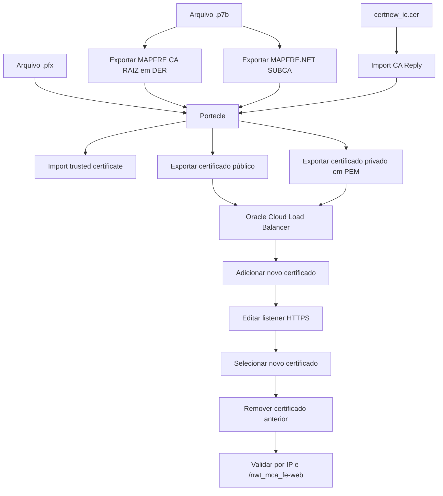

# Instalação e Verificação de Certificados em Load Balancers Oracle Cloud

## 1. Metadados do Documento
- **Arquivo de Origem:** Não identificado no conteúdo extraído
- **Tipo de Documento:** Procedimento
- **Domínio / Sistema:** Load Balancers Oracle Cloud; certificados digitais
- **Público-Alvo:** Operação, CloudOps e administradores de infraestrutura
- **Data/Versão Identificada:** Não identificada

---

## 2. Resumo Executivo & Contexto de Negócio

O documento descreve o procedimento operacional para instalar certificados previamente gerados em um Load Balancer na Oracle Cloud, incluindo preparação dos arquivos, associação do novo certificado ao listener HTTPS e validação posterior.

A preparação envolve exportar certificados da cadeia identificados como `MAPFRE CA RAIZ` e `MAPFRE.NET SUBCA`, manipular o arquivo `.pfx` no Portecle e importar certificados confiáveis. O procedimento também cita o arquivo `certnew_ic.cer` e a função `import CA Reply`.

Após a preparação, o certificado público em formato PEM e o certificado privado são carregados na área de certificados do Load Balancer. O novo certificado deve possuir um nome diferente do certificado atualmente configurado.

A troca é concluída ao editar o listener com protocolo HTTPS, selecionar o novo certificado e remover o certificado anterior. A verificação consiste em acessar uma URL por meio do endereço IP do Load Balancer e confirmar a atualização da data do certificado e o status `Certificado Válido` na rota de certificação.

---

## 3. Arquitetura, Componentes & Tecnologias Envolvidas

Componentes, ferramentas e artefatos explicitamente citados:

- **Oracle Cloud Load Balancer:** serviço no qual o certificado é instalado.
- **Portecle:** ferramenta usada para importar certificados confiáveis, importar a resposta da CA e exportar certificados.
- **Keepass:** local indicado para armazenamento da senha usada nas operações com o certificado.
- **Certificado `.p7b`:** arquivo aberto inicialmente para exportação da cadeia de certificados.
- **Certificado `.pfx`:** arquivo selecionado e arrastado para o Portecle; seu nome é usado como referência para o nome do certificado no Load Balancer.
- **Certificados `.cer`:** arquivos exportados e carregados no Load Balancer.
- **Certificado PEM:** certificado privado exportado e posteriormente adicionado ao Load Balancer.
- **`certnew_ic.cer`:** certificado importado pela opção `import CA Reply`.
- **Listener HTTPS:** listener alterado para apontar para o novo certificado.
- **Ambiente `INT`:** ambiente selecionado no exemplo apresentado.
- **Região Oracle Cloud `us-ashburn-1`:** região presente na URL de administração do Load Balancer.
- **Rota de validação:** `/nwt_mca_fe-web`.



> **Nota de Análise:** o documento não informa o algoritmo criptográfico, a autoridade certificadora emissora, a validade esperada, métodos HTTP, portas, nomes de listeners ou contratos de integração.

---

## 4. Regras de Negócio, Especificações Funcionais & Processos

### 4.1 Pré-requisito

O procedimento pressupõe que o certificado já tenha sido gerado. Caso contrário, o documento orienta consultar o procedimento denominado **“Generar solicitud de certificado”**.

### 4.2 Etapa 1 — Guardar e preparar certificados

1. Abrir o arquivo `.p7b` com duplo clique.
2. Navegar até a pasta de certificados.
3. Selecionar a pasta ou certificado denominado `MAPFRE CA RAIZ`.
4. Executar a exportação.
5. Avançar nas telas de exportação.
6. Manter o formato de exportação **DER**.
7. Salvar o arquivo com o nome `MAPFRE CA RAIZ.cer`.
8. Repetir o processo de exportação para o outro certificado da cadeia.
9. Nomear o segundo certificado como `MAPFRE.NET SUBCA`.
10. Na rota dos certificados, selecionar o arquivo `.pfx` e arrastá-lo para o Portecle.
11. Informar no Portecle a senha armazenada no Keepass quando solicitada.
12. Usar a opção `import trusted certificate`.
13. Importar o certificado selecionado e aceitar as janelas de confirmação apresentadas.
14. Repetir a importação de certificado confiável para o outro certificado.
15. Acessar a opção `import CA Reply`.
16. Importar o arquivo `certnew_ic.cer`.
17. Informar novamente a senha armazenada no Keepass.
18. Exportar o certificado público em formato **PEM**.
19. Manter o nome apresentado, removendo a parte indicada na captura original. O trecho removido não está legível no texto extraído.
20. Executar outra exportação, alterando o parâmetro `Export type`.
21. Informar a senha armazenada no Keepass.
22. Salvar o arquivo removendo a parte indicada na captura original. O trecho removido não está detalhado no texto extraído.

### 4.3 Etapa 2 — Instalar certificado no Load Balancer

1. Acessar a administração de Load Balancers Oracle Cloud na região `us-ashburn-1`.
2. Abrir o seletor de ambiente e selecionar `INT`, conforme o exemplo do documento.
3. Selecionar o Load Balancer exibido.
4. Acessar a seção `certificates`.
5. Acessar `Load Balancer certificate`.
6. Selecionar `Add certificate`.
7. Selecionar a opção `Select one`.
8. Selecionar o arquivo `.cer` exportado anteriormente.
9. Em `Certificate Name`, informar o nome do arquivo `.pfx`.
10. Garantir que o novo nome não seja igual ao nome do certificado atual.
11. Informar a senha armazenada no Keepass.
12. Adicionar o certificado privado exportado previamente em formato PEM.
13. Selecionar `Add Certificate`.
14. Aguardar a aceitação do certificado pelo Load Balancer.
15. Fechar a janela após a aceitação.
16. Acessar a aba `listeners`.
17. Editar o listener cujo protocolo é HTTPS.
18. Selecionar ou introduzir o novo certificado.
19. Salvar as alterações.
20. Retornar a `Load Balancer certificate`.
21. Excluir o certificado anteriormente configurado.

### 4.4 Etapa 3 — Verificar certificado

1. Acessar o Load Balancer e copiar seu endereço IP.
2. Substituir `XX.XX.XX.XX` pelo IP copiado na URL abaixo:

   ```text
   https://XX.XX.XX.XX/nwt_mca_fe-web
   ```

3. Após o carregamento da página, selecionar `No seguro` e acessar o alerta exibido.
4. Abrir os detalhes do certificado.
5. Confirmar que a data apresentada foi atualizada.
6. Na aba de rota de certificação, confirmar a indicação `Certificado Válido`.

---

## 5. Tabelas de Parâmetros, Ambientes e Estruturas de Dados

| Item / Parâmetro | Descrição / Função | Tipo / Valores / Formato | Ambiente / Observações |
| :--- | :--- | :--- | :--- |
| Arquivo de entrada | Arquivo aberto inicialmente para iniciar a exportação da cadeia | `.p7b` | O nome não foi informado |
| `MAPFRE CA RAIZ` | Certificado ou item da cadeia exportado | Exportação em formato DER; salvo como `.cer` | Deve ser nomeado `MAPFRE CA RAIZ.cer` |
| `MAPFRE.NET SUBCA` | Segundo certificado da cadeia | Certificado exportado | O documento instrui usar este nome |
| Arquivo de certificado | Arquivo carregado no Portecle | `.pfx` | É arrastado para o Portecle |
| Senha do certificado | Senha solicitada pelo Portecle e pela exportação | Segredo armazenado no Keepass | Não é apresentada no documento |
| Portecle | Ferramenta de manipulação de certificados | Opções `import trusted certificate` e `import CA Reply` | Usada para importação e exportação |
| `certnew_ic.cer` | Arquivo importado como resposta da CA | `.cer` | Importado na opção `import CA Reply` |
| Certificado público | Certificado exportado para instalação | PEM, conforme texto do documento | O texto relaciona a exportação PEM ao certificado público |
| Certificado privado | Certificado carregado no Load Balancer | Exportado anteriormente em PEM | Adicionado ao criar o certificado no Load Balancer |
| `Certificate Name` | Nome do novo certificado no Load Balancer | Nome do arquivo `.pfx` | Não pode ser igual ao certificado atual |
| Ambiente | Ambiente selecionado no exemplo de instalação | `INT` | O documento não descreve outros ambientes |
| Região Oracle Cloud | Região presente na URL do console | `us-ashburn-1` | Usada na administração do Load Balancer |
| Listener | Ponto de terminação HTTPS alterado | Protocolo HTTPS | Deve receber o novo certificado |
| URL de verificação | Endereço para validação pós-instalação | `https://XX.XX.XX.XX/nwt_mca_fe-web` | `XX.XX.XX.XX` deve ser substituído pelo IP do Load Balancer |
| Critério de validade | Resultado esperado na rota de certificação | `Certificado Válido` | Critério de aceitação da verificação |
| Fonte recuperada | Página de referência indicada no documento | URL Atlassian | `https://mapfrealm.atlassian.net/wiki/spaces/PPQ/pages/8714739871320019394/CloudOpsInstalar+Certificados+en+los+Load+Balancer` |

---

## 6. Bateria de Perguntas & Respostas para RAG (FAQ Sintético)

### P1: Qual é o pré-requisito para instalar o certificado no Load Balancer?
**R:** O certificado deve ter sido gerado previamente. Caso ainda não exista um certificado gerado, o documento direciona o operador para o procedimento chamado `Generar solicitud de certificado`.

### P2: Qual formato deve ser usado ao exportar o certificado `MAPFRE CA RAIZ`?
**R:** O certificado `MAPFRE CA RAIZ` deve ser exportado no formato DER e salvo com o nome `MAPFRE CA RAIZ.cer`.

### P3: Quais certificados da cadeia devem ser preparados antes da instalação?
**R:** O procedimento cita a exportação de `MAPFRE CA RAIZ` e a repetição da ação para outro certificado, nomeado como `MAPFRE.NET SUBCA`.

### P4: Para que serve o Portecle no procedimento?
**R:** O Portecle é usado para abrir o arquivo `.pfx`, informar a senha armazenada no Keepass, importar certificados confiáveis por `import trusted certificate`, importar `certnew_ic.cer` por `import CA Reply` e exportar os certificados necessários para a instalação.

### P5: Qual arquivo deve ser importado pela opção `import CA Reply`?
**R:** A opção `import CA Reply` deve importar o arquivo `certnew_ic.cer`. Após a importação, o procedimento instrui informar novamente a senha armazenada no Keepass.

### P6: Qual ambiente é selecionado no exemplo de instalação do certificado?
**R:** O exemplo apresentado seleciona o ambiente `INT` no console de Load Balancers Oracle Cloud. O documento não detalha o procedimento para outros ambientes.

### P7: Onde o novo certificado é adicionado no console Oracle Cloud?
**R:** O novo certificado é adicionado no Load Balancer, acessando `certificates`, depois `Load Balancer certificate`, e finalmente `Add certificate`.

### P8: Como deve ser definido o campo `Certificate Name`?
**R:** O campo `Certificate Name` deve receber o nome do arquivo `.pfx`. O nome escolhido não pode ser igual ao nome do certificado atualmente configurado no Load Balancer.

### P9: Que arquivos são necessários ao adicionar o certificado no Load Balancer?
**R:** O procedimento instrui selecionar o arquivo `.cer` exportado anteriormente, informar a senha armazenada no Keepass e adicionar o certificado privado que foi exportado anteriormente em formato PEM.

### P10: Como o novo certificado passa a ser usado pelo tráfego HTTPS?
**R:** Após adicionar o certificado, deve-se acessar a aba `listeners`, editar o listener com protocolo HTTPS, introduzir o novo certificado e salvar as alterações.

### P11: Quando o certificado antigo deve ser removido?
**R:** O certificado antigo deve ser removido após o novo certificado ser adicionado e associado ao listener HTTPS. A exclusão é feita novamente em `Load Balancer certificate`.

### P12: Como verificar se a atualização do certificado foi concluída corretamente?
**R:** Deve-se copiar o IP do Load Balancer, acessar `https://XX.XX.XX.XX/nwt_mca_fe-web`, abrir os dados do certificado a partir do alerta de segurança e confirmar que a data está atualizada e que a aba de rota de certificação exibe `Certificado Válido`.

---

## 7. Glossário de Termos, Siglas & Conceitos-Chave

- **CA:** Sigla presente na expressão `MAPFRE CA RAIZ`; o documento não explicita sua expansão.
- **DER:** Formato de exportação selecionado para `MAPFRE CA RAIZ`.
- **PEM:** Formato citado para a exportação de certificado e para o certificado privado carregado no Load Balancer.
- **PFX:** Extensão de arquivo de certificado importado no Portecle e usada como referência para o nome do certificado no Load Balancer.
- **P7B:** Extensão do arquivo aberto inicialmente para exportar certificados.
- **CER:** Extensão dos certificados exportados e do arquivo `certnew_ic.cer`.
- **Portecle:** Ferramenta usada no procedimento para importar, responder à CA e exportar certificados.
- **Keepass:** Repositório indicado para obtenção da senha do certificado.
- **Load Balancer:** Componente Oracle Cloud que recebe o novo certificado e o associa ao listener HTTPS.
- **Listener HTTPS:** Listener configurado com protocolo HTTPS que deve apontar para o novo certificado.
- **INT:** Ambiente selecionado no exemplo de instalação.
- **`import trusted certificate`:** Opção do Portecle usada para importar certificados confiáveis.
- **`import CA Reply`:** Opção do Portecle usada para importar o arquivo `certnew_ic.cer`.

---

## 8. Notas Críticas, Riscos & Limitações

- A senha do certificado é tratada como segredo e está indicada como armazenada no Keepass; o valor não é exposto no documento.
- O nome do novo certificado no campo `Certificate Name` não pode coincidir com o nome do certificado atual.
- O certificado antigo somente deve ser removido após o novo certificado ser adicionado e configurado no listener HTTPS.
- O texto extraído menciona remover uma “parte selecionada” do nome em duas exportações, mas não preserva qual trecho deve ser removido. Essa informação depende das capturas de tela originais.
- O documento apresenta `INT` como ambiente de exemplo, sem especificar procedimentos, URLs ou diferenças para outros ambientes.
- Não há detalhamento sobre algoritmo de chave, algoritmo de assinatura, cadeia completa de confiança, período de validade, política de renovação, rollback ou janela de manutenção.
- A verificação depende da acessibilidade do IP do Load Balancer e da rota `/nwt_mca_fe-web`.
- A fonte de informação original é uma página interna Atlassian identificada no texto extraído.

---

## 9. Conteúdo Bruto Estruturado (Referência Fiel)

```text
--- [PÁGINA 1 DE 21] ---

Instalación de certificados en Load Balanced
Índice
Introducción
Pasos a seguir
- 1. Guardar certificados
- 2. Instalar certificados
- 3. Verificar certificados
Introduccón
Este documento detalla los pasos necesarios para instalar certificados generados previamente en
Load Balancers. Si aún no tiene el certificado generado, consulte el siguiente documento:
Generar solicitud de certificado
Pasos a seguir
1. Guardar certificados
Abrimos el archivo .p7b con doble clic:
 /
 CF
Home Solutions APIs Documentation Zeus
EN

--- [PÁGINA 2 DE 21] ---

Hacemos clic en la siguiente ruta:
Vamos a carpeta certificados:
Clic derecho sobre la carpeta MAPFRE CA RAIZ y le damos a exportar:

--- [PÁGINA 3 DE 21] ---

Pinchar en Siguiente:
Pinchar en Siguiente, lo dejamos en formato DER:

--- [PÁGINA 4 DE 21] ---

Pinchar en Examinar:
Lo llamamos MAPFRE CA RAIZ.cer:

--- [PÁGINA 5 DE 21] ---

Pinchamos en Siguiente:
Hacemos lo mismo con el siguiente certificado:

--- [PÁGINA 6 DE 21] ---

Le ponemos el nombre de MAPFRE.NET SUBCA:
En la ruta de los certificados, seleccionamos el archivo .pfx y lo arrastramos al portecle, no pedirá
una contraseña que estará almacenada en el keepass:

--- [PÁGINA 7 DE 21] ---

Copiamos la pass
La pegamos en el Portecle:
Le damos a import trusted certificate :

--- [PÁGINA 8 DE 21] ---

Importamos el certificado seleccionado y le damos sí a todas las ventanas que nos salgan:
Repetimos la misma acción con el otro certificado:

--- [PÁGINA 9 DE 21] ---

Ahora vamos a la opción donde dice import CA Reply:
Importamos el certnew_ic.cer:
Copiamos y pegamos nuevamente la contraseña del keepass al portecle:

--- [PÁGINA 10 DE 21] ---

Exportamos el certificado:
Dejamos la siguiente configuración, se trata del certificado público en formato PEM:
Lo llamamos tal cual pero le quitamos la parte seleccionada:

--- [PÁGINA 11 DE 21] ---

Nuevamente hacemos otro export, pero esta vez cambiando el parámetro Export type:
Nos pide introducir la contraseña en la cual pondremos la que tenemos en el keepass:
Guardamos quitando la parte seleccionada:

--- [PÁGINA 12 DE 21] ---

2. Instalar certificados en el Load Balancer
Una vez hecho esto, se guarda e instalamos el certificado en el Load Balancer.
https://cloud.oracle.com/load-balancer/load-balancers?region=us-ashburn-1
Abrimos el desplegable y en este caso vamos a INT como se ve en la captura:
Hacemos click en el load balancer que nos sale:

--- [PÁGINA 13 DE 21] ---

Vamos a certificates:
Load Balancer certificate:

--- [PÁGINA 14 DE 21] ---

Add certificate:
Pulsamos en Select one:
Seleccionamos el certificado .cer que exportamos anteriormente:

--- [PÁGINA 15 DE 21] ---

En Certificate Name, le ponemos el nombre de archivo .pfx, teniendo en cuenta que no tenga el
mismo nombre que el certificado actual:
Le guardamos la contraseña almacenada en el keepass:
Finalmente añadimos el certificado privado (el certificado que exportamos anteriormente en formato
PEM) y pulsamos en Add Certificate:

--- [PÁGINA 16 DE 21] ---

Esperamos hasta que nos acepte el certificado y cerramos la ventana:
Vamos a la pestaña listeners:

--- [PÁGINA 17 DE 21] ---

En el de Protocolo HTTPS, lo editamos:
Introducimos el nuevo certificado y le damos a guardar cambios:

--- [PÁGINA 18 DE 21] ---

Ahora, tendremos que borrar el certificado que ya estaba configrado. Para ello, pinchamos de nuevo
en Load Balancer certificate:
Borramos el viejo:

--- [PÁGINA 19 DE 21] ---

3. Verificar certificado
Para comprobar que el certificado esté bien vamos al Load Balancer y copiamos la IP:
La introducimos en la siguiente URL:
https://XX.XX.XX.XX/nwt_mca_fe-web
Una vez cargado, clicamos en “No seguro”, luego en la alerta:

--- [PÁGINA 20 DE 21] ---

Entramos en el certificado:
Para comprobar que el certificado se ha actualizado correctamente, vemos que la fecha está
actualizada:

--- [PÁGINA 21 DE 21] ---

Y que en la pestaña de Ruta de Certificación ponga Certificado Válido:
Información recuperada de:
https://mapfrealm.atlassian.net/wiki/spaces/PPQ/pages/8714739871320019394/CloudOpsInstalar+C
ertificados+en+los+Load+Balancer
```
