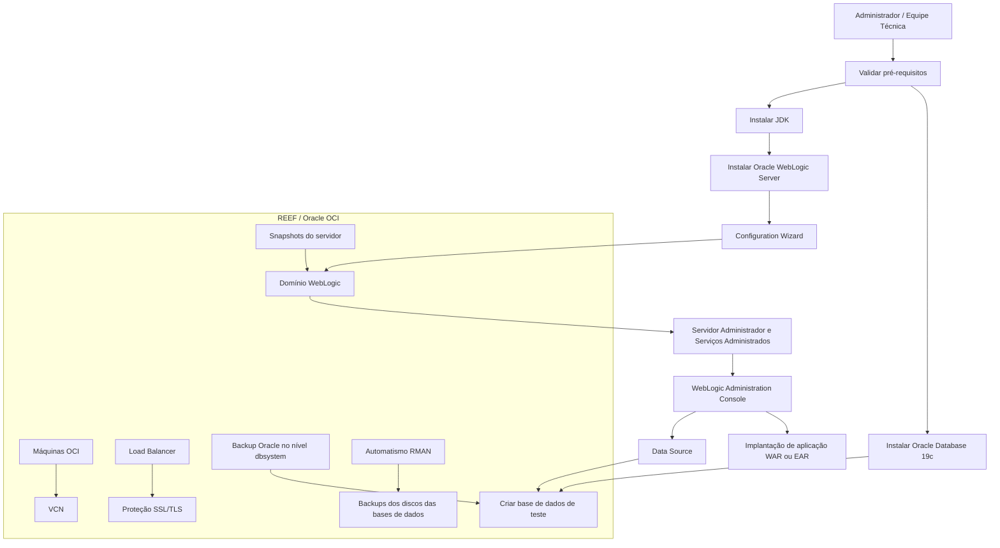

# Guia de Criação de Ambiente com Oracle Database 19c e Oracle WebLogic Server

## 1. Metadados do Documento
- **Arquivo de Origem:** Não identificado no conteúdo fornecido
- **Tipo de Documento:** Procedimento
- **Domínio / Sistema:** REEF; Oracle Database 19c; Oracle WebLogic Server; Oracle OCI
- **Público-Alvo:** Desenvolvedores, Arquitetos e Operação
- **Data/Versão Identificada:** Não identificada

---

## 2. Resumo Executivo & Contexto de Negócio

O documento descreve um procedimento para montar um ambiente utilizando **Oracle Database 19c** como base de dados e **Oracle WebLogic Server** como servidor de aplicações. O procedimento está dividido em cinco etapas: pré-requisitos, instalação do banco de dados, instalação do WebLogic, configuração e implantação de aplicações, e segurança com backup.

No contexto do sistema REEF, as instalações de bases de dados e servidores de aplicações não são realizadas manualmente. O documento informa que o ambiente utiliza a nuvem **Oracle OCI**, mas considera importante conhecer o processo manual para cenários em que não estejam disponíveis máquinas em nuvem.

A preparação do ambiente exige validar requisitos mínimos de Oracle Database e Oracle WebLogic Server, instalar um JDK para a instalação do WebLogic e obter os instaladores necessários. Em seguida, o procedimento orienta a instalar o Oracle Database 19c, configurar uma base de dados de teste e definir variáveis de ambiente.

Para o WebLogic, o procedimento prevê a criação e configuração de um domínio por meio do **Configuration Wizard**, incluindo servidor administrador, serviços administrados, nome do domínio e caminho de instalação. Depois, a aplicação de exemplo é implantada pela console administrativa do WebLogic, utilizando uma fonte de dados conectada ao Oracle Database.

A segurança no REEF é tratada parcialmente fora das máquinas: SSL/TLS é aplicado no balanceador de carga. As máquinas OCI se comunicam por uma **Virtual Cloud Network (VCN)**, descrita como rede privada e segura. Backups de banco são providos pelo serviço Oracle em nível de `dbsystem`, por automações com RMAN para discos das bases de dados e por snapshots do servidor para domínios e configurações WebLogic.

---

## 3. Arquitetura, Componentes & Tecnologias Envolvidas

| Componente / Tecnologia | Papel descrito no documento |
| :--- | :--- |
| Oracle Database 19c | Base de dados do ambiente. |
| Oracle WebLogic Server | Servidor de aplicações. |
| JDK | Pré-requisito necessário para instalar Oracle WebLogic Server. |
| Configuration Wizard | Ferramenta usada para criar o domínio WebLogic. |
| WebLogic Administration Console | Console acessada para administração, criação de Data Source e implantação de aplicações. |
| Data Source | Fonte de dados configurada no WebLogic para conexão com Oracle Database. |
| WAR / EAR | Formatos de aplicação de exemplo que podem ser enviados e implantados. |
| Oracle OCI | Nuvem Oracle usada pelo REEF para instalação de bases de dados e servidores de aplicações. |
| VCN | Rede privada e segura usada para comunicação entre máquinas OCI. |
| Load Balancer | Camada onde a proteção SSL/TLS é realizada no REEF. |
| SSL/TLS | Protocolo cuja configuração é prevista para WebLogic; no REEF, a proteção ocorre no balanceador de carga. |
| RMAN | Ferramenta integral usada por automatismo para backups dos discos das bases de dados. |
| dbsystem | Nível no qual o Oracle OCI fornece serviço de backup de banco de dados. |
| Snapshots | Mecanismo usado no REEF para backup de servidores, domínios e configurações WebLogic. |



**Nota de Análise:** O documento não descreve arquitetura lógica de aplicação, topologia de clusters, número de servidores administrados, contratos de integração, métodos HTTP, versões de JDK, configurações de portas além da console administrativa, nem detalhes de configuração do Data Source.

---

## 4. Regras de Negócio, Especificações Funcionais & Processos

### 4.1 Etapa 1 — Pré-requisitos

**Objetivos**
1. Entender as necessidades do sistema.
2. Verificar que o sistema cumpre os requisitos necessários.
3. Instalar as ferramentas necessárias.

**Atividades**
1. Verificar que o sistema atende aos requisitos mínimos para instalar Oracle Database.
2. Verificar que o sistema atende aos requisitos mínimos para instalar Oracle WebLogic Server.
3. Instalar o JDK, necessário para a instalação do Oracle WebLogic Server.
4. Após validar os requisitos mínimos, baixar Oracle Database 19c.
5. Após validar os requisitos mínimos, baixar o software indicado pelo link de Fusion Middleware.

### 4.2 Etapa 2 — Instalação do Oracle Database 19c

**Objetivos**
1. Instalar Oracle Database 19c.
2. Configurar Oracle Database 19c.

**Atividades**
1. Extrair o arquivo baixado e executar o instalador.
2. Seguir as instruções do instalador para configurar a base de dados.
3. Criar uma base de dados de teste.
4. Estabelecer as variáveis de ambiente necessárias.

### 4.3 Etapa 3 — Instalação do Oracle WebLogic Server

**Objetivos**
1. Instalar WebLogic Server.
2. Configurar WebLogic Server.

**Atividades**
1. Extrair o arquivo baixado e executar o instalador.
2. Criar um domínio WebLogic usando o **Configuration Wizard**.
3. Configurar o domínio WebLogic.
   1. Configurar o servidor administrador e os serviços administrados conforme necessário.
   2. Definir o nome do domínio e a rota de instalação.

### 4.4 Etapa 4 — Configuração e Implantação de Aplicações

**Objetivos**
1. Configurar o ambiente WebLogic.
2. Implantar uma aplicação de exemplo.

**Atividades**
1. Iniciar o WebLogic Server.
2. Acessar a console de administração em `http://localhost:7001/console`.
3. Efetuar login com as credenciais configuradas durante a criação do domínio.
4. Criar uma fonte de dados na console de administração, acessando `Services -> Data Sources -> New`, e configurá-la para conectar ao Oracle Database.
5. Fazer upload e implantar uma aplicação de exemplo em formato WAR ou EAR.

### 4.5 Etapa 5 — Segurança e Backup

**Objetivos**
1. Configurar segurança básica.
2. Implementar procedimentos de backup e recuperação.

**Atividades**
1. Estabelecer usuários e papéis no Oracle WebLogic.
2. Configurar SSL/TLS para WebLogic Server.
   - No REEF, a proteção SSL/TLS é realizada no balanceador de carga.
   - Máquinas OCI comunicam-se por uma VCN, em rede privada e segura.
   - Para solicitação de certificado, o documento referencia o material **“Generar solicitud certificado (CSR)”**.
   - Para instalação de certificado em Load Balancer, o documento referencia o material **“Instalar certificado en un Load Balancer”**.
3. Configurar backup automático da base de dados.
   - No REEF, é utilizado serviço Oracle de backup em nível de `dbsystem`.
   - Existe automatismo que utiliza RMAN para realizar backups dos discos das bases de dados.
4. Configurar políticas de backup para domínios e configurações WebLogic.
   - No REEF, esses backups são realizados mediante snapshots do servidor.

---

## 5. Tabelas de Parâmetros, Ambientes e Estruturas de Dados

| Item / Parâmetro | Descrição / Função | Tipo / Valores / Formato | Ambiente / Observações |
| :--- | :--- | :--- | :--- |
| Oracle Database | Base de dados do ambiente | Oracle Database 19c | Instalação manual descrita como alternativa quando não há máquinas em nuvem. |
| Oracle WebLogic Server | Servidor de aplicações | Oracle WebLogic Server | Requer JDK para instalação. |
| JDK | Dependência de instalação | Java Development Kit | Necessário para instalar Oracle WebLogic Server. |
| Console de Administração | Interface administrativa do WebLogic | URL HTTP | `http://localhost:7001/console` |
| Credenciais da console | Autenticação na console WebLogic | Credenciais definidas na criação do domínio | O documento não informa usuário, senha ou política de credenciais. |
| Domínio WebLogic | Unidade de configuração do WebLogic | Nome e rota de instalação | Criado pelo Configuration Wizard. |
| Servidor administrador | Administração do domínio WebLogic | Configuração do domínio | Deve ser configurado conforme necessário. |
| Serviços administrados | Serviços configuráveis no domínio WebLogic | Configuração do domínio | Devem ser configurados conforme necessário. |
| Data Source | Conexão do WebLogic para Oracle Database | Configurado na console | Caminho: `Services -> Data Sources -> New`. |
| Aplicação de exemplo | Artefato a ser implantado | WAR ou EAR | Upload e deploy são realizados no WebLogic. |
| Oracle OCI | Plataforma de nuvem Oracle | Ambiente em nuvem | Usada pelo REEF para bases de dados e servidores de aplicações. |
| VCN | Rede de comunicação privada | Virtual Cloud Network | Interliga máquinas OCI em rede privada e segura. |
| SSL/TLS | Proteção de comunicações | Protocolo de segurança | No REEF, implementado no balanceador de carga. |
| Load Balancer | Camada de terminação ou instalação de certificado | Balanceador de carga | Documento referencia procedimento separado para instalar certificado. |
| Backup do banco | Backup automático da base de dados | Serviço Oracle em nível de `dbsystem` | Contexto REEF em OCI. |
| RMAN | Backup de discos das bases de dados | Ferramenta integral | Executado por automatismo. |
| Snapshot | Backup de servidor, domínio e configuração | Snapshot do servidor | Mecanismo adotado no REEF para WebLogic. |
| Requisitos Oracle Database | Validação prévia à instalação | Checklist Oracle | URL fornecida no conteúdo bruto. |
| Requisitos WebLogic | Validação prévia à instalação | System requirements Oracle | URL fornecida no conteúdo bruto. |

---

## 6. Bateria de Perguntas & Respostas para RAG (FAQ Sintético)

### P1: Qual é o objetivo do procedimento de criação de ambiente com Oracle?
**R:** O procedimento orienta a montagem de um ambiente com Oracle Database 19c como base de dados e Oracle WebLogic Server como servidor de aplicações. O documento cobre pré-requisitos, instalação do banco e do servidor, criação de domínio, implantação de aplicação, segurança e backup.

### P2: No REEF, Oracle Database e WebLogic são instalados manualmente?
**R:** Não normalmente. O documento informa que, no REEF, instalações de bases de dados e servidores de aplicações são realizadas usando a nuvem Oracle OCI. O processo manual é apresentado para situações em que não existam máquinas em nuvem disponíveis.

### P3: Quais validações devem ocorrer antes da instalação do Oracle Database e do WebLogic?
**R:** Deve-se entender as necessidades do sistema, validar os requisitos mínimos de Oracle Database e Oracle WebLogic Server e instalar as ferramentas necessárias. O JDK deve ser instalado porque é necessário para a instalação do Oracle WebLogic Server.

### P4: Quais são as atividades para instalar Oracle Database 19c?
**R:** As atividades são: extrair o arquivo baixado e executar o instalador; seguir as instruções do instalador para configurar a base de dados; criar uma base de dados de teste; e estabelecer as variáveis de ambiente necessárias.

### P5: Como um domínio Oracle WebLogic é criado?
**R:** O domínio WebLogic é criado utilizando o Configuration Wizard. Após a criação, o procedimento requer configurar o domínio, incluindo o servidor administrador, os serviços administrados conforme necessário, o nome do domínio e a rota de instalação.

### P6: Qual é a URL da console administrativa do Oracle WebLogic indicada no documento?
**R:** A URL indicada para acesso à console de administração é `http://localhost:7001/console`. O login deve usar as credenciais configuradas durante a criação do domínio WebLogic.

### P7: Como configurar a conexão do WebLogic com o Oracle Database?
**R:** A conexão deve ser configurada por meio de uma fonte de dados, criada na console administrativa do WebLogic. O caminho indicado é `Services -> Data Sources -> New`, onde deve ser configurado um novo Data Source para conexão com Oracle Database.

### P8: Que formatos de aplicação podem ser implantados no WebLogic segundo o documento?
**R:** O documento cita o upload e a implantação de uma aplicação de exemplo nos formatos WAR ou EAR. Não são fornecidos detalhes sobre conteúdo, configuração ou dependências desses artefatos.

### P9: Onde a proteção SSL/TLS é implementada no ambiente REEF?
**R:** No REEF, a proteção SSL/TLS é realizada no balanceador de carga, e não é detalhada como configuração diretamente nas máquinas WebLogic. As máquinas OCI comunicam-se internamente por uma VCN, descrita como rede privada e segura.

### P10: Como são realizados os backups de banco de dados no REEF?
**R:** O REEF utiliza um serviço de backup fornecido pela Oracle em nível de `dbsystem`. Para backups dos discos das bases de dados, há um automatismo que usa a ferramenta RMAN.

### P11: Como são feitos backups de domínios e configurações do WebLogic no REEF?
**R:** O documento informa que backups de domínios e configurações WebLogic são realizados por snapshots do servidor.

### P12: O documento define versões de JDK, usuários, senhas ou parâmetros de Data Source?
**R:** Não. O documento exige a instalação de JDK e a criação de uma fonte de dados para Oracle Database, mas não especifica versão de JDK, credenciais, host, porta, SID, service name, driver JDBC ou outros parâmetros técnicos do Data Source.

---

## 7. Glossário de Termos, Siglas & Conceitos-Chave

- **OCI:** Oracle Cloud Infrastructure; nuvem Oracle usada no contexto REEF para bases de dados e servidores de aplicações.
- **VCN:** Virtual Cloud Network; rede privada pela qual máquinas OCI se comunicam.
- **JDK:** Java Development Kit; ferramenta necessária para a instalação do Oracle WebLogic Server.
- **WebLogic:** Oracle WebLogic Server; servidor de aplicações.
- **Configuration Wizard:** Assistente de configuração utilizado para criar um domínio WebLogic.
- **Domínio WebLogic:** Unidade de configuração do Oracle WebLogic contendo elementos como servidor administrador e serviços administrados.
- **Data Source:** Fonte de dados configurada no WebLogic para conexão com Oracle Database.
- **WAR:** Formato de arquivo de aplicação web mencionado para implantação.
- **EAR:** Formato de arquivo de aplicação empresarial mencionado para implantação.
- **SSL/TLS:** Protocolos de segurança cuja proteção, no REEF, é realizada no balanceador de carga.
- **Load Balancer:** Balanceador de carga onde é aplicada a proteção SSL/TLS no ambiente REEF.
- **CSR:** Certificate Signing Request; solicitação de certificado referenciada pelo documento.
- **RMAN:** Ferramenta integral utilizada pelo automatismo de backup dos discos das bases de dados.
- **dbsystem:** Nível em que o Oracle fornece serviço de backup para o banco de dados no contexto OCI.
- **Snapshot:** Captura de estado do servidor utilizada no REEF para backup de domínios e configurações WebLogic.

---

## 8. Notas Críticas, Riscos & Limitações

- O documento apresenta o procedimento manual como alternativa, pois no REEF as instalações são normalmente realizadas na Oracle OCI.
- Não há detalhamento de capacidade, sistema operacional, memória, disco, CPU, compatibilidade, versões específicas de JDK ou sizing de infraestrutura.
- Não são definidos parâmetros de conexão do Data Source, como URL JDBC, host, porta, serviço, SID, driver, usuário, senha ou política de pool.
- Não são detalhados os métodos de implantação, rollback, health checks, clusterização, alta disponibilidade ou balanceamento de aplicações WebLogic.
- Não há políticas de retenção, frequência, criptografia, restauração, testes de recuperação ou destino de backups.
- O documento menciona materiais para CSR e instalação de certificado em Load Balancer, mas não fornece seus conteúdos nem URLs.
- Há uma inconsistência textual no pré-requisito 5: a atividade diz baixar **Oracle Database 19c**, porém a URL aponta para a página de downloads do **Oracle Fusion Middleware**, que é coerente com obtenção do WebLogic. O documento não esclarece essa divergência.
- **Nota de Análise:** O documento não detalha métodos HTTP, APIs, contratos JSON, topologia de componentes, portas adicionais, credenciais padrão nem procedimentos de recuperação operacional.

---

## 9. Conteúdo Bruto Estruturado (Referência Fiel)

```text
--- [PÁGINA 1 DE 4] ---

CREACIÓN ENTORNO CON ORACLE
DATABASE Y ORACLE WEBLOGIC
Índice
Introducción
Paso 1: Prerequisitos
- Objetivos
- Actividades
Paso 2: Instalacion de Oracle Database 19c
- Objetivos
- Actividades
Paso 3: Instalacion de Oracle WebLogic Server
- Objetivos
- Actividades
Paso 4: Configuración y despliegue de aplicaciones
- Objetivos
- Actividades
Paso 5: Seguridad y Backup
- Objetivos
- Actividades
Introducción
El presente documento indica los pasos necesarios para montar un entorno real utilizando Oracle
Database 19c como base de datos y Oracle Weblogic Server como servidor de aplicaciones.
 /
 CF
Home Solutions APIs Documentation Zeus
EN


--- [PÁGINA 2 DE 4] ---

Cabe mencionar que en reef las instalaciones de las bases de datos y los servidores de aplicaciones
no se realizan manualmente, ya que se hace uso de la nube de Oracle OCI. No obstante, es de vital
importancia que se conozcan los pasos que habría que seguir en caso de que no se disponga de
máquinas en la nube.
Paso 1: Prerequisitos
Objetivos
Entender las necesidades del sistema
Verificar que el sistema cumple con estos requisitos
Instalar las herramientas necesarias
Actividades
1. Verificar que el sistema cumple con los requisitos mínimos para instalar Oracle Database. Se
pueden encontrar estos requisitos en la siguiente página web:
https://docs.oracle.com/en/database/oracle/oracle-database/21/ntdbi/oracle-database-installation-
checklist.html
2. Verificar que el sistema cumple con los requisitos mínimos para instalar Oracle Weblogic Server.
Se pueden encontrar estos requisitos en la siguiente página web:
https://docs.oracle.com/en/middleware/standalone/weblogic-server/14.1.1.0/sysrs/system-
requirements-and-specifications.html#GUID-A077A2B4-5967-42E0-A063-0F7A0A2254FB
3. Instalar JDK, necesario para la instalación de Oracle Weblogic Server. Se puede instalar desde
esta página web:
https://www.oracle.com/java/technologies/downloads/?er=221886
4. Una vez se haya verificado que el sistema cumple con los requisitos mínimos, descargar Oracle
Database 19c. Se puede descargar desde esta página web:
https://www.oracle.com/es/database/technologies/oracle-database-software-downloads.html
5. Una vez se haya verificado que el sistema cumple con los requisitos mínimos, descargar Oracle
Database 19c. Se puede descargar desde esta página web:
https://www.oracle.com/es/middleware/technologies/fusionmiddleware-downloads.html
Paso 2: Instalación de Oracle Database 19c
Objetivos
Instalar Oracle Database 19c
Configurar Oracle Database 19c


--- [PÁGINA 3 DE 4] ---

Actividades
1. Extraer el archivo descargado y ejecutar el instalador
2. Seguir las instrucciones del instalador para configurar la base de datos
3. Crear una base de datos de prueba
4. Establecer las variables de entorno necesarias
Paso 3: Instalación de Oracle WebLogic Server
Objetivos
Instalar WebLogic Server
Configurar WebLogic Server
Actividades
1. Extraer el archivo descargado y ejecutar el instalador
2. Crear un dominio de weblogic. Utiliza el Configuration Wizard
3. Configurar el dominio de weblogic
3.1 Configurar el servidor administrador y servicios administrados según sea necesario
3.2 Definir el nombre del dominio y la ruta de instalación
Paso 4: Configuración y despliegue de aplicaciones
Objetivos
Configurar el entorno WebLogic
Desplegar una aplicación de ejemplo
Actividades
1. Iniciar WebLogic Server
2. Acceder a la consola de administración a través de http://localhost:7001/console
3. Iniciar sesión con las credenciales configuradas durante la creación del dominio.
4. Crear una Fuente de Datos. En la consola de administración, ir a Services -> Data Sources ->
New y configurar una nueva fuente de datos para conectar a Oracle Database.
5. Subir y desplegar una aplicacion de ejemplo (WAR, EAR..)


--- [PÁGINA 4 DE 4] ---

Paso 5: Seguridad y Backup
Objetivos
Configurar seguridad básica
Implementar procedimientos de backup/recuperación
Actividades
1. Establecer usuarios y roles en Oracle WebLogic
2. Configurar protocolo SSL/TLS para WebLogic Server.
En reef, la protección SSL/TLS se realiza a nivel de balanceador de carga. Las máquinas que se
encuentran en OCI, están conectadas entre sí por medio de una Virtual Cloud Network (VCN), por lo
que se comunican dentro de una red privada y segura.
Para solicitar un certificado y poder implementar SSL/TLS, consulte el siguiente documento:
Generar solicitud certificado (CSR)
Para instalar el certificado en un Load Balancer, consulte el siguiente documento:
Instalar certificado en un Load Balancer
3. Configurar backup automático de la base de datos.
En reef, al tener las máquinas en OCI, se hace uso de un servicio de backup que proporciona Oracle
a nivel de dbsystem.
En cuanto al backup de los discos de las distintas bases de datos, se cuenta con un automatismo
que, a través de la herramienta integral RMAN, realiza backups de los discos de las bases de datos.
4. Configurar políticas de backup para los dominios y configuraciones de WebLogic.
En reef, la manera de realizar estos backups es tomando SNAPSHOTS del servidor.
```
