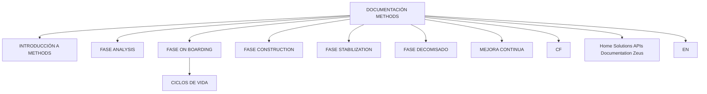

# DOCUMENTACIÓN METHODS — Temários e Fases do Ciclo de Vida

## 1. Metadados do Documento
- **Arquivo de Origem:** Não informado
- **Tipo de Documento:** Procedimento / índice de documentação
- **Domínio / Sistema:** Methods; Home Solutions APIs Documentation Zeus
- **Público-Alvo:** Não identificado
- **Data/Versão Identificada:** Não identificada

---

## 2. Resumo Executivo & Contexto de Negócio

O documento apresenta a área **DOCUMENTACIÓN METHODS**, definida como o local onde se encontram os temários relacionados a **Methods**. O conteúdo fornecido tem caráter de índice ou mapa de navegação documental, sem descrições operacionais das fases listadas.

A estrutura apresentada organiza o conteúdo de Methods em uma introdução e em fases do ciclo de vida: **Analysis**, **On Boarding**, **Construction**, **Stabilization**, **Decomisado** e **Mejora Continua**. O item **Ciclos de Vida** aparece associado visualmente à fase **On Boarding**.

O documento também contém os termos de navegação ou contexto **CF**, **Home Solutions APIs Documentation Zeus** e **EN**. Não há detalhamento explícito sobre o significado dessas siglas, sobre responsabilidades por fase, tecnologias, integrações, critérios de entrada ou saída, nem procedimentos técnicos.

> **Nota de Análise:** o material fornecido lista fases e temas relacionados a Methods, mas não detalha atividades, fluxos operacionais, contratos de APIs, ferramentas, ambientes ou regras de negócio para cada fase.

---

## 3. Arquitetura, Componentes & Tecnologias Envolvidas

Os elementos identificados no conteúdo são:

| Componente / Termo | Papel identificado no documento | Detalhamento disponível |
| :--- | :--- | :--- |
| DOCUMENTACIÓN METHODS | Seção que concentra temários relacionados a Methods | Não detalhado |
| Methods | Domínio central da documentação | Não detalhado |
| INTRODUCCIÓN A METHODS | Tema introdutório | Não detalhado |
| FASE ANALYSIS | Fase listada | Não detalhado |
| FASE ON BOARDING | Fase listada | Não detalhado |
| CICLOS DE VIDA | Tema visualmente associado a On Boarding | Não detalhado |
| FASE CONSTRUCTION | Fase listada | Não detalhado |
| FASE STABILIZATION | Fase listada | Não detalhado |
| FASE DECOMISADO | Fase listada | Não detalhado |
| MEJORA CONTINUA | Tema ou fase listada | Não detalhado |
| Home Solutions APIs Documentation Zeus | Referência de navegação ou contexto documental | Não detalhado |
| CF | Sigla ou item de navegação | Não detalhado |
| EN | Indicador textual presente no conteúdo | Não detalhado |



> **Nota de Análise:** o diagrama representa exclusivamente a hierarquia visual inferida da extração textual. O documento não descreve integrações, componentes de software, tecnologias ou fluxos de dados.

---

## 4. Regras de Negócio, Especificações Funcionais & Processos

O documento não apresenta regras de negócio explícitas, critérios de validação, cálculos, responsabilidades, entradas, saídas ou exceções operacionais.

A estrutura de processo identificada é composta pelos seguintes tópicos:

1. **Introducción a Methods**
2. **Fase Analysis**
3. **Fase On Boarding**
   - **Ciclos de Vida**
4. **Fase Construction**
5. **Fase Stabilization**
6. **Fase Decomisado**
7. **Mejora Continua**

Não é possível afirmar, com base no conteúdo fornecido:

- A ordem obrigatória de execução das fases.
- Os responsáveis por cada fase.
- Critérios para iniciar ou finalizar cada fase.
- Artefatos produzidos em Analysis, On Boarding, Construction, Stabilization ou Decomisado.
- Métricas, indicadores ou práticas aplicáveis à Mejora Continua.
- Relações técnicas entre Methods e Home Solutions APIs Documentation Zeus.

---

## 5. Tabelas de Parâmetros, Ambientes e Estruturas de Dados

| Item / Parâmetro | Descrição / Função | Tipo / Valores / Formato | Ambiente / Observações |
| :--- | :--- | :--- | :--- |
| DOCUMENTACIÓN METHODS | Área que contém temários relacionados a Methods | Título de seção | Sem ambiente identificado |
| INTRODUCCIÓN A METHODS | Tema introdutório de Methods | Tópico documental | Sem detalhamento |
| FASE ANALYSIS | Fase listada no conteúdo | Tópico documental | Sem detalhamento |
| FASE ON BOARDING | Fase listada no conteúdo | Tópico documental | Contém visualmente o item Ciclos de Vida |
| CICLOS DE VIDA | Tópico listado sob On Boarding | Tópico documental | Sem detalhamento |
| FASE CONSTRUCTION | Fase listada no conteúdo | Tópico documental | Sem detalhamento |
| FASE STABILIZATION | Fase listada no conteúdo | Tópico documental | Sem detalhamento |
| FASE DECOMISADO | Fase listada no conteúdo | Tópico documental | Sem detalhamento |
| MEJORA CONTINUA | Tema ou fase listada | Tópico documental | Sem detalhamento |
| CF | Termo presente no rodapé ou navegação | Sigla não expandida | Significado não identificado |
| Home Solutions APIs Documentation Zeus | Referência textual de documentação/navegação | Nome composto | Relação com Methods não detalhada |
| EN | Termo textual presente | Sigla ou indicador não identificado | Significado não identificado |

---

## 6. Bateria de Perguntas & Respostas para RAG (FAQ Sintético)

### P1: Qual é o objetivo da seção DOCUMENTACIÓN METHODS?
**R:** A seção DOCUMENTACIÓN METHODS reúne os temários relacionados a Methods. O conteúdo fornecido não descreve objetivos operacionais, técnicos ou de negócio adicionais.

### P2: Quais fases são listadas na documentação de Methods?
**R:** A documentação lista FASE ANALYSIS, FASE ON BOARDING, FASE CONSTRUCTION, FASE STABILIZATION, FASE DECOMISADO e MEJORA CONTINUA.

### P3: O que o documento informa sobre a fase Analysis?
**R:** O documento apenas lista FASE ANALYSIS como um tema relacionado a Methods. Não há descrição de atividades, critérios, responsáveis, entradas ou saídas para essa fase.

### P4: Qual tópico está associado à fase On Boarding?
**R:** O tópico **CICLOS DE VIDA** aparece visualmente sob **FASE ON BOARDING**. O documento não explica o conteúdo ou o escopo desses ciclos de vida.

### P5: O documento define a sequência obrigatória das fases de Methods?
**R:** Não. As fases são apresentadas em uma lista, mas o documento não estabelece explicitamente que a lista representa uma sequência obrigatória de execução.

### P6: Existem APIs, contratos JSON ou métodos HTTP detalhados para Methods?
**R:** Não. Embora o texto contenha a expressão **Home Solutions APIs Documentation Zeus**, não há métodos HTTP, endpoints, contratos JSON, autenticação ou especificações de APIs no conteúdo fornecido.

### P7: O que é abordado na fase Construction?
**R:** A FASE CONSTRUCTION é apenas listada como um tema de Methods. O documento não fornece procedimentos, ferramentas, artefatos ou responsabilidades relacionados a Construction.

### P8: Quais informações existem sobre Stabilization e Decomisado?
**R:** O conteúdo lista FASE STABILIZATION e FASE DECOMISADO, mas não detalha objetivos, atividades, controles, riscos ou critérios de conclusão para nenhuma das duas fases.

### P9: O documento descreve práticas de melhoria contínua?
**R:** Não. **MEJORA CONTINUA** é mencionada, porém não há práticas, métricas, processos de feedback ou mecanismos de governança descritos.

### P10: Qual é o significado de CF e EN no documento?
**R:** O texto contém os termos CF e EN, mas não fornece suas expansões ou significados no contexto de Methods.

---

## 7. Glossário de Termos, Siglas & Conceitos-Chave

- **Methods:** domínio ou assunto central da documentação; o documento não fornece definição adicional.
- **Analysis:** fase listada na documentação de Methods; sem descrição adicional.
- **On Boarding:** fase listada na documentação de Methods; contém visualmente o tópico Ciclos de Vida.
- **Ciclos de Vida:** tópico associado visualmente à fase On Boarding; sem definição adicional.
- **Construction:** fase listada na documentação de Methods; sem descrição adicional.
- **Stabilization:** fase listada na documentação de Methods; sem descrição adicional.
- **Decomisado:** fase listada na documentação de Methods; sem descrição adicional.
- **Mejora Continua:** tópico ou fase listado na documentação de Methods; sem descrição adicional.
- **CF:** sigla presente no documento; significado não identificado.
- **EN:** termo presente no documento; significado não identificado.
- **Home Solutions APIs Documentation Zeus:** expressão presente no documento; função e relação com Methods não detalhadas.

---

## 8. Notas Críticas, Riscos & Limitações

- O material é uma extração curta, com formato de índice, sem detalhamento operacional ou técnico das fases.
- Não foram identificadas versões, datas, autores, responsáveis, ambientes, URLs, servidores, logs ou parâmetros configuráveis.
- Não foram identificados contratos de API, endpoints, métodos HTTP, modelos de dados ou requisitos de segurança.
- A relação entre **Methods**, **Home Solutions APIs Documentation Zeus**, **CF** e **EN** não é explicada.
- A associação entre **CICLOS DE VIDA** e **FASE ON BOARDING** é baseada exclusivamente na hierarquia visual da extração.
- Não é possível inferir fluxos obrigatórios, dependências entre equipes ou critérios de aprovação sem documentação complementar.

---

## 9. Conteúdo Bruto Estruturado (Referência Fiel)

```text
--- [PÁGINA 1 DE 1] ---

DOCUMENTACIÓN METHODS
En este apartado se encuentran los temarios relacionados con Methods.
 INTRODUCCIÓN A METHODS
 FASE ANALYSIS
 FASE ON BOARDING
  CICLOS DE VIDA
 FASE CONSTRUCTION
  FASE STABILIZATION
 FASE DECOMISADO
  MEJORA COTINUA
 / 
 CF
Home Solutions APIs Documentation Zeus
EN
```
