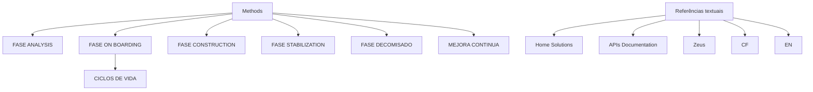

# Documentação Methods — Fases, Ciclo de Vida e Referências

## 1. Metadados do Documento
- **Arquivo de Origem:** Não identificado
- **Tipo de Documento:** Procedimento
- **Domínio / Sistema:** Methods / Home Solutions APIs Documentation Zeus
- **Público-Alvo:** Não identificado
- **Data/Versão Identificada:** Não identificada

---

## 2. Resumo Executivo & Contexto de Negócio

O documento apresenta uma estrutura de documentação relacionada a **Methods**. O conteúdo identifica um conjunto de temas e fases associados ao ciclo de vida de Methods, sem fornecer descrições operacionais, técnicas ou funcionais detalhadas para cada etapa.

As fases listadas são **Analysis**, **On Boarding**, **Construction**, **Stabilization**, **Decomisado** e **Mejora Continua**. A presença do item **Ciclos de Vida** indica que a documentação organiza ou relaciona essas fases dentro de uma perspectiva de ciclo de vida.

O texto também referencia **Home Solutions APIs Documentation Zeus**, porém não especifica a relação arquitetural, funcional ou operacional entre Methods, Home Solutions, APIs e Zeus. Não há URLs, métodos HTTP, contratos de integração, ambientes, responsáveis ou critérios de transição entre fases.

O documento funciona como um índice ou sumário de tópicos de documentação. Não contém detalhamento suficiente para derivar regras de negócio, parâmetros técnicos, fluxos executáveis ou dependências concretas.

---

## 3. Arquitetura, Componentes & Tecnologias Envolvidas

Os termos identificados no documento são:

- **Methods:** tema principal da documentação.
- **Analysis:** fase listada para Methods.
- **On Boarding:** fase listada para Methods.
- **Ciclos de Vida:** tópico associado às fases de Methods.
- **Construction:** fase listada para Methods.
- **Stabilization:** fase listada para Methods.
- **Decomisado:** fase listada para Methods.
- **Mejora Continua:** fase listada para Methods.
- **Home Solutions APIs Documentation Zeus:** referência textual presente no rodapé ou na navegação do documento.
- **CF:** sigla apresentada sem definição.
- **EN:** marcador apresentado sem definição.



> **Nota de Análise:** O diagrama representa exclusivamente a hierarquia e associação visual sugerida pelos tópicos do documento. O documento não define uma sequência obrigatória, condições de entrada ou saída, integrações técnicas, responsáveis ou transições entre as fases.

---

## 4. Regras de Negócio, Especificações Funcionais & Processos

O documento não apresenta regras de negócio explícitas, critérios de validação, cálculos, contratos de serviço, rotas de APIs, formatos de mensagens ou procedimentos operacionais passo a passo.

A estrutura documental identifica os seguintes tópicos:

1. **Introducción a Methods**
   - Seção introdutória mencionada.
   - Não há conteúdo explicativo adicional sobre Methods.

2. **Fase Analysis**
   - Fase identificada nominalmente.
   - O documento não descreve objetivos, atividades, entregáveis, responsáveis ou critérios de aceite para a fase Analysis.

3. **Fase On Boarding**
   - Fase identificada nominalmente.
   - O documento associa o tópico **Ciclos de Vida** à fase On Boarding.
   - Não há detalhamento sobre o processo de entrada, cadastro, habilitação, migração ou integração.

4. **Ciclos de Vida**
   - Tópico listado sob a fase On Boarding.
   - Não são informados estados, eventos, transições, responsáveis ou regras de alteração de ciclo de vida.

5. **Fase Construction**
   - Fase identificada nominalmente.
   - Não há especificações sobre implementação, desenvolvimento, testes, artefatos ou aprovações.

6. **Fase Stabilization**
   - Fase identificada nominalmente.
   - Não há critérios de estabilidade, métricas, monitoramento, SLA ou procedimentos de suporte.

7. **Fase Decomisado**
   - Fase identificada nominalmente.
   - Não há informações sobre desligamento, retenção de dados, migração, descontinuação ou critérios de encerramento.

8. **Mejora Continua**
   - Tópico identificado nominalmente.
   - Não há mecanismos descritos para coleta de melhorias, priorização, governança ou execução de ações corretivas.

> **Nota de Análise:** O documento lista as fases de Methods, porém não detalha o fluxo operacional, a ordem formal das etapas ou os critérios técnicos e funcionais associados a cada fase.

---

## 5. Tabelas de Parâmetros, Ambientes e Estruturas de Dados

| Item / Parâmetro | Descrição / Função | Tipo / Valores / Formato | Ambiente / Observações |
| :--- | :--- | :--- | :--- |
| Methods | Tema central da documentação. | Nome de domínio ou processo. | Não detalhado. |
| Fase Analysis | Fase relacionada a Methods. | Tópico de fase. | Sem critérios, entregáveis ou responsáveis. |
| Fase On Boarding | Fase relacionada a Methods. | Tópico de fase. | Contém referência a Ciclos de Vida. |
| Ciclos de Vida | Tópico listado sob On Boarding. | Conceito de ciclo de vida. | Estados e transições não informados. |
| Fase Construction | Fase relacionada a Methods. | Tópico de fase. | Sem detalhamento de construção ou implementação. |
| Fase Stabilization | Fase relacionada a Methods. | Tópico de fase. | Sem métricas, critérios ou procedimentos. |
| Fase Decomisado | Fase relacionada a Methods. | Tópico de fase. | Sem procedimento de desligamento informado. |
| Mejora Continua | Tópico relacionado a Methods. | Conceito de melhoria contínua. | Sem processo de priorização ou execução informado. |
| Home Solutions | Referência textual presente no documento. | Nome não expandido. | Relação com Methods não especificada. |
| APIs Documentation | Referência textual presente no documento. | Termo de documentação de APIs. | APIs, endpoints e contratos não informados. |
| Zeus | Referência textual presente no documento. | Nome não expandido. | Relação com Methods não especificada. |
| CF | Sigla ou marcador textual. | Não identificado. | Sem definição no texto. |
| EN | Sigla ou marcador textual. | Não identificado. | Sem definição no texto. |

---

## 6. Bateria de Perguntas & Respostas para RAG (FAQ Sintético)

### P1: Qual é o assunto principal do documento?
**R:** O documento apresenta temas relacionados a **Methods**, incluindo uma introdução e fases denominadas Analysis, On Boarding, Construction, Stabilization, Decomisado e Mejora Continua.

### P2: Quais fases de Methods são mencionadas?
**R:** O documento menciona as fases **Analysis**, **On Boarding**, **Construction**, **Stabilization** e **Decomisado**, além do tópico **Mejora Continua**.

### P3: O que o documento informa sobre a fase Analysis?
**R:** O documento apenas lista a **Fase Analysis** como parte dos temas relacionados a Methods. Não há descrição de atividades, responsáveis, entradas, saídas ou critérios de aceite.

### P4: Qual tópico está associado à fase On Boarding?
**R:** O tópico **Ciclos de Vida** aparece listado sob a **Fase On Boarding**. O documento não explica quais ciclos de vida existem nem como ocorrem as transições entre eles.

### P5: O documento define o fluxo sequencial das fases de Methods?
**R:** Não. Embora diversas fases sejam listadas, o documento não declara que elas devem ser executadas em uma sequência específica, nem define dependências, gatilhos ou critérios de passagem entre fases.

### P6: Existem APIs, endpoints ou contratos técnicos documentados?
**R:** Não. O texto contém a referência **Home Solutions APIs Documentation Zeus**, mas não informa URLs, endpoints, métodos HTTP, payloads, autenticação, versões ou contratos de integração.

### P7: O que é abordado na fase Construction?
**R:** A **Fase Construction** é apenas citada nominalmente. O documento não descreve atividades de desenvolvimento, construção, testes, deploy ou validação técnica.

### P8: Quais critérios de estabilidade são definidos para a fase Stabilization?
**R:** Nenhum critério é definido. A **Fase Stabilization** é listada sem métricas, indicadores, procedimentos de monitoramento, níveis de serviço ou condições de conclusão.

### P9: O documento descreve como realizar o decommissioning?
**R:** Não. A **Fase Decomisado** é mencionada, mas não há instruções sobre desligamento, retenção de dados, migração, rollback ou aprovação para encerramento.

### P10: Como funciona o processo de Mejora Continua?
**R:** O documento somente apresenta **Mejora Continua** como tópico. Não há informações sobre identificação de melhorias, priorização, governança, responsáveis ou ciclos de execução.

### P11: O que significam as siglas CF e EN?
**R:** O documento apresenta os termos **CF** e **EN**, mas não fornece expansão, definição ou contexto suficiente para determinar seus significados.

### P12: Qual é a relação entre Methods, Home Solutions e Zeus?
**R:** O documento menciona **Methods** e a referência textual **Home Solutions APIs Documentation Zeus**, mas não explica a relação arquitetural, funcional ou organizacional entre esses termos.

---

## 7. Glossário de Termos, Siglas & Conceitos-Chave

- **Methods:** Tema ou domínio principal referido pelo documento. Não há definição adicional.
- **Analysis:** Nome de uma fase relacionada a Methods.
- **On Boarding:** Nome de uma fase relacionada a Methods.
- **Ciclos de Vida:** Tópico associado à fase On Boarding; estados e transições não foram especificados.
- **Construction:** Nome de uma fase relacionada a Methods.
- **Stabilization:** Nome de uma fase relacionada a Methods.
- **Decomisado:** Nome de uma fase relacionada a Methods.
- **Mejora Continua:** Tópico relacionado a melhoria contínua, sem processo descrito.
- **Home Solutions:** Referência textual sem definição no documento.
- **APIs Documentation:** Referência a documentação de APIs, sem detalhes técnicos.
- **Zeus:** Referência textual sem definição no documento.
- **CF:** Sigla ou marcador não definido no documento.
- **EN:** Sigla ou marcador não definido no documento.

---

## 8. Notas Críticas, Riscos & Limitações

- O documento possui natureza resumida e não fornece conteúdo suficiente para operacionalizar as fases de Methods.
- Não há definição de objetivos, atividades, entregáveis, responsáveis, dependências ou critérios de aceite para nenhuma fase.
- O documento não apresenta arquitetura técnica, integrações, servidores, ambientes, URLs, protocolos, rotas de logs ou parâmetros de configuração.
- A referência a **Home Solutions APIs Documentation Zeus** não é acompanhada de detalhes que permitam identificar componentes, contratos ou relações entre sistemas.
- As siglas **CF** e **EN** não são definidas.
- Não há elementos suficientes para inferir uma sequência formal ou obrigatória entre Analysis, On Boarding, Construction, Stabilization, Decomisado e Mejora Continua.

---

## 9. Conteúdo Bruto Estruturado (Referência Fiel)

```text
--- [PÁGINA 1 DE 1] ---

DOCUMENTACIÓN METHODS
En este apartado se encuentran los temarios relacionados con Methods.
 INTRODUCCIÓN A METHODS
 FASE ANALYSIS
 FASE ON BOARDING
  CICLOS DE VIDA
 FASE CONSTRUCTION
  FASE STABILIZATION
 FASE DECOMISADO
  MEJORA COTINUA
 / 
 CF
Home Solutions APIs Documentation Zeus
EN
```
