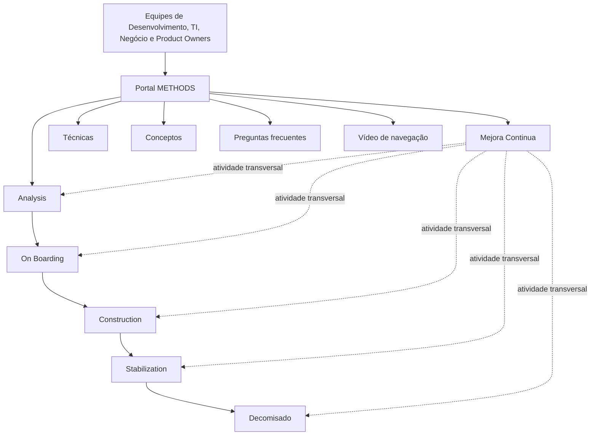

# Portal METHODS — Metodologia de Desenvolvimento de Software

## 1. Metadados do Documento
- **Arquivo de Origem:** `Não identificado`
- **Tipo de Documento:** Apresentação Executiva
- **Domínio / Sistema:** Portal METHODS / Metodologia de Desenvolvimento
- **Público-Alvo:** Equipes de Desenvolvimento, TI, Negócio e Product Owners
- **Data/Versão Identificada:** Não identificada

---

## 2. Resumo Executivo & Contexto de Negócio

O documento apresenta o **METHODS**, definido como um Portal de Metodologia de Desenvolvimento que concentra informações necessárias para equipes de Desenvolvimento, TI e Negócio. O portal busca apoiar a execução das atividades ligadas ao ciclo de desenvolvimento de software.

O objetivo declarado da metodologia METHODS é oferecer um modelo prático para o desenvolvimento de software. Esse modelo estabelece uma conexão entre a definição metodológica e as ferramentas utilizadas pelos times no trabalho diário.

O Portal METHODS organiza o desenvolvimento em fases navegáveis, permitindo que o usuário consulte mais ou menos detalhes conforme sua necessidade. As fases identificadas são: Analysis, On Boarding, Construction, Stabilization, Decomisado e Mejora Continua.

Além das etapas metodológicas, o portal disponibiliza conteúdos de suporte, incluindo técnicas aplicáveis, conceitos em formato de glossário e perguntas frequentes. A página principal também contém um vídeo sobre as opções de navegação.

---

## 3. Arquitetura, Componentes & Tecnologias Envolvidas

O documento não descreve arquitetura técnica de software, integrações, APIs, bancos de dados, protocolos, tecnologias de implementação ou ambientes. A estrutura apresentada é funcional e informacional: o Portal METHODS centraliza conteúdos metodológicos e materiais de suporte para os usuários.

### Componentes e conteúdos identificados

| Componente / Conteúdo | Descrição |
| :--- | :--- |
| Portal METHODS | Portal de Metodologia de Desenvolvimento com informações para equipes de Desenvolvimento, TI e Negócio. |
| Página principal | Página que apresenta informações sobre METHODS e um vídeo de opções de navegação. |
| Analysis | Fase inicial para estudar necessidades tecnológicas, viabilidade e potencial sucesso de uma ideia. |
| On Boarding | Fase de planejamento e coordenação com equipes envolvidas para disponibilizar recursos do projeto. |
| Construction | Fase de desenvolvimento e validação dos elementos do produto até obter uma versão funcional. |
| Stabilization | Período anterior ao lançamento em produção, voltado à confirmação de requisitos, estabilidade e ausência de erros para usuários finais. |
| Decomisado | Atividade final do ciclo de vida de uma aplicação para assegurar que ela não permaneça ativa, consumindo recursos ou gerando custos. |
| Mejora Continua | Atividades transversais para gerir mudanças de escopo e melhorar a qualidade do produto final. |
| Técnicas | Conteúdo com técnicas aplicáveis às tarefas da metodologia. |
| Conceptos | Glossário dos conceitos mencionados na metodologia. |
| Preguntas frecuentes | Seção com os conteúdos mais demandados. |
| Zeus | Item exibido na estrutura de navegação da página inicial; o documento não detalha sua função. |



> **Nota de Análise:** O documento apresenta uma sequência de fases metodológicas, mas não detalha critérios formais de entrada e saída, responsáveis, ferramentas, métodos HTTP, contratos de integração ou tecnologias de implementação do Portal METHODS.

---

## 4. Regras de Negócio, Especificações Funcionais & Processos

### Objetivo metodológico

1. A metodologia METHODS deve fornecer um modelo prático para desenvolvimento de software.
2. A metodologia METHODS deve conectar a definição metodológica às ferramentas usadas no dia a dia.
3. O portal deve apoiar o trabalho das equipes de TI e dos Product Owners com as ferramentas utilizadas diariamente.
4. O Portal METHODS deve disponibilizar navegação entre etapas e atividades relevantes do desenvolvimento.
5. A navegação deve permitir ao usuário acessar maior ou menor nível de detalhe conforme sua necessidade.

### Fluxo metodológico identificado

1. **Analysis**
   - Constitui a fase inicial.
   - Estuda as necessidades tecnológicas a partir de uma ideia.
   - Busca determinar a viabilidade da ideia.
   - Busca determinar o potencial sucesso da ideia.

2. **On Boarding**
   - Realiza planejamento.
   - Realiza coordenação com as equipes envolvidas.
   - Busca disponibilizar os recursos necessários para abordar o projeto.

3. **Construction**
   - Abrange o desenvolvimento dos elementos do produto.
   - Abrange a validação dos elementos do produto.
   - Prossegue até que seja obtida uma versão funcional.

4. **Stabilization**
   - É o período final do ciclo de vida de desenvolvimento de software antes do lançamento do produto em produção.
   - Deve garantir que o produto cumpre os requisitos especificados.
   - Deve garantir que o produto funciona de forma estável.
   - Deve garantir que o produto está pronto para ser utilizado pelos usuários finais sem erros.

5. **Decomisado**
   - É a última atividade na vida útil de uma aplicação.
   - Deve garantir que a aplicação não continuará ativa no portfólio de aplicações.
   - Deve garantir que a aplicação não continuará consumindo recursos.
   - Deve garantir que a aplicação não continuará gerando gastos.

6. **Mejora Continua**
   - É um conjunto de atividades transversais.
   - Está orientada à gestão de mudanças de escopo.
   - Está orientada à melhoria da qualidade do produto final.

### Conteúdos complementares

| Conteúdo | Finalidade declarada |
| :--- | :--- |
| Técnicas | Disponibilizar técnicas aplicáveis para realizar tarefas da metodologia. |
| Conceptos | Explicar os conceitos mencionados na metodologia por meio de um glossário. |
| Preguntas frecuentes | Disponibilizar conteúdos mais demandados pelos usuários. |
| Vídeo de navegação | Detalhar as opções de navegação disponíveis na página principal do Portal METHODS. |

---

## 5. Tabelas de Parâmetros, Ambientes e Estruturas de Dados

| Item / Parâmetro | Descrição / Função | Tipo / Valores / Formato | Ambiente / Observações |
| :--- | :--- | :--- | :--- |
| Portal METHODS | Portal de Metodologia de Desenvolvimento. | Portal informacional e metodológico. | Destinado a equipes de Desenvolvimento, TI e Negócio. |
| Modelo prático | Modelo oferecido pela metodologia para desenvolvimento de software. | Diretriz metodológica. | Conecta definição metodológica e ferramentas. |
| Nível de detalhe | Quantidade de detalhe exibida durante a navegação. | Maior ou menor detalhe. | Ajustado conforme as necessidades do usuário. |
| Analysis | Estudo das necessidades tecnológicas de uma ideia. | Fase metodológica. | Avalia viabilidade e potencial sucesso. |
| On Boarding | Planejamento e coordenação com equipes envolvidas. | Fase metodológica. | Busca disponibilizar recursos necessários ao projeto. |
| Construction | Desenvolvimento e validação do produto. | Fase metodológica. | Termina ao obter uma versão funcional. |
| Stabilization | Preparação final antes da produção. | Fase metodológica. | Confirma requisitos, estabilidade e preparo para usuários finais sem erros. |
| Decomisado | Encerramento da vida útil da aplicação. | Fase metodológica. | Evita permanência no portfólio, consumo de recursos e geração de gastos. |
| Mejora Continua | Gestão de mudanças de escopo e melhoria de qualidade. | Atividade transversal. | Aplicável de forma transversal às atividades metodológicas. |
| Técnicas | Técnicas aplicáveis às tarefas metodológicas. | Conteúdo de suporte. | O detalhamento é indicado em “Técnicas”. |
| Conceptos | Glossário de conceitos da metodologia. | Conteúdo de suporte. | O detalhamento é indicado em “Conceptos”. |
| Preguntas frecuentes | Conteúdos mais demandados. | Conteúdo de suporte. | O detalhamento é indicado em “Preguntas frecuentes”. |
| Home / Solutions / APIs / Documentation / Zeus / EN | Itens apresentados na estrutura de navegação. | Elementos de navegação. | O documento não detalha o significado ou comportamento de cada item. |

> **Nota de Análise:** O documento não fornece URLs, servidores, credenciais, variáveis de configuração, rotas de log, versões, portas, contratos de dados ou estruturas de banco de dados.

---

## 6. Bateria de Perguntas & Respostas para RAG (FAQ Sintético)

### P1: O que é o Portal METHODS?
**R:** O Portal METHODS é o Portal de Metodologia de Desenvolvimento que contém informações necessárias para equipes de Desenvolvimento, TI e Negócio. O portal organiza etapas, atividades e conteúdos de apoio relacionados ao desenvolvimento de software.

### P2: Qual é o objetivo da metodologia METHODS?
**R:** O objetivo da metodologia METHODS é proporcionar um modelo prático para o desenvolvimento de software. A metodologia estabelece uma conexão entre a definição metodológica e as ferramentas utilizadas pelas equipes de TI e pelos Product Owners no trabalho diário.

### P3: Quais são as fases principais da metodologia METHODS?
**R:** As fases principais apresentadas são Analysis, On Boarding, Construction, Stabilization, Decomisado e Mejora Continua. Mejora Continua é descrita como um conjunto de atividades transversais voltadas à gestão de mudanças de escopo e à melhoria da qualidade do produto final.

### P4: O que acontece na fase Analysis do METHODS?
**R:** Analysis é a fase inicial da metodologia. Nessa fase, as necessidades tecnológicas são estudadas a partir de uma ideia para determinar a viabilidade da ideia e seu potencial sucesso.

### P5: Qual é a finalidade da fase On Boarding?
**R:** On Boarding é a fase de planejamento e coordenação com as equipes envolvidas. Sua finalidade é disponibilizar os recursos necessários para abordar o projeto.

### P6: Quando a fase Construction é considerada concluída?
**R:** A fase Construction envolve desenvolvimento e validação dos elementos do produto. O documento indica que essa fase prossegue até a obtenção de uma versão funcional do produto.

### P7: O que a fase Stabilization deve assegurar antes da produção?
**R:** Stabilization ocorre antes do lançamento do produto em produção. Essa fase deve assegurar que o produto cumpre os requisitos especificados, funciona de maneira estável e está pronto para uso pelos usuários finais sem erros.

### P8: Qual é o objetivo da etapa Decomisado?
**R:** Decomisado é a última atividade da vida útil de uma aplicação. Seu objetivo é garantir que a aplicação não continue ativa no portfólio de aplicações, não consuma recursos e não gere gastos.

### P9: Como o Portal METHODS permite consultar as etapas da metodologia?
**R:** O Portal METHODS apresenta um esquema das etapas e atividades mais importantes do desenvolvimento. Os usuários podem navegar por essas etapas e consultar maior ou menor detalhamento de acordo com suas necessidades.

### P10: Quais conteúdos complementares o Portal METHODS oferece?
**R:** O Portal METHODS oferece técnicas aplicáveis às tarefas da metodologia, um glossário de conceitos mencionados na metodologia e uma seção de perguntas frequentes com os conteúdos mais demandados. A página principal também apresenta um vídeo que detalha as opções de navegação.

---

## 7. Glossário de Termos, Siglas & Conceitos-Chave

- **METHODS:** Portal de Metodologia de Desenvolvimento que reúne informações para equipes de Desenvolvimento, TI e Negócio.
- **Analysis:** Fase inicial de estudo de necessidades tecnológicas, viabilidade e potencial sucesso de uma ideia.
- **On Boarding:** Fase de planejamento e coordenação com equipes envolvidas para disponibilizar recursos do projeto.
- **Construction:** Fase de desenvolvimento e validação dos elementos do produto até a obtenção de uma versão funcional.
- **Stabilization:** Período final antes do lançamento em produção para confirmar requisitos, estabilidade e preparação para os usuários finais.
- **Decomisado:** Última atividade da vida útil de uma aplicação, voltada à retirada da aplicação do portfólio e à eliminação de consumo de recursos e gastos.
- **Mejora Continua:** Conjunto de atividades transversais para gestão de mudanças de escopo e melhoria da qualidade do produto final.
- **Product Owner:** Papel citado como destinatário do apoio oferecido pela conexão entre metodologia e ferramentas; o documento não apresenta definição adicional.
- **TI:** Sigla utilizada para designar equipes de tecnologia; o documento não apresenta expansão explícita.
- **Zeus:** Item exibido na navegação do portal; o documento não apresenta definição adicional.

---

## 8. Notas Críticas, Riscos & Limitações

- O documento é introdutório e não descreve a implementação técnica do Portal METHODS.
- Não foram identificadas informações sobre responsáveis, papéis por fase, aprovações, evidências, métricas, indicadores ou critérios formais de transição entre fases.
- Não foram identificadas tecnologias, integrações, APIs, contratos de dados, URLs, ambientes, servidores ou mecanismos de autenticação.
- O item de navegação **Zeus** é mencionado, mas não possui detalhamento funcional.
- As seções **Técnicas**, **Conceptos** e **Preguntas frecuentes** são referenciadas como destinos de detalhamento, mas seu conteúdo não foi incluído no material extraído.
- O vídeo de navegação é mencionado, porém sua transcrição ou conteúdo não está disponível no texto fornecido.

---

## 9. Conteúdo Bruto Estruturado (Referência Fiel)

```text
--- [PÁGINA 1 DE 3] ---

INTRODUCCIÓN A METHODS
INTRODUCCIÓN A METHODS
La información detallada relacionada con los siguientes puntos se
encuentra en la página principal del Portal METHODS.
Qué es Methods
METHODS es el Portal de Metodología de Desarrollo que contiene toda la información necesaria
para los Equipos de Desarrollo, TI y Negocio.
El objetivo de la metodología METHODS es proporcionar un modelo práctico para el desarrollo
de software, estableciendo la conexión entre la definición metodológica y las herramientas, de
manera que se facilite a los equipos de TI y Product Owner el trabajo con las herramientas que
se utilizan en el día a día.
Estructura
 / 
 CF
Home Solutions APIs Documentation Zeus
EN


--- [PÁGINA 2 DE 3] ---

El Portal METHODS muestra un esquema de las etapas y actividades más importantes a realizar
durante el desarrollo, entre las que se puede navegar, mostrando mayor o menor detalle en
función de las necesidades del usuario.
Las principales fases de la metodología son:
- Analysis: fase inicial donde se estudian las necesidades tecnológicas a partir de la idea para
determinar su viabilidad y potencial éxito.
- On Boarding: fase de planificación y coordinación con los equipos implicados para disponer de
los recursos necesarios para abordar el proyecto.
- Construction: fase de dearrollo y validación de los elementos del producto hasta obtener una
versión funcional.
- Stabilization: período final en el ciclo de vida del desarrollo de software, antes del lanzamiento
del producto en producción, donde se garantiza que cumple con los requisitos especificados,
funciona de manera estable, y está listo para ser utlizado por los usuarios finales sin errores.
- Decomisado: última actividad en la vida útil de una aplicación, en la que se garantiza que no
continuará activa en el portfolio de aplicaciones, ni consumiendo recursos, ni generando gasto.
- Mejora Continua: conjunto de actividades transversales orientadas a gestionar o cambios al
alcance, y a mejorar la calidad del producto final.
Navegación
En la página principal del Portal METHODS se muestra un vídeo detallando las opciones de
navegación.


--- [PÁGINA 3 DE 3] ---

Otros contenidos
Con el fin de faciltar la labor a los equipos, METHODS también ofrece otros tipos de contenidos
de soporte a las actividades del día a dia, como son:
- Técnicas aplicables para llevar a cabo las tareas de la metodología. El detalle se muestra en:
Técnicas
- Conceptos: glosario en el que se explican los conceptos mencionados en la metodología. El
detalle se muestra en: Conceptos
- Preguntas frecuentes: sección con los contenidos más demandados. El detalle se muestra en:
Preguntas frecuentes
```
