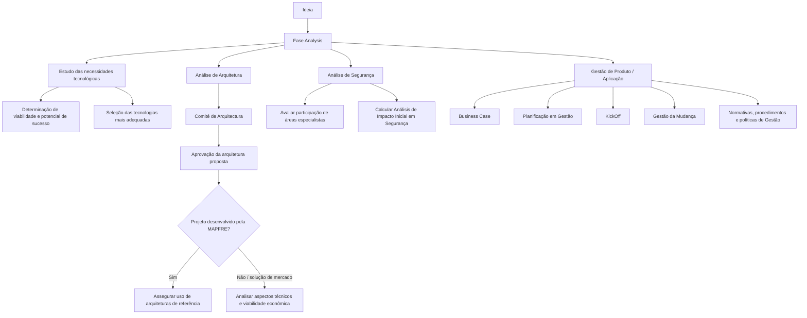

# Processo de Analysis: Arquitetura, Segurança e Gestão de Produto/Aplicação

## 1. Metadados do Documento
- **Arquivo de Origem:** Não identificado no conteúdo fornecido
- **Tipo de Documento:** Procedimento / Apresentação de processo
- **Domínio / Sistema:** Fase inicial de análise de iniciativas tecnológicas; arquitetura, segurança e gestão de Produto/Aplicação
- **Público-Alvo:** Arquitetos, Segurança, Gestores de Produto/Aplicação, equipes de desenvolvimento e negócio
- **Data/Versão Identificada:** Não identificada

---

## 2. Resumo Executivo & Contexto de Negócio

O documento descreve a fase inicial denominada **Analysis**, na qual necessidades tecnológicas são estudadas a partir de uma ideia. A finalidade da fase é determinar a viabilidade e o potencial de sucesso antes da criação do produto.

A atividade de Analysis busca identificar quais tecnologias são mais adequadas para o desenvolvimento. O texto referencia o **Análisis Tecnológico** como local de detalhamento dos aspectos avaliados, mas não apresenta o conteúdo desse material.

O **Comité de Arquitectura** aprova a arquitetura proposta para o projeto. Quando o projeto é desenvolvido pela MAPFRE, o comitê assegura o uso de arquiteturas de referência. Quando for necessária uma solução de mercado, o comitê analisa aspectos técnicos e viabilidade econômica.

A participação da área de Segurança visa avaliar a necessidade de envolvimento de áreas especialistas e calcular o **Análisis de Impacto Inicial** em aspectos de segurança. No âmbito de gestão de Produto/Aplicação, o documento destaca Business Case, planejamento de gestão, KickOff, gestão da mudança e normas, procedimentos e políticas de gestão.

---

## 3. Arquitetura, Componentes & Tecnologias Envolvidas

Os componentes e áreas explicitamente citados são:

- **Fase Analysis:** etapa inicial para estudar necessidades tecnológicas decorrentes de uma ideia.
- **Análisis Tecnológico:** referência para os aspectos avaliados durante a análise tecnológica.
- **Comité de Arquitectura:** responsável por aprovar a arquitetura proposta.
- **Arquitecturas de referencia:** arquiteturas cuja utilização deve ser assegurada em projetos desenvolvidos pela MAPFRE.
- **Seguridad:** área que avalia o envolvimento de especialistas e calcula o impacto inicial de segurança.
- **Produto / Aplicação:** escopo de gestão que contempla Business Case, planejamento, KickOff, mudança e políticas.
- **MAPFRE:** organização mencionada como responsável pelo desenvolvimento em determinado cenário.
- **Solução de mercado:** alternativa sujeita à análise técnica e de viabilidade econômica.



> **Nota de Análise:** O documento não identifica tecnologias concretas, linguagens, servidores, bancos de dados, APIs, protocolos ou contratos de integração.

---

## 4. Regras de Negócio, Especificações Funcionais & Processos

### Processo da fase Analysis

1. A fase Analysis inicia a partir de uma ideia.
2. As necessidades tecnológicas associadas à ideia são estudadas.
3. O estudo busca determinar a viabilidade da iniciativa.
4. O estudo busca determinar o potencial de sucesso da iniciativa.
5. Antes da criação do produto, são determinadas as tecnologias mais adequadas ao desenvolvimento.
6. Os aspectos analisados são referenciados no documento denominado **Análisis Tecnológico**.

### Governança de arquitetura

1. O Comité de Arquitectura é responsável por aprovar a arquitetura proposta para o projeto.
2. Se o projeto for desenvolvido pela MAPFRE, o Comité de Arquitectura deve assegurar a utilização das arquiteturas de referência.
3. Quando for necessária uma solução de mercado, o Comité de Arquitectura deve analisar:
   - aspectos técnicos;
   - viabilidade econômica.

### Análise de segurança

1. A área de Segurança participa da fase Analysis.
2. A participação de Segurança tem como objetivo avaliar a participação das áreas especialistas.
3. A participação de Segurança inclui o cálculo do Análisis de Impacto Inicial relacionado a aspectos de segurança.

### Gestão de Produto / Aplicação

As atividades destacadas no âmbito da gestão de Produto/Aplicação são:

1. Business Case.
2. Planificação em Gestão.
3. KickOff.
4. Gestão da Mudança.
5. Normativas, procedimentos e políticas de Gestão.

> **Nota de Análise:** O documento lista as atividades de gestão, mas não define responsáveis, entradas, saídas, prazos, critérios de aprovação ou sequência obrigatória entre Business Case, planejamento, KickOff e gestão da mudança.

---

## 5. Tabelas de Parâmetros, Ambientes e Estruturas de Dados

| Item / Parâmetro | Descrição / Função | Tipo / Valores / Formato | Ambiente / Observações |
| :--- | :--- | :--- | :--- |
| Fase Analysis | Fase inicial em que necessidades tecnológicas são estudadas a partir de uma ideia. | Processo / fase | Ocorre antes da criação do produto. |
| Ideia | Origem para o estudo das necessidades tecnológicas. | Entrada conceitual | Não há formato ou critérios detalhados. |
| Viabilidade | Aspecto que a fase Analysis busca determinar. | Avaliação | O documento não define critérios de viabilidade. |
| Potencial de sucesso | Aspecto avaliado na fase Analysis. | Avaliação | Não há métricas ou indicadores informados. |
| Tecnologias adequadas | Tecnologias consideradas mais adequadas para o desenvolvimento. | Decisão tecnológica | O documento não lista tecnologias específicas. |
| Análisis Tecnológico | Referência onde os aspectos analisados são detalhados. | Documento / atividade referenciada | Conteúdo não fornecido. |
| Comité de Arquitectura | Entidade responsável por aprovar a arquitetura proposta. | Governança de arquitetura | Não há composição, rito ou critérios de aprovação descritos. |
| Arquitecturas de referencia | Arquiteturas cujo uso deve ser assegurado para projetos desenvolvidos pela MAPFRE. | Padrão de arquitetura | Não são identificadas no conteúdo. |
| Solução de mercado | Solução cuja análise inclui aspectos técnicos e viabilidade econômica. | Alternativa de solução | Não há fornecedores, produtos ou critérios adicionais. |
| Análisis de Impacto Inicial | Cálculo realizado em aspectos de segurança. | Avaliação de segurança | Não há fórmula, escala ou resultado esperado. |
| Áreas especialistas | Áreas cuja participação é avaliada pela Segurança. | Stakeholders internos | Não são nomeadas. |
| Business Case | Atividade de gestão de Produto/Aplicação. | Atividade de gestão | Sem detalhamento. |
| Planificación en Gestión | Atividade de planejamento no âmbito da gestão. | Atividade de gestão | Sem detalhamento. |
| KickOff | Atividade destacada na gestão de Produto/Aplicação. | Evento / atividade | Sem detalhamento. |
| Gestión del Cambio | Atividade de gestão da mudança. | Atividade de gestão | Sem detalhamento. |
| Normativas, procedimientos y políticas de Gestión | Conjunto de elementos de governança de gestão. | Normas e políticas | Não são enumerados. |

---

## 6. Bateria de Perguntas & Respostas para RAG (FAQ Sintético)

### P1: Qual é o objetivo da fase Analysis?
**R:** A fase Analysis estuda necessidades tecnológicas a partir de uma ideia para determinar a viabilidade e o potencial de sucesso da iniciativa antes da criação do produto.

### P2: Em que momento a seleção de tecnologias ocorre?
**R:** A seleção das tecnologias mais adequadas ocorre durante a fase inicial Analysis, antes da criação do produto.

### P3: Quem aprova a arquitetura proposta para um projeto?
**R:** O Comité de Arquitectura é responsável por aprovar a arquitetura proposta para o projeto.

### P4: Qual é a responsabilidade do Comité de Arquitectura em projetos desenvolvidos pela MAPFRE?
**R:** Quando o projeto é desenvolvido pela MAPFRE, o Comité de Arquitectura assegura que o projeto utilize as arquiteturas de referência.

### P5: O que deve ser analisado quando uma solução de mercado é necessária?
**R:** Quando for necessária uma solução de mercado, o Comité de Arquitectura deve analisar os aspectos técnicos e a viabilidade econômica da solução.

### P6: Qual é o objetivo da participação da área de Segurança na fase Analysis?
**R:** A participação da área de Segurança visa valorar a participação das áreas especialistas e calcular o Análisis de Impacto Inicial nos aspectos de segurança.

### P7: O documento informa como o Análisis de Impacto Inicial deve ser calculado?
**R:** Não. O documento informa que o Análisis de Impacto Inicial deve ser calculado em aspectos de segurança, mas não apresenta fórmula, critérios, escala, responsáveis ou artefatos resultantes.

### P8: Quais atividades são destacadas na gestão de Produto/Aplicação?
**R:** O documento destaca Business Case, Planificación en Gestión, KickOff, Gestión del Cambio e normativas, procedimentos e políticas de Gestão.

### P9: Onde são detalhados os aspectos analisados durante a fase Analysis?
**R:** O documento informa que os aspectos analisados na atividade são detalhados em Análisis Tecnológico, mas o conteúdo desse material não foi fornecido.

### P10: Quais tecnologias, APIs ou plataformas são obrigatórias para os projetos?
**R:** O conteúdo fornecido não identifica tecnologias, APIs, plataformas, linguagens, versões ou ferramentas obrigatórias. Apenas informa que devem ser determinadas as tecnologias mais adequadas durante a fase Analysis.

---

## 7. Glossário de Termos, Siglas & Conceitos-Chave

- **Analysis:** fase inicial em que necessidades tecnológicas são estudadas a partir de uma ideia.
- **Análisis Tecnológico:** referência citada para o detalhamento dos aspectos analisados na atividade de Analysis.
- **Comité de Arquitectura:** órgão responsável por aprovar a arquitetura proposta para o projeto.
- **Arquitecturas de referencia:** arquiteturas cujo uso deve ser assegurado quando o projeto é desenvolvido pela MAPFRE.
- **Análisis de Impacto Inicial:** análise ou cálculo inicial em aspectos de segurança.
- **Business Case:** atividade destacada no escopo de gestão de Produto/Aplicação.
- **KickOff:** atividade destacada no escopo de gestão de Produto/Aplicação.
- **Gestión del Cambio:** atividade de gestão da mudança citada no documento.
- **MAPFRE:** organização mencionada como desenvolvedora de projetos em um dos cenários descritos.
- **Produto / Aplicação:** âmbito de gestão que inclui Business Case, planejamento, KickOff, gestão da mudança e políticas de gestão.

---

## 8. Notas Críticas, Riscos & Limitações

- O arquivo de origem, data, versão, autor e classificação documental não foram identificados no conteúdo fornecido.
- O documento referencia **Análisis Tecnológico**, mas não contém o detalhamento correspondente.
- As arquiteturas de referência não são listadas nem caracterizadas.
- Não há definição do processo de aprovação do Comité de Arquitectura, incluindo participantes, critérios, evidências, prazos ou instâncias de escalonamento.
- O Análisis de Impacto Inicial de segurança é citado sem metodologia, critérios, classificação de risco ou entregáveis.
- As atividades de gestão de Produto/Aplicação são apresentadas como lista, sem fluxo, responsáveis, dependências ou critérios de conclusão.
- Não há ambientes, URLs, logs, parâmetros técnicos, contratos de API, tecnologias ou configurações operacionais descritas.

---

## 9. Conteúdo Bruto Estruturado (Referência Fiel)

```text
--- [PÁGINA 1 DE 2] ---

FASE ANALYSIS
ANALYSIS
En la fase inicial Analysis se estudian las necesidades tecnológicas a
partir de la idea, para determinar su viabilidad y potencial éxito. Esta
tarea, previa a la creación del producto, tiene como objetivo determinar
qué tecnologías son las más adecuadas a utilizar durante el desarrollo.
Los aspectos que se analizan en esta actividad se detallan en: Análisis
Tecnológico.
Arquitecturas de referencia
El Comité de Arquitectura se encarga de
aprobar la arquitectura propuesta para el
proyecto:
- Cuando el proyecto lo desarrolla MAPFRE,
asegura que utiliza las arquitecturas de
referencia. - Cuando sea necesaria una
solución de mercado, se encarga de analizar
Análisis de Seguridad
El objetivo de la participación de Seguridad en
esta fase es valorar la participación de las
áreas expertas y calcular el Análisis de
Impacto Inicial en aspectos de Seguridad.
 / 
 RS
Inicio Soluciones APIs Documentación Zeus
ES


--- [PÁGINA 2 DE 2] ---

los aspectos técnicos y la viabilidad
económica.
Requisitos de Gestión
En el ámbito de la gestión del Producto /
Aplicación destacan varias actividades a tener
en cuenta:
Business Case
Planificación en Gestión
KickOff
Gestión del Cambio
Normativas, procedimientos y políticas de
Gestión
```
