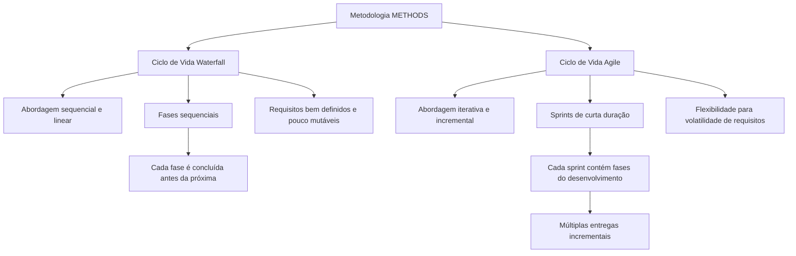

# Ciclos de Vida de Desenvolvimento: METHODS, Waterfall e Agile

## 1. Metadados do Documento
- **Arquivo de Origem:** `Não identificado`
- **Tipo de Documento:** Apresentação Executiva
- **Domínio / Sistema:** Metodologia METHODS e ciclos de vida de desenvolvimento de software
- **Público-Alvo:** Desenvolvedores, Arquitetos, Gestão de Projetos e Negócio
- **Data/Versão Identificada:** Não identificada

---

## 2. Resumo Executivo & Contexto de Negócio

O documento apresenta a aplicabilidade da metodologia **METHODS** a diferentes ciclos de vida de desenvolvimento de software, especificamente os modelos **Waterfall** e **Agile**. A mensagem central é que a metodologia não está restrita a uma única forma de execução de projetos.

O ciclo de vida **Waterfall** é descrito como um modelo sequencial e linear, composto por fases concluídas uma após a outra. Esse modelo é indicado quando os requisitos estão claramente definidos no início do desenvolvimento e possuem baixa expectativa de alteração.

O ciclo de vida **Agile** é apresentado como um modelo iterativo e incremental, organizado em sprints curtos que incluem as fases de desenvolvimento. Esse formato permite múltiplas entregas incrementais de software até a conclusão do produto e busca aumentar a produtividade.

A escolha entre Waterfall e Agile depende principalmente da estabilidade dos requisitos e da natureza do produto ou aplicação. Waterfall prioriza previsibilidade e sequência de fases; Agile prioriza flexibilidade diante da volatilidade de requisitos e a evolução incremental do produto.

O documento também referencia materiais complementares para aprofundamento: **Ciclo de Vida Waterfall**, **Ciclo de Vida Agile** e **Diferencias Waterfall - Agile**. O conteúdo fornecido não detalha esses materiais referenciados.

---

## 3. Arquitetura, Componentes & Tecnologias Envolvidas

O conteúdo não descreve uma arquitetura de software, componentes técnicos, microsserviços, integrações, servidores, tecnologias, protocolos ou ambientes. O escopo é metodológico e compara dois ciclos de vida de desenvolvimento aplicáveis pela metodologia METHODS.



> **Nota de Análise:** O documento não fornece detalhamento adicional sobre como a metodologia METHODS é operacionalizada em cada ciclo de vida, nem descreve artefatos, papéis, ferramentas ou critérios formais para selecionar Waterfall ou Agile.

---

## 4. Regras de Negócio, Especificações Funcionais & Processos

### Aplicabilidade da metodologia METHODS
- A metodologia **METHODS** é aplicável a qualquer ciclo de vida.
- O documento cita explicitamente os ciclos de vida **Agile** e **Waterfall** como exemplos de aplicação da metodologia METHODS.

### Ciclo de vida Waterfall
1. Waterfall é um modelo de desenvolvimento de software.
2. Waterfall possui abordagem sequencial e linear.
3. Waterfall possui poucas entregas finais.
4. Waterfall é formado por um conjunto de fases sequenciais.
5. Cada fase do ciclo Waterfall deve ser concluída antes do início da próxima fase.
6. Waterfall é aplicável quando os requisitos estão bem definidos desde o início.
7. Waterfall é aplicável quando não se espera que os requisitos mudem significativamente durante o desenvolvimento.
8. Waterfall não oferece muita flexibilidade diante de mudanças.

### Ciclo de vida Agile
1. Agile é um modelo de desenvolvimento de software.
2. Agile possui abordagem iterativa e incremental.
3. Agile é estruturado em sprints de curta duração.
4. Cada sprint contém as fases do desenvolvimento.
5. A estrutura baseada em sprints permite múltiplas entregas incrementais de software.
6. As entregas incrementais continuam até a conclusão do produto final.
7. O documento associa o modelo Agile ao aumento da produtividade.
8. Agile é aplicável quando há orientação ao desenvolvimento de um produto incremental.
9. Agile é aplicável quando existem equipes multifuncionais.
10. Agile permite adaptar a forma de trabalho às condições do produto ou aplicação.
11. Agile oferece flexibilidade em situações de volatilidade nos requisitos.

### Materiais referenciados
- O detalhamento do ciclo Waterfall é referenciado como **Ciclo de Vida Waterfall**.
- O detalhamento do ciclo Agile é referenciado como **Ciclo de Vida Agile**.
- A comparação entre os dois modelos é referenciada como **Diferencias Waterfall - Agile**.

> **Nota de Análise:** Os conteúdos dos documentos referenciados não foram incluídos na extração fornecida. Portanto, não há fatos adicionais sobre fases específicas, duração de sprints, papéis, cerimônias, entregáveis ou métricas.

---

## 5. Tabelas de Parâmetros, Ambientes e Estruturas de Dados

| Item / Parâmetro | Descrição / Função | Tipo / Valores / Formato | Ambiente / Observações |
| :--- | :--- | :--- | :--- |
| Metodologia METHODS | Metodologia aplicável a diferentes ciclos de vida de desenvolvimento. | Aplicável a Agile e Waterfall. | O documento afirma que METHODS é aplicável a qualquer ciclo de vida. |
| Waterfall | Modelo de desenvolvimento com abordagem sequencial e linear. | Fases sequenciais; poucas entregas finais. | Indicado para requisitos bem definidos e pouco sujeitos a mudanças. |
| Conclusão de fase Waterfall | Regra de progressão entre fases do modelo Waterfall. | A fase atual deve ser concluída antes da próxima. | Não há descrição dos nomes ou quantidade de fases. |
| Flexibilidade Waterfall | Capacidade de adaptação a mudanças. | Baixa, segundo o documento. | Não recomendado quando se espera mudança significativa nos requisitos. |
| Agile | Modelo de desenvolvimento com abordagem iterativa e incremental. | Estruturado em sprints de curta duração. | Aplicável a produtos incrementais e equipes multifuncionais. |
| Sprint | Unidade de organização do ciclo Agile. | Curta duração; contém fases do desenvolvimento. | O documento não informa duração, cerimônias ou artefatos do sprint. |
| Entregas Agile | Entregas de software realizadas ao longo do desenvolvimento. | Múltiplas entregas incrementais. | Prosseguem até completar o produto final. |
| Volatilidade de requisitos | Situação em que os requisitos podem variar durante o desenvolvimento. | Associada à necessidade de flexibilidade. | O documento relaciona Agile a esse cenário. |
| Ciclo de Vida Waterfall | Material complementar referenciado. | Referência documental. | Conteúdo não fornecido. |
| Ciclo de Vida Agile | Material complementar referenciado. | Referência documental. | Conteúdo não fornecido. |
| Diferencias Waterfall - Agile | Material complementar de comparação entre modelos. | Referência documental. | Conteúdo não fornecido. |

---

## 6. Bateria de Perguntas & Respostas para RAG (FAQ Sintético)

### P1: A metodologia METHODS pode ser utilizada somente com o ciclo de vida Agile?
**R:** Não. O documento afirma que a metodologia METHODS é aplicável a qualquer ciclo de vida, incluindo explicitamente os ciclos Agile e Waterfall.

### P2: O que caracteriza o ciclo de vida Waterfall no documento?
**R:** Waterfall é caracterizado como um modelo de desenvolvimento de software com abordagem sequencial e linear. O modelo é composto por fases sequenciais, e cada fase deve ser concluída antes de iniciar a fase seguinte.

### P3: Em quais situações o ciclo Waterfall é aplicável?
**R:** Waterfall é aplicável quando os requisitos estão bem definidos desde o início do projeto e não se espera que esses requisitos sofram muitas alterações durante o desenvolvimento.

### P4: Como o documento descreve a flexibilidade do modelo Waterfall?
**R:** O documento informa que Waterfall não oferece muita flexibilidade diante de mudanças. Essa limitação está relacionada à sua estrutura sequencial, em que cada fase é concluída antes da próxima.

### P5: O que caracteriza o ciclo de vida Agile?
**R:** Agile é descrito como um modelo de desenvolvimento de software com abordagem iterativa e incremental. O modelo é estruturado em sprints de curta duração que incluem as fases do desenvolvimento.

### P6: Como o Agile permite entregas de software?
**R:** O modelo Agile permite múltiplas entregas incrementais de software. Cada sprint contém fases do desenvolvimento, possibilitando evoluir o produto progressivamente até completar o produto final.

### P7: Quando o ciclo de vida Agile é indicado?
**R:** Agile é indicado quando o trabalho está orientado ao desenvolvimento de um produto incremental e conta com equipes multifuncionais. Também é apresentado como adequado para contextos de volatilidade nos requisitos.

### P8: Qual é a relação entre Agile e produtividade segundo o documento?
**R:** O documento afirma que a organização do trabalho em sprints curtos, contendo as fases de desenvolvimento, torna possíveis múltiplas entregas incrementais até a conclusão do produto final, aumentando a produtividade.

### P9: Como o Agile lida com mudanças de requisitos?
**R:** O documento informa que Agile permite adaptar a forma de trabalho às condições do produto ou aplicação e oferece flexibilidade em situações de volatilidade nos requisitos.

### P10: O documento define as fases específicas de Waterfall?
**R:** Não. O documento afirma que Waterfall possui um conjunto de fases sequenciais, mas não informa os nomes, a quantidade, os responsáveis ou os critérios de entrada e saída dessas fases.

### P11: O documento informa a duração dos sprints Agile?
**R:** Não. O documento apenas caracteriza os sprints como de curta duração; não apresenta duração em dias, semanas ou outro formato temporal.

### P12: Onde estão detalhadas as diferenças entre Agile e Waterfall?
**R:** O documento referencia o material denominado **Diferencias Waterfall - Agile** para o detalhamento das diferenças entre os ciclos de vida. O conteúdo desse material não está presente na extração fornecida.

---

## 7. Glossário de Termos, Siglas & Conceitos-Chave

- **METHODS:** Metodologia mencionada como aplicável a qualquer ciclo de vida, incluindo Agile e Waterfall. O documento não expande a sigla ou detalha sua composição.
- **Waterfall:** Modelo de desenvolvimento de software sequencial e linear, organizado em fases concluídas sucessivamente.
- **Agile:** Modelo de desenvolvimento de software iterativo e incremental, estruturado em sprints de curta duração.
- **Sprint:** Período de curta duração no modelo Agile que contém fases do desenvolvimento.
- **Desenvolvimento incremental:** Desenvolvimento que permite entregas sucessivas de software até a conclusão do produto final.
- **Equipe multifuncional:** Tipo de equipe citado como contexto de aplicação do ciclo Agile. O documento não detalha sua composição.
- **Volatilidade de requisitos:** Condição em que os requisitos podem mudar, associada no documento à necessidade de flexibilidade do modelo Agile.
- **Ciclo de vida:** Forma de organizar o desenvolvimento de software; o documento cita Waterfall e Agile.

---

## 8. Notas Críticas, Riscos & Limitações

- O documento não identifica nome de arquivo, data, versão, autoria ou contexto organizacional específico.
- A metodologia METHODS é citada, mas o documento não explica seus processos, práticas, papéis, entregáveis ou governança.
- Não há arquitetura técnica, sistemas, serviços, bancos de dados, integrações, protocolos, URLs, logs ou ambientes descritos.
- Waterfall é explicitamente associado a baixa flexibilidade perante mudanças de requisitos, o que representa uma limitação operacional em cenários de alta volatilidade.
- Agile é associado à flexibilidade e ao desenvolvimento incremental, mas o documento não define como sprints devem ser planejados, executados, medidos ou encerrados.
- Os materiais **Ciclo de Vida Waterfall**, **Ciclo de Vida Agile** e **Diferencias Waterfall - Agile** são somente referenciados; seus conteúdos não estão disponíveis na extração.
- Há aparentes erros de digitação no conteúdo bruto, como “adptar” e “lo aporta”, que foram preservados na seção de referência fiel.

---

## 9. Conteúdo Bruto Estruturado (Referência Fiel)

```text
--- [PÁGINA 1 DE 2] ---

CICLOS DE VIDA
CICLOS DE VIDA
La metodología METHODS es aplicable con cualquier ciclo de vida, ya
sea agile o waterfall.
WATERFALL
El ciclo de vida WATERFALL es un modelo de
desarrollo de software que presenta un
enfoque secuencial y lineal con pocas
entregas finales, es decir, consta de un
conjunto de fases secuenciales, cada una de
las cuales se completa antes de pasar a la
siguiente.
Es aplicable cuando los requisitos están bien
definidos desde el inicio, y no se espera que
cambien mucho durante el desarrollo, puesto
que no ofrece mucha flexibilidad ante los
cambios.
AGILE
El ciclo de vida AGILE es un modelo de
desarrollo de software que presenta un
enfoque iterativo e incremental para el
desarrollo. Este modelo se estructura en
sprints de corta duración, cada uno de los
cuales contiene las fases del desarrollo, lo
que hace posible tener múltiples entregas de
software incrementales hasta llegar a
completar el producto final aumentando la
productividad.
Es aplicable cuando se trabaja con
orientación al desarrollo de un producto
incremental, con equipos multifuncionales. Se
 / 
 CF
Home Solutions APIs Documentation Zeus
EN


--- [PÁGINA 2 DE 2] ---

Este ciclo de vida se detalla en: Ciclo de Vida
Waterfall.
trata de un modelo que permite adptar la
forma de trabajo a las condiciones del
producto/aplicación, lo aporta mucha
flexibilidad en situaciones de volatilidad en los
requisitos.
Este ciclo de vida se detalla en: Ciclo de Vida
Agile
Diferencias AGILE vs. WATERFALL
Las diferencias entre los ciclos de vida se
detallan en: Diferencias Waterfall - Agile.
```
