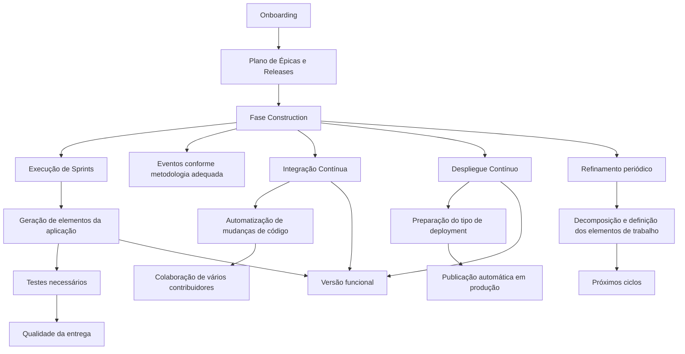

# Fase Construction: Execução de Sprints, Qualidade, Integração Contínua e Despliegue Contínuo

## 1. Metadados do Documento
- **Arquivo de Origem:** Não identificado no conteúdo fornecido
- **Tipo de Documento:** Apresentação Executiva
- **Domínio / Sistema:** Fase Construction de produto ou aplicação; estratégia CI/CD
- **Público-Alvo:** Desenvolvedores, Arquitetos, Operação e equipes de produto
- **Data/Versão Identificada:** Não identificada

---

## 2. Resumo Executivo & Contexto de Negócio

O documento descreve a fase **Construction**, etapa na qual são gerados os elementos de uma aplicação por meio da execução de sprints. A fase adota uma estratégia de **CI/CD** para facilitar a evolução do software desenvolvido até uma versão funcional.

A condução da fase Construction deve seguir o **Plano de Épicas e Releases** definido durante a fase de **Onboarding**, mantendo a possibilidade de adaptar o planejamento conforme a evolução do produto ou da aplicação. O conteúdo também determina a celebração dos eventos previstos de acordo com a metodologia mais adequada ao produto ou aplicação.

A entrega de software deve incluir os elementos planejados e os testes necessários para assegurar a qualidade da entrega. Em paralelo, a automatização de mudanças de código deve ser assegurada para favorecer a colaboração de múltiplos contribuidores em um único produto ou aplicação.

A fase também contempla a preparação do tipo de deployment adequado para publicação automática em ambientes de produção e o refinamento periódico dos elementos de trabalho para os ciclos seguintes. O documento referencia detalhamentos específicos para Plano de Épicas, Eventos, Desenvolvimento, Integração Contínua, Despliegue Contínuo e Refinamento, mas não apresenta esses detalhamentos no conteúdo fornecido.

---

## 3. Arquitetura, Componentes & Tecnologias Envolvidas

Os elementos e práticas explicitamente citados são:

- **Construction:** fase de geração dos elementos da aplicação.
- **Sprint:** mecanismo de execução usado para gerar os elementos planejados.
- **CI/CD:** estratégia que facilita a transição do software desenvolvido para uma versão funcional.
- **Plano de Épicas e Releases:** planejamento previsto na fase de Onboarding e adaptável à evolução do produto ou aplicação.
- **Eventos:** eventos celebrados conforme a metodologia adequada.
- **Desenvolvimento:** geração dos elementos de software com testes necessários para qualidade.
- **Integração Contínua:** automatização das mudanças de código para colaboração entre contribuidores.
- **Despliegue Contínuo:** identificação e preparação do deployment adequado para publicação automática em produção.
- **Refinamento:** decomposição e definição periódica dos elementos de trabalho para ciclos posteriores.



> **Nota de Análise:** O documento menciona CI/CD, Integração Contínua e Despliegue Contínuo, mas não especifica ferramentas, repositórios, pipelines, tecnologias, ambientes não produtivos, URLs, métodos de deployment ou critérios técnicos de aprovação.

---

## 4. Regras de Negócio, Especificações Funcionais & Processos

### Processo da fase Construction

1. Gerar os elementos da aplicação mediante a execução de sprints.
2. Aplicar a estratégia CI/CD para facilitar a passagem do software desenvolvido para uma versão funcional.
3. Executar e seguir o Plano de Épicas e Releases previsto durante a fase de Onboarding.
4. Adaptar o Plano de Épicas e Releases à evolução do produto ou aplicação.
5. Celebrar os eventos previstos segundo a metodologia que melhor se adapte ao produto ou aplicação.
6. Gerar os elementos de software planejados.
7. Realizar as provas necessárias para assegurar a qualidade da entrega.
8. Assegurar a automatização das mudanças de código.
9. Utilizar a automatização das mudanças de código para favorecer a colaboração de vários contribuidores em um único produto ou aplicação.
10. Identificar e preparar o tipo de deployment adequado para publicação automática nos ambientes de produção.
11. Realizar periodicamente, durante toda a etapa de construção, a decomposição e definição dos elementos de trabalho.
12. Direcionar os elementos de trabalho decompostos e definidos para os ciclos seguintes.

### Referências internas indicadas pelo documento

| Atividade | Referência de detalhamento citada |
| :--- | :--- |
| Execução e adaptação do plano | Plan de Épicas |
| Celebração de eventos | Eventos |
| Geração de software e testes | Desarrollo |
| Automatização de mudanças de código | Integración Continua |
| Preparação de publicação automática em produção | Despliegue Continuo |
| Decomposição e definição para ciclos seguintes | Refinamiento |

> **Nota de Análise:** O conteúdo fornecido apenas aponta os tópicos de detalhamento. Não há informações adicionais sobre os procedimentos, responsáveis, entradas, saídas, critérios de aceite ou ferramentas desses tópicos.

---

## 5. Tabelas de Parâmetros, Ambientes e Estruturas de Dados

| Item / Parâmetro | Descrição / Função | Tipo / Valores / Formato | Ambiente / Observações |
| :--- | :--- | :--- | :--- |
| Fase Construction | Etapa na qual são gerados todos os elementos da aplicação | Fase de construção | Executada por meio de sprints |
| Sprint | Mecanismo de execução para geração dos elementos da aplicação | Ciclo de trabalho | Associado à fase Construction |
| Estratégia CI/CD | Facilita a passagem do software desenvolvido para uma versão funcional | Estratégia de entrega de software | Ferramentas e pipeline não especificados |
| Plano de Épicas e Releases | Plano a ser seguido e adaptado conforme a evolução do produto ou aplicação | Planejamento | Previsto na fase de Onboarding |
| Eventos | Eventos a celebrar segundo a metodologia mais adequada | Eventos metodológicos | Tipos, periodicidade e responsáveis não especificados |
| Elementos de software planejados | Itens de software que devem ser gerados | Entregáveis de software | Devem incluir testes necessários |
| Provas / testes | Atividades necessárias para assegurar a qualidade da entrega | Validação de qualidade | Tipos e critérios não especificados |
| Automatização de mudanças de código | Prática para favorecer a colaboração de múltiplos contribuidores | Integração Contínua | Mecanismos de automação não especificados |
| Tipo de deployment | Forma de deployment a identificar e preparar | Configuração de publicação | Deve ser adequada à publicação automática |
| Publicação automática | Publicação do software | Processo automatizado | Ambientes de produção |
| Refinamento | Decomposição e definição de elementos de trabalho | Processo recorrente | Realizado periodicamente durante toda a construção |
| Ciclos seguintes | Ciclos que receberão os elementos de trabalho refinados | Ciclos de trabalho futuros | Sem periodicidade ou duração especificada |

---

## 6. Bateria de Perguntas & Respostas para RAG (FAQ Sintético)

### P1: Qual é o objetivo da fase Construction?
**R:** A fase Construction tem o objetivo de gerar todos os elementos da aplicação por meio da execução de sprints. Durante essa fase, aplica-se uma estratégia CI/CD para facilitar a passagem do software desenvolvido para uma versão funcional.

### P2: Como o Plano de Épicas e Releases deve ser tratado durante a Construction?
**R:** O Plano de Épicas e Releases previsto na fase de Onboarding deve ser executado e seguido durante a Construction. O plano também deve ser adaptado à evolução do produto ou aplicação.

### P3: Quais atividades devem garantir a qualidade da entrega de software?
**R:** A Construction exige a geração dos elementos de software planejados com as provas ou testes necessários para assegurar a qualidade da entrega. O documento não detalha os tipos de testes nem os critérios de qualidade.

### P4: Qual é o objetivo da automatização de mudanças de código?
**R:** A automatização das mudanças de código deve ser assegurada para favorecer a colaboração de vários contribuidores em um único produto ou aplicação. Essa atividade é referenciada pelo documento como parte de Integração Contínua.

### P5: O documento especifica quais ferramentas de CI/CD devem ser usadas?
**R:** Não. O documento menciona a estratégia CI/CD, Integração Contínua e Despliegue Contínuo, mas não identifica ferramentas, plataformas, repositórios, tecnologias ou configurações de pipeline.

### P6: O que deve ser preparado para publicar automaticamente em produção?
**R:** Deve ser identificado e preparado o tipo de deployment adequado para permitir a publicação automática nos ambientes de produção. O documento não descreve os mecanismos técnicos, ambientes específicos ou aprovações necessárias.

### P7: Como os eventos da metodologia devem ser conduzidos?
**R:** Os eventos previstos devem ser celebrados segundo a metodologia que melhor se adapte ao produto ou aplicação. O documento não lista quais eventos devem ocorrer nem define uma metodologia específica.

### P8: O que é refinamento no contexto da fase Construction?
**R:** Refinamento é a realização periódica, durante toda a etapa de construção, da decomposição e definição dos elementos de trabalho que serão abordados nos ciclos seguintes.

### P9: Quando o refinamento deve ocorrer?
**R:** O refinamento deve ser realizado periodicamente e durante toda a etapa de Construction. O conteúdo não informa uma cadência, duração ou evento específico para sua execução.

### P10: Qual é a relação entre Onboarding e Construction?
**R:** O Plano de Épicas e Releases usado na fase Construction é previsto anteriormente durante a fase de Onboarding. Durante a Construction, esse plano deve ser executado, seguido e adaptado à evolução do produto ou aplicação.

### P11: O documento define contratos, APIs ou métodos HTTP?
**R:** Não. O texto fornecido não detalha APIs, contratos de integração, métodos HTTP, formatos JSON, endpoints, URLs ou estruturas de dados técnicas.

### P12: Quais são os tópicos que possuem detalhamento referenciado, mas não incluído no conteúdo?
**R:** O documento referencia os tópicos Plan de Épicas, Eventos, Desarrollo, Integración Continua, Despliegue Continuo e Refinamiento. Entretanto, o conteúdo fornecido não inclui os documentos ou seções detalhadas desses tópicos.

---

## 7. Glossário de Termos, Siglas & Conceitos-Chave

- **CI/CD:** Estratégia citada como facilitadora da passagem do software desenvolvido para uma versão funcional. O documento não expande formalmente a sigla.
- **Construction:** Fase na qual são gerados os elementos da aplicação por meio da execução de sprints.
- **Sprint:** Ciclo de execução usado para gerar elementos da aplicação durante a fase Construction.
- **Onboarding:** Fase na qual está previsto o Plano de Épicas e Releases que deve ser seguido na Construction.
- **Plano de Épicas e Releases:** Planejamento que deve ser executado, seguido e adaptado à evolução do produto ou aplicação.
- **Integração Contínua:** Atividade associada à automatização das mudanças de código para apoiar a colaboração de múltiplos contribuidores.
- **Despliegue Contínuo:** Atividade associada à preparação do tipo de deployment adequado para publicação automática em ambientes de produção.
- **Deployment:** Tipo de publicação que deve ser identificado e preparado para viabilizar publicação automática em produção.
- **Refinamento:** Decomposição e definição periódica de elementos de trabalho para tratamento nos ciclos seguintes.
- **Elementos de trabalho:** Itens que são decompostos e definidos durante o refinamento para ciclos posteriores.

---

## 8. Notas Críticas, Riscos & Limitações

- O documento não identifica o arquivo de origem, autor, data, versão ou organização responsável.
- A estratégia CI/CD é citada sem ferramentas, estágios, gatilhos, repositórios, políticas de branch, controles de qualidade ou critérios de promoção entre ambientes.
- O documento menciona ambientes de produção, mas não identifica nomes de ambientes, servidores, URLs, credenciais, portas ou topologia de deployment.
- Não há detalhamento sobre os testes necessários para assegurar a qualidade da entrega.
- Não há definição dos eventos metodológicos, papéis responsáveis, cadência de sprints ou framework ágil adotado.
- Os tópicos Plan de Épicas, Eventos, Desarrollo, Integración Continua, Despliegue Continuo e Refinamiento são apenas referenciados; seus conteúdos detalhados não estão presentes.
- A sequência textual `"/ CF Home Solutions APIs Documentation Zeus EN"` aparece no conteúdo bruto, mas seu significado, vínculo arquitetural e função não são explicados pelo documento.

---

## 9. Conteúdo Bruto Estruturado (Referência Fiel)

```text
--- [PÁGINA 1 DE 2] ---

FASE CONSTRUCTION
CONSTRUCTION
Durante la fase de Contruction se generan todos los elementos de la
aplicación mediante la ejecución del sprint, y aplicando la estrategia
CI/CD, que facilita el paso del software desarrollado a una versión
funcional.
Ejecutar y seguir el Plan de Épicas y
Releases previsto en la fase de
Onboarding y adaptar el Plan a la
evolución del producto / aplicación.
Esta actividad se detalla en: Plan de Épicas
Celebrar los eventos previstos según la
metodología que mejor se adapte al
producto / aplicación.
Esta actividad se detalla en: Eventos
Generar los elementos de software
planificados con las pruebas necesarias
para asegurar la Calidad de la entrega.
Esta actividad se detalla en: Desarrollo
Asegurar la automatización de los cambios
de código para favorecer la colaboración
de varios contribuidores en un único
producto / aplicación.
 / 
 CF
Home Solutions APIs Documentation Zeus
EN


--- [PÁGINA 2 DE 2] ---

Esta actividad se detalla en: Integración
Continua
Identificar y preparar el tipo de despliegue
adecuado para la publicación automática
en los entornos de producción.
Esta actividad se detalla en: Despliegue
Continuo
Realizar periódicamente y durante toda la
etapa de construcción la descomposición
y definición de los elementos de trabajo
para abordarlos en los siguientes ciclos
Esta actividad se detalla en: Refinamiento
```
