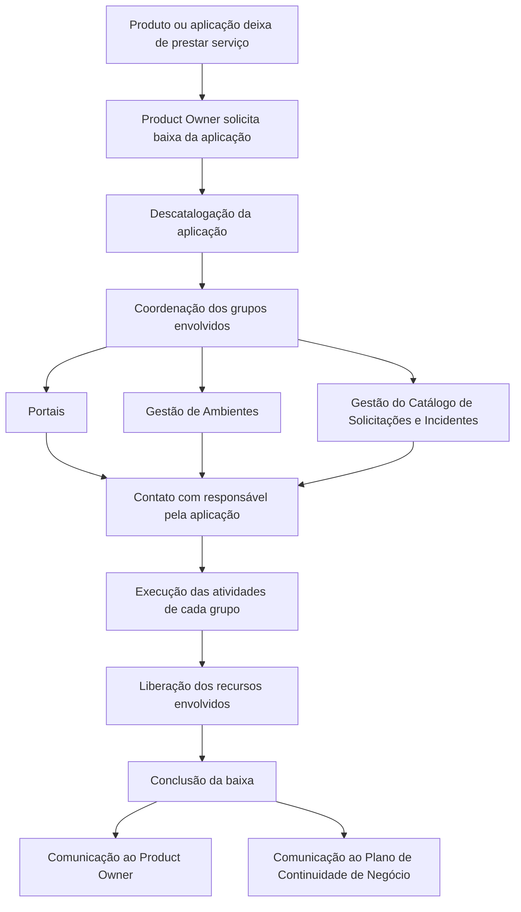

# Processo de Decomissionamento de Aplicações — Solicitação de Baixa, Coordenação e Liberação de Recursos

## 1. Metadados do Documento
- **Arquivo de Origem:** `Não identificado`
- **Tipo de Documento:** Procedimento
- **Domínio / Sistema:** Decomissionamento de aplicações
- **Público-Alvo:** Product Owner, equipes de Portais, Gestão de Ambientes, Gestão do Catálogo de Solicitações e Incidentes, Plano de Continuidade de Negócio
- **Data/Versão Identificada:** Não identificada

---

## 2. Resumo Executivo & Contexto de Negócio

O documento descreve a fase de **decomissionamento** de um produto ou aplicação após a interrupção da prestação de serviço. O objetivo é impedir que a aplicação permaneça ativa no portfólio corporativo, consumindo recursos e gerando custos após deixar de ser necessária.

O processo começa quando o **Product Owner** solicita a baixa da aplicação para viabilizar sua descatalogação. A solicitação inicial desencadeia a coordenação entre os grupos envolvidos no decomissionamento.

A execução exige colaboração orquestrada entre equipes como Portais, Gestão de Ambientes e Gestão do Catálogo de Solicitações e Incidentes. Cada grupo entra em contato com o responsável pela aplicação para realizar a parcela de atividades sob sua responsabilidade.

Após a conclusão da baixa e da liberação dos recursos envolvidos, a finalização é comunicada ao Product Owner e ao **Plano de Continuidade de Negócio**. O documento não apresenta detalhes sobre prazos, ferramentas, critérios técnicos de validação ou procedimentos específicos executados por cada equipe.

---

## 3. Arquitetura, Componentes & Tecnologias Envolvidas

O documento não descreve uma arquitetura de software, tecnologias, endpoints, bancos de dados ou integrações técnicas. Os componentes organizacionais e processuais identificados são:

- Aplicação ou produto a ser decomissionado.
- Product Owner.
- Responsável pela aplicação.
- Equipe de Portais.
- Equipe de Gestão de Ambientes.
- Equipe de Gestão do Catálogo de Solicitações e Incidentes.
- Plano de Continuidade de Negócio.
- Portfólio de aplicações.



> **Nota de Análise:** o documento cita grupos participantes do processo, mas não detalha sistemas, ferramentas, responsabilidades individuais, fluxos de aprovação, métodos de comunicação ou evidências exigidas para concluir a baixa.

---

## 4. Regras de Negócio, Especificações Funcionais & Processos

1. Uma aplicação ou produto que deixa de prestar serviço deve ser decomissionado.
2. O decomissionamento evita que a aplicação permaneça ativa no portfólio de aplicações.
3. O decomissionamento busca evitar consumo contínuo de recursos e geração de gastos.
4. O Product Owner deve solicitar a baixa da aplicação como primeiro passo do processo.
5. A solicitação de baixa permite a descatalogação da aplicação.
6. O processo requer coordenação entre os grupos envolvidos no decomissionamento.
7. Os grupos explicitamente citados são Portais, Gestão de Ambientes e Gestão do Catálogo de Solicitações e Incidentes.
8. Os grupos envolvidos devem contatar o responsável pela aplicação.
9. Cada grupo deve executar a parte do decomissionamento que lhe corresponda.
10. Após a finalização da baixa, a conclusão deve ser comunicada ao Product Owner.
11. Após a finalização da baixa, a conclusão deve ser comunicada ao Plano de Continuidade de Negócio.

---

## 5. Tabelas de Parâmetros, Ambientes e Estruturas de Dados

| Item / Parâmetro | Descrição / Função | Tipo / Valores / Formato | Ambiente / Observações |
| :--- | :--- | :--- | :--- |
| Decomissionamento | Processo aplicado quando um produto ou aplicação deixa de prestar serviço. | Processo operacional | Evita manutenção indevida da aplicação no portfólio. |
| Solicitação de baixa | Solicitação iniciada pelo Product Owner para permitir a descatalogação. | Etapa inicial do processo | O documento atribui a solicitação ao Product Owner. |
| Descatalogação | Retirada da aplicação do catálogo ou portfólio de aplicações. | Resultado esperado da solicitação de baixa | Não há detalhamento de ferramenta ou fluxo de aprovação. |
| Portais | Grupo envolvido na colaboração do decomissionamento. | Equipe participante | Responsabilidades específicas não detalhadas. |
| Gestão de Ambientes | Grupo envolvido na colaboração do decomissionamento. | Equipe participante | Responsabilidades específicas não detalhadas. |
| Gestão do Catálogo de Solicitações e Incidentes | Grupo envolvido na colaboração do decomissionamento. | Equipe participante | Responsabilidades específicas não detalhadas. |
| Responsável pela aplicação | Pessoa contatada pelos grupos para viabilizar as atividades sob responsabilidade de cada grupo. | Papel organizacional | Não há nome, área ou canal de contato informado. |
| Liberação de recursos | Atividade necessária no processo de decomissionamento. | Etapa operacional | Os recursos não são especificados no documento. |
| Product Owner | Responsável por iniciar a baixa e receber a comunicação de conclusão. | Papel organizacional | Atua no início e no encerramento do processo. |
| Plano de Continuidade de Negócio | Destinatário da comunicação após a conclusão da baixa. | Parte interessada | Não são informados critérios ou ações posteriores. |

---

## 6. Bateria de Perguntas & Respostas para RAG (FAQ Sintético)

### P1: Quando uma aplicação deve ser decomissionada?
**R:** Uma aplicação deve ser decomissionada quando o produto ou aplicação deixa de prestar serviço. O objetivo é impedir que permaneça ativa no portfólio, consumindo recursos e gerando gastos.

### P2: Quem deve iniciar o processo de baixa de uma aplicação?
**R:** O Product Owner deve iniciar o processo solicitando a baixa da aplicação. O documento identifica essa solicitação como o primeiro passo do decomissionamento.

### P3: Qual é a finalidade da solicitação de baixa feita pelo Product Owner?
**R:** A solicitação de baixa permite que seja realizada a descatalogação da aplicação, removendo-a do portfólio corporativo de aplicações.

### P4: Quais equipes são mencionadas como participantes do decomissionamento?
**R:** O documento menciona os grupos de Portais, Gestão de Ambientes e Gestão do Catálogo de Solicitações e Incidentes como envolvidos na colaboração necessária para o decomissionamento.

### P5: Por que é necessário coordenar diferentes equipes durante o decomissionamento?
**R:** A coordenação é necessária porque distintos grupos precisam executar as atividades que lhes correspondem no processo de baixa e liberação dos recursos associados à aplicação.

### P6: Com quem as equipes envolvidas devem entrar em contato?
**R:** Os grupos envolvidos devem entrar em contato com o responsável pela aplicação para executar a parte do processo que cabe a cada grupo.

### P7: O que deve ocorrer após a execução das atividades pelos grupos envolvidos?
**R:** Após as atividades correspondentes serem executadas, os recursos implicados devem ser liberados e a baixa da aplicação deve ser finalizada.

### P8: Quem deve ser informado quando a baixa da aplicação for concluída?
**R:** Após a finalização da baixa, a conclusão deve ser comunicada ao Product Owner e ao Plano de Continuidade de Negócio.

### P9: Quais recursos devem ser liberados no decomissionamento?
**R:** O documento determina que os recursos envolvidos devem ser liberados, mas não especifica quais tipos de recursos, como infraestrutura, acessos, ambientes, dados ou licenças.

### P10: O documento define prazos ou critérios de aceite para concluir o decomissionamento?
**R:** Não. O documento descreve as etapas gerais de solicitação, coordenação, execução, liberação de recursos e comunicação final, mas não informa prazos, critérios formais de aceite ou evidências obrigatórias.

---

## 7. Glossário de Termos, Siglas & Conceitos-Chave

- **Decomissionamento / Decomisado:** processo de baixa de uma aplicação ou produto que deixou de prestar serviço.
- **Product Owner:** papel responsável por solicitar a baixa da aplicação e receber a comunicação de conclusão.
- **Descatalogação:** remoção da aplicação do catálogo ou portfólio de aplicações.
- **Portfólio de aplicações:** conjunto corporativo de aplicações ativas.
- **Gestão de Ambientes:** grupo citado como participante do processo de decomissionamento.
- **Gestão do Catálogo de Solicitações e Incidentes:** grupo citado como participante do processo de decomissionamento.
- **Plano de Continuidade de Negócio:** destinatário da comunicação após a finalização da baixa.

---

## 8. Notas Críticas, Riscos & Limitações

- O documento não identifica o nome da aplicação, produto, sistema ou domínio específico ao qual o procedimento se aplica.
- Não há detalhamento das atividades atribuídas a Portais, Gestão de Ambientes ou Gestão do Catálogo de Solicitações e Incidentes.
- Não são especificados os recursos que devem ser liberados.
- O documento não informa prazos, responsáveis nominais, ferramentas, canais de solicitação, evidências, aprovações ou critérios de conclusão.
- Não são definidos procedimentos para tratamento de falhas, pendências, dependências técnicas ou reversão do decomissionamento.
- **Nota de Análise:** o material descreve um fluxo operacional de alto nível; não há detalhamento adicional sobre execução técnica, integrações ou controles de governança.

---

## 9. Conteúdo Bruto Estruturado (Referência Fiel)

```text
--- [PÁGINA 1 DE 2] ---

FASE DECOMISADO
DECOMISADO
Una vez que el producto/aplicación deje de dar servicio se deberá
decomisar para que no continúe activo/a en el portfolio de aplicaciones
consumiendo recursos y generando gastos. Estas tareas se detallan en:
Decomisado.
Solicitar la baja de la aplicación
Como primer paso del Decomisado, el
Product Owner debe solicitar la baja de la
aplicación para que se proceda a su
descatalogación.
Coordinar los equipos implicados en el
decomisado
Es preciso orquestar la colaboración entre los
distintos grupos implicados: Portales, Gestión
de Entornos, Gestión del Catálogo de
Peticiones de Incidencias...
Liberar los recursos implicados
Los distintos grupos contactarán con el
responsable de la aplicación para poder
Confirmar y comunicar la completitud de la
baja y comunicarla al Plan de Continuidad
de Negocio
 /
 CF
Home Solutions APIs Documentation Zeus
EN


--- [PÁGINA 2 DE 2] ---

ejecutar la parte que le corresponda.
 Una vez finalizada la baja, se comunica al
Product Owner y al Plan de Continuidad de
Negocio.
```
