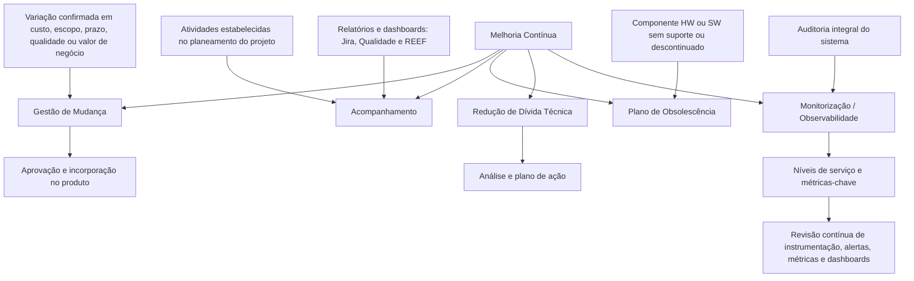

# Fase de Melhoria Contínua — Gestão de Mudança, Acompanhamento, Obsolescência, Dívida Técnica e Monitorização

## 1. Metadados do Documento
- **Arquivo de Origem:** Não identificado no conteúdo fornecido
- **Tipo de Documento:** Procedimento
- **Domínio / Sistema:** MAPFRE; ciclo de melhoria contínua de produto
- **Público-Alvo:** Desenvolvedores, Arquitetos, Operação, Gestão de Projeto e Qualidade
- **Data/Versão Identificada:** Não identificada

---

## 2. Resumo Executivo & Contexto de Negócio

O documento descreve a fase de **Mejora Continua** (Melhoria Contínua), composta por atividades transversais destinadas a garantir visibilidade, coerência e evolução do produto. As atividades apresentadas abrangem gestão de mudanças, acompanhamento da execução do projeto, tratamento de obsolescência tecnológica, redução de dívida técnica e monitorização/observabilidade.

A Gestão de Mudança é iniciada quando uma variação é confirmada nas condições atuais de custo, escopo, prazo, qualidade ou valor de negócio. O objetivo declarado é submeter essa variação à aprovação e incorporá-la ao produto.

O Acompanhamento estabelece ações para verificar a execução correta das atividades previstas no planeamento do projeto. Essa atividade apoia-se principalmente em relatórios e dashboards de Jira, Qualidade e REEF.

A melhoria contínua também inclui a gestão preventiva de riscos tecnológicos. O documento define obsolescência tecnológica como componentes de hardware ou software cujo suporte do fornecedor/fabricante terminou ou que sofreram descontinuidade. Também orienta a análise e elaboração de um plano de ação para reduzir gradualmente a dívida técnica identificada no produto.

A Monitorização é tratada sob a perspetiva de Observabilidade: requer auditoria integral do sistema para definir níveis de serviço e métricas-chave. À medida que o sistema cresce ou muda, a instrumentação, alertas, métricas e dashboards devem ser revistos continuamente para manter o alinhamento com o estado e o comportamento atuais do sistema.

---

## 3. Arquitetura, Componentes & Tecnologias Envolvidas

Os elementos citados representam ferramentas e frentes operacionais da fase de melhoria contínua:

- **Gestão de Mudança:** processo para aprovar e incorporar variações confirmadas.
- **Acompanhamento:** controlo da execução das atividades planeadas do projeto.
- **Jira:** fonte de relatórios e dashboards utilizada no acompanhamento.
- **Qualidade:** fonte de relatórios e dashboards utilizada no acompanhamento.
- **REEF:** fonte de relatórios e dashboards utilizada no acompanhamento.
- **Plano de Obsolescência:** atividade para tratamento de componentes HW ou SW sem suporte ou descontinuados.
- **Redução de Dívida Técnica:** atividade de análise e planeamento de ações corretivas graduais.
- **Monitorização / Observabilidade:** auditoria do sistema, definição de níveis de serviço e evolução de instrumentação, alertas, métricas e dashboards.
- **Home Solutions APIs Documentation Zeus:** texto apresentado no rodapé do conteúdo; o documento não descreve a função desse elemento.
- **CF:** sigla apresentada junto de “Reducción de Deuda Técnica”; o documento não fornece expansão ou definição.



> **Nota de Análise:** o documento apresenta as atividades e seus objetivos, mas não detalha responsáveis, ferramentas de aprovação, prazos, métodos de cálculo, contratos de integração, métodos HTTP, URLs ou procedimentos operacionais específicos.

---

## 4. Regras de Negócio, Especificações Funcionais & Processos

### 4.1 Gestão de Mudança

1. Deve ser identificada uma variação nas condições atuais do produto ou projeto.
2. A variação deve estar confirmada.
3. A variação pode afetar um ou mais dos seguintes elementos:
   - custo;
   - escopo;
   - prazo;
   - qualidade;
   - valor de negócio.
4. Após a confirmação, deve ser iniciada a Gestão de Mudança.
5. A Gestão de Mudança visa permitir a aprovação da variação.
6. Após aprovação, a variação deve ser incorporada ao produto.

### 4.2 Acompanhamento

1. O Acompanhamento define o conjunto de ações para comprovar a execução correta das atividades do projeto.
2. As atividades verificadas são as estabelecidas no planeamento do projeto.
3. O Acompanhamento apoia-se principalmente em:
   - relatórios de Jira;
   - dashboards de Jira;
   - relatórios de Qualidade;
   - dashboards de Qualidade;
   - relatórios de REEF;
   - dashboards de REEF.

### 4.3 Plano de Obsolescência

1. É considerada obsolescência tecnológica qualquer versão de componente de hardware (HW) ou software (SW) existente na MAPFRE que atenda a pelo menos uma condição:
   - o suporte do fornecedor/fabricante tenha terminado; ou
   - tenha ocorrido descontinuidade do componente.
2. O documento remete o detalhe da atividade para o “Plan de Obsolescencia”.
3. Não são informados critérios de priorização, inventário de componentes, responsáveis, prazos ou ações de substituição.

### 4.4 Redução de Dívida Técnica

1. Dívida técnica é definida como o custo de retrabalho decorrente de ações tomadas durante o desenvolvimento.
2. Essas ações podem ocasionar problemas futuros.
3. O esforço de correção da dívida técnica aumenta com o passar do tempo.
4. Quando for identificada dívida técnica no produto em curso, deve ser iniciada uma análise.
5. Após a análise, deve ser elaborado um plano de ação.
6. O plano de ação deve reduzir gradualmente a dívida técnica.

### 4.5 Monitorização e Observabilidade

1. A Observabilidade requer uma auditoria integral do sistema.
2. A auditoria integral permite estabelecer níveis de serviço.
3. A auditoria integral permite definir métricas-chave para avaliar os níveis de serviço.
4. À medida que o sistema cresce e muda, a Observabilidade também deve evoluir.
5. A evolução da Observabilidade requer revisão contínua de:
   - instrumentação;
   - alertas;
   - métricas;
   - dashboards.
6. As revisões devem assegurar alinhamento com o estado atual do sistema e com o comportamento atual do sistema.

---

## 5. Tabelas de Parâmetros, Ambientes e Estruturas de Dados

| Item / Parâmetro | Descrição / Função | Tipo / Valores / Formato | Ambiente / Observações |
| :--- | :--- | :--- | :--- |
| Fase de Melhoria Contínua | Conjunto de atividades transversais para garantir visibilidade, coerência e melhoria do produto. | Fase/processo | Aplicável ao produto e ao projeto. |
| Gestão de Mudança | Processo iniciado para aprovar e incorporar uma variação no produto. | Processo | Requer confirmação prévia da variação. |
| Condição de disparo da Gestão de Mudança | Variação confirmada nas condições atuais. | Regra de negócio | Pode afetar custo, escopo, prazo, qualidade ou valor de negócio. |
| Custo | Uma das condições que pode sofrer variação. | Critério de impacto | Pode iniciar Gestão de Mudança quando a variação for confirmada. |
| Escopo | Uma das condições que pode sofrer variação. | Critério de impacto | Pode iniciar Gestão de Mudança quando a variação for confirmada. |
| Prazo | Uma das condições que pode sofrer variação. | Critério de impacto | Pode iniciar Gestão de Mudança quando a variação for confirmada. |
| Qualidade | Uma das condições que pode sofrer variação. | Critério de impacto | Pode iniciar Gestão de Mudança quando a variação for confirmada. |
| Valor de negócio | Uma das condições que pode sofrer variação. | Critério de impacto | Pode iniciar Gestão de Mudança quando a variação for confirmada. |
| Acompanhamento | Conjunto de ações para comprovar a correta execução das atividades do projeto. | Processo | Baseado no planeamento do projeto. |
| Jira | Fonte de relatórios e dashboards para Acompanhamento. | Ferramenta/sistema citado | Não há detalhamento de projetos, filtros ou dashboards. |
| Qualidade | Fonte de relatórios e dashboards para Acompanhamento. | Área, sistema ou fonte citada | O documento não especifica a ferramenta de Qualidade. |
| REEF | Fonte de relatórios e dashboards para Acompanhamento. | Sistema/fonte citada | O documento não expande a sigla. |
| Obsolescência tecnológica | Situação de componente HW ou SW sem suporte ou descontinuado. | Definição / critério | Aplicável a componentes existentes na MAPFRE. |
| Hardware (HW) | Componente físico sujeito à obsolescência tecnológica. | Tipo de componente | O suporte do fornecedor/fabricante pode ter terminado. |
| Software (SW) | Componente lógico sujeito à obsolescência tecnológica. | Tipo de componente | O suporte do fornecedor/fabricante pode ter terminado. |
| Dívida técnica | Custo de retrabalho causado por ações realizadas durante o desenvolvimento. | Conceito de engenharia | Pode causar problemas futuros; o esforço de correção aumenta com o tempo. |
| Plano de ação de dívida técnica | Plano elaborado após análise de dívida técnica identificada. | Artefacto de ação | Deve reduzir gradualmente a dívida técnica. |
| Auditoria integral do sistema | Auditoria necessária para estabelecer níveis de serviço e métricas-chave. | Atividade de Observabilidade | O documento não especifica método, frequência ou responsáveis. |
| Níveis de serviço | Níveis a estabelecer por meio da auditoria integral do sistema. | Critério de avaliação | Sem valores, indicadores ou metas informados. |
| Métricas-chave | Métricas definidas para avaliar os níveis de serviço. | Indicador | Sem catálogo, fórmula ou limiar informado. |
| Instrumentação | Elemento de Observabilidade a ser revisto continuamente. | Elemento técnico | Deve acompanhar o crescimento e as mudanças do sistema. |
| Alertas | Elemento de Observabilidade a ser revisto continuamente. | Elemento operacional | Deve permanecer alinhado ao estado e comportamento atuais. |
| Dashboards | Elemento de Observabilidade e Acompanhamento. | Visualização/relatório | Citado em Jira, Qualidade, REEF e Monitorização. |

---

## 6. Bateria de Perguntas & Respostas para RAG (FAQ Sintético)

### P1: Quando a Gestão de Mudança deve ser iniciada?
**R:** A Gestão de Mudança deve ser iniciada quando uma variação estiver confirmada nas condições atuais de custo, escopo, prazo, qualidade ou valor de negócio. A finalidade é proceder à aprovação da variação e à sua incorporação no produto.

### P2: Quais impactos podem justificar a abertura de uma Gestão de Mudança?
**R:** O documento cita cinco tipos de impacto: custo, escopo, prazo, qualidade e valor de negócio. A variação precisa estar confirmada para que a Gestão de Mudança seja iniciada.

### P3: Qual é o objetivo do Acompanhamento no projeto?
**R:** O Acompanhamento estabelece o conjunto de ações necessárias para comprovar a correta execução das atividades do projeto definidas no planeamento do próprio projeto.

### P4: Quais fontes de informação apoiam o Acompanhamento?
**R:** O Acompanhamento apoia-se principalmente nos relatórios e dashboards de Jira, Qualidade e REEF. O documento não detalha os relatórios, dashboards, filtros ou métricas específicos utilizados nessas fontes.

### P5: Como o documento define obsolescência tecnológica?
**R:** Obsolescência tecnológica é qualquer versão de um componente de hardware ou software existente na MAPFRE cujo suporte do fornecedor/fabricante tenha terminado e/ou que tenha sofrido descontinuidade.

### P6: O que deve ocorrer quando for identificada dívida técnica no produto em curso?
**R:** Quando a dívida técnica for identificada, deve ser iniciada uma análise e elaborado um plano de ação para reduzir gradualmente a dívida técnica. O documento destaca que o esforço de correção aumenta ao longo do tempo.

### P7: Qual é a definição de dívida técnica apresentada?
**R:** Dívida técnica é o custo de retrabalho derivado de ações realizadas durante o desenvolvimento que podem causar problemas no futuro. O custo ou esforço necessário para correção aumenta com o passar do tempo.

### P8: Por que a Observabilidade exige uma auditoria integral do sistema?
**R:** A auditoria integral do sistema é necessária para estabelecer os níveis de serviço e definir as métricas-chave que serão analisadas para avaliar esses níveis de serviço.

### P9: Quais elementos da Observabilidade devem evoluir quando o sistema cresce ou muda?
**R:** A instrumentação, os alertas, as métricas e os dashboards devem ser revistos continuamente para garantir alinhamento com o estado atual do sistema e com o comportamento atual do sistema.

### P10: O documento informa valores, metas ou fórmulas para métricas de serviço?
**R:** Não. O documento informa que as métricas-chave devem ser definidas para avaliar níveis de serviço, mas não especifica métricas, fórmulas, limiares, metas ou acordos de nível de serviço.

---

## 7. Glossário de Termos, Siglas & Conceitos-Chave

- **Acompanhamento / Seguimiento:** conjunto de ações para comprovar a correta execução das atividades do projeto definidas no planeamento.
- **CF:** sigla citada junto de “Reducción de Deuda Técnica”; o documento não apresenta o significado.
- **Dívida Técnica / Deuda Técnica:** custo de retrabalho decorrente de ações de desenvolvimento que podem gerar problemas futuros.
- **Gestão de Mudança / Gestión del Cambio:** processo para aprovar e incorporar no produto uma variação confirmada.
- **HW:** hardware; componente físico sujeito à obsolescência tecnológica.
- **MAPFRE:** organização na qual existem os componentes de hardware e software considerados no conceito de obsolescência tecnológica.
- **Monitorização / Monitorización:** atividade relacionada à Observabilidade, auditoria integral, níveis de serviço e métricas-chave.
- **Observabilidade / Observabilidad:** capacidade que requer auditoria integral do sistema e evolução contínua de instrumentação, alertas, métricas e dashboards.
- **REEF:** fonte de relatórios e dashboards usada no Acompanhamento; o documento não expande a sigla.
- **SW:** software; componente lógico sujeito à obsolescência tecnológica.

---

## 8. Notas Críticas, Riscos & Limitações

- O documento remete detalhes de Gestão de Mudança, Acompanhamento, Plano de Obsolescência, Redução de Dívida Técnica e Monitorização para materiais específicos, mas esses materiais não foram fornecidos.
- Não são identificados responsáveis, papéis, aprovações, prazos, critérios de prioridade ou fluxos de escalonamento.
- Não são definidos valores ou metas para níveis de serviço, métricas-chave, alertas ou dashboards.
- A dívida técnica tende a exigir maior esforço de correção ao longo do tempo, constituindo um risco explícito caso não seja analisada e reduzida gradualmente.
- Componentes de hardware e software sem suporte ou descontinuados configuram obsolescência tecnológica e demandam tratamento pelo Plano de Obsolescência.
- A dependência de relatórios e dashboards de Jira, Qualidade e REEF é mencionada, porém o documento não define disponibilidade, governança, fontes de dados ou regras de atualização dessas ferramentas.
- **Nota de Análise:** “Home Solutions APIs Documentation Zeus” e “CF” são citados sem explicação funcional adicional.

---

## 9. Conteúdo Bruto Estruturado (Referência Fiel)

```text
--- [PÁGINA 1 DE 2] ---

FASE MEJORA CONTINUA
MEJORA CONTINUA
Conjunto de actividades transversales que garantizan la visibilidad, la
coherencia y la mejora del producto.
Gestión del Cambio
Cuando se confirma una variación con las
condiciones actuales en coste, alcance,
tiempo, calidad o valor de negocio, se inicia la
Gestión del Cambio para proceder a su
aprobación e incorporación al producto.
El detalle de esta actividad se recoge en:
Gestión del Cambio
Seguimiento
El seguimiento establece el conjunto de
acciones que se llevarán a cabo para la
comprobación de la correcta ejecución de las
actividades del proyecto establecidas en la
planificación del mismo. Principalmente, se
apoya en los informes y dashboards de Jira,
Calidad, REEF...
El detalle de esta actividad se recoge en:
Seguimiento
Plan de Obsolescencia
 Reducción de Deuda Técnica
 / 
 CF
Home Solutions APIs Documentation Zeus
EN


--- [PÁGINA 2 DE 2] ---

Se considera obsolescencia tecnológica a
toda aquella versión de un componente
hardware (HW) o software (SW) existente en
MAPFRE del cual haya finalizado el soporte
del proveedor/fabricante y/o se haya
producido una discontinuidad del mismo.
El detalle de esta actividad se recoge en: Plan
de Obsolescencia
La deuda técnica es el coste del retrabajo
derivado de actuaciones durante el desarrollo
que pueden llegar a ocasionar problemas en
el futuro. Este esfuerzo de corrección
aumenta a medida que pasa el tiempo, por lo
que cuando se detecta deuda en el producto
en curso, se debe iniciar un análisis y elaborar
un plan de acción para reducir gradualmente
la deuda técnica.
El detalle de esta actividad se recoge en:
Reducción de Deuda Técnica
Monitorización
La Observabilidad precisa de una auditoría
integral del sistema para poder establecer los
niveles de servicio y definir las métricas clave
a analizar para evaluarlos.
A medida que el sistema crezca y cambie, la
Observabilidad también debe evolucionar,
revisando continuamente su instrumentación,
alertas, métricas y dashboards para asegurar
que se alineen con el estado actual del
sistema y su comportamiento.
El detalle de esta actividad se recoge en:
Monitorización
```
