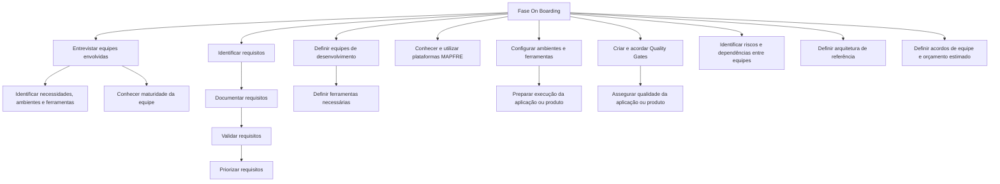

# Fase On Boarding — Provisão Inicial para Desenvolvimento de Produto

## 1. Metadados do Documento
- **Arquivo de Origem:** `Não informado`
- **Tipo de Documento:** `Apresentação executiva (inferido pelo conteúdo paginado; não confirmado)`
- **Domínio / Sistema:** `MAPFRE — fase On Boarding`
- **Público-Alvo:** `Equipes de desenvolvimento, arquitetura, gestão e equipes envolvidas`
- **Data/Versão Identificada:** `Não identificada`

---

## 2. Resumo Executivo & Contexto de Negócio

O documento descreve a fase de **On Boarding**, etapa inicial voltada à provisão das ferramentas e plataformas necessárias para desenvolver uma aplicação ou produto. Essa fase também inclui a definição de um diagrama de arquitetura de referência, a organização da equipe de desenvolvimento e a definição de acordos de equipe sob um orçamento estimado.

A fase de On Boarding prevê entrevistas com as equipes envolvidas para identificar necessidades, ambientes e ferramentas necessárias à criação da solução. As entrevistas também permitem conhecer o nível de maturidade da equipe participante do projeto.

O conteúdo determina a identificação, documentação, validação e priorização de requisitos. Também estabelece a necessidade de definir equipes e ferramentas, utilizar as plataformas disponíveis na MAPFRE, configurar ambientes de execução e acordar Quality Gates para assegurar a qualidade da aplicação ou produto.

Por fim, a fase inclui a identificação de riscos e dependências entre equipes. O documento referencia atividades detalhadas em seções denominadas “Primeros pasos”, “Plan”, “Requisitos”, “Aplicaciones”, “Backlog y Releases”, “Recursos”, “Plataformas”, “Configuración”, “Quality Gates” e “Identificar Riesgos y Dependencias”, sem apresentar o conteúdo dessas seções.

---

## 3. Arquitetura, Componentes & Tecnologias Envolvidas

O documento não especifica tecnologias, protocolos, microsserviços, servidores, URLs, integrações, contratos ou ferramentas concretas. O conteúdo apresenta um fluxo organizacional para preparação da solução durante a fase de On Boarding.

Componentes e elementos citados:

- Fase **On Boarding**.
- Ferramentas e plataformas necessárias ao desenvolvimento.
- Diagrama de arquitetura de referência.
- Equipe de desenvolvimento.
- Acordos de equipe.
- Orçamento estimado.
- Requisitos documentados, validados e priorizados.
- Ambientes e ferramentas de execução.
- Plataformas disponíveis na MAPFRE.
- Quality Gates.
- Riscos e dependências entre equipes.
- Referências de navegação ou seções: `Inicio`, `Soluciones`, `APIs`, `Documentación`, `Zeus`, `ES`, `RS`.



> **Nota de Análise:** O documento menciona um “diagrama de arquitetura de referência”, porém não fornece o diagrama, seus componentes, interfaces ou tecnologias.

---

## 4. Regras de Negócio, Especificações Funcionais & Processos

### Processo da fase de On Boarding

1. Prover as ferramentas e plataformas necessárias para desenvolver o produto.
2. Definir o diagrama de arquitetura de referência.
3. Organizar a equipe de desenvolvimento.
4. Definir os acordos de equipe considerando um orçamento estimado.
5. Realizar entrevistas com as equipes envolvidas.
6. Identificar necessidades, ambientes e ferramentas necessários para criar a solução.
7. Conhecer o nível de maturidade da equipe participante do projeto.
8. Identificar requisitos.
9. Documentar os requisitos identificados.
10. Validar os requisitos documentados.
11. Priorizar os requisitos validados.
12. Definir as equipes de desenvolvimento e as ferramentas necessárias.
13. Conhecer e utilizar as plataformas disponíveis na MAPFRE.
14. Configurar e preparar todos os ambientes e ferramentas necessários para executar a aplicação ou produto.
15. Criar e acordar Quality Gates para assegurar a qualidade da aplicação ou produto.
16. Identificar riscos e dependências entre equipes.

### Referências a atividades detalhadas

| Atividade identificada | Seção indicada pelo documento | Detalhamento disponível no conteúdo fornecido |
| :--- | :--- | :--- |
| Entrevistar equipes envolvidas e identificar necessidades | `Primeros pasos` | Não |
| Identificar, documentar, validar e priorizar requisitos | `Plan`, `Requisitos`, `Aplicaciones`, `Backlog y Releases` | Não |
| Definir equipes e ferramentas necessárias | `Recursos` | Não |
| Conhecer e utilizar plataformas MAPFRE | `Plataformas` | Não |
| Configurar ambientes e ferramentas | `Configuración` | Não |
| Criar e acordar Quality Gates | `Quality Gates` | Não |
| Identificar riscos e dependências | `Identificar Riesgos y Dependencias` | Não |

---

## 5. Tabelas de Parâmetros, Ambientes e Estruturas de Dados

| Item / Parâmetro | Descrição / Função | Tipo / Valores / Formato | Ambiente / Observações |
| :--- | :--- | :--- | :--- |
| Ferramentas | Recursos necessários para desenvolver o produto e executar a aplicação ou produto | Não especificado | Devem ser provisionadas e preparadas durante On Boarding |
| Plataformas | Plataformas disponíveis para utilização | Plataformas MAPFRE | O documento não identifica nomes, versões ou acessos |
| Diagrama de arquitetura de referência | Arquitetura de referência a ser definida | Diagrama não fornecido | Não há componentes ou tecnologias detalhados |
| Equipe de desenvolvimento | Equipe responsável pelo desenvolvimento | Não especificado | Deve ser organizada e definida |
| Acordos de equipe | Acordos a serem definidos para o trabalho da equipe | Não especificado | Considerados sob orçamento estimado |
| Orçamento estimado | Referência financeira associada aos acordos de equipe | Não especificado | Não há valores ou critérios de cálculo |
| Requisitos | Necessidades a identificar, documentar, validar e priorizar | Não especificado | Referenciados nas seções Plan, Requisitos, Aplicaciones, Backlog y Releases |
| Ambientes | Ambientes necessários à execução da aplicação ou produto | Não especificado | Devem ser configurados e preparados |
| Quality Gates | Critérios acordados para assegurar qualidade | Não especificado | Não há métricas, critérios ou responsáveis detalhados |
| Riscos | Riscos a serem identificados | Não especificado | Inclui riscos entre equipes |
| Dependências | Dependências entre equipes a serem identificadas | Não especificado | Não há matriz de dependências fornecida |

---

## 6. Bateria de Perguntas & Respostas para RAG (FAQ Sintético)

### P1: Qual é o objetivo da fase de On Boarding descrita no documento?
**R:** A fase de On Boarding tem como objetivo prover as ferramentas e plataformas necessárias para desenvolver o produto, definir um diagrama de arquitetura de referência, organizar a equipe de desenvolvimento e estabelecer acordos de equipe sob um orçamento estimado.

### P2: Por que o documento recomenda entrevistar as equipes envolvidas?
**R:** As entrevistas servem para identificar necessidades, ambientes e ferramentas necessários à criação da solução. Também permitem conhecer o nível de maturidade da equipe que participará do projeto.

### P3: Como os requisitos devem ser tratados durante a fase de On Boarding?
**R:** Os requisitos devem ser identificados, documentados, validados e priorizados. O documento referencia as seções Plan, Requisitos, Aplicaciones, Backlog y Releases para detalhamento dessas atividades, mas não apresenta esse detalhamento no conteúdo fornecido.

### P4: O que deve ser definido sobre as equipes de desenvolvimento?
**R:** Devem ser definidos os times de desenvolvimento e as ferramentas necessárias para esses times. A atividade é referenciada na seção Recursos.

### P5: Qual orientação o documento fornece sobre plataformas corporativas?
**R:** O documento orienta conhecer e utilizar as plataformas disponíveis na MAPFRE. Não são informados os nomes das plataformas, versões, URLs, credenciais, responsáveis ou procedimentos de acesso.

### P6: O que precisa ser configurado antes da execução da aplicação ou produto?
**R:** Todos os ambientes e ferramentas necessários para a execução da aplicação ou produto devem ser configurados e preparados. A atividade é referenciada na seção Configuración.

### P7: Qual é a finalidade dos Quality Gates mencionados no documento?
**R:** Os Quality Gates devem ser criados e acordados para assegurar a qualidade da aplicação ou produto a ser realizado. O documento não detalha critérios, métricas, evidências, ferramentas ou responsáveis pelos Quality Gates.

### P8: Quais riscos devem ser identificados durante o On Boarding?
**R:** Devem ser identificados quaisquer tipos de risco e dependências entre equipes. O documento referencia a seção Identificar Riesgos y Dependencias, mas não apresenta exemplos, classificações ou ações de mitigação.

### P9: O documento disponibiliza a arquitetura de referência da solução?
**R:** Não. O documento informa que o diagrama de arquitetura de referência deve ser definido durante a fase de On Boarding, mas não contém o diagrama nem descreve componentes, integrações, tecnologias ou fluxos técnicos.

### P10: Há informações sobre orçamento, ferramentas específicas ou ambientes técnicos?
**R:** Não há informações específicas. O documento menciona orçamento estimado, ferramentas, plataformas e ambientes, mas não fornece valores, produtos, versões, endpoints, topologias ou procedimentos operacionais.

---

## 7. Glossário de Termos, Siglas & Conceitos-Chave

- **On Boarding:** Fase inicial em que são provisionadas ferramentas e plataformas, definida uma arquitetura de referência, organizada a equipe de desenvolvimento e estabelecidos acordos de equipe.
- **MAPFRE:** Organização citada como disponibilizadora de plataformas. O documento não expande ou detalha a sigla.
- **Quality Gates:** Elementos que devem ser criados e acordados para assegurar a qualidade da aplicação ou produto.
- **Requisitos:** Necessidades que devem ser identificadas, documentadas, validadas e priorizadas.
- **Backlog:** Termo citado na referência “Backlog y Releases”; não há definição adicional no documento.
- **Releases:** Termo citado na referência “Backlog y Releases”; não há definição adicional no documento.
- **APIs:** Termo listado no conteúdo de referência; o documento não apresenta definição, contratos ou detalhes técnicos.
- **Zeus:** Termo listado no conteúdo de referência; o documento não apresenta definição ou contexto funcional adicional.
- **RS:** Sigla listada no conteúdo de referência; não definida no documento.
- **ES:** Sigla listada no conteúdo de referência; não definida no documento.

---

## 8. Notas Críticas, Riscos & Limitações

- O documento não identifica o arquivo de origem, autor, data, versão ou responsáveis.
- O documento não apresenta o diagrama de arquitetura de referência que afirma dever ser definido.
- Não há especificação de tecnologias, servidores, ambientes, URLs, portas, APIs, integrações ou contratos de dados.
- Não há critérios mensuráveis para os Quality Gates.
- Não há definição de responsáveis, prazos, entregáveis ou evidências para as atividades de On Boarding.
- As seções referenciadas para detalhamento das atividades não estão presentes no conteúdo fornecido.
- Riscos e dependências entre equipes devem ser identificados, mas o documento não fornece matriz de riscos, classificação, impacto, probabilidade, mitigação ou responsáveis.

---

## 9. Conteúdo Bruto Estruturado (Referência Fiel)

```text
--- [PÁGINA 1 DE 2] ---

FASE ON BOARDING
ON BOARDING
Durante la fase de On Boarding se lleva a cabo la provisión de las
herramientas y plataformas necesarias para desarrollar el producto, se
define el diagrama de arquitectura de referencia, se organiza el equipo
de desarrollo y se definen los acuerdos de equipo bajo un presupuesto
estimado.
Celebrar entrevistas con los equipos
involucrados para identificar sus
necesidades, entornos o herramientas de
cara a la creación de la solución.
De este modo, conoceremos el nivel de
madurez del equipo que participará en el
proyecto.
Esta actividad se detalla en: Primeros pasos
Identificar los requisitos, que deberán ser
documentados, validados y priorizados.
Esta actividad se detalla en: Plan, Requisitos,
Aplicaciones, Backlog y Releases
 /
 RS
Inicio Soluciones APIs Documentación Zeus
ES


--- [PÁGINA 2 DE 2] ---

Definir los equipos de desarrollo junto con
las herramientas necesarias.
Esta actividad se detalla en: Recursos
Conocer y utilizar las plataformas
disponibles en MAPFRE.
Esta actividad se detalla en: Plataformas
Configurar y preparar todos los entornos y
herramientas para la ejecución de la
aplicación / producto.
Esta actividad se detalla en: Configuración
Crear y acordar los Quality Gates que
asegurarán la Calidad de la aplicación /
producto a realizar.
Esta actividad se detalla en: Quality Gates
Identificar cualquier tipo de riesgo y/o
dependencia entre equipos.
Esta actividad se detalla en: Identificar
Riesgos y Dependencias
```
