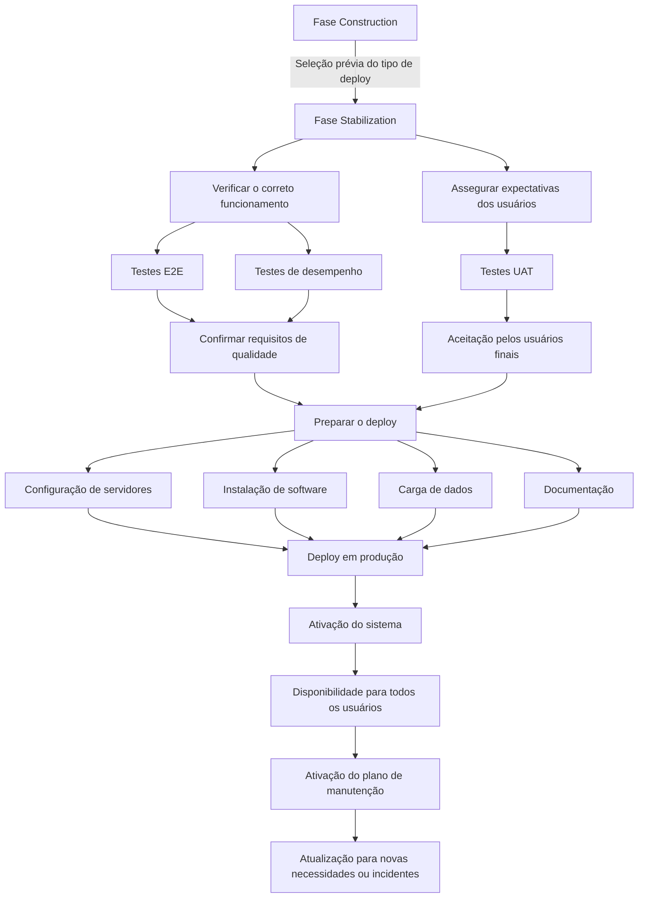

# Fase de Stabilization: Validação Final, Go Live e Ativação de Manutenção

## 1. Metadados do Documento
- **Arquivo de Origem:** `Não identificado — conteúdo bruto fornecido na solicitação`
- **Tipo de Documento:** Procedimento
- **Domínio / Sistema:** Ciclo de vida de desenvolvimento de software — fase *Stabilization*
- **Público-Alvo:** Desenvolvedores, Arquitetos, Operação, Qualidade e Negócio
- **Data/Versão Identificada:** Não identificada

---

## 2. Resumo Executivo & Contexto de Negócio

O documento descreve a fase de **Stabilization**, apresentada como o período final do ciclo de vida de desenvolvimento de software antes do lançamento de um produto ou sistema em produção. O propósito central dessa fase é assegurar que a aplicação desenvolvida cumpra todos os requisitos especificados, opere de forma estável e esteja apta ao uso pelos usuários finais sem erros.

A fase de Stabilization concentra a validação de qualidade por meio da confirmação do funcionamento esperado do software. Essa confirmação é realizada com a execução de testes **E2E** e testes de desempenho. O documento informa que as atividades associadas a esses testes são detalhadas em um conteúdo denominado **Pruebas Estabilización**, mas não reproduz essas atividades no material fornecido.

Além da validação técnica, a fase de Stabilization busca assegurar que os usuários finais aceitem o sistema e que a solução atenda às necessidades e expectativas desses usuários. Para essa finalidade, são executados testes **UAT**. O documento também referencia **Pruebas Estabilización** como fonte de detalhamento das atividades de UAT.

Após a validação, o processo abrange a preparação do deploy, o deploy em produção e a ativação de um plano de manutenção. A preparação considera o tipo de deploy selecionado anteriormente, na fase **Construction**, e inclui configuração de servidores, instalação de software, carga de dados e documentação. O documento remete as atividades detalhadas de preparação, execução do deploy e ativação da manutenção ao conteúdo denominado **Go Live**.

---

## 3. Arquitetura, Componentes & Tecnologias Envolvidas

O conteúdo não descreve uma arquitetura de software detalhada, nem identifica microsserviços, protocolos, APIs, tecnologias, bancos de dados, URLs, servidores específicos ou contratos de integração. O material descreve, entretanto, um fluxo de processo para a etapa final anterior à produção.

Componentes e processos explicitamente citados:

| Componente / Processo | Papel no documento |
| :--- | :--- |
| Fase Stabilization | Período final do ciclo de desenvolvimento antes da entrada em produção. |
| Testes E2E | Usados para confirmar o funcionamento esperado e o cumprimento de requisitos de qualidade. |
| Testes de desempenho | Usados, juntamente com testes E2E, para confirmar funcionamento e qualidade. |
| Testes UAT | Usados para assegurar a aceitação pelos usuários finais e o atendimento de necessidades e expectativas. |
| Pruebas Estabilización | Material referenciado para detalhamento das atividades de testes E2E e UAT. |
| Fase Construction | Fase anterior na qual o tipo de deploy é previamente selecionado. |
| Preparação do deploy | Atividade que assegura prontidão dos componentes para produção. |
| Go Live | Material referenciado para detalhamento da preparação, execução do deploy e ativação do plano de manutenção. |
| Ambiente de produção | Ambiente no qual o sistema é implantado, ativado e disponibilizado aos usuários. |
| Plano de manutenção | Conjunto de atividades para manter o produto ou aplicação atualizado diante de novas necessidades ou incidentes. |



> **Nota de Análise:** O documento descreve um fluxo operacional de estabilização e entrada em produção, mas não detalha a arquitetura técnica dos componentes, os ambientes intermediários, os métodos de deploy, os responsáveis por cada atividade ou os critérios mensuráveis de aprovação.

---

## 4. Regras de Negócio, Especificações Funcionais & Processos

### 4.1 Objetivo da fase de Stabilization

A fase de Stabilization é o período final do ciclo de vida de desenvolvimento de software antes do lançamento do produto ou sistema em produção. Durante essa fase, o produto ou aplicação deve:

1. Cumprir todos os requisitos especificados.
2. Funcionar de maneira estável.
3. Estar preparado para uso pelos usuários finais.
4. Não apresentar erros no momento de disponibilização aos usuários finais.

### 4.2 Verificação do funcionamento correto

A confirmação de que o software funciona conforme esperado e atende aos requisitos de qualidade deve ser realizada por meio de:

1. Execução de testes E2E.
2. Execução de testes de desempenho.

As atividades detalhadas relacionadas aos testes E2E são referenciadas no documento como **Pruebas Estabilización**.

### 4.3 Validação das expectativas dos usuários

A aceitação do sistema pelos usuários finais e o atendimento às respectivas necessidades e expectativas devem ser assegurados mediante a execução de testes UAT.

As atividades detalhadas relacionadas aos testes UAT são referenciadas no documento como **Pruebas Estabilización**.

### 4.4 Preparação do deploy

Antes da implantação em produção, todos os componentes do sistema devem estar prontos para serem implantados no ambiente de produção. A preparação deve respeitar o tipo de deploy selecionado previamente na fase Construction.

A preparação do deploy inclui explicitamente:

1. Configuração de servidores.
2. Instalação de software.
3. Carga de dados.
4. Documentação.

As atividades detalhadas relacionadas à preparação do deploy são referenciadas no documento como **Go Live**.

### 4.5 Deploy em produção

O deploy em produção consiste em implantar a solução no ambiente de produção, ativar o sistema e torná-lo disponível para todos os usuários.

As atividades detalhadas relacionadas à execução do deploy são referenciadas no documento como **Go Live**.

### 4.6 Ativação do plano de manutenção

Após o produto ou aplicação ser implantado em produção, deve ser realizado o mantenimiento necessário para mantê-lo atualizado durante sua vida útil. O plano de manutenção deve considerar:

1. Novas necessidades que possam surgir.
2. Incidentes que possam ocorrer durante a vida útil do produto ou aplicação.

As atividades detalhadas relacionadas à ativação do plano de manutenção são referenciadas no documento como **Go Live**.

---

## 5. Tabelas de Parâmetros, Ambientes e Estruturas de Dados

| Item / Parâmetro | Descrição / Função | Tipo / Valores / Formato | Ambiente / Observações |
| :--- | :--- | :--- | :--- |
| Stabilization | Fase final do ciclo de desenvolvimento antes da entrada em produção. | Fase de ciclo de vida de software. | Antecede o lançamento em produção. |
| Requisitos especificados | Requisitos que o produto ou aplicação deve cumprir antes de produção. | Critério de validação. | O documento não detalha os requisitos. |
| Estabilidade | Condição esperada para que o produto ou aplicação esteja apto à produção. | Critério de qualidade. | Sem métricas ou limiares especificados. |
| Testes E2E | Testes executados para confirmar funcionamento esperado e requisitos de qualidade. | Atividade de testes. | Detalhamento referenciado em `Pruebas Estabilización`. |
| Testes de desempenho | Testes executados para confirmar funcionamento esperado e requisitos de qualidade. | Atividade de testes. | O documento não informa cenários, métricas ou ferramentas. |
| Testes UAT | Testes executados para assegurar aceitação dos usuários finais e aderência a necessidades e expectativas. | Atividade de testes. | Detalhamento referenciado em `Pruebas Estabilización`. |
| Tipo de deploy | Modalidade de implantação previamente selecionada. | Não especificado. | Selecionado na fase Construction. |
| Configuração de servidores | Parte da preparação para implantação em produção. | Atividade operacional. | Sem nomes de servidores, endereços ou configurações. |
| Instalação de software | Parte da preparação para implantação em produção. | Atividade operacional. | Sem softwares ou versões identificados. |
| Carga de dados | Parte da preparação para implantação em produção. | Atividade operacional. | Sem fontes, volume, formato ou método informados. |
| Documentação | Parte da preparação para implantação em produção. | Artefato documental. | Sem tipos ou repositórios especificados. |
| Ambiente de produção | Ambiente em que o sistema é implantado, ativado e disponibilizado. | Ambiente operacional. | Não há URL, host, porta ou identificador de ambiente. |
| Go Live | Referência para atividades de preparação, execução do deploy e ativação do plano de manutenção. | Material/processo referenciado. | O conteúdo de Go Live não foi fornecido. |
| Plano de manutenção | Manutenção posterior ao deploy para atualização diante de novas necessidades ou incidentes. | Processo pós-produção. | Detalhamento referenciado em `Go Live`. |

---

## 6. Bateria de Perguntas & Respostas para RAG (FAQ Sintético)

### P1: O que é a fase de Stabilization no ciclo de vida de desenvolvimento de software?
**R:** A fase de Stabilization é o período final do ciclo de vida de desenvolvimento de software antes do lançamento do produto ou sistema em produção. O objetivo é garantir que a aplicação cumpra todos os requisitos especificados, funcione de forma estável e esteja pronta para uso pelos usuários finais sem erros.

### P2: Quais testes são usados para verificar o correto funcionamento do software durante a fase de Stabilization?
**R:** O documento informa que a verificação do correto funcionamento é realizada mediante a execução de testes E2E e testes de desempenho. Esses testes confirmam que o software funciona conforme esperado e atende aos requisitos de qualidade.

### P3: Onde estão detalhadas as atividades de testes E2E e UAT?
**R:** As atividades relacionadas aos testes E2E e aos testes UAT são referenciadas como detalhadas no material denominado `Pruebas Estabilización`. O conteúdo fornecido não apresenta esse detalhamento.

### P4: Qual é o propósito dos testes UAT na fase de Stabilization?
**R:** Os testes UAT têm a finalidade de assegurar que os usuários finais aceitem o sistema e que o sistema atenda às necessidades e expectativas desses usuários.

### P5: O que deve estar pronto antes do deploy em produção?
**R:** Todos os componentes do sistema devem estar prontos para implantação no ambiente de produção, de acordo com o tipo de deploy previamente selecionado na fase Construction. A preparação inclui configuração de servidores, instalação de software, carga de dados e documentação.

### P6: Em qual fase é selecionado o tipo de deploy?
**R:** O documento informa que o tipo de deploy é previamente selecionado na fase Construction. A fase de Stabilization utiliza essa seleção para preparar os componentes para a implantação em produção.

### P7: O que acontece durante o deploy em produção?
**R:** Durante o deploy em produção, o sistema é implantado no ambiente de produção, ativado e disponibilizado para todos os usuários. O detalhamento das atividades de execução do deploy é referenciado no material denominado `Go Live`.

### P8: Qual é a finalidade do plano de manutenção após a entrada em produção?
**R:** Após o produto ou aplicação ser implantado em produção, o plano de manutenção deve ser ativado para que a solução permaneça atualizada em relação a novas necessidades ou incidentes que possam surgir durante sua vida útil.

### P9: O documento informa quais servidores devem ser configurados no processo de deploy?
**R:** Não. O documento cita a configuração de servidores como parte da preparação do deploy, mas não identifica nomes de servidores, endereços, sistemas operacionais, parâmetros de configuração ou responsáveis.

### P10: O documento define métricas de aprovação para os testes de desempenho?
**R:** Não. O material informa que testes de desempenho são executados para confirmar o funcionamento e os requisitos de qualidade, mas não especifica métricas, limiares, cenários, ferramentas ou critérios de aprovação.

### P11: Quais documentos complementares são necessários para obter o detalhamento operacional da fase?
**R:** O documento referencia `Pruebas Estabilización` para as atividades de testes E2E e UAT, e `Go Live` para preparação do deploy, execução do deploy e ativação do plano de manutenção. Esses materiais não foram incluídos no conteúdo fornecido.

---

## 7. Glossário de Termos, Siglas & Conceitos-Chave

- **Construction:** Fase em que o tipo de deploy é previamente selecionado, conforme indicado pelo documento.
- **Deploy:** Implantação do sistema ou produto em um ambiente.
- **E2E:** Termo usado pelo documento para os testes executados na verificação do funcionamento correto. A expansão da sigla não é fornecida no conteúdo.
- **Go Live:** Material ou processo referenciado para detalhar a preparação do deploy, a execução do deploy e a ativação do plano de manutenção.
- **Produção:** Ambiente no qual o sistema é implantado, ativado e disponibilizado aos usuários.
- **Pruebas Estabilización:** Material referenciado para detalhar as atividades relacionadas aos testes E2E e UAT.
- **Stabilization:** Fase final do ciclo de vida de desenvolvimento de software antes do lançamento em produção.
- **UAT:** Termo usado pelo documento para os testes que asseguram a aceitação pelos usuários finais e o atendimento de necessidades e expectativas. A expansão da sigla não é fornecida no conteúdo.

---

## 8. Notas Críticas, Riscos & Limitações

- O documento não identifica o arquivo de origem, autoria, data, versão ou sistema corporativo específico.
- O documento não detalha requisitos funcionais, requisitos não funcionais, critérios mensuráveis de qualidade ou critérios formais de aprovação para entrada em produção.
- Não há definição dos cenários, ferramentas, responsáveis, evidências ou métricas para testes E2E, testes de desempenho ou testes UAT.
- O material cita `Pruebas Estabilización`, mas esse conteúdo não foi fornecido; portanto, não é possível extrair suas atividades detalhadas sem introduzir informações não sustentadas.
- O material cita `Go Live`, mas esse conteúdo não foi fornecido; portanto, não é possível detalhar procedimentos de preparação, execução de deploy ou ativação de manutenção.
- Não há identificação de ambientes além de produção, nem URLs, servidores, portas, credenciais, pipelines, ferramentas de CI/CD, estratégias de rollback ou procedimentos de contingência.
- A fase de manutenção é citada de forma conceitual; não há SLAs, processos de incidentes, priorização, responsáveis ou canais operacionais definidos.

---

## 9. Conteúdo Bruto Estruturado (Referência Fiel)

```text
--- [PÁGINA 1 DE 2] ---

FASE STABILIZATION
STABILIZATION
La fase de Stabilization es el período final en el ciclo de vida del
desarrollo de software antes del lanzamiento del producto o sistema en
producción. Durante esta fase, el objetivo es garantizar que el
producto/aplicación desarrollado cumpla con todos los requisitos
especificados, funcione de manera estable y esté listo para ser utilizado
por los usuarios finales sin errores.
Verificar el correcto funcionamiento
Durante esta tarea se confirma que el
software funciona como se espera y cumple
con todos los requisitos de calidad, mediante
la ejecución de pruebas E2E y pruebas de
Rendimiento.
Las actividades relacionadas con las pruebas
E2E se detallan en: Pruebas Estabilización.
Asegurar que cumple con las expectativas
de los usuarios
Se trata de asegurar que los usuarios finales
aceptan el sistema y que cumple con sus
necesidades y expectativas, para lo que se
ejecutan las pruebas UAT.
Las actividades relacionadas con las pruebas
UAT se detallan en: Pruebas Estabilización.
 / 
 CF
Home Solutions APIs Documentation Zeus
EN


--- [PÁGINA 2 DE 2] ---

Preparar el Despliegue
Se asegura que todos los componentes del
sistema están listos para ser desplegados en
el entorno de producción, de acuerdo al tipo
de despliegue previamente seleccionado (en
la fase Construction): configuración de los
servidores, instalación de software, carga de
datos, documentación…
Las actividades relacionadas con la
preparación del despliegue se detallan en: Go
Live
Desplegar a Producción
Se realiza el despliegue al entorno de
producción activando el sistema y su
disponibilidad para todos los usuarios.
Las actividades relacionadas con la ejecución
del despliegue se detallan en: Go Live
Activar el Plan de Mantenimiento
Una vez que el producto/aplicación se
encuentra desplegado en Producción es
importante realizar el mantenimiento
necesario para que se mantenga actualizado
con las nuevas necesidades o incidencias que
puedan surgir durante su vida útil.
Las actividades relacionadas con la la
activación del Plan de Mantenimiento se
detallan en: Go Live
```
