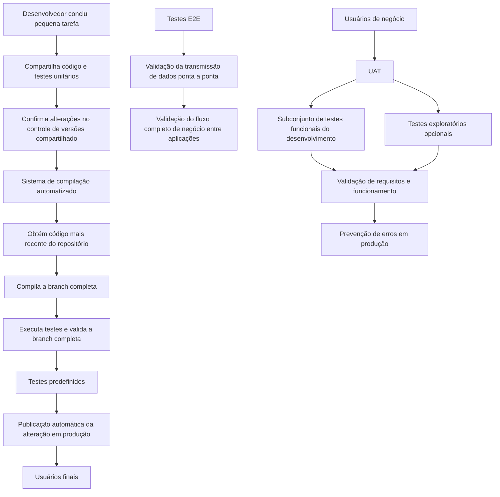

# Termos de Métodos de Qualidade e Entrega de Software — CI/CD, E2E e UAT

## 1. Metadados do Documento
- **Arquivo de Origem:** Não identificado no conteúdo fornecido
- **Tipo de Documento:** Documentação de APIs / material conceitual de métodos
- **Domínio / Sistema:** Home Solutions APIs Documentation Zeus
- **Público-Alvo:** Desenvolvedores, equipes de qualidade, usuários de negócio e operação
- **Data/Versão Identificada:** Não identificada

---

## 2. Resumo Executivo & Contexto de Negócio

O conteúdo define três conceitos empregados no ciclo de desenvolvimento, validação e entrega de software: Integração Contínua e Despliegue Contínuo (CI/CD), testes End-to-End (E2E) e Testes de Aceitação do Usuário (UAT).

A estratégia CI/CD automatiza a compilação, os testes, a validação de alterações integradas ao controle de versões e a publicação automática de mudanças de código em produção. O objetivo declarado é acelerar a entrega de software, reduzir o intervalo entre a escrita do código e sua disponibilidade para usuários finais, reduzir erros humanos e elevar a qualidade do software.

Os testes E2E verificam a transmissão de dados do início ao fim de um fluxo de negócio. Diferentemente de validações isoladas de funcionalidades simples, os testes E2E confirmam que a informação percorre corretamente as diferentes aplicações participantes de um cenário concreto.

Os testes UAT são executados por usuários de negócio para validar a aderência do sistema aos requisitos definidos e seu funcionamento correto antes da produção. A validação utiliza um subconjunto de testes funcionais projetados durante o desenvolvimento e pode incluir testes exploratórios baseados na experiência dos usuários.

---

## 3. Arquitetura, Componentes & Tecnologias Envolvidas

O conteúdo não detalha arquitetura física, infraestrutura, protocolos, métodos HTTP, contratos JSON, repositórios específicos, ferramentas de CI/CD ou ambientes nomeados. Os elementos identificados são processos e papéis do ciclo de entrega de software.

| Componente / Conceito | Papel descrito |
| :--- | :--- |
| Controle de versões compartilhado | Repositório no qual desenvolvedores incorporam alterações e testes unitários após concluir pequenas tarefas. |
| Sistema de compilação automatizado | Acionado por uma confirmação de código; obtém o código mais recente, compila, testa e valida a branch completa. |
| CI — Integração Contínua | Processo de automatização da compilação e dos testes a cada confirmação de mudanças no controle de versões. |
| DC — Despliegue Contínuo | Estratégia que publica automaticamente em produção alterações de código de uma aplicação, baseada em testes predefinidos. |
| E2E — End-to-End | Teste que valida a transmissão de dados do início ao fim de um fluxo de negócio entre aplicações. |
| UAT — User Acceptance Test | Validação realizada por usuários de negócio para confirmar requisitos e funcionamento antes da produção. |
| Usuários de negócio | Responsáveis por executar UAT, incluindo testes funcionais e, opcionalmente, testes exploratórios. |



> **Nota de Análise:** O conteúdo cita um sistema de compilação automatizado e um repositório de controle de versões compartilhado, mas não identifica ferramentas, produtos, pipelines, branches, URLs, servidores ou critérios de aprovação específicos.

---

## 4. Regras de Negócio, Especificações Funcionais & Processos

### 4.1 Integração Contínua (CI)

1. A Integração Contínua automatiza a compilação e os testes de código.
2. A automação deve ocorrer toda vez que um integrante da equipe confirma mudanças no controle de versões.
3. A CI incentiva desenvolvedores a compartilharem código e testes unitários.
4. Os desenvolvedores incorporam alterações a um repositório compartilhado de controle de versões após a conclusão de cada pequena tarefa.
5. Uma confirmação de código aciona um sistema de compilação automatizado.
6. O sistema de compilação automatizado deve:
   - obter o código mais recente do repositório compartilhado;
   - compilar a branch completa;
   - testar a branch completa;
   - validar a branch completa.

### 4.2 Despliegue Contínuo (DC)

1. O Despliegue Contínuo é uma estratégia de desenvolvimento de software.
2. Alterações de código de uma aplicação são publicadas automaticamente no ambiente de produção.
3. A automação de publicação é baseada em uma série de testes predefinidos.
4. O objetivo principal é acelerar o ciclo de entrega de software.
5. A estratégia busca reduzir o tempo entre a escrita do código e a disponibilidade da alteração para usuários finais.

### 4.3 Benefícios declarados da estratégia CI/CD

A estratégia CI/CD permite:

- acelerar o ciclo de entrega;
- reduzir erros humanos;
- melhorar a qualidade do software;
- responder mais rapidamente a mudanças e problemas.

### 4.4 Testes End-to-End (E2E)

1. Os testes E2E verificam a transmissão de um dado desde o início até o fim de um fluxo de negócio.
2. Os testes E2E asseguram que a informação trafega corretamente pelas diferentes aplicações de um cenário concreto.
3. Os testes E2E não se limitam a funcionalidades simples.
4. Os testes E2E validam o processo de negócio completo.

### 4.5 Testes de Aceitação do Usuário (UAT)

1. Usuários de negócio devem validar se o sistema cumpre os requisitos definidos.
2. A validação ocorre mediante a execução de testes de aceitação UAT.
3. Os usuários executam um subconjunto dos testes funcionais projetados durante o desenvolvimento.
4. Os usuários podem executar opcionalmente testes exploratórios baseados em sua própria experiência.
5. O UAT busca validar:
   - a adequação do sistema desenvolvido às necessidades especificadas;
   - o correto funcionamento do sistema.
6. O objetivo final é evitar erros em produção.

---

## 5. Tabelas de Parâmetros, Ambientes e Estruturas de Dados

| Item / Parâmetro | Descrição / Função | Tipo / Valores / Formato | Ambiente / Observações |
| :--- | :--- | :--- | :--- |
| CI | Automatiza compilação e testes quando há confirmação de mudanças no controle de versões. | Processo de desenvolvimento | Atua sobre alterações confirmadas no controle de versões. |
| DC | Publica automaticamente em produção mudanças de código de uma aplicação. | Estratégia de desenvolvimento de software | Baseia-se em série de testes predefinidos. |
| CI/CD | Estratégia para acelerar entrega, reduzir erros humanos, melhorar qualidade e responder a mudanças e problemas. | Estratégia de entrega de software | O documento usa “DC” para Despliegue Contínuo. |
| Confirmação de código | Evento que aciona o sistema de compilação automatizado. | Evento de controle de versões | Não há ferramenta de versionamento identificada. |
| Repositório compartilhado | Fonte do código mais recente utilizado pelo sistema de compilação automatizado. | Repositório de controle de versões | Nome, URL e tecnologia não detalhados. |
| Branch completa | Unidade compilada, testada e validada após a confirmação de código. | Branch de controle de versões | Convenções de branch não detalhadas. |
| Testes predefinidos | Conjunto de testes que sustenta a automação da publicação em produção. | Série de testes | Casos, ferramentas e critérios de aprovação não detalhados. |
| E2E | Verifica a transmissão de dados ao longo de todo o fluxo de negócio. | Teste de integração ponta a ponta | Inclui diferentes aplicações de um cenário concreto. |
| UAT | Validação de requisitos e funcionamento realizada por usuários de negócio. | Teste de aceitação | Executado antes da produção para evitar erros. |
| Testes funcionais | Testes projetados durante o desenvolvimento, dos quais UAT executa um subconjunto. | Teste funcional | Não há catálogo de casos de teste. |
| Testes exploratórios | Testes opcionais fundamentados na experiência dos usuários de negócio. | Teste exploratório | Opcional durante UAT. |
| Produção | Ambiente que recebe automaticamente mudanças de código no Despliegue Contínuo. | Ambiente | URL, servidores e controles de implantação não detalhados. |

---

## 6. Bateria de Perguntas & Respostas para RAG (FAQ Sintético)

### P1: O que a Integração Contínua (CI) automatiza?
**R:** A Integração Contínua automatiza a compilação e os testes de código sempre que um membro da equipe confirma alterações no sistema de controle de versões.

### P2: O que acontece após uma confirmação de código no fluxo de CI?
**R:** A confirmação de código aciona um sistema de compilação automatizado que obtém o código mais recente do repositório compartilhado e executa compilação, testes e validação da branch completa.

### P3: Qual é o papel dos testes unitários no processo de Integração Contínua?
**R:** O conteúdo estabelece que a CI incentiva os desenvolvedores a compartilharem tanto o código quanto os testes unitários ao incorporarem mudanças ao repositório compartilhado após concluir pequenas tarefas.

### P4: Como o Despliegue Contínuo publica alterações em produção?
**R:** O Despliegue Contínuo publica automaticamente em produção as mudanças de código de uma aplicação. Essa automação está baseada em uma série de testes predefinidos.

### P5: Qual é o objetivo principal do Despliegue Contínuo?
**R:** O objetivo principal do Despliegue Contínuo é acelerar o ciclo de entrega de software e reduzir o tempo entre a escrita do código e sua disponibilidade para os usuários finais.

### P6: Quais benefícios são atribuídos à estratégia CI/CD?
**R:** A estratégia CI/CD é apresentada como uma forma de acelerar o ciclo de entrega, reduzir erros humanos, melhorar a qualidade do software e responder mais rapidamente a mudanças e problemas.

### P7: O que os testes End-to-End (E2E) validam?
**R:** Os testes E2E validam a transmissão de um dado desde o início até o fim de um fluxo de negócio, assegurando que a informação percorra corretamente as diferentes aplicações envolvidas em um cenário concreto.

### P8: Qual é a diferença apresentada entre testes E2E e validações de funcionalidades simples?
**R:** Enquanto validações de funcionalidades simples analisam partes específicas do sistema, os testes E2E verificam o processo de negócio completo e o trânsito da informação entre as aplicações envolvidas.

### P9: Quem executa os testes UAT?
**R:** Os testes UAT são executados por usuários de negócio, que devem validar se o sistema cumpre os requisitos definidos.

### P10: Quais testes podem ser realizados durante UAT?
**R:** Durante UAT, os usuários de negócio executam um subconjunto dos testes funcionais criados durante o desenvolvimento e podem, opcionalmente, realizar testes exploratórios baseados em sua própria experiência.

### P11: Qual é a finalidade do UAT antes da produção?
**R:** O UAT busca validar a adequação do sistema desenvolvido às necessidades especificadas e seu correto funcionamento, com a finalidade de evitar erros no ambiente de produção.

---

## 7. Glossário de Termos, Siglas & Conceitos-Chave

- **CI:** Integração Contínua; processo de automatização da compilação e dos testes de código a cada confirmação de mudanças no controle de versões.
- **CI/CD:** Estratégia de entrega de software composta por Integração Contínua e Despliegue Contínuo.
- **DC:** Despliegue Contínuo; estratégia em que mudanças de código de uma aplicação são publicadas automaticamente em produção com base em testes predefinidos.
- **E2E:** End-to-End; testes que validam a transmissão de dados através de todo o fluxo de negócio.
- **UAT:** User Acceptance Test; Pruebas de Aceptación del Usuario, realizadas por usuários de negócio.
- **Branch:** Ramificação completa do controle de versões que é compilada, testada e validada pelo sistema automatizado.
- **Controle de versões:** Mecanismo de repositório compartilhado no qual membros da equipe confirmam e integram alterações de código.
- **Testes exploratórios:** Testes opcionais baseados na experiência dos usuários de negócio.
- **Testes funcionais:** Testes projetados durante o desenvolvimento, dos quais um subconjunto é usado em UAT.

---

## 8. Notas Críticas, Riscos & Limitações

- O conteúdo não identifica a ferramenta de controle de versões, a ferramenta de automação de compilação, a ferramenta de testes nem a plataforma de implantação.
- Não há descrição de critérios objetivos de aprovação ou reprovação para compilação, testes, validação de branches, UAT ou publicação em produção.
- Não são apresentados ambientes intermediários, como desenvolvimento, homologação, qualidade ou pré-produção.
- O documento não detalha os testes predefinidos que habilitam a publicação automática em produção.
- O conteúdo não fornece casos de uso, exemplos de fluxos de negócio, aplicações participantes ou dados trafegados nos testes E2E.
- O documento não especifica responsáveis por aprovar UAT, evidências exigidas, critérios de aceite nem procedimento para tratar falhas identificadas pelos usuários de negócio.
- **Nota de Análise:** O trecho identifica “Home Solutions APIs Documentation Zeus”, mas não descreve APIs, endpoints, métodos HTTP, contratos de integração ou componentes técnicos específicos desse domínio.

---

## 9. Conteúdo Bruto Estruturado (Referência Fiel)

```text
--- [PÁGINA 1 DE 2] ---

TÉRMINOS (METHODS)
CI/CD - Integración Continua / Despliegue Continuo
La Integración Continua (CI) es el proceso de automatizar la compilación y las pruebas de
código cada vez que un miembro del equipo confirma cambios en el control de versiones.
La CI estimula a los desarrolladores para que compartan el código y las pruebas unitarias, ya
que incorpora sus cambios a un repositorio de control de versiones compartido después de que
cada tarea pequeña se complete. La confirmación de código desencadena un sistema de
compilación automatizado para obtener el código más reciente del repositorio compartido y para
compilar, probar y validar la rama completa.
El Despliegue Continuo (DC) es una estrategia de desarrollo de software en la que los cambios
de código de una aplicación se publican automáticamente en el entorno de producción. Esta
automatización se basa en una serie de pruebas predefinidas.
El objetivo principal del despliegue continuo es acelerar el ciclo de entrega de software, reducir el
tiempo entre la escritura del código y su disponibilidad para los usuarios finales.
La estrategia CI/CD permite acelerar el ciclo de entrega, reducir errores humanos, mejorar la calidad
del software y proporcionar una respuesta más rápida a cambios y problemas.
E2E - Pruebas End to End
Las Pruebas End to End (E2E) se centran en comprobar la transmisión del dato desde el inicio
hasta el fin del flujo de negocio, asegurando que la información viaja correctamente a través de las
distintas aplicaciones en un escenario concreto. Es decir, en lugar de centrarse en funcionalidades
simples, se valida el proceso de negocio al completo.
UAT - Pruebas de Aceptación del Usuario (User Acceptance Test
)
Los usuarios de negocio deben validar que el sistema cumple con los requisitos definidos, mediante
la ejecución de las Pruebas de Aceptación (UAT). Para ello que ejecutan un subconjunto de las
 / 
 CF
Home Solutions APIs Documentation Zeus
EN


--- [PÁGINA 2 DE 2] ---

pruebas funcionales diseñadas durante el desarrollo, y, opcionalmente, pruebas exploratorias
basadas en su propia experiencia.
El objetivo es que los usuarios validen, tanto la adecuación del sistema desarrollado a las
necesidades especificadas, como el correcto funcionamiento de dicho sistema, con el fin de evitar
errores en Producción.
```
