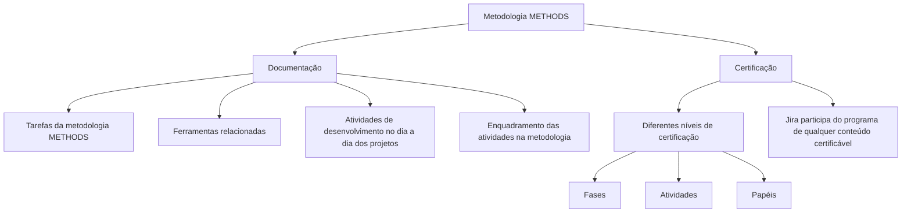

# Documentação da Metodologia METHODS: Conteúdos, Certificação e Jira

## 1. Metadados do Documento
- **Arquivo de Origem:** Não identificado; conteúdo bruto fornecido no enunciado.
- **Tipo de Documento:** Manual Operacional / Página de Documentação.
- **Domínio / Sistema:** Metodologia de desenvolvimento METHODS.
- **Público-Alvo:** Equipes de projeto, desenvolvedores e profissionais em certificação.
- **Data/Versão Identificada:** Não identificada.

---

## 2. Resumo Executivo & Contexto de Negócio

O conteúdo apresenta uma área de conhecimento dedicada à metodologia de desenvolvimento **METHODS**. O propósito declarado é permitir a aquisição de conhecimentos funcionais e técnicos relacionados à metodologia.

A informação é organizada em duas perspectivas: **Documentação** e **Certificação**. A perspectiva de Documentação concentra conteúdos voltados à execução cotidiana das tarefas e à compreensão das ferramentas relacionadas à metodologia METHODS.

A perspectiva de Certificação disponibiliza programas de estudo organizados por diferentes níveis de certificação. O documento diferencia fases, atividades e papéis, indicando que fases e atividades são os elementos sobre os quais a certificação será obtida.

A ferramenta **Jira** participa do programa de qualquer conteúdo certificável. O conteúdo fornecido não detalha níveis específicos, critérios de aprovação, fluxos de acesso, configurações de Jira ou ferramentas adicionais.

---

## 3. Arquitetura, Componentes & Tecnologias Envolvidas

| Componente / Elemento | Descrição baseada no conteúdo |
| :--- | :--- |
| Metodologia METHODS | Metodologia de desenvolvimento à qual se relacionam os conhecimentos funcionais e técnicos apresentados. |
| Documentação | Perspectiva que reúne conteúdos para execução das tarefas da metodologia METHODS e para conhecimento de ferramentas relacionadas. |
| Certificação | Perspectiva que reúne programas de estudo dos diferentes níveis de certificação. |
| Fases | Elementos diferenciados no conteúdo de certificação e sobre os quais se obtém certificação. |
| Atividades | Elementos diferenciados no conteúdo de certificação e sobre os quais se obtém certificação. |
| Papéis | Elementos distinguidos nos programas de estudo de certificação. |
| Jira | Ferramenta que participa do programa de qualquer conteúdo certificável. |
| Soluciones | Item de navegação identificado no conteúdo bruto, sem detalhamento funcional. |
| APIs | Item de navegação identificado no conteúdo bruto, sem detalhamento funcional. |
| Zeus | Item de navegação identificado no conteúdo bruto, sem detalhamento funcional. |



**Nota de Análise:** O conteúdo não descreve uma arquitetura de software, integrações técnicas, APIs, protocolos, ambientes ou contratos de dados. O diagrama representa exclusivamente a organização conceitual explicitada no documento.

---

## 4. Regras de Negócio, Especificações Funcionais & Processos

### Organização do conhecimento METHODS
1. A documentação permite adquirir conhecimentos funcionais e técnicos relacionados à metodologia de desenvolvimento METHODS.
2. A informação está organizada em duas perspectivas: Documentação e Certificação.

### Perspectiva de Documentação
1. A área de Documentação contém conteúdos que ajudam a realizar as tarefas da metodologia METHODS.
2. A área de Documentação também permite conhecer as ferramentas relacionadas.
3. As equipes podem conhecer as atividades de desenvolvimento a serem realizadas no dia a dia dos projetos.
4. As equipes podem compreender como as atividades de desenvolvimento se enquadram na metodologia METHODS.

### Perspectiva de Certificação
1. A área de Certificação contém programas de estudo de diferentes níveis de certificação.
2. Os programas de estudo fazem distinção entre fases, atividades e papéis.
3. As fases e as atividades são os elementos sobre os quais a certificação será obtida.
4. Jira é a ferramenta que participará do programa de qualquer conteúdo certificável.

**Nota de Análise:** O documento não especifica os nomes dos níveis de certificação, as fases, as atividades, os papéis, os critérios de avaliação, as notas mínimas, a duração dos cursos ou os mecanismos de emissão de certificados.

---

## 5. Tabelas de Parâmetros, Ambientes e Estruturas de Dados

| Item / Parâmetro | Descrição / Função | Tipo / Valores / Formato | Ambiente / Observações |
| :--- | :--- | :--- | :--- |
| Metodologia | Base metodológica coberta pela documentação e certificação. | METHODS | Não são informadas versões. |
| Perspectiva de informação | Organização declarada para os conteúdos. | Documentação; Certificação | Duas perspectivas. |
| Documentação | Apoia a realização de tarefas METHODS e o conhecimento de ferramentas relacionadas. | Área de conteúdos | Voltada ao dia a dia dos projetos. |
| Certificação | Disponibiliza programas de estudo para certificação. | Área de conteúdos | Diferencia fases, atividades e papéis. |
| Objeto de certificação | Elementos sobre os quais se obtém certificação. | Fases; Atividades | Papéis são diferenciados no programa, mas não são declarados como objeto de certificação. |
| Ferramenta certificável | Ferramenta participante do programa de conteúdos certificáveis. | Jira | Participa de qualquer conteúdo certificável. |
| Soluciones | Elemento de navegação. | Texto de menu | Sem detalhamento adicional. |
| APIs | Elemento de navegação. | Texto de menu | Sem detalhamento adicional. |
| Zeus | Elemento de navegação. | Texto de menu | Sem detalhamento adicional. |
| Idioma | Indicador de idioma visível na navegação. | ES | O conteúdo bruto está em espanhol. |

---

## 6. Bateria de Perguntas & Respostas para RAG (FAQ Sintético)

### P1: Qual é o objetivo da área de metodologia METHODS?
**R:** A área de metodologia METHODS tem o objetivo de fornecer documentação para aquisição de conhecimentos funcionais e técnicos relacionados à metodologia de desenvolvimento METHODS.

### P2: Como as informações sobre a metodologia METHODS estão organizadas?
**R:** As informações estão organizadas em duas perspectivas: **Documentação** e **Certificação**.

### P3: O que pode ser encontrado na perspectiva de Documentação?
**R:** A perspectiva de Documentação contém conteúdos que ajudam a executar tarefas da metodologia METHODS, conhecer ferramentas relacionadas, entender as atividades de desenvolvimento realizadas diariamente nos projetos e compreender como essas atividades se enquadram na metodologia.

### P4: Qual é a finalidade da documentação METHODS para as equipes de projeto?
**R:** A documentação METHODS permite que as equipes conheçam as atividades de desenvolvimento que devem realizar no dia a dia dos projetos e entendam como essas atividades se relacionam com a metodologia METHODS.

### P5: O que a perspectiva de Certificação disponibiliza?
**R:** A perspectiva de Certificação disponibiliza os programas de estudo dos diferentes níveis de certificação, com distinção entre fases, atividades e papéis.

### P6: Quais elementos são usados para obtenção de certificação na metodologia METHODS?
**R:** Segundo o conteúdo, as fases e as atividades são os elementos sobre os quais a certificação será obtida.

### P7: Qual é o papel de Jira no conteúdo de certificação?
**R:** Jira é a ferramenta que participará do programa de qualquer conteúdo certificável.

### P8: Os papéis também são declarados como objeto direto de certificação?
**R:** Não. O texto afirma que os programas de estudo distinguem fases, atividades e papéis, mas declara explicitamente que a certificação será obtida sobre fases e atividades.

### P9: O documento informa quais são as fases e atividades da metodologia METHODS?
**R:** Não. O documento apenas informa que fases e atividades são consideradas na certificação; não lista seus nomes, descrições ou critérios.

### P10: O documento detalha configurações, fluxos de trabalho ou integrações de Jira?
**R:** Não. O conteúdo somente informa que Jira participa do programa de qualquer conteúdo certificável. Não há detalhes sobre configurações, projetos, workflows, permissões ou integrações de Jira.

### P11: Existem informações sobre APIs, Soluciones ou Zeus?
**R:** APIs, Soluciones e Zeus aparecem como itens de navegação no conteúdo bruto. O documento não fornece descrição funcional, técnica ou arquitetural adicional para esses itens.

---

## 7. Glossário de Termos, Siglas & Conceitos-Chave

- **METHODS:** Metodologia de desenvolvimento abordada pela documentação e pelos conteúdos de certificação.
- **Documentação:** Perspectiva de conteúdo voltada à execução de tarefas METHODS, às ferramentas relacionadas e às atividades diárias dos projetos.
- **Certificação:** Perspectiva que reúne programas de estudo de diferentes níveis e distingue fases, atividades e papéis.
- **Fases:** Elementos diferenciados nos programas de certificação e declarados como objeto de certificação.
- **Atividades:** Elementos diferenciados nos programas de certificação e declarados como objeto de certificação.
- **Papéis:** Elementos distinguidos nos programas de estudo de certificação.
- **Jira:** Ferramenta que participa do programa de qualquer conteúdo certificável.
- **APIs:** Item de navegação apresentado sem explicação adicional.
- **Zeus:** Item de navegação apresentado sem explicação adicional.
- **ES:** Indicador de idioma exibido na navegação; o texto está em espanhol.

---

## 8. Notas Críticas, Riscos & Limitações

- O arquivo de origem não foi identificado no conteúdo fornecido; por isso, não é possível determinar extensão, autoria, data, versão ou paginação real.
- O conteúdo é resumido e não apresenta detalhamento adicional sobre fases, atividades, papéis, níveis de certificação ou ferramentas relacionadas.
- Não são fornecidos critérios de aprovação, processo de inscrição, evidências exigidas, responsáveis, prazos ou regras de renovação de certificação.
- Jira é citado como participante do programa de conteúdos certificáveis, mas não há informações sobre uso operacional, permissões, fluxos, projetos ou configurações.
- Os itens “Soluciones”, “APIs” e “Zeus” aparecem na navegação sem conteúdo explicativo associado.
- Não há URLs, ambientes, servidores, credenciais, parâmetros técnicos, diagramas originais ou contratos de integração no conteúdo analisado.

---

## 9. Conteúdo Bruto Estruturado (Referência Fiel)

```text
--- [PÁGINA 1 DE 1] ---

METODOLOGÍA
 En este apartado se encuentra la documentación que permite adquirir
conocimientos tanto funcionales como técnicos relacionados con la metodología
de desarrollo METHODS. La información está organizada en dos perspectivas:
Documentación
Certificación
DOCUMENTACIÓN
En este lugar se encuentran los contenidos que ayudan a realizar las tareas de la metodología
METHODS, así como a conocer las herramientas realacionadas. Es un lugar donde los equipos
pueden conocer las actividades de desarrollo a realizar el el día a día de los proyectos, y cómo se
enmarcan dentro de la metodología.
CERTIFICACIÓN
Aquí se encuentran los temarios de los distintos niveles de certificación, haciendo distinción entre
fases, actividades y roles. Las fases y actividades son aquellas sobre los que se obtendrá la
certificación. Jira es la herramienta que participará en el temario de cualquier contenido certificable.
 / 
 RS
Inicio Soluciones APIs Documentación Zeus
ES
```
