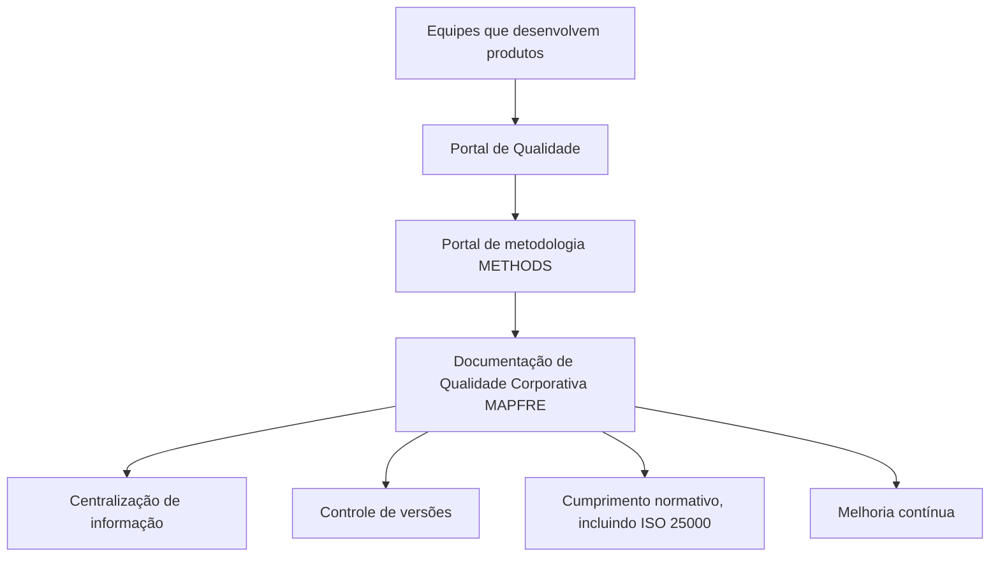

# Documentação de Qualidade Corporativa MAPFRE — Portal de Qualidade METHODS

## 1. Metadados do Documento
- **Arquivo de Origem:** Não identificado
- **Tipo de Documento:** Procedimento
- **Domínio / Sistema:** Qualidade Corporativa MAPFRE; portal de metodologia METHODS; Portal de Qualidade
- **Público-Alvo:** Equipes que desenvolvem produtos
- **Data/Versão Identificada:** Não identificada

---

## 2. Resumo Executivo & Contexto de Negócio

O documento apresenta a documentação relacionada à Qualidade Corporativa de MAPFRE. Essa documentação está localizada no portal de metodologia METHODS, especificamente no Portal de Qualidade.

A gestão da qualidade é apresentada como um pilar fundamental para o sucesso e a sustentabilidade de qualquer produto. O Portal de Qualidade funciona como uma localização única para encontrar documentação de forma intuitiva e fácil.

A centralização documental busca assegurar que todos os membros da equipe encontrem e utilizem as informações necessárias sem complicações. A documentação de qualidade é descrita como essencial para garantir que os produtos atendam aos padrões estabelecidos.

Entre as utilidades declaradas estão a centralização das informações, o controle de versões, o suporte ao cumprimento de normas e padrões internacionais, como ISO 25000, e o apoio à melhoria contínua por meio da identificação de áreas de melhoria e da implementação de ações corretivas e preventivas.

---

## 3. Arquitetura, Componentes & Tecnologias Envolvidas

Os elementos identificados no conteúdo são:

| Componente / Elemento | Papel descrito |
| :--- | :--- |
| MAPFRE | Contexto da Qualidade Corporativa e das equipes que desenvolvem produtos. |
| METHODS | Portal de metodologia onde está localizada a documentação de Qualidade Corporativa MAPFRE. |
| Portal de Qualidade | Localização específica dentro de METHODS para documentação de qualidade. |
| Documentação de qualidade | Conjunto de documentos para acesso, gestão, controle de versões, conformidade e melhoria contínua. |
| ISO 25000 | Norma ou padrão internacional citado como referência de cumprimento normativo. |



**Nota de Análise:** O conteúdo não detalha tecnologias de implementação, autenticação, URLs, integrações técnicas, permissões, métodos HTTP ou contratos de dados do portal METHODS ou do Portal de Qualidade.

---

## 4. Regras de Negócio, Especificações Funcionais & Processos

1. A documentação relacionada à Qualidade Corporativa de MAPFRE encontra-se no portal de metodologia METHODS.
2. O Portal de Qualidade é a localização específica indicada para consultar a documentação de qualidade.
3. O Portal de Qualidade deve permitir localizar a documentação de forma intuitiva e fácil.
4. O Portal de Qualidade deve disponibilizar uma localização única para os documentos de qualidade.
5. A centralização documental facilita o acesso e a gestão dos documentos de qualidade.
6. A plataforma inclui controle de versões para garantir o uso da versão mais atualizada de cada documento.
7. O uso da versão mais atualizada é considerado crucial para manter coerência e precisão nos processos de qualidade.
8. O Portal de Qualidade apoia as equipes de desenvolvimento de produtos no cumprimento de normas e padrões internacionais, incluindo ISO 25000.
9. A documentação centralizada e organizada facilita a identificação de áreas de melhoria.
10. A identificação de áreas de melhoria apoia a implementação de ações corretivas e preventivas.
11. As ações corretivas e preventivas contribuem para a melhoria contínua da documentação gerada.

---

## 5. Tabelas de Parâmetros, Ambientes e Estruturas de Dados

| Item / Parâmetro | Descrição / Função | Tipo / Valores / Formato | Ambiente / Observações |
| :--- | :--- | :--- | :--- |
| Documentação de Qualidade Corporativa MAPFRE | Documentação relacionada à qualidade corporativa. | Documentos de qualidade. | Localizada no portal METHODS, especificamente no Portal de Qualidade. |
| Portal de Qualidade | Localização única para encontrar documentação de qualidade. | Portal documental. | Deve permitir acesso intuitivo e fácil aos membros da equipe. |
| Centralização de Informação | Armazena documentos de qualidade em um único local. | Utilidade do portal. | Facilita acesso e gestão dos documentos. |
| Controle de Versões | Assegura o uso da versão mais atualizada de cada documento. | Funcionalidade da plataforma. | Necessário para coerência e precisão dos processos de qualidade. |
| Cumprimento Normativo | Apoia equipes no cumprimento de normas e padrões internacionais. | Utilidade do portal. | ISO 25000 é citada como exemplo. |
| Melhoria Contínua | Apoia identificação de melhorias e ações corretivas e preventivas. | Resultado do uso da documentação centralizada. | Contribui para melhoria contínua da documentação gerada. |
| URLs, servidores, ambientes e logs | Não informados. | Não aplicável. | O conteúdo não fornece detalhes técnicos desses itens. |

---

## 6. Bateria de Perguntas & Respostas para RAG (FAQ Sintético)

### P1: Onde está localizada a documentação de Qualidade Corporativa de MAPFRE?
**R:** A documentação relacionada à Qualidade Corporativa de MAPFRE está no portal de metodologia METHODS, mais especificamente no Portal de Qualidade.

### P2: Qual é a finalidade principal do Portal de Qualidade?
**R:** O Portal de Qualidade fornece uma localização única para encontrar documentação de qualidade de forma intuitiva e fácil, permitindo que os membros da equipe encontrem e utilizem as informações necessárias sem complicações.

### P3: Por que a gestão da qualidade é importante segundo o documento?
**R:** A gestão da qualidade é apresentada como um pilar fundamental para o sucesso e a sustentabilidade de qualquer produto.

### P4: Como o Portal de Qualidade apoia a centralização de informações?
**R:** O portal permite armazenar todos os documentos de qualidade em um único local, facilitando o acesso e a gestão desses documentos.

### P5: Como funciona o controle de versões citado no Portal de Qualidade?
**R:** A plataforma inclui um sistema de controle de versões que assegura que seja utilizada a versão mais atualizada de cada documento.

### P6: Qual é o impacto do controle de versões nos processos de qualidade?
**R:** O controle de versões é crucial para manter a coerência e a precisão nos processos de qualidade, pois assegura o uso da versão atualizada de cada documento.

### P7: Que referência normativa internacional é mencionada no documento?
**R:** O documento cita ISO 25000 como exemplo de norma ou padrão internacional cujo cumprimento pode ser apoiado pelo Portal de Qualidade.

### P8: Quem é apoiado pelo Portal de Qualidade no cumprimento normativo?
**R:** O Portal de Qualidade ajuda as equipes que desenvolvem produtos a cumprir normas e padrões internacionais, fornecendo uma estrutura clara e organizada para a documentação requerida.

### P9: Como a documentação centralizada contribui para a melhoria contínua?
**R:** A centralização e organização da documentação facilitam a identificação de áreas de melhoria e a implementação de ações corretivas e preventivas, contribuindo para a melhoria contínua da documentação gerada.

### P10: O documento especifica URLs, tecnologias ou integrações do Portal de Qualidade?
**R:** Não. O conteúdo fornecido não informa URLs, tecnologias, integrações, métodos de acesso, servidores, ambientes ou contratos técnicos do Portal de Qualidade.

---

## 7. Glossário de Termos, Siglas & Conceitos-Chave

- **MAPFRE:** Organização citada no contexto da Qualidade Corporativa.
- **METHODS:** Portal de metodologia onde se encontra a documentação de Qualidade Corporativa MAPFRE.
- **Portal de Qualidade:** Localização específica no portal METHODS para documentação relacionada à qualidade.
- **ISO 25000:** Norma ou padrão internacional citado como referência de cumprimento normativo.
- **Controle de Versões:** Sistema que assegura a utilização da versão mais atualizada de cada documento.
- **Ações Corretivas e Preventivas:** Ações mencionadas como parte da melhoria contínua da documentação gerada.

---

## 8. Notas Críticas, Riscos & Limitações

- O documento não identifica o nome do arquivo, data, versão ou responsável pela documentação.
- O documento não detalha arquitetura técnica, infraestrutura, tecnologias, URLs, permissões, autenticação, integração com outros sistemas ou rotas de logs.
- O documento não descreve o processo operacional para publicar, aprovar, versionar ou consultar documentos no Portal de Qualidade.
- A sigla ou denominação METHODS é apresentada como portal de metodologia, mas não recebe detalhamento funcional adicional.
- ISO 25000 é mencionada como referência, sem detalhamento sobre requisitos, controles ou evidências necessárias para conformidade.
- A segunda página é indicada como página em branco ou contendo apenas elementos visuais/imagem.

---

## 9. Conteúdo Bruto Estruturado (Referência Fiel)

```text
--- [PÁGINA 1 DE 2] ---

Imagen LOGO
DOCUMENTACIÓN
 En este apartado se aborda todo aquello relacionado con la Calidad.
La documentación relacionada con la Calidad Corporativa de MAPFRE se encuentra en el portal de
metodología METHODS, y más en concreto en el Portal de Calidad:
CALIDAD
La gestión de la calidad es un pilar fundamental para el éxito y la sostenibilidad de cualquier
producto.
El Portal de Calidad proporciona una ubicación única dónde encontrar todas la documentación de
forma intuitiva y fácil, asegurando que todos los miembros del equipo puedan encontrar y utilizar la
información que necesitan sin complicaciones.
La documentación de calidad es esencial para garantizar que los productos cumplan con los
estándares establecidos. A continuación, se detallan algunas de las principales utilidades de la
documentación contenida en el Portal de Calidad:
Centralización de Información: El portal permite almacenar todos los documentos de calidad
en un único lugar, facilitando su acceso y gestión.
Control de Versiones: La plataforma incluye un sistema de control de versiones que asegura
que siempre se esté utilizando la versión más actualizada de cada documento. Esto es crucial
para mantener la coherencia y la precisión en los procesos de calidad.
Cumplimiento Normativo: El Portal de Calidad ayuda a las equipos que desarrollan productos,
a cumplir con las normativas y estándares internacionales, como ISO 25000, al proporcionar una
estructura clara y organizada para la documentación requerida.
Mejora Continua: Al centralizar y organizar la documentación de calidad, el portal facilita la
identificación de áreas de mejora y la implementación de acciones correctivas y preventivas.
Esto contribuye a la mejora continua de la documentación generada.
 / 
 CF
Home Solutions APIs Documentation Zeus
EN

--- [PÁGINA 2 DE 2] ---

[Página em branco ou apenas elementos visuais/imagem]
```
