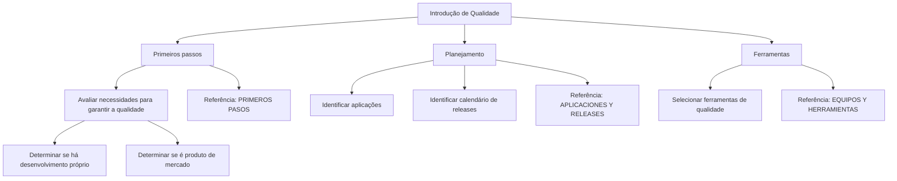

# Certificação de Testing — Introdução de Qualidade, Planejamento e Ferramentas

## 1. Metadados do Documento
- **Arquivo de Origem:** Não informado; conteúdo bruto com 2 páginas.
- **Tipo de Documento:** Material de certificação / apresentação de treinamento.
- **Domínio / Sistema:** Testing e qualidade de produto.
- **Público-Alvo:** Profissionais envolvidos em desenvolvimento, qualidade e planejamento de releases.
- **Data/Versão Identificada:** Não identificada.

---

## 2. Resumo Executivo & Contexto de Negócio

O documento apresenta o módulo **“Certificación de Testing - Introducción de Calidad”**, cujo objetivo é revisar como os temas de qualidade devem ser tratados desde o início do ciclo do produto. A finalidade declarada é identificar o que será necessário para realizar o testing.

A abordagem é organizada em três frentes: **primeiros passos**, **planejamento** e **ferramentas**. Os primeiros passos orientam a avaliar as necessidades para garantir a qualidade do produto, distinguindo situações nas quais a organização desenvolve o produto daquelas em que utiliza um produto de mercado.

O planejamento requer identificar as aplicações relacionadas ao produto e o calendário de releases. A seleção das ferramentas de qualidade também é apresentada como uma atividade necessária para o produto.

O conteúdo fornece referências internas denominadas **PRIMEROS PASOS**, **APLICACIONES Y RELEASES** e **EQUIPOS Y HERRAMIENTAS**, mas não detalha o conteúdo dessas referências, critérios específicos de qualidade, ferramentas concretas, calendário de releases ou procedimentos de teste.

---

## 3. Arquitetura, Componentes & Tecnologias Envolvidas

O documento não descreve arquitetura de software, sistemas, módulos técnicos, microsserviços, tecnologias, integrações, ambientes ou contratos de dados. O fluxo conceitual de preparação para testing pode ser representado da seguinte forma:



> **Nota de Análise:** O documento não detalha quais aplicações, quais releases, quais ferramentas de qualidade ou quais critérios devem orientar a seleção de ferramentas.

---

## 4. Regras de Negócio, Especificações Funcionais & Processos

### Processo de preparação para qualidade e testing

1. Abordar os temas de qualidade desde o início.
2. Identificar o que será necessário para realizar o testing.
3. Avaliar as necessidades para garantir a qualidade do produto.
4. Considerar o contexto do produto:
   - Desenvolvimento do produto pela própria organização.
   - Utilização de um produto de mercado.
5. Identificar as aplicações associadas ao produto.
6. Identificar o calendário de releases do produto.
7. Selecionar as ferramentas de qualidade que serão utilizadas para o produto.

### Referências internas citadas

- **PRIMEROS PASOS:** Referência para informações adicionais sobre a avaliação inicial necessária para garantir a qualidade do produto.
- **APLICACIONES Y RELEASES:** Referência para informações adicionais sobre aplicações e calendário de releases.
- **EQUIPOS Y HERRAMIENTAS:** Referência para informações adicionais sobre equipes e ferramentas.

> **Nota de Análise:** Não são apresentados critérios de aprovação, métricas de qualidade, tipos de teste, responsabilidades, ferramentas específicas, cadência de releases ou regras de escalonamento.

---

## 5. Tabelas de Parâmetros, Ambientes e Estruturas de Dados

| Item / Parâmetro | Descrição / Função | Tipo / Valores / Formato | Ambiente / Observações |
| :--- | :--- | :--- | :--- |
| Objetivo do módulo | Revisar como abordar qualidade desde o início e identificar o necessário para testing | Diretriz de treinamento | Não detalha artefatos ou critérios resultantes |
| Primeiros passos | Avaliar necessidades para garantir qualidade do produto | Etapa de processo | Considera desenvolvimento próprio ou produto de mercado |
| Planejamento | Identificar aplicações e calendário de releases | Etapa de processo | Referência: `APLICACIONES Y RELEASES` |
| Ferramentas | Selecionar ferramentas de qualidade para o produto | Etapa de processo | Referência: `EQUIPOS Y HERRAMIENTAS` |
| PRIMEROS PASOS | Fonte adicional de informações sobre a etapa inicial | Referência interna | Conteúdo não incluído |
| APLICACIONES Y RELEASES | Fonte adicional sobre aplicações e releases | Referência interna | Conteúdo não incluído |
| EQUIPOS Y HERRAMIENTAS | Fonte adicional sobre equipes e ferramentas | Referência interna | Conteúdo não incluído |
| Desenvolvimento próprio | Cenário a considerar na avaliação de qualidade | Condição de contexto | Sem detalhamento adicional |
| Produto de mercado | Cenário alternativo a considerar na avaliação de qualidade | Condição de contexto | Sem detalhamento adicional |

---

## 6. Bateria de Perguntas & Respostas para RAG (FAQ Sintético)

### P1: Qual é a finalidade do módulo “Certificación de Testing - Introducción de Calidad”?
**R:** A finalidade é revisar como os temas de qualidade devem ser abordados desde o início e identificar o que será necessário para realizar o testing.

### P2: Quais são os temas principais apresentados no módulo de introdução à qualidade?
**R:** O módulo organiza o conteúdo em primeiros passos, planejamento e ferramentas.

### P3: O que deve ser avaliado nos primeiros passos para garantir a qualidade do produto?
**R:** Deve-se avaliar o que é necessário para garantir a qualidade do produto, considerando se o produto é desenvolvido pela própria organização ou se é um produto de mercado.

### P4: Quais cenários de origem do produto o documento determina que sejam considerados?
**R:** O documento determina considerar se há desenvolvimento do produto ou se o caso envolve um produto de mercado.

### P5: O que deve ser identificado durante o planejamento de testing?
**R:** Durante o planejamento, devem ser identificadas as aplicações e o calendário de releases do produto.

### P6: Onde o documento indica que há mais informações sobre aplicações e releases?
**R:** O documento aponta a referência interna `APLICACIONES Y RELEASES`, mas não reproduz o conteúdo dessa referência.

### P7: Qual ação o documento recomenda em relação às ferramentas de qualidade?
**R:** O documento recomenda selecionar as ferramentas de qualidade que serão utilizadas para o produto.

### P8: Quais ferramentas de qualidade específicas são mencionadas no documento?
**R:** Nenhuma ferramenta específica é mencionada. O documento apenas estabelece a necessidade de selecionar ferramentas de qualidade.

### P9: O documento define métricas, critérios de aceite ou tipos de teste?
**R:** Não. O conteúdo fornecido não define métricas de qualidade, critérios de aceite, tipos de teste, casos de teste ou procedimentos operacionais detalhados.

### P10: Onde encontrar mais informações sobre a avaliação inicial de qualidade?
**R:** O documento direciona para a referência interna `PRIMEROS PASOS`, cujo conteúdo não está presente no material extraído.

### P11: Onde encontrar mais informações sobre equipes e ferramentas?
**R:** O documento direciona para a referência interna `EQUIPOS Y HERRAMIENTAS`, mas não apresenta detalhes sobre equipes, responsabilidades ou ferramentas.

---

## 7. Glossário de Termos, Siglas & Conceitos-Chave

- **Testing:** Atividade de teste mencionada como dependente da identificação prévia das necessidades de qualidade.
- **Qualidade:** Tema que deve ser abordado desde o início, visando garantir a qualidade do produto.
- **Produto de mercado:** Produto que não é desenvolvido pela própria organização, citado como cenário a considerar na avaliação de qualidade.
- **Release:** Entrega ou versão planejada do produto; o calendário de releases deve ser identificado.
- **PRIMEROS PASOS:** Referência interna para informações sobre avaliação inicial de qualidade.
- **APLICACIONES Y RELEASES:** Referência interna para informações sobre aplicações e calendário de releases.
- **EQUIPOS Y HERRAMIENTAS:** Referência interna para informações sobre equipes e ferramentas de qualidade.

---

## 8. Notas Críticas, Riscos & Limitações

- O conteúdo é introdutório e não apresenta detalhamento técnico de arquitetura, integração, tecnologia, ambientes, servidores, URLs, logs ou estruturas de dados.
- As referências `PRIMEROS PASOS`, `APLICACIONES Y RELEASES` e `EQUIPOS Y HERRAMIENTAS` são citadas, mas seus conteúdos não foram fornecidos.
- Não há definição de ferramentas concretas, responsabilidades, critérios de seleção, indicadores de qualidade, escopo de testes ou processos de aprovação.
- Não são apresentados métodos HTTP, contratos JSON, sistemas corporativos identificáveis ou fluxos de integração.
- Não há notas do apresentador disponíveis no conteúdo bruto fornecido.

---

## 9. Conteúdo Bruto Estruturado (Referência Fiel)

```text
--- [PÁGINA 1 DE 2] ---

CERTIFICACIÓN de TESTING - Introducción de
Calidad
OBJETIVO
La finalidad de este módulo es repasar cómo tenemos que abordar los temas de Calidad desde el
inicio. Qué será necesario para poder realizar el testing.
Primeros pasos
Planificación
Herramientas
Primeros pasos
Deberemos evaluar qué necesitamos para garantizar la calidad del producto, en función de si
hacemos el desarrollo del mismo o se trata de un producto de mercado.
Podemos encontrar más información en: PRIMEROS PASOS
Planificación
Será necesario identificar las aplicaciones y el calendario de releases que tiene nuestro producto.
Podemos encontrar más información en: APLICACIONES Y RELEASES
 / 
 CF
Home Solutions APIs Documentation Zeus
EN


--- [PÁGINA 2 DE 2] ---

Herramientas
Tendremos que seleccionar las herramientas de Calidad que utilizaremos para el producto.
Podemos encontrar más información en: EQUIPOS Y HERRAMIENTAS
```
