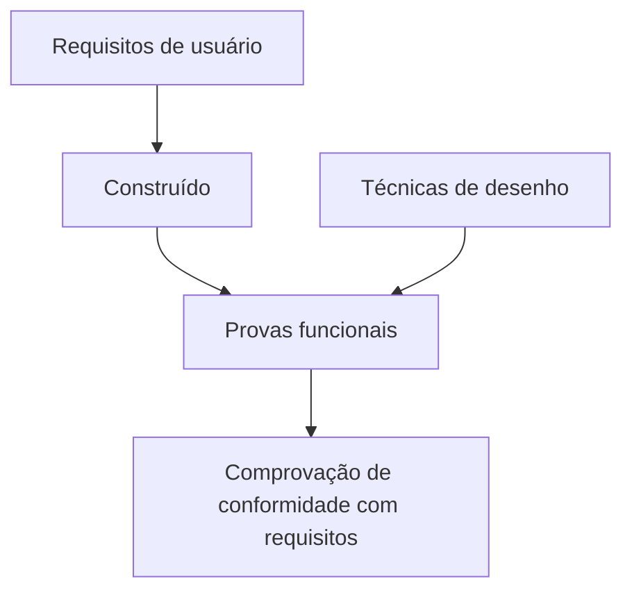

# Certificação de Testing — Desenho de Provas

## 1. Metadados do Documento
- **Arquivo de Origem:** Não identificado
- **Tipo de Documento:** Apresentação Executiva / Material de Capacitação
- **Domínio / Sistema:** Certificação de Testing; desenho de provas funcionais
- **Público-Alvo:** Profissionais envolvidos em testes e validação de requisitos de usuário
- **Data/Versão Identificada:** Não identificada

---

## 2. Resumo Executivo & Contexto de Negócio

O documento apresenta um módulo de **Certificação de Testing** dedicado ao tema de **desenho de provas**. O objetivo declarado é revisar como uma prova deve ser desenhada, quais tipos de provas existem e como as provas podem ser reutilizadas.

O foco funcional do conteúdo é o desenho de provas funcionais. Essas provas são descritas como o mecanismo utilizado para verificar se o que foi construído corresponde ao que foi solicitado nos requisitos de usuário.

O documento indica que o profissional pode se apoiar em diferentes técnicas para realizar o desenho das provas. Também referencia materiais complementares denominados **“DISEÑO DE PRUEBAS”** e **“TÉCNICA DE DISEÑO”**, sem detalhar seu conteúdo, localização ou critérios de uso.

Não há especificações sobre ferramentas de automação, ambientes, casos de teste concretos, métodos HTTP, sistemas corporativos, métricas de qualidade ou processo de execução das provas.

---

## 3. Arquitetura, Componentes & Tecnologias Envolvidas

O documento não descreve arquitetura de software, componentes técnicos, microsserviços, integrações, ambientes ou tecnologias. O único fluxo conceitual explicitamente sustentado pelo conteúdo é a relação entre requisitos de usuário, construção da solução e provas funcionais.



> **Nota de Análise:** o diagrama representa exclusivamente a relação conceitual descrita no texto. O documento não detalha sistemas, interfaces, ferramentas ou implementação técnica desse fluxo.

---

## 4. Regras de Negócio, Especificações Funcionais & Processos

1. O módulo tem a finalidade de revisar como as provas devem ser desenhadas.
2. O módulo aborda a existência de diferentes tipos de provas.
3. O módulo menciona a reutilização de provas como parte do conteúdo a ser revisado.
4. Devem ser desenhadas provas funcionais.
5. As provas funcionais devem servir para comprovar que o que foi construído é o que foi solicitado nos requisitos de usuário.
6. O desenho das provas pode ser apoiado por diferentes técnicas de desenho.
7. O documento referencia o material **“DISEÑO DE PRUEBAS”** como fonte de informações adicionais sobre desenho de provas funcionais.
8. O documento referencia o material **“TÉCNICA DE DISEÑO”** como fonte de informações adicionais sobre técnicas de desenho.

> **Nota de Análise:** o documento não especifica quais tipos de provas devem ser usados, quais técnicas de desenho estão disponíveis, como reutilizar provas, nem critérios de aprovação ou reprovação.

---

## 5. Tabelas de Parâmetros, Ambientes e Estruturas de Dados

| Item / Parâmetro | Descrição / Função | Tipo / Valores / Formato | Ambiente / Observações |
| :--- | :--- | :--- | :--- |
| Objetivo do módulo | Revisar como desenhar uma prova, os tipos de provas e sua reutilização | Objetivo educacional | Não há ambiente identificado |
| Provas funcionais | Comprovar que o construído corresponde aos requisitos de usuário | Tipo de prova | O documento não define casos de teste ou critérios de aceite |
| Técnicas de desenho | Apoio para realizar o desenho das provas | Técnicas não especificadas | Há referência ao material “TÉCNICA DE DISEÑO” |
| DISEÑO DE PRUEBAS | Fonte adicional de informações sobre desenho de provas | Referência documental | URL, localização e conteúdo não informados |
| TÉCNICA DE DISEÑO | Fonte adicional de informações sobre técnicas de desenho | Referência documental | URL, localização e conteúdo não informados |
| CF | Sigla exibida no rodapé | Não definido | Significado não detalhado |
| Home Solutions APIs Documentation Zeus | Texto exibido no rodapé | Navegação ou referência visual não confirmada | Relação com o conteúdo não detalhada |
| EN | Texto exibido no rodapé | Idioma ou marcador não confirmado | Significado não detalhado |

---

## 6. Bateria de Perguntas & Respostas para RAG (FAQ Sintético)

### P1: Qual é a finalidade do módulo de Certificação de Testing sobre desenho de provas?
**R:** A finalidade do módulo é revisar como uma prova deve ser desenhada, quais tipos de provas existem e como as provas podem ser reutilizadas.

### P2: Para que servem as provas funcionais descritas no documento?
**R:** As provas funcionais servem para comprovar que o que foi construído corresponde ao que foi solicitado nos requisitos de usuário.

### P3: O documento define quais são os tipos de provas disponíveis?
**R:** Não. O documento informa que o módulo aborda tipos de provas, mas não enumera ou descreve esses tipos.

### P4: Como o documento orienta o desenho das provas?
**R:** O documento afirma que o desenho das provas pode ser apoiado por distintas técnicas, sem detalhar quais técnicas devem ser aplicadas.

### P5: Qual é a relação entre requisitos de usuário e provas funcionais?
**R:** As provas funcionais são utilizadas para verificar se a construção realizada atende ao que foi solicitado nos requisitos de usuário.

### P6: Onde encontrar informações adicionais sobre desenho de provas?
**R:** O documento indica a referência denominada **“DISEÑO DE PRUEBAS”**, mas não fornece URL, localização ou conteúdo dessa referência.

### P7: Onde encontrar informações adicionais sobre técnicas de desenho?
**R:** O documento indica a referência denominada **“TÉCNICA DE DISEÑO”**, mas não fornece URL, localização ou conteúdo dessa referência.

### P8: O documento informa ferramentas, plataformas ou ambientes para executar as provas?
**R:** Não. O texto não informa ferramentas de teste, plataformas, servidores, URLs, ambientes ou configurações operacionais.

### P9: O documento explica como reutilizar provas?
**R:** Não. A reutilização de provas é mencionada como objetivo do módulo, mas não há procedimento, condição ou exemplo de reutilização.

### P10: O documento estabelece critérios de aprovação para uma prova funcional?
**R:** Não. O documento apenas estabelece que as provas funcionais devem comprovar a aderência entre o construído e os requisitos de usuário; não define critérios formais de aprovação ou reprovação.

---

## 7. Glossário de Termos, Siglas & Conceitos-Chave

- **Certificación de Testing:** título do módulo apresentado no documento.
- **Desenho de provas:** atividade de definir provas para validação; o documento não detalha seu método.
- **Provas funcionais:** provas destinadas a comprovar que o construído atende ao solicitado nos requisitos de usuário.
- **Requisitos de usuário:** solicitações que devem ser atendidas pelo que foi construído.
- **Técnica de desenho:** técnica que pode apoiar a realização do desenho das provas; técnicas específicas não foram informadas.
- **DISEÑO DE PRUEBAS:** referência documental mencionada para informações adicionais sobre desenho de provas.
- **TÉCNICA DE DISEÑO:** referência documental mencionada para informações adicionais sobre técnicas de desenho.
- **CF:** sigla exibida no material sem definição.
- **Zeus:** termo exibido no rodapé sem explicação de significado ou função.

---

## 8. Notas Críticas, Riscos & Limitações

- O documento é resumido e não apresenta detalhamento operacional sobre desenho, execução, evidências ou reutilização de provas.
- Não há definição dos tipos de provas citados no objetivo do módulo.
- Não há descrição das técnicas de desenho mencionadas.
- As referências **“DISEÑO DE PRUEBAS”** e **“TÉCNICA DE DISEÑO”** não possuem URL, localização, versão ou conteúdo no texto extraído.
- Não há critérios objetivos de aceite, cobertura, rastreabilidade, aprovação ou reprovação.
- Não há informações sobre ferramentas, ambientes, automação, responsáveis ou governança de testes.
- Os termos **CF**, **Home Solutions APIs Documentation Zeus** e **EN** aparecem no rodapé, mas o documento não explica sua relação com o módulo.

---

## 9. Conteúdo Bruto Estruturado (Referência Fiel)

```text
--- [PÁGINA 1 DE 1] ---

CERTIFICACIÓN de TESTING - Diseño de
Pruebas
OBJETIVO
La finalidad de este módulo es repasar cómo tenemos que diseñar una prueba. Qué tipos de pruebas
tenemos y como reutilizarlas.
Diseño de pruebas
Técnica de diseño
Diseño de pruebas funcionales
Tenemos que diseñar las pruebas funcionales, que nos servirán para comprobar, que lo construído
es lo solicitado en los requisitos de usuario.
Podemos encontrar más información en: DISEÑO DE PRUEBAS
Técnica de diseño
Para realizar el diseño de las pruebas, podemos apoyarnos en distintas técnicas.
Podemos encontrar más información en: TÉCNICA DE DISEÑO
 /
 CF
Home Solutions APIs Documentation Zeus
EN
```
