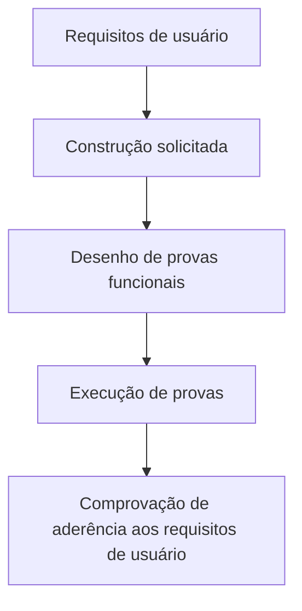

# Certificación de Testing — Ejecución de Pruebas

## 1. Metadados do Documento
- **Arquivo de Origem:** Não identificado
- **Tipo de Documento:** Procedimento / Material de treinamento
- **Domínio / Sistema:** Certificación de Testing; execução de provas funcionais
- **Público-Alvo:** Profissionais envolvidos em testes funcionais
- **Data/Versão Identificada:** Não identificada

---

## 2. Resumo Executivo & Contexto de Negócio

O documento apresenta um módulo de certificação de testing dedicado à execução de provas. O objetivo declarado é revisar como uma prova deve ser executada, como ela é classificada e onde ela é executada.

O conteúdo estabelece que as provas funcionais precisam ser desenhadas para verificar se o que foi construído corresponde ao que foi solicitado nos requisitos de usuário. Assim, o documento relaciona a execução de testes diretamente à validação dos requisitos de usuário.

O material também referencia uma fonte adicional denominada **“EJECUCIÓN DE PRUEBAS”** e exibe os termos **“CF”**, **“Home Solutions APIs Documentation”** e **“Zeus”**, sem explicar suas funções, relações ou significados.

Não há detalhamento sobre casos de teste específicos, critérios de aceite, ambientes, ferramentas, métodos de execução, contratos de API ou classificação concreta das provas.

---

## 3. Arquitetura, Componentes & Tecnologias Envolvidas

O documento cita os seguintes elementos:

- Certificación de Testing
- Ejecución de pruebas
- Pruebas funcionales
- Requisitos de usuario
- EJECUCIÓN DE PRUEBAS
- CF
- Home Solutions APIs Documentation
- Zeus

O conteúdo não descreve arquitetura de software, integrações, camadas técnicas, microsserviços, protocolos ou tecnologias. O fluxo conceitual explicitamente sustentado pelo texto é:



> **Nota de Análise:** O documento exibe “Home Solutions APIs Documentation” e “Zeus”, mas não detalha se representam sistemas, ferramentas, portais, ambientes ou repositórios documentais.

---

## 4. Regras de Negócio, Especificações Funcionais & Processos

1. O módulo tem a finalidade de revisar como uma prova deve ser executada.
2. O módulo aborda a classificação das provas.
3. O módulo aborda onde as provas são executadas.
4. As provas funcionais devem ser desenhadas.
5. As provas funcionais servem para comprovar que o que foi construído corresponde ao que foi solicitado nos requisitos de usuário.
6. Há uma referência para informações adicionais denominada **EJECUCIÓN DE PRUEBAS**.

> **Nota de Análise:** O documento não informa categorias de classificação de provas, etapas operacionais de execução, responsáveis, critérios de aprovação ou reprovação, evidências exigidas, ferramentas ou ambientes de teste.

---

## 5. Tabelas de Parâmetros, Ambientes e Estruturas de Dados

| Item / Parâmetro | Descrição / Função | Tipo / Valores / Formato | Ambiente / Observações |
| :--- | :--- | :--- | :--- |
| Ejecución de pruebas | Tema central do módulo de certificação de testing. | Processo de teste | O documento informa que aborda como, como classificar e onde executar uma prova. |
| Pruebas funcionales | Provas que devem ser desenhadas para verificar a aderência da construção aos requisitos de usuário. | Provas funcionais | Não há casos de teste ou passos detalhados. |
| Requisitos de usuario | Referência usada para validar se o que foi construído foi solicitado. | Requisitos | Não há especificação dos requisitos. |
| EJECUCIÓN DE PRUEBAS | Fonte indicada para obter mais informações. | Referência documental | O documento não fornece URL ou localização detalhada. |
| CF | Termo exibido no conteúdo bruto. | Não identificado | Sem definição adicional. |
| Home Solutions APIs Documentation | Termo exibido no conteúdo bruto. | Não identificado | Sem descrição de função, URL ou tecnologia. |
| Zeus | Termo exibido no conteúdo bruto. | Não identificado | Sem descrição de função, URL ou tecnologia. |

---

## 6. Bateria de Perguntas & Respostas para RAG (FAQ Sintético)

### P1: Qual é a finalidade do módulo “Certificación de Testing - Ejecución de Pruebas”?
**R:** A finalidade do módulo é revisar como uma prova deve ser executada, como uma prova é classificada e onde uma prova é executada.

### P2: Que tipo de testes deve ser desenhado conforme o documento?
**R:** O documento determina que devem ser desenhadas provas funcionais.

### P3: Para que servem as provas funcionais?
**R:** As provas funcionais servem para comprovar que o que foi construído corresponde ao que foi solicitado nos requisitos de usuário.

### P4: Qual é a relação entre provas funcionais e requisitos de usuário?
**R:** As provas funcionais são desenhadas para validar a aderência entre a construção realizada e o que foi solicitado nos requisitos de usuário.

### P5: O documento descreve os passos detalhados para executar uma prova?
**R:** Não. O documento afirma que o módulo revisa como executar uma prova, mas não apresenta uma sequência operacional detalhada de passos.

### P6: O documento define quais classificações de provas devem ser utilizadas?
**R:** Não. O documento menciona que trata da classificação das provas, mas não lista nem define categorias de classificação.

### P7: O documento informa os ambientes onde as provas são executadas?
**R:** Não. O documento declara que aborda onde uma prova é executada, porém não identifica ambientes, servidores, URLs ou configurações.

### P8: Onde podem ser encontradas mais informações sobre execução de provas?
**R:** O documento indica que mais informações podem ser encontradas na referência denominada **EJECUCIÓN DE PRUEBAS**.

### P9: O que o documento informa sobre “Home Solutions APIs Documentation”?
**R:** O documento somente exibe o termo “Home Solutions APIs Documentation”; não explica seu propósito, conteúdo, URL, relação com as provas ou modo de acesso.

### P10: O que significa “CF” no contexto do documento?
**R:** O documento apresenta o termo “CF”, mas não fornece uma definição, expansão da sigla ou contexto operacional adicional.

### P11: O que significa “Zeus” no contexto do documento?
**R:** O documento apresenta o termo “Zeus”, mas não esclarece se ele corresponde a um sistema, ambiente, ferramenta ou outro componente.

### P12: O documento contém critérios de aprovação ou reprovação das provas funcionais?
**R:** Não. O documento estabelece apenas que as provas funcionais verificam se a construção atende ao solicitado nos requisitos de usuário; não define critérios formais de aprovação ou reprovação.

---

## 7. Glossário de Termos, Siglas & Conceitos-Chave

- **Certificación de Testing:** Título do material apresentado, relacionado à execução de provas.
- **Ejecución de pruebas:** Processo ou tema de executar provas, abordado pelo módulo.
- **Pruebas funcionales:** Provas desenhadas para verificar se o que foi construído atende ao solicitado nos requisitos de usuário.
- **Requisitos de usuario:** Solicitações do usuário que servem como referência para validar o que foi construído.
- **EJECUCIÓN DE PRUEBAS:** Referência indicada pelo documento para informações adicionais.
- **CF:** Sigla ou termo citado sem definição no conteúdo.
- **Home Solutions APIs Documentation:** Termo citado sem detalhamento no conteúdo.
- **Zeus:** Termo citado sem detalhamento no conteúdo.

---

## 8. Notas Críticas, Riscos & Limitações

- O documento não identifica o arquivo de origem, data, versão, autor ou área responsável.
- O documento não especifica como desenhar, classificar ou executar as provas na prática.
- Não há critérios de aceite, evidências de teste, responsabilidades, papéis ou fluxos de aprovação.
- Não há informações sobre ferramentas, URLs, servidores, ambientes ou configurações de teste.
- Os termos **CF**, **Home Solutions APIs Documentation** e **Zeus** não possuem definição contextual.
- A referência **EJECUCIÓN DE PRUEBAS** é citada, mas sua localização não é fornecida.
- Não há detalhes sobre métodos HTTP, contratos JSON, APIs, integrações ou comportamentos de sistemas.

---

## 9. Conteúdo Bruto Estruturado (Referência Fiel)

```text
--- [PÁGINA 1 DE 1] ---

CERTIFICACIÓN de TESTING - Ejecución de
Pruebas
OBJETIVO
La finalidad de este módulo es repasar cómo tenemos que ejecutar una prueba. Además, de ver
cómo se clasifica y dónde se ejecuta.
Ejecución de pruebas
Ejecución de pruebas
Tenemos que diseñar las pruebas funcionales, que nos servirán para comprobar, que lo construído
es lo solicitado en los requisitos de usuario.
Podemos encontrar más información en: EJECUCIÓN DE PRUEBAS
 /
 CF
Home Solutions APIs Documentation Zeus
EN
```
