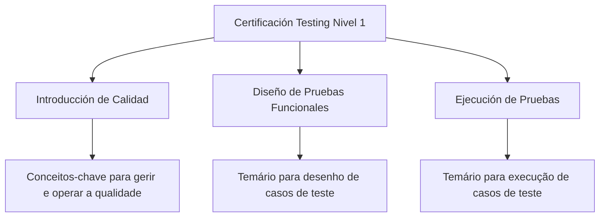

# Certificación Testing Nivel 1 — Introdução de Qualidade, Desenho e Execução de Testes Funcionais

## 1. Metadados do Documento
- **Arquivo de Origem:** Não identificado
- **Tipo de Documento:** Apresentação Executiva
- **Domínio / Sistema:** Certificación Testing Nivel 1; qualidade e testes funcionais
- **Público-Alvo:** Profissionais envolvidos em qualidade, desenho de testes funcionais e execução de casos de teste
- **Data/Versão Identificada:** Nível 1; demais versão e data não identificadas

---

## 2. Resumo Executivo & Contexto de Negócio

O documento apresenta a estrutura temática da certificação **Testing Nivel 1**. O conteúdo está organizado para abordar conceitos-chave necessários à gestão e à operação da qualidade.

A certificação inclui um módulo de **Introducción de Calidad**, descrito como o espaço que reúne o temário com os conceitos fundamentais para gerir e operar a qualidade. O texto não detalha metodologias, métricas, ferramentas ou critérios de qualidade.

O documento também contempla **Diseño de Pruebas Funcionales**, destinado ao temário relacionado ao desenho de casos de teste. Não são especificados modelos de casos, técnicas de particionamento, critérios de aceite ou dados de teste.

Por fim, a apresentação inclui **Ejecución de Pruebas**, com foco no temário para execução de casos de teste. O material não informa ferramentas de execução, evidências requeridas, regras de aprovação ou processos de reporte de defeitos.

---

## 3. Arquitetura, Componentes & Tecnologias Envolvidas

O documento não descreve uma arquitetura de software, integrações, microsserviços, tecnologias, ambientes ou componentes técnicos. A estrutura identificada é curricular, composta por três áreas temáticas da certificação Testing Nivel 1.



**Nota de Análise:** O texto apresenta os módulos da certificação, mas não detalha a sequência obrigatória, pré-requisitos, ferramentas, plataformas ou relações operacionais entre os módulos.

---

## 4. Regras de Negócio, Especificações Funcionais & Processos

### Estrutura temática identificada

1. A certificação é denominada **Certificación Testing Nivel 1**.
2. O módulo **Introducción de Calidad** contém o temário com conceitos-chave para gerir e operar a qualidade.
3. O módulo **Diseño de Pruebas Funcionales** contém o temário para o desenho de casos de teste.
4. O módulo **Ejecución de Pruebas** contém o temário para a execução de casos de teste.

### Limites de detalhamento do material

O documento não especifica:

- Requisitos para participação na certificação.
- Critérios de aprovação, reprovação ou pontuação.
- Processo de criação, revisão, aprovação ou manutenção de casos de teste.
- Regras para registro e classificação de defeitos.
- Ferramentas de gestão de testes, automação, qualidade ou rastreabilidade.
- Papéis e responsabilidades de analistas, desenvolvedores, operadores ou gestores.
- Métricas de qualidade, indicadores operacionais ou níveis de serviço.
- Métodos HTTP, contratos de API, URLs, ambientes, servidores ou rotas de logs.

---

## 5. Tabelas de Parâmetros, Ambientes e Estruturas de Dados

| Item / Parâmetro | Descrição / Função | Tipo / Valores / Formato | Ambiente / Observações |
| :--- | :--- | :--- | :--- |
| Certificación Testing Nivel 1 | Certificação apresentada pelo documento | Nível 1 | Não há data, versão detalhada ou critérios de certificação identificados |
| Introducción de Calidad | Módulo com conceitos-chave para gestão e operação da qualidade | Área temática | O conteúdo conceitual não é detalhado |
| Diseño de Pruebas Funcionales | Módulo dedicado ao temário de desenho de casos de teste | Área temática | Não informa técnicas, modelos ou ferramentas |
| Ejecución de Pruebas | Módulo dedicado ao temário de execução de casos de teste | Área temática | Não informa ferramentas, evidências ou critérios de resultado |
| Home Solutions APIs Documentation Zeus | Texto exibido na extração bruta | Referência textual | Relação com a certificação não detalhada |
| EN | Texto exibido na extração bruta | Código ou indicador não definido | Significado não identificado |
| CF | Texto exibido na extração bruta | Sigla não definida | Significado não identificado |

---

## 6. Bateria de Perguntas & Respostas para RAG (FAQ Sintético)

### P1: Qual é o tema principal do documento Certificación Testing Nivel 1?
**R:** O documento apresenta a estrutura temática da certificação Testing Nivel 1, organizada em introdução à qualidade, desenho de testes funcionais e execução de testes.

### P2: O que é abordado no módulo Introducción de Calidad?
**R:** O módulo Introducción de Calidad reúne o temário com os conceitos-chave para gerir e operar a qualidade. O documento não detalha quais conceitos, metodologias ou métricas de qualidade compõem esse temário.

### P3: Qual módulo trata da criação ou desenho de casos de teste?
**R:** O módulo Diseño de Pruebas Funcionales trata do temário para o desenho de casos de teste. O material não especifica técnicas de desenho, templates ou critérios de aceite.

### P4: Onde o documento aborda a execução de casos de teste?
**R:** A execução de casos de teste é abordada no módulo Ejecución de Pruebas, que contém o temário destinado à execução. Não há detalhamento de ferramentas, evidências ou critérios de aprovação.

### P5: O documento define ferramentas para gestão ou execução de testes?
**R:** Não. O texto fornecido não identifica ferramentas de gestão de testes, automação, controle de defeitos, qualidade ou rastreabilidade.

### P6: Existem regras de aprovação para a certificação Testing Nivel 1?
**R:** Não. O documento menciona a certificação Testing Nivel 1, mas não apresenta critérios de aprovação, pontuação, avaliações, pré-requisitos ou duração.

### P7: O documento descreve ambientes, URLs, servidores ou APIs?
**R:** Não há descrição técnica de ambientes, URLs, servidores, contratos de API ou integrações. A expressão “Home Solutions APIs Documentation Zeus” aparece na extração bruta, mas sua função e relação com a certificação não são explicadas.

### P8: Quais são os três blocos temáticos da certificação?
**R:** Os três blocos identificados são Introducción de Calidad, Diseño de Pruebas Funcionales e Ejecución de Pruebas.

### P9: O documento informa como defeitos devem ser registrados ou classificados?
**R:** Não. Não há regras para registro, priorização, classificação, correção ou validação de defeitos.

### P10: Há uma sequência obrigatória entre qualidade, desenho de testes e execução de testes?
**R:** O documento lista os três temas, mas não declara uma sequência obrigatória, dependências formais ou fluxo operacional entre os módulos.

---

## 7. Glossário de Termos, Siglas & Conceitos-Chave

- **Certificación Testing Nivel 1:** Nome da certificação apresentada no documento.
- **Introducción de Calidad:** Área temática com conceitos-chave para gerir e operar a qualidade.
- **Diseño de Pruebas Funcionales:** Área temática dedicada ao desenho de casos de teste.
- **Ejecución de Pruebas:** Área temática dedicada à execução de casos de teste.
- **Caso de prueba:** Termo citado no contexto de desenho e execução; o documento não fornece definição adicional.
- **CF:** Sigla exibida na extração bruta sem definição no documento.
- **EN:** Indicador exibido na extração bruta sem definição no documento.
- **Zeus:** Termo exibido em “Home Solutions APIs Documentation Zeus”; não possui definição adicional no texto.

---

## 8. Notas Críticas, Riscos & Limitações

- O conteúdo fornecido é resumido e não apresenta aprofundamento técnico dos módulos da certificação.
- Não há detalhes sobre ferramentas, métricas, processos de governança, fluxos de defeitos ou evidências de teste.
- Não foram identificados requisitos de entrada, critérios de certificação, duração, avaliação ou público formalmente definido.
- Os termos **CF**, **EN**, **Home Solutions APIs Documentation Zeus** e **Zeus** aparecem na extração, mas não têm contexto ou definição suficiente para interpretação confiável.
- **Nota de Análise:** O documento lista desenho e execução de casos de teste, porém não detalha métodos, templates, contratos, ferramentas ou critérios operacionais associados.

---

## 9. Conteúdo Bruto Estruturado (Referência Fiel)

```text
--- [PÁGINA 1 DE 1] ---

CERTIFICACIÓN - TESTING NIVEL 1
CERTIFICACIÓN Testing
nivel 1
INTRODUCCIÓN DE CALIDAD
En este apartado se encuentra el temario con
todos los conceptos clave para gestionar y
operar la Calidad
DISEÑO DE PRUEBAS FUNCIONALES
En este apartado se encuentra el temario
para el diseño de casos de prueba
EJECUCIÓN DE PRUEBAS
En este apartado se encuentra el temario
para la ejecución de casos de prueba
 / 
 CF
Home Solutions APIs Documentation Zeus
EN
```
