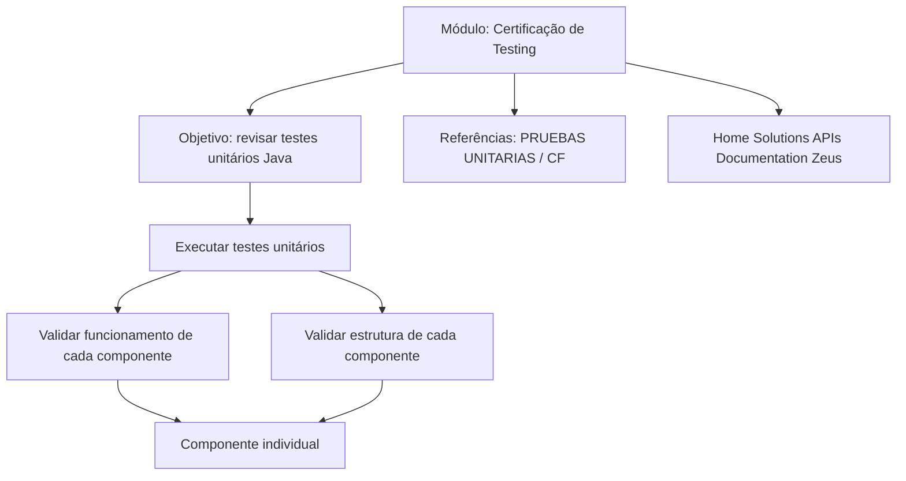

# Certificação de Testing — Automatização de Testes Unitários Java

## 1. Metadados do Documento
- **Arquivo de Origem:** Não identificado
- **Tipo de Documento:** Procedimento
- **Domínio / Sistema:** Testing; testes unitários Java; Home Solutions APIs Documentation Zeus
- **Público-Alvo:** Desenvolvedores
- **Data/Versão Identificada:** Não identificada

---

## 2. Resumo Executivo & Contexto de Negócio

O conteúdo apresenta um módulo de certificação voltado à automatização de testes unitários em Java. A finalidade explicitada é revisar conceitos de *testing* aplicados a testes unitários Java.

O documento estabelece que testes unitários devem ser executados para validar o correto funcionamento e a estrutura de cada componente de forma individual. Portanto, o foco descrito é a validação isolada de componentes.

Como fonte complementar, o documento referencia “PRUEBAS UNITARIAS / CF” e “Home Solutions APIs Documentation Zeus”. Não há detalhamento sobre frameworks, ferramentas de automação, comandos de execução, cobertura mínima, pipelines ou contratos de APIs.

---

## 3. Arquitetura, Componentes & Tecnologias Envolvidas

| Componente / Termo | Papel identificado |
| :--- | :--- |
| Java | Tecnologia associada aos testes unitários. |
| Pruebas unitarias | Testes executados para validar funcionamento e estrutura de cada componente individualmente. |
| Componentes | Unidades individuais cuja estrutura e funcionamento devem ser validados. |
| PRUEBAS UNITARIAS / CF | Referência indicada para obter mais informações. |
| Home Solutions APIs Documentation Zeus | Referência documental citada no conteúdo. |



**Nota de Análise:** O conteúdo não descreve arquitetura de software, microsserviços, APIs, métodos HTTP, contratos JSON, ferramentas de teste ou ambientes de execução.

---

## 4. Regras de Negócio, Especificações Funcionais & Processos

1. O módulo tem como finalidade revisar o *testing* de testes unitários em Java.
2. É necessário executar testes unitários.
3. Os testes unitários devem validar o correto funcionamento de cada componente.
4. Os testes unitários devem validar a estrutura de cada componente.
5. A validação deve ocorrer de forma individual para cada componente.
6. Informações adicionais podem ser consultadas nas referências “PRUEBAS UNITARIAS / CF” e “Home Solutions APIs Documentation Zeus”.

---

## 5. Tabelas de Parâmetros, Ambientes e Estruturas de Dados

| Item / Parâmetro | Descrição / Função | Tipo / Valores / Formato | Ambiente / Observações |
| :--- | :--- | :--- | :--- |
| Objetivo do módulo | Revisar o *testing* de testes unitários em Java. | Objetivo educacional / certificação | Não há versão ou ambiente identificado. |
| Testes unitários | Validar o correto funcionamento dos componentes. | Execução de testes | Aplicável a cada componente individualmente. |
| Estrutura do componente | Deve ser validada por testes unitários. | Critério de validação | Sem critérios técnicos adicionais especificados. |
| Funcionamento do componente | Deve ser validado por testes unitários. | Critério de validação | Sem casos de teste especificados. |
| PRUEBAS UNITARIAS / CF | Fonte para mais informações. | Referência documental | URL ou localização não informada. |
| Home Solutions APIs Documentation Zeus | Referência documental citada. | Documentação | URL, acesso e conteúdo não detalhados. |

---

## 6. Bateria de Perguntas & Respostas para RAG (FAQ Sintético)

### P1: Qual é a finalidade do módulo “Certificación de TESTING - Automatización de Pruebas Unitarias Java”?
**R:** A finalidade do módulo é revisar o *testing* de testes unitários em Java.

### P2: O que os testes unitários devem validar?
**R:** Os testes unitários devem validar o correto funcionamento e a estrutura de cada componente.

### P3: A validação dos testes unitários é feita no sistema completo ou por componente?
**R:** O conteúdo determina que a validação deve ser realizada de forma individual para cada componente.

### P4: Qual tecnologia é mencionada no escopo dos testes unitários?
**R:** A tecnologia mencionada é Java, no contexto de automatização e revisão de testes unitários.

### P5: O documento define um framework de testes unitários Java?
**R:** Não. O conteúdo não identifica frameworks, bibliotecas ou ferramentas específicas para testes unitários Java.

### P6: O documento define critérios mínimos de cobertura de código?
**R:** Não. Não há percentual de cobertura, métrica de qualidade ou regra de aceite especificada.

### P7: Onde o documento indica que podem ser encontradas mais informações?
**R:** O conteúdo indica as referências “PRUEBAS UNITARIAS / CF” e “Home Solutions APIs Documentation Zeus”.

### P8: O documento fornece comandos para executar os testes unitários?
**R:** Não. O documento informa que será necessário executar testes unitários, mas não apresenta comandos, scripts ou procedimentos de execução.

### P9: O conteúdo descreve ambientes de desenvolvimento, homologação ou produção?
**R:** Não. Nenhum ambiente técnico é identificado no texto fornecido.

### P10: Quais aspectos de cada componente precisam ser verificados?
**R:** Cada componente precisa ter seu correto funcionamento e sua estrutura validados individualmente por testes unitários.

---

## 7. Glossário de Termos, Siglas & Conceitos-Chave

- **Testing:** Termo usado no documento para o contexto de testes, especificamente testes unitários.
- **Testes unitários / Pruebas unitarias:** Testes necessários para validar o funcionamento e a estrutura de cada componente individualmente.
- **Java:** Tecnologia mencionada no título e no objetivo do módulo de testes unitários.
- **CF:** Sigla presente na referência “PRUEBAS UNITARIAS / CF”; o significado não é detalhado no conteúdo.
- **Home Solutions APIs Documentation Zeus:** Nome de referência documental citado para consulta de informações adicionais.
- **Zeus:** Termo presente em “Home Solutions APIs Documentation Zeus”; seu significado ou função não é detalhado no conteúdo.

---

## 8. Notas Críticas, Riscos & Limitações

- O conteúdo não informa o nome do arquivo de origem, data, versão, autor ou organização responsável.
- O conteúdo não detalha frameworks, bibliotecas, ferramentas de automação ou infraestrutura de execução de testes Java.
- O conteúdo não apresenta casos de teste, critérios de aceite, padrões de nomenclatura ou métricas de cobertura.
- As referências “PRUEBAS UNITARIAS / CF” e “Home Solutions APIs Documentation Zeus” não possuem URL, caminho de acesso ou conteúdo adicional no texto fornecido.
- **Nota de Análise:** O documento exige validação individual de componentes, porém não especifica como identificar os componentes, como estruturar testes ou como comprovar o resultado da validação.

---

## 9. Conteúdo Bruto Estruturado (Referência Fiel)

```text
--- [PÁGINA 1 DE 1] ---

CERTIFICACIÓN de TESTING - Automatización
de Pruebas Unitarias Java
OBJETIVO
La finalidad de este módulo es repasar el testing de pruebas unitarias en Java
Pruebas unitarias
Pruebas unitarias
Será necesario ejecutar pruebas unitarias que validen el correcto funcionamiento y estructura de
cada componente de forma individual.
Podemos encontrar más información en: PRUEBAS UNITARIAS
 / 
 CF
Home Solutions APIs Documentation Zeus
EN
```
