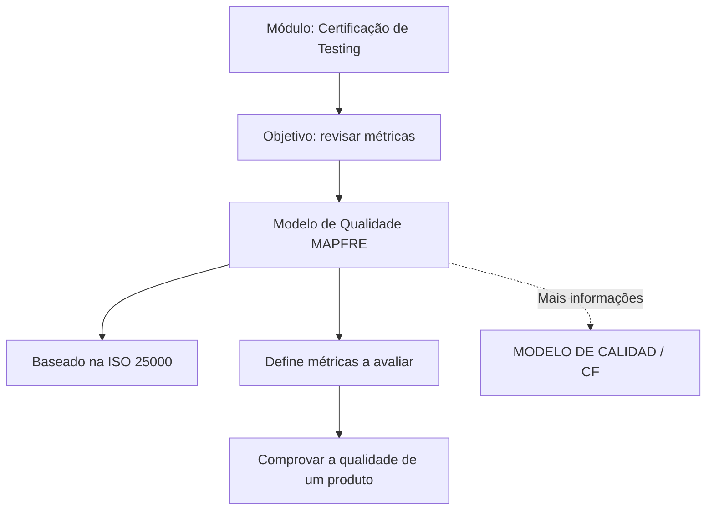

# Certificação de Testing — Modelo de Qualidade MAPFRE baseado na ISO 25000

## 1. Metadados do Documento
- **Arquivo de Origem:** Não identificado no conteúdo fornecido
- **Tipo de Documento:** Apresentação Executiva / Material de Certificação de Testing
- **Domínio / Sistema:** Modelo de Qualidade MAPFRE
- **Público-Alvo:** Profissionais de Testing e Qualidade
- **Data/Versão Identificada:** Não identificada

---

## 2. Resumo Executivo & Contexto de Negócio

O documento apresenta um módulo de certificação de testing sobre o Modelo de Qualidade da MAPFRE. A finalidade explicitamente declarada é revisar as métricas desse modelo, cuja base é a ISO 25000.

O Modelo de Qualidade é descrito como o mecanismo que define as métricas a serem avaliadas para comprovar a qualidade de um produto. Portanto, o foco apresentado é a avaliação da qualidade de produtos por meio de métricas estabelecidas pelo próprio modelo.

O conteúdo fornecido não detalha as métricas individuais, os critérios de aceite, métodos de cálculo, ferramentas de medição ou o processo operacional de certificação. O material também aponta referências denominadas “MODELO DE CALIDAD”, “CF” e “Home Solutions APIs Documentation Zeus”, sem explicar a função, o endereço ou a relação operacional dessas referências com o módulo.

---

## 3. Arquitetura, Componentes & Tecnologias Envolvidas

Os elementos identificados no conteúdo são:

| Componente / Referência | Papel identificado no documento |
| :--- | :--- |
| Certificação de Testing | Contexto educacional ou de certificação do material. |
| Modelo de Qualidade | Define as métricas que serão avaliadas para verificar a qualidade de um produto. |
| MAPFRE | Organização associada ao Modelo de Qualidade apresentado. |
| ISO 25000 | Base declarada para o Modelo de Qualidade da MAPFRE. |
| MODELO DE CALIDAD | Referência indicada para obtenção de mais informações. |
| CF | Referência citada junto de “MODELO DE CALIDAD”, sem detalhamento adicional. |
| Home Solutions APIs Documentation Zeus | Texto de referência presente na extração, sem descrição funcional. |
| EN | Marcador textual presente na extração, sem contexto adicional. |



**Nota de Análise:** O documento não descreve arquitetura de software, APIs, integrações, ambientes, servidores, contratos, tecnologias de implementação ou fluxo de dados.

---

## 4. Regras de Negócio, Especificações Funcionais & Processos

1. O módulo tem como finalidade revisar as métricas do Modelo de Qualidade da MAPFRE.
2. O Modelo de Qualidade da MAPFRE é baseado na ISO 25000.
3. O Modelo de Qualidade define quais métricas devem ser avaliadas.
4. A avaliação das métricas tem a finalidade de comprovar a qualidade de um produto.
5. O documento indica que informações adicionais podem ser encontradas nas referências “MODELO DE CALIDAD” e “CF”.

**Nota de Análise:** O conteúdo não apresenta nomes de métricas, fórmulas, limites, pesos, critérios de aprovação, regras de exceção, responsáveis, etapas de execução ou evidências requeridas para a certificação.

---

## 5. Tabelas de Parâmetros, Ambientes e Estruturas de Dados

| Item / Parâmetro | Descrição / Função | Tipo / Valores / Formato | Ambiente / Observações |
| :--- | :--- | :--- | :--- |
| Finalidade do módulo | Revisar as métricas do Modelo de Qualidade da MAPFRE. | Objetivo educacional / de certificação. | Não informado. |
| Modelo de Qualidade | Define as métricas a serem avaliadas para comprovar a qualidade de um produto. | Modelo de avaliação de qualidade. | Associado à MAPFRE. |
| Base normativa | ISO 25000. | Norma ou referência citada. | Não informado. |
| Referência adicional | MODELO DE CALIDAD. | Referência textual. | Não há URL nem conteúdo detalhado. |
| Referência adicional | CF. | Referência textual. | Não há expansão da sigla nem conteúdo detalhado. |
| Referência textual | Home Solutions APIs Documentation Zeus. | Texto extraído. | Relação com o Modelo de Qualidade não detalhada. |
| Marcador textual | EN. | Texto extraído. | Significado não informado. |

---

## 6. Bateria de Perguntas & Respostas para RAG (FAQ Sintético)

### P1: Qual é a finalidade do módulo “Certificación de Testing - Modelo de Calidad”?
**R:** A finalidade do módulo é revisar as métricas do Modelo de Qualidade da MAPFRE, baseado na ISO 25000.

### P2: Em qual referência o Modelo de Qualidade da MAPFRE é baseado?
**R:** O documento informa que o Modelo de Qualidade da MAPFRE é baseado na ISO 25000.

### P3: O que o Modelo de Qualidade define?
**R:** O Modelo de Qualidade define as métricas que serão avaliadas para comprovar a qualidade de um produto.

### P4: Qual é o objetivo da avaliação das métricas do Modelo de Qualidade?
**R:** A avaliação das métricas tem como objetivo comprovar a qualidade de um produto.

### P5: Quais métricas específicas são avaliadas pelo Modelo de Qualidade da MAPFRE?
**R:** O conteúdo fornecido afirma que o modelo define métricas a serem avaliadas, mas não lista ou descreve quais são essas métricas.

### P6: O documento apresenta fórmulas ou critérios de cálculo das métricas de qualidade?
**R:** Não. O conteúdo fornecido não apresenta fórmulas, critérios de cálculo, valores de referência, limites ou regras de aprovação para as métricas.

### P7: Onde o documento indica que podem ser encontradas mais informações?
**R:** O documento aponta as referências “MODELO DE CALIDAD” e “CF” para mais informações, mas não fornece URLs, descrições ou conteúdo adicional dessas fontes.

### P8: O material descreve um processo operacional de certificação de testing?
**R:** Não. O material identifica o contexto como uma certificação de testing, mas não detalha etapas, responsáveis, evidências, ferramentas ou critérios operacionais de certificação.

### P9: O documento especifica sistemas, APIs ou integrações relacionadas ao Modelo de Qualidade?
**R:** Não. A extração contém o texto “Home Solutions APIs Documentation Zeus”, mas não explica seu significado nem estabelece uma integração, sistema, API ou relação técnica com o Modelo de Qualidade.

### P10: Qual organização está associada ao Modelo de Qualidade apresentado?
**R:** O Modelo de Qualidade apresentado está associado à MAPFRE, conforme declarado no objetivo do módulo.

---

## 7. Glossário de Termos, Siglas & Conceitos-Chave

- **MAPFRE:** Organização mencionada como associada ao Modelo de Qualidade apresentado.
- **ISO 25000:** Referência na qual o Modelo de Qualidade da MAPFRE é baseado, segundo o documento.
- **Modelo de Qualidade:** Modelo que define as métricas a serem avaliadas para comprovar a qualidade de um produto.
- **Certificación de Testing:** Título e contexto do módulo apresentado.
- **CF:** Referência citada para informações adicionais; o documento não expande nem define a sigla.
- **MODELO DE CALIDAD:** Referência indicada para obtenção de mais informações; o documento não detalha o conteúdo.
- **Home Solutions APIs Documentation Zeus:** Texto presente na extração; não há definição nem contexto adicional.
- **EN:** Marcador textual presente na extração; significado não identificado.

---

## 8. Notas Críticas, Riscos & Limitações

- O conteúdo disponível é resumido e não apresenta detalhamento das métricas do Modelo de Qualidade.
- Não há critérios mensuráveis, fórmulas, thresholds, regras de aceite ou evidências de conformidade.
- Não são identificadas versões, datas, autores ou responsáveis pelo material.
- As referências “MODELO DE CALIDAD” e “CF” não possuem URL, descrição ou conteúdo acessível na extração.
- “Home Solutions APIs Documentation Zeus” e “EN” aparecem no conteúdo bruto sem contexto que permita atribuir significado técnico ou funcional.
- O documento não descreve fluxos operacionais de testing, certificação, integração, arquitetura de software ou ambientes.

---

## 9. Conteúdo Bruto Estruturado (Referência Fiel)

```text
--- [PÁGINA 1 DE 1] ---

CERTIFICACIÓN de TESTING - Modelo de
Calidad
OBJETIVO
La finalidad de este módulo es repasar las métricas del Modelo de Calidad de MAPFRE basado en la
ISO 25000.
Modelo de Calidad
Modelo de Calidad
El Modelo de Calidad define las métricas que se van a evaluar para comprobar la calidad de un
producto.
Podemos encontrar más información en: MODELO DE CALIDAD
 / 
 CF
Home Solutions APIs Documentation Zeus
EN
```
