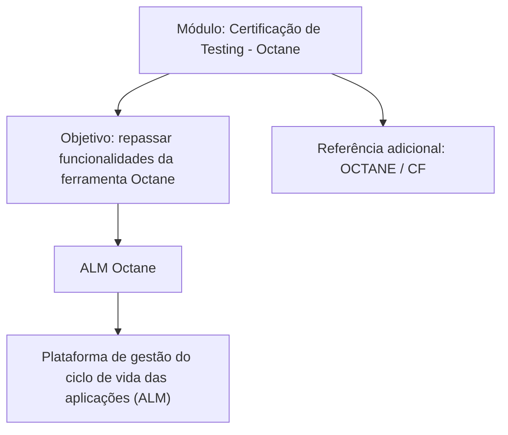

# Certificação de Testing — ALM Octane: Visão Geral do Módulo

## 1. Metadados do Documento
- **Arquivo de Origem:** Não identificado no conteúdo fornecido
- **Tipo de Documento:** Apresentação Executiva / Material de Treinamento
- **Domínio / Sistema:** ALM Octane; certificação de testing
- **Público-Alvo:** Profissionais de testing e usuários da ferramenta Octane
- **Data/Versão Identificada:** `Oct` (ano e versão não identificados)

---

## 2. Resumo Executivo & Contexto de Negócio

O conteúdo apresentado descreve um módulo de **Certificação de Testing - Octane**. A finalidade declarada do módulo é revisar as funcionalidades disponibilizadas pela ferramenta Octane.

O documento identifica o **ALM Octane** como uma plataforma de gestão do ciclo de vida das aplicações, também conhecida pela sigla ALM. O material não detalha funcionalidades específicas, fluxos operacionais, configurações, integrações, permissões ou procedimentos de uso da plataforma.

Também há uma referência a uma fonte adicional denominada **OCTANE**, sem URL, descrição ou conteúdo complementar explicitamente disponível no texto extraído. Os termos “Home”, “Solutions”, “APIs”, “Documentation”, “Zeus”, “EN” e “CF” aparecem no conteúdo bruto, mas não possuem explicação contextual suficiente para determinar sua função.

---

## 3. Arquitetura, Componentes & Tecnologias Envolvidas

O documento cita os seguintes elementos:

- **ALM Octane:** plataforma de gestão do ciclo de vida das aplicações.
- **Octane:** ferramenta abordada pelo módulo de certificação de testing.
- **OCTANE:** referência indicada como fonte para mais informações.
- **CF:** termo citado ao lado de OCTANE, sem detalhamento.
- **Home, Solutions, APIs, Documentation, Zeus, EN:** termos presentes no conteúdo extraído, sem relação técnica explicitamente descrita.



> **Nota de Análise:** O conteúdo não descreve arquitetura de software, componentes internos, APIs, integrações, protocolos, ambientes ou fluxos de dados do ALM Octane.

---

## 4. Regras de Negócio, Especificações Funcionais & Processos

1. O módulo tem como finalidade revisar as funcionalidades oferecidas pela ferramenta Octane.
2. O ALM Octane é apresentado como uma plataforma de gestão do ciclo de vida das aplicações.
3. O documento orienta que mais informações podem ser encontradas em uma referência denominada “OCTANE / CF”.
4. Não foram fornecidas regras de negócio, critérios de validação, parâmetros de cálculo, etapas operacionais, contratos de integração ou especificações funcionais detalhadas.

> **Nota de Análise:** O documento não detalha quais funcionalidades do Octane serão revisadas, nem descreve como usuários devem executar atividades de testing na plataforma.

---

## 5. Tabelas de Parâmetros, Ambientes e Estruturas de Dados

| Item / Parâmetro | Descrição / Função | Tipo / Valores / Formato | Ambiente / Observações |
| :--- | :--- | :--- | :--- |
| Certificação de Testing - Octane | Nome do módulo apresentado | Título de módulo | Material de treinamento |
| Objetivo | Revisar funcionalidades da ferramenta Octane | Declaração de propósito | Não há detalhamento das funcionalidades |
| ALM Octane | Plataforma de gestão do ciclo de vida das aplicações | Plataforma ALM | Não foram informadas versão, URL ou ambiente |
| OCTANE | Referência para mais informações | Referência citada | Sem URL ou conteúdo complementar |
| CF | Termo associado à referência OCTANE | Não especificado | Significado não identificado |
| Home | Termo presente no conteúdo bruto | Não especificado | Sem contexto adicional |
| Solutions | Termo presente no conteúdo bruto | Não especificado | Sem contexto adicional |
| APIs | Termo presente no conteúdo bruto | Não especificado | Não há APIs, métodos ou contratos descritos |
| Documentation | Termo presente no conteúdo bruto | Não especificado | Sem documentação vinculada no texto |
| Zeus | Termo presente no conteúdo bruto | Não especificado | Sem contexto adicional |
| EN | Termo presente no conteúdo bruto | Não especificado | Possível indicador de idioma, não confirmado pelo texto |

---

## 6. Bateria de Perguntas & Respostas para RAG (FAQ Sintético)

### P1: Qual é o objetivo do módulo Certificação de Testing - Octane?
**R:** O objetivo declarado do módulo é revisar as funcionalidades fornecidas pela ferramenta Octane.

### P2: O que é o ALM Octane segundo o documento?
**R:** O documento define o ALM Octane como uma plataforma de gestão do ciclo de vida das aplicações, isto é, uma plataforma ALM.

### P3: O documento detalha quais funcionalidades do Octane serão revisadas?
**R:** Não. O conteúdo informa que o módulo revisará funcionalidades da ferramenta Octane, mas não enumera nem explica quais funcionalidades serão abordadas.

### P4: Existe uma referência para obter mais informações sobre Octane?
**R:** Sim. O texto informa que mais informações podem ser encontradas em uma referência identificada como “OCTANE / CF”. Entretanto, o conteúdo não fornece URL, localização, responsável ou descrição dessa referência.

### P5: O documento apresenta procedimentos de testing no ALM Octane?
**R:** Não. Não há procedimentos, etapas de execução, fluxos de teste, critérios de aprovação ou instruções operacionais no conteúdo fornecido.

### P6: O documento descreve APIs ou integrações do ALM Octane?
**R:** Não. Embora o termo “APIs” apareça no conteúdo bruto, não há descrição de APIs, endpoints, métodos HTTP, autenticação, payloads ou integrações.

### P7: Há versão ou data identificada para o material de Certificação de Testing - Octane?
**R:** O texto contém a indicação “Oct”, mas não apresenta ano, data completa, número de versão ou histórico de alterações. Portanto, a versão e a data não podem ser confirmadas.

### P8: Qual público pode se beneficiar do módulo apresentado?
**R:** O texto não declara explicitamente o público-alvo. Pelo título “Certificação de Testing - Octane” e pelo objetivo de revisar funcionalidades da ferramenta, o conteúdo está relacionado a profissionais que utilizam Octane em atividades de testing, sem que isso seja formalmente especificado pelo documento.

### P9: O documento apresenta ambientes, servidores ou URLs do ALM Octane?
**R:** Não. Não foram identificados ambientes, servidores, URLs, portas, credenciais, rotas de logs ou parâmetros de configuração.

### P10: O termo Zeus é explicado no documento?
**R:** Não. “Zeus” aparece no conteúdo bruto, mas não há definição, relação com o ALM Octane ou instrução de uso associada.

---

## 7. Glossário de Termos, Siglas & Conceitos-Chave

- **ALM:** Gestão do ciclo de vida das aplicações, conforme a descrição de ALM Octane no documento.
- **ALM Octane:** Plataforma de gestão do ciclo de vida das aplicações.
- **Octane:** Ferramenta cujas funcionalidades são objeto de revisão no módulo de certificação de testing.
- **Testing:** Contexto de testes associado ao título do módulo.
- **CF:** Termo citado junto de “OCTANE”; significado não identificado no conteúdo.
- **APIs:** Termo presente no conteúdo bruto; não definido nem detalhado no documento.
- **Zeus:** Termo presente no conteúdo bruto; não definido nem contextualizado no documento.
- **EN:** Termo presente no conteúdo bruto; significado não confirmado pelo documento.

---

## 8. Notas Críticas, Riscos & Limitações

- O conteúdo é resumido e não apresenta detalhamento das funcionalidades do ALM Octane.
- Não há procedimentos, regras de negócio, fluxos de processo, configurações ou requisitos técnicos.
- Não foram identificados URLs, ambientes, versões, servidores, rotas de logs ou contratos de API.
- A referência “OCTANE / CF” não contém endereço ou contexto suficiente para consulta autônoma.
- Os termos “Home”, “Solutions”, “APIs”, “Documentation”, “Zeus”, “EN” e “CF” não possuem definição sustentada pelo conteúdo original.
- Não é possível inferir métodos HTTP, contratos JSON, modelos de dados, permissões ou integrações a partir do texto fornecido.

---

## 9. Conteúdo Bruto Estruturado (Referência Fiel)

```text
--- [PÁGINA 1 DE 1] ---

CERTIFICACIÓN de TESTING - Octane
OBJETIVO
La finalidad de este módulo es repasar las funcionalidades que proporciona la herramienta Octane.
Octane
Octane
ALM Octane es una plataforma de gestión del ciclo de vida de las aplicaciones (ALM).
Podemos encontrar más información en: OCTANE
 / 
 CF
Home Solutions APIs Documentation Zeus
EN
```
