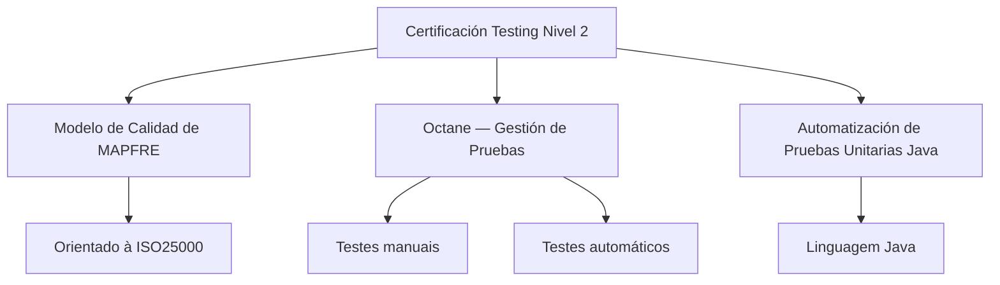

# Certificación Testing Nivel 2 — Modelo de Calidad, Octane y Automatización Unitaria Java

## 1. Metadados do Documento
- **Arquivo de Origem:** Não identificado
- **Tipo de Documento:** Material de certificação / apresentação de treinamento
- **Domínio / Sistema:** Certificación Testing Nivel 2; MAPFRE; Octane; Java
- **Público-Alvo:** Profissionais de testes e qualidade
- **Data/Versão Identificada:** Não identificada

---

## 2. Resumo Executivo & Contexto de Negócio

O documento apresenta o conteúdo associado à **Certificación Testing Nivel 2**. O material organiza o treinamento em três tópicos: Modelo de Calidad de MAPFRE, gestão de testes com Octane e automatização de testes unitários Java.

O tópico de Modelo de Calidad descreve que existe um modelo de qualidade da MAPFRE orientado à **ISO25000**. O conteúdo fornecido não apresenta atributos de qualidade, critérios de avaliação, métricas, processos de auditoria ou responsabilidades relacionadas a esse modelo.

O tópico **Octane — Gestión de Pruebas** aborda o uso da ferramenta Octane para gestão de testes manuais e automáticos. O texto não detalha fluxos operacionais, configurações, integrações, tipos de evidência, ciclos de teste ou relatórios.

O terceiro tópico trata da automatização de testes unitários para a linguagem Java. O documento informa a existência de um temário para esse assunto, mas não identifica frameworks, bibliotecas, padrões de testes, comandos de execução ou critérios de cobertura.

---

## 3. Arquitetura, Componentes & Tecnologias Envolvidas

Os elementos explicitamente citados são:

- **Certificación Testing Nivel 2:** contexto de certificação e treinamento.
- **Modelo de Calidad de MAPFRE:** modelo de qualidade orientado à ISO25000.
- **ISO25000:** referência utilizada como orientação para o Modelo de Calidad de MAPFRE.
- **Octane:** ferramenta abordada para gestão de testes manuais e automáticos.
- **Java:** linguagem associada ao temário de automatização de testes unitários.
- **Home Solutions APIs Documentation Zeus:** texto presente na extração, sem relação funcional descrita com os demais tópicos.
- **EN:** texto isolado presente na extração, sem detalhamento adicional.
- **CF:** texto isolado presente na extração, sem detalhamento adicional.



**Nota de Análise:** o documento não descreve arquitetura de software, integrações, APIs, ambientes, protocolos, contratos, microsserviços ou relações técnicas entre Octane, Java e Home Solutions APIs Documentation Zeus.

---

## 4. Regras de Negócio, Especificações Funcionais & Processos

1. A **Certificación Testing Nivel 2** contém um tópico relacionado ao Modelo de Calidad de MAPFRE.
2. O **Modelo de Calidad de MAPFRE** é apresentado como orientado à **ISO25000**.
3. O conteúdo de **Octane — Gestión de Pruebas** aborda a ferramenta Octane para gestão de testes.
4. A gestão de testes em Octane contempla testes **manuais** e **automáticos**.
5. O tópico de **Automatización de Pruebas Unitarias Java** contém um temário destinado à automatização de testes unitários na linguagem Java.

**Nota de Análise:** não há regras de negócio detalhadas, condições de validação, parâmetros de cálculo, critérios de aprovação, sequências operacionais ou restrições técnicas adicionais no conteúdo fornecido.

---

## 5. Tabelas de Parâmetros, Ambientes e Estruturas de Dados

| Item / Parâmetro | Descrição / Função | Tipo / Valores / Formato | Ambiente / Observações |
| :--- | :--- | :--- | :--- |
| Certificación Testing Nivel 2 | Contexto principal do material | Certificação / treinamento | Não há versão ou data identificada |
| Modelo de Calidad de MAPFRE | Modelo de qualidade citado no material | Modelo de qualidade | Orientado à ISO25000 |
| ISO25000 | Referência de orientação do Modelo de Calidad de MAPFRE | Norma ou referência citada | Não há detalhamento adicional |
| Octane | Ferramenta tratada no tópico de gestão de testes | Ferramenta de gestão de testes | Aplicável a testes manuais e automáticos |
| Gestão de testes manuais | Modalidade de testes citada no tópico Octane | Teste manual | Sem fluxo operacional detalhado |
| Gestão de testes automáticos | Modalidade de testes citada no tópico Octane | Teste automático | Sem integração ou ferramenta complementar detalhada |
| Automatización de Pruebas Unitarias Java | Temário para automatização de testes unitários | Treinamento técnico | Associado à linguagem Java |
| Java | Linguagem mencionada no tema de testes unitários | Linguagem de programação | Frameworks e bibliotecas não identificados |
| Home Solutions APIs Documentation Zeus | Texto presente na extração | Não especificado | Relação com a certificação não detalhada |
| EN | Texto isolado presente na extração | Não especificado | Sem detalhamento |
| CF | Texto isolado presente na extração | Não especificado | Sem detalhamento |

---

## 6. Bateria de Perguntas & Respostas para RAG (FAQ Sintético)

### P1: Qual é o objetivo central do documento Certificación Testing Nivel 2?
**R:** O documento apresenta temas de uma certificação de testing nível 2: o Modelo de Calidad de MAPFRE orientado à ISO25000, a gestão de testes manuais e automáticos com Octane e a automatização de testes unitários Java.

### P2: Qual referência orienta o Modelo de Calidad de MAPFRE?
**R:** O documento informa que o Modelo de Calidad de MAPFRE é orientado à ISO25000. O conteúdo não detalha quais características, métricas ou critérios da ISO25000 são utilizados.

### P3: O que o documento informa sobre a ferramenta Octane?
**R:** O documento apresenta Octane como ferramenta abordada para gestão de testes, incluindo testes manuais e testes automáticos. Não são especificados procedimentos de configuração, integração, execução ou geração de relatórios.

### P4: Octane é citado somente para testes manuais?
**R:** Não. O conteúdo afirma que o temário de Octane cobre gestão de testes manuais ou automáticos.

### P5: Qual linguagem é abordada na automatização de testes unitários?
**R:** A linguagem citada é Java. O documento informa que existe um temário para automatização de testes unitários Java, mas não identifica frameworks ou bibliotecas.

### P6: O documento define quais frameworks devem ser usados para testes unitários Java?
**R:** Não. O documento apenas menciona a automatização de testes unitários para Java e não especifica frameworks, ferramentas, comandos, padrões ou requisitos de cobertura.

### P7: O documento descreve uma arquitetura de integração entre Octane e Java?
**R:** Não. Octane e Java são apresentados como tópicos da certificação, mas o conteúdo não descreve integração técnica, troca de dados, APIs, conectores ou fluxo de automação entre esses elementos.

### P8: Existem critérios de aprovação, qualidade ou cobertura de testes no material?
**R:** Não foram identificados critérios de aprovação, percentuais de cobertura, métricas, SLAs, indicadores ou regras de qualidade no texto fornecido.

### P9: O que significa Home Solutions APIs Documentation Zeus no contexto do documento?
**R:** “Home Solutions APIs Documentation Zeus” aparece no conteúdo bruto extraído, porém o documento não explica seu significado, sua função ou sua relação com a Certificación Testing Nivel 2.

### P10: O documento informa a versão ou a data da certificação?
**R:** Não. Não foi identificada data, versão, edição ou vigência no conteúdo fornecido.

---

## 7. Glossário de Termos, Siglas & Conceitos-Chave

- **Certificación Testing Nivel 2:** denominação do material de certificação apresentado.
- **Modelo de Calidad:** modelo de qualidade da MAPFRE citado no documento.
- **MAPFRE:** organização mencionada como responsável pelo Modelo de Calidad.
- **ISO25000:** referência à qual o Modelo de Calidad de MAPFRE é orientado, conforme o documento.
- **Octane:** ferramenta citada para gestão de testes manuais e automáticos.
- **Gestión de Pruebas:** gestão de testes, incluindo modalidades manuais ou automáticas.
- **Automatización de Pruebas Unitarias Java:** tópico de treinamento relacionado à automatização de testes unitários na linguagem Java.
- **Java:** linguagem mencionada no tópico de automatização de testes unitários.
- **Home Solutions APIs Documentation Zeus:** expressão presente no texto extraído, sem definição ou contexto adicional.
- **EN:** sigla ou texto isolado presente na extração, sem significado definido.
- **CF:** sigla ou texto isolado presente na extração, sem significado definido.

---

## 8. Notas Críticas, Riscos & Limitações

- O conteúdo é resumido e não apresenta detalhamento técnico suficiente para definir implementação, configuração ou operação de Octane.
- O Modelo de Calidad de MAPFRE é apenas relacionado à ISO25000; o documento não descreve atributos, métricas, controles ou critérios concretos do modelo.
- A automatização de testes unitários Java não inclui ferramentas, frameworks, padrões de código, comandos de execução, estratégias de mocking ou critérios de cobertura.
- Não há informações sobre ambientes, URLs, servidores, credenciais, permissões, versões, integrações, APIs ou contratos de dados.
- As expressões “Home Solutions APIs Documentation Zeus”, “EN” e “CF” não possuem explicação contextual no conteúdo disponibilizado.

---

## 9. Conteúdo Bruto Estruturado (Referência Fiel)

```text
--- [PÁGINA 1 DE 1] ---

CERTIFICACIÓN - TESTING NIVEL 2
CERTIFICACIÓN Testing
nivel 2
MODELO DE CALIDAD
En este apartado se encuentra detallado el
Modelo de Calidad de MAPFRE orientado a la
ISO25000
OCTANE - GESTIÓN DE PRUEBAS
En este apartado se encuentra el temario
para el uso de la herramienta Octane, en todo
lo que se refiere a la gestión de pruebas, ya
sean manuales o automáticas
AUTOMATIZACIÓN DE PRUEBAS
UNITARIAS JAVA
En este apartado se encuentra el temario
para la automatización de las pruebas
unitarias del lenguaje JAVA
 / 
 CF
Home Solutions APIs Documentation Zeus
EN
```
