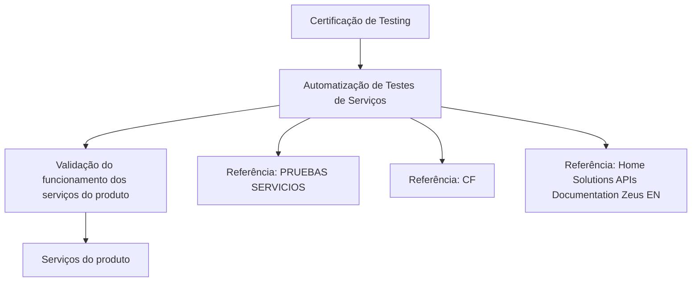

# Certificação de Testing — Automatização de Testes de Serviços

## 1. Metadados do Documento
- **Arquivo de Origem:** Não identificado
- **Tipo de Documento:** Apresentação Executiva
- **Domínio / Sistema:** Certificação de Testing; testes de serviços; produto
- **Público-Alvo:** Desenvolvedores, QA e equipes de testing
- **Data/Versão Identificada:** Não identificada

---

## 2. Resumo Executivo & Contexto de Negócio

O documento apresenta um módulo de certificação de testing voltado à **automatização de testes de serviços**. O objetivo declarado é automatizar testes aplicados aos serviços de um produto.

A necessidade funcional explicitada é validar o correto funcionamento dos serviços do produto. O conteúdo não descreve critérios de aceite, tipos de serviço, contratos de interface, métodos HTTP, payloads, ferramentas de automação ou estratégias de execução.

O documento também aponta referências adicionais denominadas **“PRUEBAS SERVICIOS”**, **“CF”** e **“Home Solutions APIs Documentation Zeus EN”**. Não há URLs, caminhos de acesso, responsáveis ou explicações adicionais para essas referências no conteúdo fornecido.

---

## 3. Arquitetura, Componentes & Tecnologias Envolvidas

Os únicos elementos identificados são o módulo de automatização, os serviços do produto e as referências documentais indicadas.



**Nota de Análise:** O documento não detalha arquitetura de software, microsserviços específicos, tecnologias, protocolos, ambientes, ferramentas de automação ou contratos de APIs.

---

## 4. Regras de Negócio, Especificações Funcionais & Processos

1. O módulo tem como finalidade automatizar testes sobre serviços.
2. Os serviços do produto devem ter o funcionamento correto validado.
3. O documento direciona o leitor para materiais adicionais identificados como:
   - PRUEBAS SERVICIOS
   - CF
   - Home Solutions APIs Documentation Zeus EN

**Nota de Análise:** Não foram informadas regras de negócio adicionais, sequências operacionais, condições de erro, critérios de sucesso, entradas, saídas ou mecanismos de validação.

---

## 5. Tabelas de Parâmetros, Ambientes e Estruturas de Dados

| Item / Parâmetro | Descrição / Função | Tipo / Valores / Formato | Ambiente / Observações |
| :--- | :--- | :--- | :--- |
| Certificação de Testing | Contexto identificado no título do documento. | Título / domínio de testing | Sem versão ou data identificada. |
| Automatização de Testes de Serviços | Finalidade declarada para o módulo apresentado. | Módulo funcional | O documento não identifica ferramenta de automação. |
| Serviços do produto | Elementos cujo funcionamento deve ser validado. | Serviços | Não há identificação de nomes, endpoints ou contratos. |
| PRUEBAS SERVICIOS | Referência para obtenção de mais informações. | Referência documental | URL ou localização não informada. |
| CF | Referência mencionada junto a “PRUEBAS SERVICIOS”. | Referência / sigla não definida | Significado não informado. |
| Home Solutions APIs Documentation Zeus EN | Referência documental mencionada no conteúdo. | Documentação de APIs | O documento não detalha seu conteúdo, URL ou sistema associado. |

---

## 6. Bateria de Perguntas & Respostas para RAG (FAQ Sintético)

### P1: Qual é o objetivo do módulo de Certificação de Testing?
**R:** A finalidade declarada do módulo é automatizar testes sobre serviços.

### P2: O que deve ser validado pelos testes de serviços?
**R:** Os testes devem validar o correto funcionamento dos serviços do produto.

### P3: O documento identifica quais serviços do produto serão testados?
**R:** Não. O conteúdo refere-se genericamente aos “serviços do produto”, sem listar nomes de serviços, APIs, endpoints ou componentes.

### P4: Qual ferramenta de automação de testes é utilizada?
**R:** O documento não informa nenhuma ferramenta, framework ou tecnologia específica para a automatização dos testes de serviços.

### P5: Existem critérios de aceite para os testes automatizados?
**R:** Não. O conteúdo declara que o funcionamento correto dos serviços deve ser validado, mas não especifica critérios de aceite, métricas, evidências ou condições de aprovação.

### P6: Onde obter mais informações sobre testes de serviços?
**R:** O documento indica as referências “PRUEBAS SERVICIOS”, “CF” e “Home Solutions APIs Documentation Zeus EN”. No entanto, não fornece URLs, caminhos ou instruções de acesso.

### P7: O documento descreve os contratos JSON ou métodos HTTP dos serviços?
**R:** Não. Não há detalhamento de métodos HTTP, contratos JSON, payloads, autenticação, códigos de resposta ou protocolos de integração.

### P8: Há ambientes identificados para execução dos testes?
**R:** Não. O documento não menciona ambientes como desenvolvimento, homologação, testes, produção ou quaisquer servidores.

### P9: O que significa a referência “CF”?
**R:** O significado de “CF” não é definido no conteúdo fornecido. O documento apenas a cita como uma referência associada a informações adicionais.

### P10: A documentação explica como executar os testes automatizados?
**R:** Não. A documentação informa o objetivo de automatizar testes de serviços, mas não descreve passos de execução, pré-requisitos, comandos, pipelines ou evidências esperadas.

---

## 7. Glossário de Termos, Siglas & Conceitos-Chave

- **Certificação de Testing:** Expressão apresentada no título do documento; não possui definição adicional no conteúdo.
- **Automatização de Testes de Serviços:** Finalidade do módulo, destinada a automatizar testes aplicados a serviços.
- **Serviços do produto:** Serviços cujo funcionamento correto deve ser validado.
- **PRUEBAS SERVICIOS:** Referência documental citada para informações adicionais sobre testes de serviços.
- **CF:** Sigla ou referência mencionada sem expansão ou definição.
- **Home Solutions APIs Documentation Zeus EN:** Referência documental relacionada a APIs, citada sem detalhamento adicional.
- **API:** O termo aparece no nome da referência documental; o documento não define seu significado ou contratos associados.

---

## 8. Notas Críticas, Riscos & Limitações

- O conteúdo é resumido e não fornece detalhes técnicos de implementação da automatização.
- Não há identificação de serviços, endpoints, APIs, métodos HTTP, contratos de dados, autenticação ou códigos de resposta.
- Não são informados ambientes, servidores, URLs, portas, ferramentas, frameworks ou pipelines de CI/CD.
- A referência **CF** não é explicada.
- As referências complementares não possuem links ou caminhos de acesso no material fornecido.
- Não há definição de critérios de sucesso, métricas de cobertura, estratégia de testes ou tratamento de falhas.

---

## 9. Conteúdo Bruto Estruturado (Referência Fiel)

```text
--- [PÁGINA 1 DE 1] ---

CERTIFICACIÓN de TESTING - Automatización
de Pruebas de Servicios
OBJETIVO
La finalidad de este módulo es automatizar las pruebas sobre servicios.
Pruebas de Servicios
Pruebas de Servicios
Tendremos que validar el correcto funcionamiento de los servicios del producto.
Podemos encontrar más información en: PRUEBAS SERVICIOS
 / 
 CF
Home Solutions APIs Documentation Zeus
EN
```
