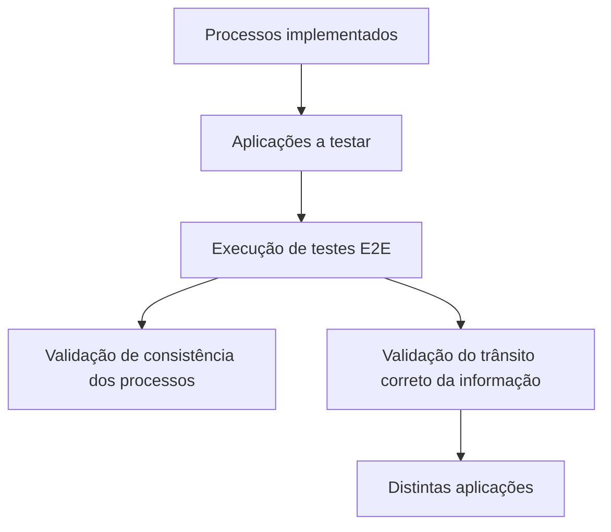
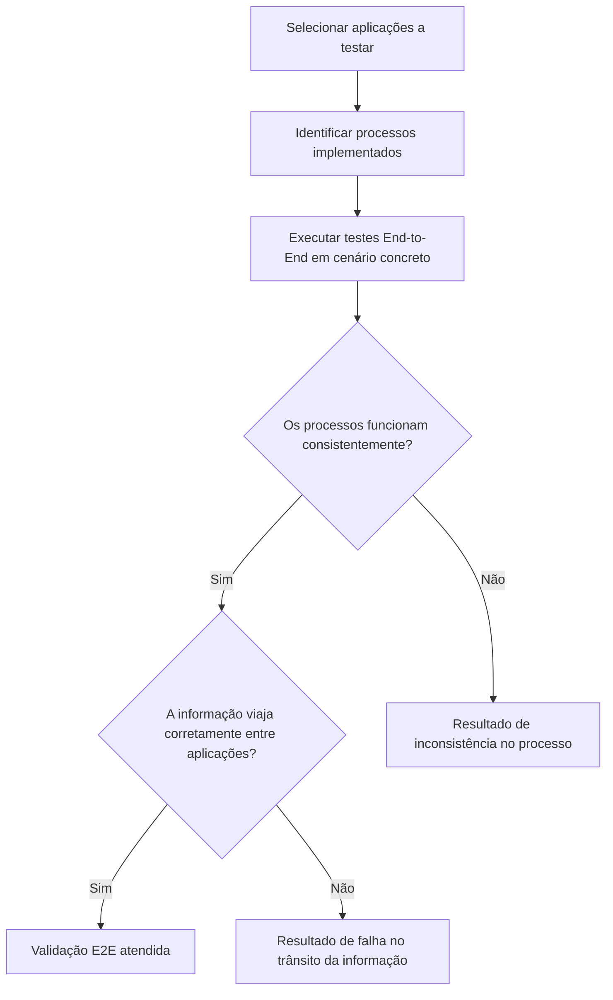

# Certificação de Testing — Testes End-to-End (E2E)

## 1. Metadados do Documento
- **Arquivo de Origem:** `Não identificado`
- **Tipo de Documento:** `Procedimento`
- **Domínio / Sistema:** `Certificación de Testing / Octane`
- **Público-Alvo:** `Desenvolvedores, QA e Operação`
- **Data/Versão Identificada:** `Não identificada`

---

## 2. Resumo Executivo & Contexto de Negócio

O documento apresenta o objetivo do módulo de certificação de testes associado a Octane: compreender como testes End-to-End (E2E) são executados.

Os testes E2E devem validar que os processos implementados pelas aplicações sob teste funcionam de forma consistente em um cenário concreto. A validação cobre a jornada entre diferentes aplicações, não apenas o comportamento isolado de uma aplicação.

O critério funcional explicitamente descrito é assegurar que a informação trafega corretamente pelas distintas aplicações participantes do processo. O documento aponta referências adicionais denominadas `PRUEBAS E2E` e `CF Home Solutions APIs Documentation Zeus EN`.

Não há detalhamento de cenários específicos, aplicações participantes, métodos de teste, contratos de integração, tecnologias, ambientes ou critérios mensuráveis de aprovação.

---

## 3. Arquitetura, Componentes & Tecnologias Envolvidas

| Componente / Termo | Papel identificado no documento |
| :--- | :--- |
| Certificación de Testing | Contexto de certificação apresentado no material. |
| Octane | Termo presente no título do documento. O documento não detalha sua função. |
| Pruebas E2E | Testes destinados a validar a consistência dos processos entre aplicações. |
| Aplicações a testar | Aplicações que implementam os processos submetidos à validação E2E. |
| Informação | Elemento que deve viajar corretamente entre as distintas aplicações. |
| PRUEBAS E2E | Referência indicada para mais informações. |
| CF Home Solutions APIs Documentation Zeus EN | Referência indicada para mais informações. |



**Nota de Análise:** O documento não identifica os nomes das aplicações, interfaces, APIs, ambientes, protocolos, métodos HTTP ou contratos de dados envolvidos no fluxo E2E.

---

## 4. Regras de Negócio, Especificações Funcionais & Processos

### Objetivo do módulo
O módulo tem como finalidade permitir o entendimento de como são executados os testes End-to-End.

### Regras e critérios de validação E2E

1. Os testes E2E devem validar os processos implementados pelas aplicações sob teste.
2. Os processos devem funcionar de maneira consistente.
3. A consistência deve ser avaliada em um cenário concreto.
4. Os testes E2E devem assegurar que a informação viaja corretamente através das distintas aplicações.
5. O escopo descrito contempla a interação entre aplicações, e não somente o teste isolado de uma aplicação.

### Fluxo funcional extraído



**Nota de Análise:** O documento não descreve passos operacionais para selecionar cenários, executar testes, registrar evidências, tratar falhas ou aprovar uma certificação.

---

## 5. Tabelas de Parâmetros, Ambientes e Estruturas de Dados

| Item / Parâmetro | Descrição / Função | Tipo / Valores / Formato | Ambiente / Observações |
| :--- | :--- | :--- | :--- |
| Objetivo do módulo | Entender como são executados os testes End-to-End. | Objetivo funcional | Não informado |
| Testes E2E | Validar processos implementados pelas aplicações a testar. | Tipo de teste | Cenário concreto |
| Consistência | Verificar que os processos funcionam de maneira consistente. | Critério de validação | Não informado |
| Trânsito da informação | Assegurar que a informação viaja corretamente através das distintas aplicações. | Critério de integração | Não informado |
| PRUEBAS E2E | Referência para informação adicional. | Referência documental | Não detalhada |
| CF Home Solutions APIs Documentation Zeus EN | Referência para informação adicional. | Referência documental | Não detalhada |
| Octane | Termo presente no título da certificação. | Sistema ou ferramenta não detalhada | Não informado |

---

## 6. Bateria de Perguntas & Respostas para RAG (FAQ Sintético)

### P1: Qual é a finalidade do módulo de Certificación de Testing - Octane?
**R:** A finalidade do módulo é entender como são executados os testes End-to-End, também identificados como testes E2E.

### P2: O que os testes E2E devem validar segundo o documento?
**R:** Os testes E2E devem validar que os processos implementados pelas aplicações a testar funcionam de maneira consistente.

### P3: Em que contexto os processos devem ser avaliados nos testes E2E?
**R:** Os processos devem ser avaliados em um cenário concreto. O documento não especifica quais cenários devem ser usados.

### P4: Qual é o requisito relativo à informação nos testes E2E?
**R:** Os testes E2E devem assegurar que a informação viaja corretamente através das distintas aplicações participantes do cenário.

### P5: O documento descreve testes unitários ou testes de integração isolados?
**R:** Não. O material trata de testes End-to-End, com foco na validação de processos e no trânsito de informação entre distintas aplicações.

### P6: Quais aplicações participam dos testes E2E?
**R:** O documento menciona “aplicações a testar” e “distintas aplicações”, mas não identifica os nomes, responsabilidades ou interfaces dessas aplicações.

### P7: O documento define critérios quantitativos de aprovação para os testes E2E?
**R:** Não. O material exige consistência dos processos e trânsito correto da informação, mas não apresenta métricas, percentuais, tempos de resposta ou limiares de aprovação.

### P8: Onde buscar mais informações sobre os testes E2E?
**R:** O documento indica as referências `PRUEBAS E2E` e `CF Home Solutions APIs Documentation Zeus EN`, sem fornecer URLs, localização, conteúdo ou instruções de acesso.

### P9: O que significa validar consistência de processos neste documento?
**R:** Significa validar que os processos implementados pelas aplicações sob teste funcionam de maneira consistente dentro de um cenário concreto. O documento não detalha como essa consistência deve ser medida.

### P10: O documento especifica como executar ou automatizar os testes E2E?
**R:** Não. O documento estabelece o objetivo e os critérios gerais dos testes E2E, mas não descreve ferramentas, comandos, automação, dados de teste ou procedimento operacional.

---

## 7. Glossário de Termos, Siglas & Conceitos-Chave

- **E2E:** Abreviação de *End-to-End*; testes que validam processos e o trânsito de informação através de distintas aplicações.
- **Pruebas E2E:** Denominação em espanhol para testes End-to-End.
- **Octane:** Termo presente no título `CERTIFICACIÓN de TESTING - Octane`; sua função não é detalhada no documento.
- **Certificación de Testing:** Contexto de certificação de testes apresentado no material.
- **CF Home Solutions APIs Documentation Zeus EN:** Referência documental citada para obtenção de mais informações; não detalhada.
- **PRUEBAS E2E:** Referência documental citada para obtenção de mais informações; não detalhada.

---

## 8. Notas Críticas, Riscos & Limitações

- O documento não identifica as aplicações que compõem o cenário E2E.
- Não são descritos ambientes, URLs, credenciais, rotas de log, dados de teste ou mecanismos de observabilidade.
- Não há métodos HTTP, contratos JSON, APIs, tecnologias, versões ou ferramentas de automação descritos.
- O termo `Octane` é citado, mas a relação operacional de Octane com a execução ou gestão dos testes não é explicada.
- As referências `PRUEBAS E2E` e `CF Home Solutions APIs Documentation Zeus EN` são mencionadas sem localização ou detalhamento acessível no conteúdo fornecido.
- Não existem critérios objetivos de sucesso, reprovação, tratamento de incidentes ou aprovação da certificação.

---

## 9. Conteúdo Bruto Estruturado (Referência Fiel)

```text
--- [PÁGINA 1 DE 1] ---

CERTIFICACIÓN de TESTING - Octane
OBJETIVO
La finalidad de este módulo es entender cómo se ejecutan las pruebas End to End.
Pruebas E2E
Pruebas E2E
Tendremos que validar que los procesos, que se implementan con las aplicaciones a probar,
funcionan de manera consistente, asegurando que la información viaja correctamente a través de las
distintas aplicaciones en un escenario concreto.
Podemos encontrar más información en: PRUEBAS E2E
 / 
 CF
Home Solutions APIs Documentation Zeus
EN
```
