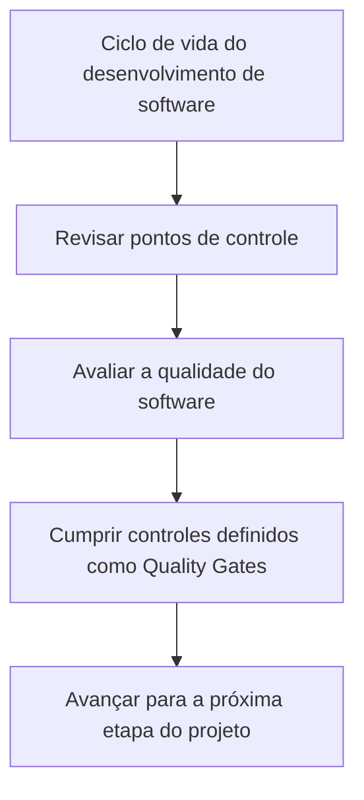

# Certificación de Testing — Plan de Calidad e Quality Gates

## 1. Metadados do Documento
- **Arquivo de Origem:** Não identificado
- **Tipo de Documento:** Procedimento
- **Domínio / Sistema:** Certificación de Testing / Plan de Calidad
- **Público-Alvo:** Equipes de desenvolvimento e qualidade de software
- **Data/Versão Identificada:** Não identificada

---

## 2. Resumo Executivo & Contexto de Negócio

O documento descreve o módulo **“Certificación de Testing - Plan de Calidad”**, cuja finalidade é revisar os pontos de controle presentes no ciclo de vida do desenvolvimento de software.

A revisão de qualidade ocorre antes que o projeto avance para a etapa seguinte. O documento estabelece que a qualidade do software é avaliada durante esses pontos de controle do ciclo de vida.

O processo exige o cumprimento dos controles de qualidade definidos como **Quality Gates**. O documento também aponta referências denominadas **PLAN DE CALIDAD**, **CF**, **Home Solutions APIs Documentation** e **Zeus**, sem explicar o papel, a localização ou o conteúdo de cada referência.

Não há detalhamento sobre critérios de aprovação, responsáveis, ferramentas, etapas do ciclo de vida, evidências de teste ou métricas de qualidade.

---

## 3. Arquitetura, Componentes & Tecnologias Envolvidas

O conteúdo não descreve uma arquitetura de software, componentes técnicos, integrações, microsserviços, tecnologias, ambientes ou fluxos de dados.

O único fluxo explicitamente suportado pelo texto é o controle de qualidade antes da progressão entre etapas do projeto.



| Elemento citado | Classificação suportada pelo texto | Descrição disponível |
| :--- | :--- | :--- |
| Certificación de Testing | Módulo | Módulo relacionado à revisão de controles de qualidade no ciclo de vida de desenvolvimento de software. |
| Plan de Calidad | Referência / tema | O documento menciona o plano de qualidade e os controles de qualidade a serem cumpridos. |
| Quality Gates | Controles de qualidade | Controles definidos que devem ser cumpridos. |
| PLAN DE CALIDAD | Referência citada | Referência indicada para obtenção de mais informações; não há URL ou descrição adicional. |
| CF | Referência citada | Termo citado junto às referências; não detalhado. |
| Home Solutions APIs Documentation | Referência citada | Termo citado junto às referências; não detalhado. |
| Zeus | Referência citada | Termo citado junto às referências; não detalhado. |

> *Nota de Análise: O documento não detalha os critérios, ferramentas, responsáveis ou evidências exigidas pelos Quality Gates.*

---

## 4. Regras de Negócio, Especificações Funcionais & Processos

1. O módulo tem como finalidade revisar pontos de controle no ciclo de vida do desenvolvimento de software.
2. A qualidade do software deve ser avaliada antes do avanço para a próxima etapa do projeto.
3. Os controles de qualidade definidos como **Quality Gates** devem ser cumpridos.
4. O documento indica que mais informações podem ser encontradas nas referências citadas, mas não fornece endereços, instruções de acesso ou conteúdo complementar.

| Regra / Processo | Condição | Resultado ou objetivo |
| :--- | :--- | :--- |
| Revisão de pontos de controle | Durante o ciclo de vida do desenvolvimento de software | Avaliar a qualidade do software. |
| Avaliação de qualidade | Antes de avançar para a etapa seguinte do projeto | Verificar a qualidade antes da progressão do projeto. |
| Cumprimento de Quality Gates | Controles de qualidade definidos | Atender aos controles exigidos pelo Plan de Calidad. |

---

## 5. Tabelas de Parâmetros, Ambientes e Estruturas de Dados

O documento não apresenta parâmetros técnicos, URLs, servidores, ambientes, variáveis, estruturas de dados, campos ou valores de configuração.

| Item / Parâmetro | Descrição / Função | Tipo / Valores / Formato | Ambiente / Observações |
| :--- | :--- | :--- | :--- |
| Quality Gates | Controles de qualidade que devem ser cumpridos | Não especificado | Relacionados ao Plan de Calidad. |
| PLAN DE CALIDAD | Fonte indicada para mais informações | Não especificado | Sem URL, localização ou conteúdo detalhado. |
| CF | Referência citada | Não especificado | Sem expansão da sigla ou contexto adicional. |
| Home Solutions APIs Documentation | Referência citada | Não especificado | Sem URL, localização ou conteúdo detalhado. |
| Zeus | Referência citada | Não especificado | Sem descrição funcional ou técnica. |

---

## 6. Bateria de Perguntas & Respostas para RAG (FAQ Sintético)

### P1: Qual é a finalidade do módulo “Certificación de Testing - Plan de Calidad”?
**R:** A finalidade do módulo é revisar os pontos de controle existentes no ciclo de vida do desenvolvimento de software.

### P2: Em qual momento a qualidade do software é avaliada?
**R:** A qualidade do software é avaliada nos pontos de controle do ciclo de vida do desenvolvimento, antes de o projeto avançar para a etapa seguinte.

### P3: O que são os Quality Gates no contexto do documento?
**R:** Quality Gates são os controles de qualidade definidos que devem ser cumpridos no contexto do Plan de Calidad.

### P4: O projeto pode avançar de etapa antes da avaliação de qualidade?
**R:** O documento informa que a qualidade do software é avaliada antes de avançar para a próxima etapa do projeto. Entretanto, não detalha critérios formais de aprovação ou reprovação.

### P5: Quais controles devem ser atendidos durante o processo de certificação de testing?
**R:** Devem ser cumpridos os controles de qualidade definidos como Quality Gates. O documento não enumera esses controles.

### P6: O documento especifica métricas de qualidade para os Quality Gates?
**R:** Não. O conteúdo apenas informa que existem controles de qualidade definidos como Quality Gates e que eles devem ser cumpridos.

### P7: Onde obter mais informações sobre o Plan de Calidad?
**R:** O documento indica as referências “PLAN DE CALIDAD”, “CF”, “Home Solutions APIs Documentation” e “Zeus”. Não são fornecidos URLs, caminhos de acesso ou detalhes adicionais.

### P8: O documento descreve ferramentas de teste, automação ou tecnologias usadas?
**R:** Não. Não há descrição de ferramentas de teste, automação, tecnologias, linguagens, ambientes ou integrações.

### P9: O documento identifica responsáveis pela avaliação dos pontos de controle?
**R:** Não. O conteúdo não identifica equipes, papéis, responsáveis ou aprovadores dos controles de qualidade.

### P10: O documento detalha as etapas do ciclo de vida de desenvolvimento de software?
**R:** Não. O documento menciona o ciclo de vida do desenvolvimento de software e a passagem para a etapa seguinte do projeto, mas não enumera suas etapas.

---

## 7. Glossário de Termos, Siglas & Conceitos-Chave

- **Certificación de Testing:** Nome do módulo apresentado no documento, voltado à revisão de pontos de controle de qualidade no ciclo de vida de desenvolvimento de software.
- **Plan de Calidad:** Plano de qualidade mencionado como contexto dos controles e Quality Gates.
- **Quality Gates:** Controles de qualidade definidos que devem ser cumpridos antes da progressão no projeto.
- **CF:** Referência citada no documento; o significado não é definido.
- **Home Solutions APIs Documentation:** Referência citada no documento; a finalidade não é detalhada.
- **Zeus:** Referência citada no documento; a finalidade não é detalhada.

---

## 8. Notas Críticas, Riscos & Limitações

- O documento não especifica os critérios concretos dos Quality Gates.
- O documento não informa métricas, evidências, responsáveis, ferramentas ou mecanismos de aprovação.
- Não há detalhamento das etapas do ciclo de vida do desenvolvimento de software.
- As referências “PLAN DE CALIDAD”, “CF”, “Home Solutions APIs Documentation” e “Zeus” não possuem URLs, localização, descrição ou instruções de consulta.
- Não há informações sobre exceções, reprovação, reprocessamento, escalonamento ou tratamento de falhas nos controles de qualidade.

---

## 9. Conteúdo Bruto Estruturado (Referência Fiel)

```text
--- [PÁGINA 1 DE 1] ---

CERTIFICACIÓN de TESTING - Plan de Calidad
OBJETIVO
La finalidad de este módulo es revisar los puntos de control en el ciclo de vida del desarrollo de
software, donde se evalúa la calidad del software antes de avanzar a la siguiente etapa del proyecto.
Plan de Calidad
Plan de Calidad
Tendremos que cumplir con los controles de calidad definidos como Quality Gates.
Podemos encontrar más información en: PLAN DE CALIDAD
 / 
 CF
Home Solutions APIs Documentation Zeus
EN
```
