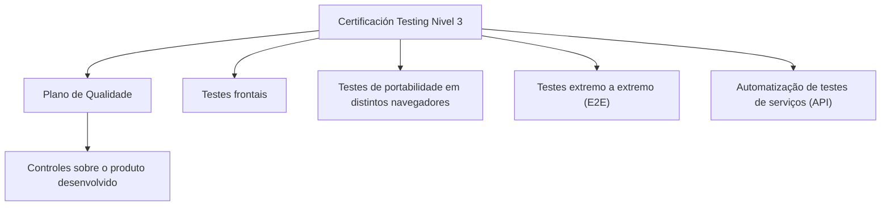

# Certificación — Testing Nivel 3: Plano de Qualidade e Temário de Testes

## 1. Metadados do Documento
- **Arquivo de Origem:** Não identificado
- **Tipo de Documento:** Apresentação Executiva
- **Domínio / Sistema:** Certificación Testing Nivel 3 / Plano de Qualidade
- **Público-Alvo:** Profissionais de qualidade, testes e desenvolvimento
- **Data/Versão Identificada:** Não identificada

---

## 2. Resumo Executivo & Contexto de Negócio

O documento apresenta o tema **“Certificación - Testing Nivel 3”**, associado a um conteúdo de certificação em testes e a um **Plano de Qualidade**. O material descreve áreas de controle aplicadas ao produto desenvolvido dentro de um projeto.

O Plano de Qualidade é apresentado como a seção que detalha os controles realizados sobre o produto durante o desenvolvimento. O texto não identifica critérios de aceite, ferramentas, responsáveis, periodicidade dos controles ou indicadores de qualidade.

O documento também inclui um temário para execução de **testes frontais**, testes de **portabilidade em diferentes navegadores** e testes **end-to-end (E2E)**. Esses testes E2E são descritos como validações de uma funcionalidade completa.

Há ainda uma seção dedicada à **automação de testes de serviços (API)**. O conteúdo informa que essa seção contém um temário para automação de testes de serviços, mas não detalha APIs, métodos HTTP, contratos, ferramentas de automação, ambientes ou evidências esperadas.

---

## 3. Arquitetura, Componentes & Tecnologias Envolvidas

Os elementos explicitamente citados no documento são:

- Certificación Testing Nivel 3.
- Plano de Qualidade.
- Controles sobre produtos desenvolvidos em projetos.
- Testes frontais.
- Testes de portabilidade entre navegadores.
- Testes extremo a extremo (E2E).
- Automação de testes de serviços (API).
- Referências textuais: `CF`, `Home`, `Solutions`, `APIs`, `Documentation`, `Zeus`, `EN`.

> **Nota de Análise:** O documento não descreve uma arquitetura de software, integrações, componentes técnicos, protocolos, tecnologias de implementação ou relações confirmadas entre as referências `CF`, `Home`, `Solutions`, `APIs`, `Documentation` e `Zeus`.



---

## 4. Regras de Negócio, Especificações Funcionais & Processos

### 4.1 Plano de Qualidade
- O Plano de Qualidade contém o detalhe dos controles realizados sobre o produto.
- Os controles são aplicados ao produto desenvolvido dentro de um projeto.
- O documento não especifica quais controles são executados, suas entradas, responsáveis, critérios, frequência, ferramentas ou saídas.

### 4.2 Testes Frontais, Portabilidade e E2E
- O documento apresenta um temário para execução de testes frontais.
- O documento apresenta testes de portabilidade em diferentes navegadores.
- O documento apresenta testes extremo a extremo, identificados pela sigla **E2E**.
- Os testes E2E validam uma funcionalidade completa.
- O texto não informa navegadores-alvo, cenários, massa de dados, critérios de aprovação, evidências, automação ou ambientes de execução.

### 4.3 Automação de Testes de Serviços
- O documento contém um temário para automação de testes de serviços.
- Os serviços são identificados como **API**.
- O documento não detalha endpoints, métodos HTTP, autenticação, contratos JSON, ferramentas, bibliotecas, pipelines ou estratégias de execução da automação.

---

## 5. Tabelas de Parâmetros, Ambientes e Estruturas de Dados

| Item / Parâmetro | Descrição / Função | Tipo / Valores / Formato | Ambiente / Observações |
| :--- | :--- | :--- | :--- |
| Certificación Testing Nivel 3 | Tema principal do documento e conteúdo de certificação em testes. | Título / certificação | Não há versão ou data identificada. |
| Plano de Qualidade | Seção que detalha controles sobre o produto desenvolvido dentro de um projeto. | Processo de qualidade | Os controles não são especificados. |
| Controles de qualidade | Controles realizados sobre o produto desenvolvido. | Não especificado | Não há critérios, responsáveis ou frequência descritos. |
| Testes frontais | Parte do temário de execução de testes. | Tipo de teste | Não há detalhamento funcional ou técnico adicional. |
| Testes de portabilidade | Testes realizados em diferentes navegadores. | Tipo de teste | Navegadores não identificados. |
| Testes E2E | Testes extremo a extremo que validam uma funcionalidade completa. | Tipo de teste | Fluxos, dados e critérios de aprovação não identificados. |
| Automação de testes de serviços | Temário para automação de testes de serviços. | Automação de testes | O documento associa os serviços ao termo API. |
| API | Referência a serviços para os quais há um temário de automação de testes. | Sigla / serviço | Métodos, rotas e contratos não informados. |
| CF | Texto presente no rodapé/referência do documento. | Referência textual | Significado não detalhado. |
| Home | Texto presente no rodapé/referência do documento. | Referência textual | Relação com os demais termos não detalhada. |
| Solutions | Texto presente no rodapé/referência do documento. | Referência textual | Relação com os demais termos não detalhada. |
| APIs | Texto presente no rodapé/referência do documento. | Referência textual | Não há inventário de APIs. |
| Documentation | Texto presente no rodapé/referência do documento. | Referência textual | Não há URL ou localização fornecida. |
| Zeus | Texto presente no rodapé/referência do documento. | Referência textual | Não há descrição de sistema ou componente. |
| EN | Texto presente no rodapé/referência do documento. | Referência textual | Significado não detalhado. |

---

## 6. Bateria de Perguntas & Respostas para RAG (FAQ Sintético)

### P1: Qual é o objetivo do Plano de Qualidade apresentado no documento?
**R:** O Plano de Qualidade apresenta o detalhe dos controles realizados sobre o produto desenvolvido dentro de um projeto. O documento não descreve quais controles específicos são aplicados.

### P2: O que os testes E2E validam segundo o documento?
**R:** Os testes extremo a extremo, ou E2E, validam uma funcionalidade completa.

### P3: Quais modalidades de teste são citadas no temário de execução?
**R:** O documento cita testes frontais, testes de portabilidade em distintos navegadores e testes extremo a extremo (E2E).

### P4: O documento informa quais navegadores devem ser utilizados nos testes de portabilidade?
**R:** Não. O documento informa apenas que existem testes de portabilidade em diferentes navegadores, sem identificar os navegadores-alvo.

### P5: Qual é o escopo da seção de automação de testes de serviços?
**R:** A seção contém um temário para automação de testes de serviços, identificados no documento pela referência a API. Não há detalhes sobre endpoints, métodos HTTP, contratos ou ferramentas.

### P6: O documento descreve endpoints ou contratos JSON das APIs?
**R:** Não. O documento cita automação de testes de serviços (API), mas não detalha métodos HTTP, endpoints, contratos JSON, autenticação ou payloads.

### P7: Existem critérios de aceite ou métricas de qualidade definidos?
**R:** Não. O documento menciona controles de qualidade sobre o produto, mas não apresenta métricas, critérios de aceite, indicadores ou condições de aprovação.

### P8: Qual é a relação entre a Certificación Testing Nivel 3 e o Plano de Qualidade?
**R:** O Plano de Qualidade é apresentado como uma seção dentro do conteúdo de Certificación Testing Nivel 3, dedicada ao detalhamento dos controles realizados sobre o produto desenvolvido em um projeto.

### P9: O documento apresenta uma arquitetura técnica ou fluxo de integração entre sistemas?
**R:** Não. O documento não fornece uma arquitetura técnica, interfaces, integrações, servidores, ambientes ou fluxos de comunicação entre componentes.

### P10: O que significam CF, Home, Solutions, APIs, Documentation, Zeus e EN?
**R:** Esses termos aparecem como referências textuais no documento, mas seus significados e relações não são explicados. Não é possível atribuir definições adicionais sem extrapolar o conteúdo-fonte.

---

## 7. Glossário de Termos, Siglas & Conceitos-Chave

- **API:** Termo associado a serviços cujo temário de automação de testes é mencionado no documento. O significado expandido não é fornecido no texto.
- **E2E:** Sigla usada para “pruebas extremo a extremo”, testes que validam uma funcionalidade completa.
- **Plano de Qualidade:** Seção que reúne o detalhe dos controles realizados sobre o produto desenvolvido em um projeto.
- **Portabilidade:** Testes executados em diferentes navegadores, conforme apresentado no documento.
- **Testes frontais:** Modalidade de testes incluída no temário de execução.
- **CF:** Referência textual presente no documento, sem definição fornecida.
- **Zeus:** Referência textual presente no documento, sem definição fornecida.

---

## 8. Notas Críticas, Riscos & Limitações

- O conteúdo é resumido e não contém detalhamento operacional suficiente para execução direta de testes.
- Não há critérios de aceite, cobertura esperada, evidências obrigatórias, responsáveis ou métricas de qualidade.
- Não foram identificados ambientes, URLs, servidores, credenciais, rotas de logs ou pipelines de CI/CD.
- Os testes de portabilidade não especificam navegadores, versões ou plataformas.
- A automação de testes de API não apresenta ferramentas, contratos, endpoints, estratégias de autenticação ou mecanismos de execução.
- A segunda página não contém conteúdo textual utilizável, sendo descrita como página em branco ou composta apenas por elementos visuais/imagem.
- As referências `CF`, `Home`, `Solutions`, `APIs`, `Documentation`, `Zeus` e `EN` não possuem explicação contextual adicional.

---

## 9. Conteúdo Bruto Estruturado (Referência Fiel)

```text
--- [PÁGINA 1 DE 2] ---

CERTIFICACIÓN - TESTING NIVEL 3
CERTIFICACIÓN Testing
nivel 3
PLAN DE CALIDAD
En este apartado se encuentra el detalle de
los controles, que se realizan sobre el
producto que se desarrolla dentro de un
proyecto
PRUEBAS FRONTAL, PORTABILIDAD Y
E2E
En este apartado se encuentra el temario
para la ejecución de pruebas de frontal, de
portabilidad en distintos navegadores y de
pruebas extremo a extremo que validan una
funcionalidad completa
AUTOMATIZACIÓN DE PRUEBAS DE
SERVICIOS (API)
En este apartado se encuentra el temario
para la automatización de pruebas de
servicios
 /
 CF
Home Solutions APIs Documentation Zeus
EN

--- [PÁGINA 2 DE 2] ---

[Página em branco ou apenas elementos visuais/imagem]
```
