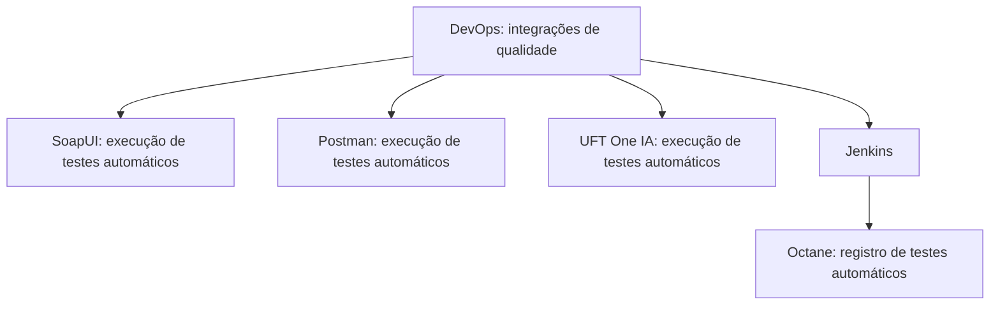

# Certificación de Testing — Integraciones de Calidad en DevOps

## 1. Metadados do Documento
- **Arquivo de Origem:** Não identificado no conteúdo fornecido
- **Tipo de Documento:** Apresentação Executiva / Material de Certificação
- **Domínio / Sistema:** Testing em DevOps; integrações de qualidade
- **Público-Alvo:** Desenvolvedores, equipes de Qualidade, operação de testes e usuários de DevOps
- **Data/Versão Identificada:** Não identificada

---

## 2. Resumo Executivo & Contexto de Negócio

O documento apresenta um módulo de certificação de testing focado na revisão das integrações de qualidade disponíveis em DevOps. O objetivo declarado é abordar ferramentas e mecanismos relacionados à execução e ao registro de testes automáticos.

As integrações de qualidade listadas são SoapUI, Postman, UFT One IA e registro em Octane. SoapUI, Postman e UFT One IA são associados à execução de testes automáticos. O registro em Octane é associado ao registro de testes automáticos realizados por meio de Jenkins.

O material também referencia fontes adicionais de informação para cada integração: SOAPUI, POSTMAN, UFT ONE IA e REGISTRO OCTANE. O conteúdo fornecido não apresenta URLs, procedimentos de configuração, contratos de integração, credenciais, versões de ferramentas ou detalhes técnicos desses materiais referenciados.

O contexto exibido inclui os termos “CF”, “Home Solutions APIs Documentation” e “Zeus”, sem explicação adicional sobre seu significado, vínculo arquitetural ou papel no processo de testes.

---

## 3. Arquitetura, Componentes & Tecnologias Envolvidas

| Componente / Tecnologia | Papel explicitamente descrito |
| :--- | :--- |
| DevOps | Contexto no qual as integrações de qualidade estão disponíveis. |
| SoapUI | Execução de testes automáticos. |
| Postman | Execução de testes automáticos. |
| UFT One IA | Execução de testes automáticos. |
| Jenkins | Meio utilizado para registrar testes automáticos em Octane. |
| Octane | Destino do registro de testes automáticos executados através de Jenkins. |
| CF | Termo citado sem detalhamento. |
| Home Solutions APIs Documentation | Termo citado sem detalhamento. |
| Zeus | Termo citado sem detalhamento. |



**Nota de Análise:** o documento não especifica como SoapUI, Postman ou UFT One IA se conectam ao Jenkins ou ao Octane. O único fluxo de integração explicitamente descrito é o registro de testes automáticos através de Jenkins em Octane.

---

## 4. Regras de Negócio, Especificações Funcionais & Processos

### Objetivo do módulo
- Revisar as integrações de qualidade disponíveis em DevOps.

### Execução de testes automáticos
- SoapUI é apresentado como ferramenta para execução de testes automáticos.
- Postman é apresentado como ferramenta para execução de testes automáticos.
- UFT One IA é apresentado como ferramenta para execução de testes automáticos.

### Registro de testes automáticos
- Os testes automáticos podem ser registrados em Octane através de Jenkins.

### Referências adicionais indicadas
- Para SoapUI, o documento indica uma referência denominada `SOAPUI`.
- Para Postman, o documento indica uma referência denominada `POSTMAN`.
- Para UFT One IA, o documento indica uma referência denominada `UFT ONE IA`.
- Para o registro em Octane, o documento indica uma referência denominada `REGISTRO OCTANE`.

**Nota de Análise:** o documento não detalha critérios de aprovação, dados de entrada, cenários de teste, tipos de protocolo, métodos HTTP, pipelines Jenkins, plugins, jobs, autenticação, endpoints ou campos registrados no Octane.

---

## 5. Tabelas de Parâmetros, Ambientes e Estruturas de Dados

| Item / Parâmetro | Descrição / Função | Tipo / Valores / Formato | Ambiente / Observações |
| :--- | :--- | :--- | :--- |
| SoapUI | Execução de testes automáticos | Ferramenta de teste | O documento aponta referência adicional: `SOAPUI`. |
| Postman | Execução de testes automáticos | Ferramenta de teste | O documento aponta referência adicional: `POSTMAN`. |
| UFT One IA | Execução de testes automáticos | Ferramenta de teste | O documento aponta referência adicional: `UFT ONE IA`. |
| Jenkins | Viabiliza o registro de testes automáticos em Octane | Ferramenta citada no fluxo de registro | Não são informados jobs, pipelines, agentes, plugins ou configurações. |
| Octane | Recebe o registro de testes automáticos através de Jenkins | Sistema de registro de testes | O documento aponta referência adicional: `REGISTRO OCTANE`. |
| CF | Não detalhado | Termo citado | Aparece junto a “Home Solutions APIs Documentation” e “Zeus”. |
| Home Solutions APIs Documentation | Não detalhado | Termo citado | Não há descrição de conteúdo, URL ou relação com as ferramentas de teste. |
| Zeus | Não detalhado | Termo citado | Não há descrição de função, arquitetura ou integração. |

---

## 6. Bateria de Perguntas & Respostas para RAG (FAQ Sintético)

### P1: Qual é a finalidade do módulo “Certificación de Testing - Testing en DevOps”?
**R:** A finalidade declarada do módulo é revisar as integrações de qualidade disponíveis em DevOps.

### P2: Quais integrações de qualidade são apresentadas no documento?
**R:** O documento apresenta SoapUI, Postman, UFT One IA e o registro em Octane como tópicos do módulo de testing em DevOps.

### P3: Qual ferramenta é indicada para executar testes automáticos?
**R:** O documento indica que SoapUI permite a execução de testes automáticos.

### P4: O Postman é citado para qual finalidade no módulo?
**R:** Postman é citado para a execução de testes automáticos.

### P5: Qual é a função do UFT One IA segundo o conteúdo fornecido?
**R:** UFT One IA é apresentado como ferramenta para execução de testes automáticos.

### P6: Como os testes automáticos são registrados em Octane?
**R:** O documento informa que os testes automáticos são registrados em Octane através de Jenkins.

### P7: O documento informa quais pipelines ou jobs Jenkins devem ser usados para registrar testes no Octane?
**R:** Não. O documento apenas afirma que o registro de testes automáticos ocorre através de Jenkins em Octane, sem detalhar pipelines, jobs, plugins, configurações ou parâmetros.

### P8: Há links ou URLs para a documentação de SoapUI, Postman, UFT One IA e registro no Octane?
**R:** Não há URLs explícitas no conteúdo fornecido. O documento apenas menciona referências denominadas `SOAPUI`, `POSTMAN`, `UFT ONE IA` e `REGISTRO OCTANE`.

### P9: O documento descreve métodos HTTP, contratos de API ou coleções Postman?
**R:** Não. Embora Postman e “Home Solutions APIs Documentation” sejam citados, o material não descreve métodos HTTP, contratos JSON, endpoints, coleções ou variáveis de ambiente.

### P10: Qual é o papel do Octane no fluxo descrito?
**R:** Octane é o sistema em que os testes automáticos são registrados através de Jenkins.

### P11: O que significam os termos CF e Zeus no contexto do documento?
**R:** O conteúdo fornecido apenas cita `CF` e `Zeus`, sem definir seus significados, responsabilidades ou relações com DevOps, Jenkins, Octane ou as ferramentas de teste.

---

## 7. Glossário de Termos, Siglas & Conceitos-Chave

- **DevOps:** Contexto no qual o documento declara existirem integrações de qualidade.
- **SoapUI:** Ferramenta citada para execução de testes automáticos.
- **Postman:** Ferramenta citada para execução de testes automáticos.
- **UFT One IA:** Ferramenta citada para execução de testes automáticos.
- **Jenkins:** Ferramenta citada como meio para registro de testes automáticos em Octane.
- **Octane:** Sistema citado como destino do registro de testes automáticos realizados através de Jenkins.
- **CF:** Termo citado sem definição no conteúdo fornecido.
- **Home Solutions APIs Documentation:** Termo citado sem explicação adicional no conteúdo fornecido.
- **Zeus:** Termo citado sem definição no conteúdo fornecido.

---

## 8. Notas Críticas, Riscos & Limitações

- O documento tem caráter resumido e não fornece detalhamento técnico das integrações.
- Não são identificados arquivo de origem, autor, data, versão ou URL de documentação.
- Não são informados métodos HTTP, contratos de API, formatos de payload, credenciais, permissões, topologia de ambientes ou configurações de rede.
- Não são descritos jobs, pipelines, plugins, agentes, gatilhos ou regras de falha para Jenkins.
- Não são definidos os dados, resultados, campos ou status que Jenkins deve registrar em Octane.
- Os termos `CF`, `Home Solutions APIs Documentation` e `Zeus` são citados sem contexto suficiente para definição confiável.
- **Nota de Análise:** o documento lista SoapUI, Postman e UFT One IA, mas não detalha procedimentos de instalação, configuração, execução ou integração dessas ferramentas.

---

## 9. Conteúdo Bruto Estruturado (Referência Fiel)

```text
--- [PÁGINA 1 DE 2] ---

CERTIFICACIÓN de TESTING - Testing en
DevOps
OBJETIVO
La finalidad de este módulo es repasar las integraciones de Calidad disponibles en DevOps.
SoapUI
Postman
UFT One IA
Registro en Octane
SoapUI
Ejecución de pruebas automáticas con SoapUI.
Podemos encontrar más información en: SOAPUI
Postman
Ejecución de pruebas automáticas con Postman.
Podemos encontrar más información en: POSTMAN
 /
 CF
Home Solutions APIs Documentation Zeus
EN


--- [PÁGINA 2 DE 2] ---

UFT One IA
Ejecución de pruebas automáticas con UFT One IA.
Podemos encontrar más información en: UFT ONE IA
Registro en Octane
Registro de pruebas automáticas a través de Jenkins en Octane.
Podemos encontrar más información en: REGISTRO OCTANE
```
