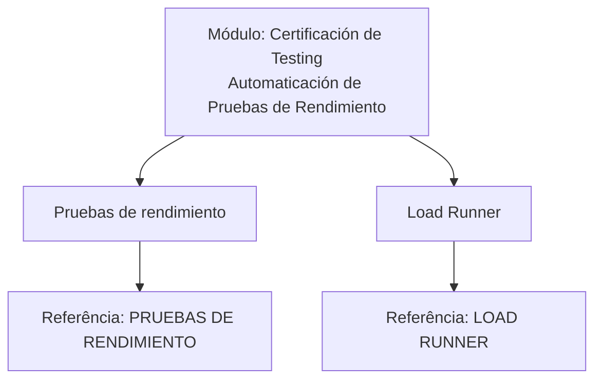

# Certificación de Testing — Automatização de Testes de Desempenho com Load Runner

## 1. Metadados do Documento
- **Arquivo de Origem:** `Não identificado no texto fornecido`
- **Tipo de Documento:** `Material de certificação / módulo de treinamento`
- **Domínio / Sistema:** `Testing — testes de desempenho e Load Runner`
- **Público-Alvo:** `Profissionais envolvidos em testes e certificação`
- **Data/Versão Identificada:** `Não identificada`

---

## 2. Resumo Executivo & Contexto de Negócio

O documento apresenta um módulo denominado **“Certificación de Testing - Automaticación de Pruebas de Rendimiento”**. O propósito declarado é capacitar o leitor a compreender o conceito de testes de desempenho e revisar as funcionalidades disponibilizadas pela ferramenta **Load Runner**.

O conteúdo está estruturado em dois tópicos principais: **Pruebas de rendimiento** e **Load Runner**. O primeiro tópico trata da revisão conceitual sobre em que consistem os testes de desempenho. O segundo tópico trata da revisão da funcionalidade da ferramenta Load Runner.

O documento também aponta referências adicionais para aprofundamento: **PRUEBAS DE RENDIMIENTO** para o tema de testes de desempenho e **LOAD RUNNER** para o tema da ferramenta. O texto fornecido não especifica métricas, cenários de carga, métodos de automação, versões da ferramenta, contratos técnicos ou procedimentos operacionais.

O rodapé menciona os termos **CF**, **Home Solutions**, **APIs Documentation**, **Zeus** e o idioma **EN**, mas não explica a relação desses elementos com o módulo de certificação ou com os testes de desempenho.

---

## 3. Arquitetura, Componentes & Tecnologias Envolvidas

Os elementos explicitamente citados no documento são:

| Componente / Termo | Papel identificado no documento |
| :--- | :--- |
| Certificación de Testing | Contexto de certificação associado ao módulo apresentado. |
| Automaticación de Pruebas de Rendimiento | Tema indicado no título do módulo. |
| Pruebas de rendimiento | Tópico destinado à revisão conceitual sobre testes de desempenho. |
| Load Runner | Ferramenta cuja funcionalidade será revisada. |
| PRUEBAS DE RENDIMIENTO | Referência indicada para obter mais informações sobre testes de desempenho. |
| LOAD RUNNER | Referência indicada para obter mais informações sobre a ferramenta Load Runner. |
| CF | Termo exibido no rodapé, sem explicação adicional. |
| Home Solutions | Termo exibido no rodapé, sem explicação adicional. |
| APIs Documentation | Termo exibido no rodapé, sem explicação adicional. |
| Zeus | Termo exibido no rodapé, sem explicação adicional. |
| EN | Indicador exibido no rodapé, possivelmente relacionado ao idioma; não detalhado. |



> **Nota de Análise:** O documento não descreve arquitetura de software, integrações, APIs, ambientes, servidores, fluxos de dados ou componentes técnicos além dos tópicos de treinamento e da menção à ferramenta Load Runner.

---

## 4. Regras de Negócio, Especificações Funcionais & Processos

### Objetivo do módulo

A finalidade declarada do módulo é:

1. Entender em que consistem as **pruebas de rendimiento**.
2. Revisar as funcionalidades oferecidas pela ferramenta **Load Runner**.

### Estrutura temática

#### Pruebas de rendimiento
- O documento informa que será revisado em que consistem os testes de desempenho.
- O documento direciona o leitor à referência **PRUEBAS DE RENDIMIENTO** para obter informações adicionais.
- Não são descritos tipos de teste, critérios de aceite, indicadores de desempenho, volumes de carga, tempos de resposta, níveis de concorrência ou ferramentas complementares.

#### Load Runner
- O documento informa que será revisada a funcionalidade da ferramenta Load Runner.
- O documento direciona o leitor à referência **LOAD RUNNER** para obter informações adicionais.
- Não são detalhadas funcionalidades específicas, configuração, execução, relatórios, licenciamento, versões ou integrações da ferramenta.

> **Nota de Análise:** O documento é introdutório e não apresenta regras de negócio, procedimentos executáveis, parâmetros técnicos ou especificações funcionais detalhadas.

---

## 5. Tabelas de Parâmetros, Ambientes e Estruturas de Dados

| Item / Parâmetro | Descrição / Função | Tipo / Valores / Formato | Ambiente / Observações |
| :--- | :--- | :--- | :--- |
| Objetivo do módulo | Entender testes de desempenho e revisar funcionalidades de Load Runner. | Objetivo educacional. | Não há ambiente identificado. |
| Pruebas de rendimiento | Tema de revisão sobre o que são testes de desempenho. | Tópico de treinamento. | Referência adicional: `PRUEBAS DE RENDIMIENTO`. |
| Load Runner | Ferramenta cuja funcionalidade será revisada. | Ferramenta de testes, conforme contexto do módulo. | Referência adicional: `LOAD RUNNER`. |
| CF | Termo presente no rodapé. | Não especificado. | Sem detalhamento no documento. |
| Home Solutions | Termo presente no rodapé. | Não especificado. | Sem detalhamento no documento. |
| APIs Documentation | Termo presente no rodapé. | Não especificado. | Sem detalhamento no documento. |
| Zeus | Termo presente no rodapé. | Não especificado. | Sem detalhamento no documento. |
| EN | Indicador presente no rodapé. | Não especificado. | Sem detalhamento no documento. |

---

## 6. Bateria de Perguntas & Respostas para RAG (FAQ Sintético)

### P1: Qual é a finalidade do módulo “Certificación de Testing - Automaticación de Pruebas de Rendimiento”?
**R:** A finalidade do módulo é entender em que consistem as provas ou testes de desempenho e revisar as funcionalidades fornecidas pela ferramenta Load Runner.

### P2: Quais são os dois temas principais apresentados no módulo?
**R:** Os dois temas principais são **Pruebas de rendimiento**, dedicado à revisão sobre testes de desempenho, e **Load Runner**, dedicado à revisão da funcionalidade da ferramenta Load Runner.

### P3: O que o documento afirma que será revisado no tópico “Pruebas de rendimiento”?
**R:** O documento afirma que será revisado em que consistem as provas de desempenho. Não apresenta métricas, critérios, cenários ou procedimentos técnicos adicionais.

### P4: Onde o documento orienta buscar mais informações sobre testes de desempenho?
**R:** O documento indica a referência denominada **PRUEBAS DE RENDIMIENTO** para obter mais informações sobre testes de desempenho.

### P5: O que será revisado no tópico Load Runner?
**R:** O documento informa que será revisada a funcionalidade da ferramenta Load Runner. As funcionalidades específicas não são enumeradas no texto fornecido.

### P6: Onde o documento orienta buscar mais informações sobre a ferramenta Load Runner?
**R:** O documento indica a referência denominada **LOAD RUNNER** para obter mais informações sobre a ferramenta Load Runner.

### P7: O documento descreve como configurar ou executar testes de desempenho?
**R:** Não. O texto fornecido limita-se a declarar que o módulo revisará o conceito de testes de desempenho e a funcionalidade da ferramenta Load Runner.

### P8: O documento apresenta métricas de desempenho, metas de tempo de resposta ou volumes de usuários?
**R:** Não. Não há métricas, metas, valores de carga, níveis de concorrência, tempos de resposta ou critérios de aprovação identificados no conteúdo.

### P9: O documento define uma arquitetura de integração para Load Runner?
**R:** Não. O documento não descreve arquitetura, integrações, APIs, servidores, ambientes ou fluxos de dados relacionados ao Load Runner.

### P10: Quais termos adicionais aparecem no rodapé do material?
**R:** O rodapé apresenta os termos **CF**, **Home Solutions**, **APIs Documentation**, **Zeus** e **EN**. O texto não define esses termos nem descreve suas relações com o módulo.

---

## 7. Glossário de Termos, Siglas & Conceitos-Chave

- **APIs Documentation:** Termo exibido no rodapé; não definido no documento.
- **Automaticación de Pruebas de Rendimiento:** Expressão presente no título do módulo, associada ao contexto de automatização de testes de desempenho.
- **CF:** Sigla ou termo exibido no rodapé; significado não informado.
- **EN:** Indicador exibido no rodapé; significado não detalhado no documento.
- **Home Solutions:** Termo exibido no rodapé; significado não informado.
- **Load Runner:** Ferramenta cuja funcionalidade será revisada no módulo.
- **PRUEBAS DE RENDIMIENTO:** Referência indicada para mais informações sobre testes de desempenho.
- **Pruebas de rendimiento:** Tema do módulo relativo ao entendimento de testes de desempenho.
- **Zeus:** Termo exibido no rodapé; significado não informado.

---

## 8. Notas Críticas, Riscos & Limitações

- O texto fornecido contém apenas uma apresentação introdutória do módulo e não detalha procedimentos técnicos de execução de testes de desempenho.
- Não são identificados ambientes, URLs, servidores, credenciais, versões de software, requisitos de infraestrutura ou configurações de Load Runner.
- Não há definições de métricas, SLAs, SLOs, critérios de aceite, perfis de carga, cenários de teste ou formatos de relatório.
- Os termos **CF**, **Home Solutions**, **APIs Documentation**, **Zeus** e **EN** são apresentados sem contexto suficiente para definição confiável.
- **Nota de Análise:** O documento menciona Load Runner, mas não detalha métodos, scripts, protocolos, contratos, dashboards ou funcionalidades concretas da ferramenta.

---

## 9. Conteúdo Bruto Estruturado (Referência Fiel)

```text
--- [PÁGINA 1 DE 1] ---

CERTIFICACIÓN de TESTING - Automaticación
de Pruebas de Rendimiento
OBJETIVO
La finalidad de este módulo es entender en qué consisten las pruebas de rendimiento, y repasar las
funcionalidades que proporciona la herramienta Load Runner.
Pruebas de rendimiento
Load Runner
Pruebas de rendimiento
Se revisará en qué consisten las pruebas de rendimiento.
Podemos encontrar más información en: PRUEBAS DE RENDIMIENTO
Load Runner
Se revisará la funcionalidad de la herramienta Load Runner.
Podemos encontrar más información en: LOAD RUNNER
 / 
 CF
Home Solutions APIs Documentation Zeus
EN
```
