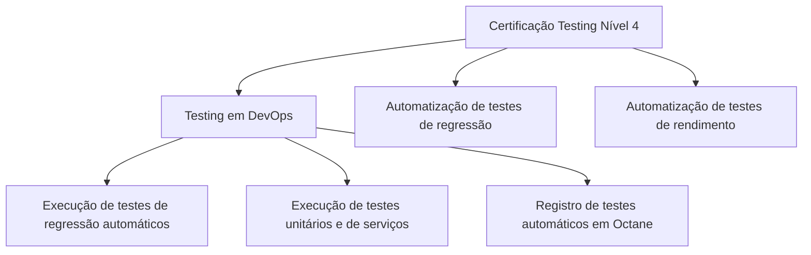

# Certificação Testing Nível 4 — Temário de Testes em DevOps

## 1. Metadados do Documento
- **Arquivo de Origem:** Não identificado
- **Tipo de Documento:** Apresentação Executiva
- **Domínio / Sistema:** Certificação Testing Nível 4 / DevOps
- **Público-Alvo:** Profissionais envolvidos em testes, DevOps e certificação
- **Data/Versão Identificada:** Nível 4; demais informações não identificadas

---

## 2. Resumo Executivo & Contexto de Negócio

O documento apresenta o tema **“Certificación - Testing Nivel 4”**, com foco em práticas de testes no contexto de **DevOps**. O conteúdo indica um temário destinado a apoiar a execução de atividades relacionadas a testes automatizados e ao respectivo registro em Octane.

No escopo de **Testing en DevOps**, o documento cita três atividades: execução de testes de regressão automáticos, execução de testes unitários e de serviços, e registro de testes automáticos em Octane. O material não detalha ferramentas, pipelines, critérios de aprovação, contratos de serviço ou procedimentos operacionais para essas atividades.

O documento também apresenta dois blocos temáticos adicionais: **automatização de testes de regressão** e **automatização de testes de rendimento**. Ambos são descritos como seções que contêm um temário para automação, sem conteúdo técnico adicional no trecho fornecido.

A referência visual inclui os termos **“Home Solutions APIs Documentation Zeus”**, mas não explica a relação desses elementos com a certificação, DevOps, Octane ou os fluxos de teste.

---

## 3. Arquitetura, Componentes & Tecnologias Envolvidas

Os elementos identificados no documento são:

| Componente / Termo | Papel identificado no documento | Detalhamento disponível |
| :--- | :--- | :--- |
| Certificación Testing Nivel 4 | Tema central do material | O documento não descreve requisitos, avaliação ou critérios da certificação. |
| DevOps | Contexto das atividades de teste | São citadas execução de testes e registro de testes automáticos. |
| Testes de regressão automáticos | Atividade e tema de automação | Não são detalhados cenários, ferramentas ou gatilhos de execução. |
| Testes unitários | Atividade de testes em DevOps | Não são detalhadas linguagens, frameworks ou métricas. |
| Testes de serviços | Atividade de testes em DevOps | Não são detalhados protocolos, endpoints ou contratos. |
| Octane | Destino de registro de testes automáticos | O documento não identifica configurações, projetos ou fluxo de integração. |
| Testes de rendimento | Tema de automação | Não são informadas métricas, carga, volumes ou ferramentas. |
| Home Solutions APIs Documentation Zeus | Termos exibidos no material | A relação funcional entre esses termos não é explicada. |



**Nota de Análise:** O diagrama representa somente as relações temáticas explicitamente apresentadas. O documento não descreve uma arquitetura de software, integrações técnicas, APIs, ambientes ou pipeline de CI/CD.

---

## 4. Regras de Negócio, Especificações Funcionais & Processos

O conteúdo extraído não apresenta regras de negócio formais, fórmulas, condições de validação, critérios de aceite ou fluxos operacionais detalhados.

As atividades e processos explicitamente mencionados são:

1. Consultar o temário associado a **Testing en DevOps**.
2. Executar **testes de regressão automáticos**.
3. Executar **testes unitários e de serviços**.
4. Registrar **testes automáticos em Octane**.
5. Consultar o temário de **automatização de testes de regressão**.
6. Consultar o temário de **automatização de testes de rendimento**.

**Nota de Análise:** O documento não especifica a sequência obrigatória entre a execução dos testes e o registro em Octane. Também não informa responsáveis, entradas, saídas, periodicidade, critérios de sucesso, evidências ou tratamento de falhas.

---

## 5. Tabelas de Parâmetros, Ambientes e Estruturas de Dados

| Item / Parâmetro | Descrição / Função | Tipo / Valores / Formato | Ambiente / Observações |
| :--- | :--- | :--- | :--- |
| Nível da certificação | Nível indicado no título do material | `4` | Certificación Testing Nivel 4 |
| Contexto de testes | Área que contém temário para atividades de teste | Testing en DevOps | Não detalhado |
| Testes de regressão | Execução de testes de regressão automáticos | Teste automatizado | Ferramentas e cenários não identificados |
| Testes unitários | Execução de testes unitários | Teste | Frameworks e linguagens não identificados |
| Testes de serviços | Execução de testes de serviços | Teste | Protocolos e contratos não identificados |
| Registro de testes | Registro de testes automáticos | Registro em Octane | Processo de integração não identificado |
| Automação de regressão | Temário para automatização de testes de regressão | Tema de capacitação | Sem detalhamento adicional |
| Automação de rendimento | Temário para automatização de testes de rendimento | Tema de capacitação | Sem métricas ou ferramentas informadas |
| Home Solutions APIs Documentation Zeus | Referência textual exibida no documento | Texto / possível referência de navegação | Relação com o conteúdo não detalhada |
| Idioma do conteúdo | Idioma predominante do texto extraído | Espanhol | Metadados estruturados gerados em português |

---

## 6. Bateria de Perguntas & Respostas para RAG (FAQ Sintético)

### P1: Qual é o tema principal do documento?
**R:** O documento trata da **Certificación Testing Nivel 4**, apresentando temas relacionados a testes no contexto de DevOps, automação de testes de regressão e automação de testes de rendimento.

### P2: Quais atividades de teste são citadas na seção “Testing en DevOps”?
**R:** A seção “Testing en DevOps” cita a execução de testes de regressão automáticos, a execução de testes unitários e de serviços, e o registro de testes automáticos em Octane.

### P3: O documento informa quais ferramentas devem ser usadas para testes de regressão automatizados?
**R:** Não. O documento afirma que existe um temário para automação de testes de regressão, mas não identifica ferramentas, frameworks, linguagens, cenários ou comandos de execução.

### P4: Qual é o papel do Octane no conteúdo apresentado?
**R:** Octane é citado como o local ou mecanismo para o **registro de testes automáticos**. O documento não detalha como esse registro é realizado, quais campos devem ser preenchidos ou como ocorre a integração com ferramentas de teste.

### P5: O material descreve testes unitários e testes de serviços?
**R:** O material apenas menciona a execução de testes unitários e de serviços como atividades no contexto de DevOps. Não há descrição de escopo, contratos, endpoints, tecnologias ou critérios de aprovação.

### P6: O que o documento informa sobre automação de testes de rendimento?
**R:** O documento informa que existe um temário para a automatização de testes de rendimento. Não apresenta métricas de desempenho, objetivos de carga, volumes de usuários, tempos de resposta ou ferramentas.

### P7: Existe um pipeline de CI/CD descrito no documento?
**R:** Não. Embora o documento esteja contextualizado em DevOps, o trecho fornecido não descreve etapas de CI/CD, repositórios, gatilhos, builds, deploys, ambientes ou mecanismos de aprovação.

### P8: Quais detalhes da certificação Testing Nível 4 estão disponíveis?
**R:** Está disponível apenas a identificação da certificação como “Testing Nivel 4” e a apresentação de temas ligados a testes em DevOps, automação de regressão e automação de rendimento. O documento não informa pré-requisitos, duração, avaliação, critérios de aprovação ou emissor da certificação.

### P9: Qual é a relação entre “Home Solutions APIs Documentation Zeus” e os testes descritos?
**R:** O texto extraído exibe “Home Solutions APIs Documentation Zeus”, mas não explica sua relação com a certificação, os testes, DevOps ou Octane. Não é possível inferir uma integração ou dependência técnica a partir do conteúdo disponível.

---

## 7. Glossário de Termos, Siglas & Conceitos-Chave

- **DevOps:** Contexto citado para execução de testes de regressão automáticos, testes unitários e de serviços, e registro de testes automáticos em Octane. O documento não expande formalmente o termo.
- **Octane:** Plataforma ou destino mencionado para o registro de testes automáticos; o documento não fornece detalhamento operacional.
- **Teste de regressão:** Tipo de teste citado no documento, com referência à execução automática e à automatização.
- **Teste unitário:** Tipo de teste citado como parte das atividades de Testing em DevOps.
- **Teste de serviços:** Tipo de teste citado como parte das atividades de Testing em DevOps.
- **Teste de rendimento:** Tipo de teste para o qual o documento menciona um temário de automatização.
- **Home Solutions APIs Documentation Zeus:** Conjunto de termos exibido no documento sem definição ou contexto adicional.

---

## 8. Notas Críticas, Riscos & Limitações

- O conteúdo disponível é resumido e não apresenta detalhamento técnico operacional.
- Não há informações sobre ferramentas de automação, frameworks de teste, linguagens, repositórios, pipelines ou ambientes.
- Não foram identificados endpoints, métodos HTTP, contratos JSON, URLs, portas, credenciais ou parâmetros de execução.
- O documento cita Octane, mas não explica a configuração, o processo de registro ou a rastreabilidade dos testes automáticos.
- O material menciona testes de rendimento sem definir indicadores, limiares, carga esperada ou critérios de aprovação.
- **Nota de Análise:** O documento lista “Home Solutions APIs Documentation Zeus”, porém não detalha o significado desses termos nem sua relação com os processos de teste apresentados.
- A segunda página não contém texto técnico adicional extraível, sendo descrita como página em branco ou composta apenas por elementos visuais/imagem.

---

## 9. Conteúdo Bruto Estruturado (Referência Fiel)

```text
--- [PÁGINA 1 DE 2] ---

CERTIFICACIÓN - TESTING NIVEL 4
CERTIFICACIÓN Testing
nivel 4
TESTING EN DEVOPS
En este apartado se encuentra el temario
para poder realizar las siguientes tareas en
DevOps: ejecución de pruebas de regresión
automáticas, ejecución de pruebas unitarias y
de servicios, y registro de pruebas
automáticas en Octane
AUTOMATIZACIÓN DE PRUEBAS DE
REGRESIÓN
En este apartado se encuentra el temario
para la automatización de pruebas de
regresión
AUTOMATIZACIÓN DE PRUEBAS DE
RENDIMIENTO
En este apartado se encuentra el temario
para la automatización de pruebas de
rendimiento
 /
 CF
Home Solutions APIs Documentation Zeus
EN


--- [PÁGINA 2 DE 2] ---

[Página em branco ou apenas elementos visuais/imagem]
```
