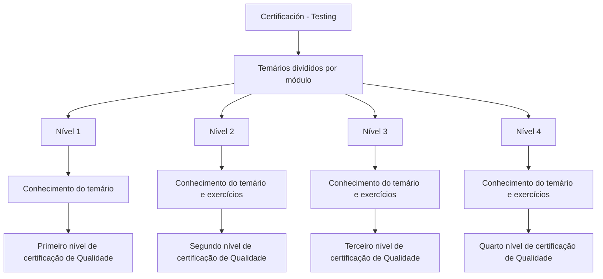

# Certificação de Qualidade — Testing: Temários por Nível

## 1. Metadados do Documento
- **Arquivo de Origem:** Não identificado
- **Tipo de Documento:** Procedimento
- **Domínio / Sistema:** Certificação de Qualidade — Testing
- **Público-Alvo:** Profissionais em processo de certificação de Qualidade
- **Data/Versão Identificada:** Não identificada

---

## 2. Resumo Executivo & Contexto de Negócio

O documento apresenta a área de **Certificación - Testing**, que reúne os temários associados aos níveis de certificação de Qualidade. Os conteúdos são organizados por módulo.

A estrutura de certificação contém quatro níveis. O primeiro nível exige o conhecimento do temário correspondente para a obtenção da primeira certificação de Qualidade.

Os níveis 2, 3 e 4 exigem conhecimento do temário de cada nível e incluem exercícios. O documento não descreve os módulos, os tópicos programáticos, os critérios de aprovação, a duração das avaliações ou os formatos dos exercícios.

O conteúdo também apresenta referências de navegação ou contexto de portal: **CF**, **Home**, **Solutions**, **APIs**, **Documentation**, **Zeus** e o idioma **EN**. A relação funcional entre essas referências e a certificação não é detalhada.

---

## 3. Arquitetura, Componentes & Tecnologias Envolvidas

O documento não descreve arquitetura de software, componentes técnicos, integrações, tecnologias, microsserviços, ambientes ou fluxos de dados.

O fluxo de progressão de certificação explicitamente apresentado pode ser representado da seguinte forma:



> **Nota de Análise:** O documento não detalha pré-requisitos entre níveis, mecanismos de avaliação, percentuais de aprovação ou procedimentos para realização dos exercícios.

---

## 4. Regras de Negócio, Especificações Funcionais & Processos

1. A seção **Certificación - Testing** contém os temários de cada nível de certificação.
2. Os temários são divididos por módulo.
3. Para obter a certificação de Qualidade de **Nível 1**, é necessário conhecer o temário do primeiro nível.
4. Para obter a certificação de Qualidade de **Nível 2**, é necessário conhecer o temário e realizar exercícios associados ao segundo nível.
5. Para obter a certificação de Qualidade de **Nível 3**, é necessário conhecer o temário e realizar exercícios associados ao terceiro nível.
6. Para obter a certificação de Qualidade de **Nível 4**, é necessário conhecer o temário e realizar exercícios associados ao quarto nível.
7. O documento não especifica se a certificação de um nível anterior é obrigatória para acessar ou obter a certificação do nível seguinte.
8. O documento não define quais módulos pertencem a cada nível nem quais exercícios devem ser realizados.

---

## 5. Tabelas de Parâmetros, Ambientes e Estruturas de Dados

| Item / Parâmetro | Descrição / Função | Tipo / Valores / Formato | Ambiente / Observações |
| :--- | :--- | :--- | :--- |
| Área | Seção que reúne os conteúdos de certificação | Certificación - Testing | Não há ambiente técnico informado |
| Organização do conteúdo | Forma de agrupamento dos temários | Divididos por módulo | Os módulos não são listados |
| Certificação de Nível 1 | Primeiro nível de certificação de Qualidade | Conhecimento do temário do Nível 1 | Não há exercícios mencionados para o Nível 1 |
| Certificação de Nível 2 | Segundo nível de certificação de Qualidade | Conhecimento do temário e exercícios | Conteúdo dos exercícios não informado |
| Certificação de Nível 3 | Terceiro nível de certificação de Qualidade | Conhecimento do temário e exercícios | Conteúdo dos exercícios não informado |
| Certificação de Nível 4 | Quarto nível de certificação de Qualidade | Conhecimento do temário e exercícios | Conteúdo dos exercícios não informado |
| Referência de navegação | Elemento exibido no conteúdo original | CF | Relação com a certificação não detalhada |
| Referência de navegação | Elemento exibido no conteúdo original | Home | Relação com a certificação não detalhada |
| Referência de navegação | Elemento exibido no conteúdo original | Solutions | Relação com a certificação não detalhada |
| Referência de navegação | Elemento exibido no conteúdo original | APIs | Relação com a certificação não detalhada |
| Referência de navegação | Elemento exibido no conteúdo original | Documentation | Relação com a certificação não detalhada |
| Referência de navegação | Elemento exibido no conteúdo original | Zeus | Relação com a certificação não detalhada |
| Idioma exibido | Indicador textual de idioma | EN | O corpo principal está em espanhol |

---

## 6. Bateria de Perguntas & Respostas para RAG (FAQ Sintético)

### P1: Qual é o objetivo da seção “Certificación - Testing”?
**R:** A seção “Certificación - Testing” reúne os temários necessários para os diferentes níveis de certificação de Qualidade. Os temários são divididos por módulo.

### P2: Como os conteúdos de certificação são organizados?
**R:** O documento informa que os temários de certificação são divididos por módulo. Não são informados os nomes, conteúdos ou quantidades dos módulos.

### P3: O que é necessário para obter a certificação de Qualidade de Nível 1?
**R:** Para obter o primeiro nível de certificação de Qualidade, é necessário conhecer o temário definido para a certificação de Nível 1.

### P4: A certificação de Nível 1 exige exercícios?
**R:** O documento informa apenas que o conhecimento do temário é necessário para o Nível 1. Exercícios não são mencionados como requisito para esse nível.

### P5: O que é necessário para obter a certificação de Qualidade de Nível 2?
**R:** Para obter o segundo nível de certificação de Qualidade, é necessário conhecer o temário de Nível 2 e realizar exercícios associados a esse nível.

### P6: Quais níveis de certificação incluem exercícios?
**R:** Os níveis 2, 3 e 4 incluem temário e exercícios. O documento não descreve os exercícios, seus formatos ou critérios de avaliação.

### P7: O documento define os critérios de aprovação das certificações?
**R:** Não. O documento não informa critérios de aprovação, notas mínimas, número de tentativas, duração das avaliações ou métodos de correção.

### P8: O Nível 3 possui requisitos descritos no documento?
**R:** Sim. O documento estabelece que a certificação de Nível 3 requer o conhecimento do temário correspondente e a realização de exercícios. Não há detalhamento adicional.

### P9: O que é necessário para a certificação de Nível 4?
**R:** A certificação de Nível 4 requer conhecimento do temário de quarto nível e exercícios associados. O conteúdo programático e os exercícios não são especificados.

### P10: É obrigatório concluir um nível antes de realizar o nível seguinte?
**R:** O documento não informa se há uma dependência obrigatória entre os níveis de certificação. Portanto, não é possível afirmar que a conclusão de um nível seja pré-requisito formal para o próximo.

### P11: Quais referências adicionais aparecem no documento?
**R:** O documento exibe as referências “CF”, “Home”, “Solutions”, “APIs”, “Documentation”, “Zeus” e “EN”. Não há explicação sobre a função dessas referências no processo de certificação.

---

## 7. Glossário de Termos, Siglas & Conceitos-Chave

- **Certificación - Testing:** Seção apresentada como repositório dos temários de certificação.
- **Certificação de Qualidade:** Processo de certificação organizado em quatro níveis no documento.
- **Temário:** Conteúdo que deve ser conhecido para obtenção de uma certificação de Qualidade.
- **Módulo:** Unidade de organização dos temários de certificação.
- **Nível 1:** Primeiro nível da certificação de Qualidade; requer conhecimento do temário.
- **Nível 2:** Segundo nível da certificação de Qualidade; requer conhecimento do temário e exercícios.
- **Nível 3:** Terceiro nível da certificação de Qualidade; requer conhecimento do temário e exercícios.
- **Nível 4:** Quarto nível da certificação de Qualidade; requer conhecimento do temário e exercícios.
- **CF:** Referência exibida no documento sem definição contextual.
- **EN:** Indicador de idioma exibido no documento; seu significado funcional não é detalhado.

---

## 8. Notas Críticas, Riscos & Limitações

- O documento não identifica o arquivo de origem, a data, a versão, o autor ou a área responsável.
- Não há detalhamento dos módulos, temários, exercícios, mecanismos de avaliação ou critérios de aprovação.
- Não há informação sobre pré-requisitos entre os quatro níveis de certificação.
- Não são descritos sistemas, ferramentas, ambientes, URLs, integrações ou tecnologias envolvidas.
- As referências “CF”, “Home”, “Solutions”, “APIs”, “Documentation”, “Zeus” e “EN” aparecem sem explicação funcional.
- **Nota de Análise:** O documento descreve a estrutura geral dos níveis de certificação, mas não fornece detalhamento suficiente para executar, administrar ou auditar o processo completo de certificação.

---

## 9. Conteúdo Bruto Estruturado (Referência Fiel)

```text
--- [PÁGINA 1 DE 1] ---

CERTIFICACIÓN - TESTING
 En este apartado se encuentran los temarios de cada uno de los niveles de
certificación. Los temarios están divididas por módulo.
CERTIFICACIÓN DE NIVEL 1
En este apartado se encuentra el temario que
se necesita conocer para obtener el primer
nivel de certificación de Calidad
CERTIFICACIÓN DE NIVEL 2
En este apartado se encuentra el temario que
se necesita conocer junto con ejercicios para
obtener el segundo nivel de certificación de
Calidad
CERTIFICACIÓN DE NIVEL 3
En este apartado se encuentra el temario que
se necesita conocer junto con ejercicios para
obtener el tercer nivel de certificación de
Calidad
CERTIFICACIÓN DE NIVEL 4
En este apartado se encuentra el temario que
se necesita conocer junto con ejercicios para
obtener el cuarto nivel de certificación de
Calidad
 / 
 CF
Home Solutions APIs Documentation Zeus
EN
```
