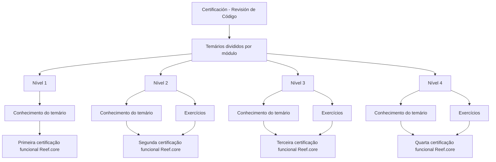

# Certificação Funcional Reef.core — Revisão de Código e Temários por Nível

## 1. Metadados do Documento
- **Arquivo de Origem:** Não identificado no conteúdo fornecido
- **Tipo de Documento:** Procedimento / material de certificação funcional
- **Domínio / Sistema:** Reef.core
- **Público-Alvo:** Profissionais que buscam certificação funcional Reef.core
- **Data/Versão Identificada:** Não identificada

---

## 2. Resumo Executivo & Contexto de Negócio

O documento apresenta a área de **Certificación - Revisión de Código**, contendo os temários associados aos níveis de certificação funcional da plataforma **Reef.core**. Os conteúdos são organizados por módulo.

A certificação é estruturada em quatro níveis progressivos. O primeiro nível requer conhecimento de um temário para obtenção da certificação funcional inicial de Reef.core.

Os níveis 2, 3 e 4 também exigem o conhecimento de seus respectivos temários, acrescentando exercícios como requisito explícito para a obtenção da certificação funcional em cada nível.

O material também referencia elementos de navegação ou sistemas denominados **Home**, **Solutions**, **APIs**, **Documentation**, **Zeus** e **EN**, sem explicar sua função, integração ou relação direta com o processo de certificação.

---

## 3. Arquitetura, Componentes & Tecnologias Envolvidas

O conteúdo não descreve arquitetura de software, componentes técnicos, microsserviços, tecnologias, integrações, ambientes ou fluxos de dados. A estrutura apresentada é um fluxo conceitual de progressão entre níveis de certificação funcional Reef.core.



**Nota de Análise:** O documento não detalha os módulos do temário, os critérios de aprovação, o formato dos exercícios, notas mínimas, prazos ou responsáveis pela certificação.

---

## 4. Regras de Negócio, Especificações Funcionais & Processos

1. O conteúdo de certificação está localizado na seção intitulada **“Certificación - Revisión de Código”**.
2. Os temários de certificação são divididos por módulo.
3. A certificação funcional Reef.core possui quatro níveis: nível 1, nível 2, nível 3 e nível 4.
4. Para obter a certificação funcional de **nível 1**, é necessário conhecer o temário correspondente ao primeiro nível.
5. Para obter a certificação funcional de **nível 2**, é necessário conhecer o temário correspondente e realizar exercícios.
6. Para obter a certificação funcional de **nível 3**, é necessário conhecer o temário correspondente e realizar exercícios.
7. Para obter a certificação funcional de **nível 4**, é necessário conhecer o temário correspondente e realizar exercícios.
8. O texto não afirma que os níveis precisam ser realizados em ordem, embora a nomenclatura indique uma estrutura de níveis progressivos.
9. O texto não informa se os exercícios são obrigatórios para aprovação, como são avaliados ou onde devem ser realizados.

---

## 5. Tabelas de Parâmetros, Ambientes e Estruturas de Dados

| Item / Parâmetro | Descrição / Função | Tipo / Valores / Formato | Ambiente / Observações |
| :--- | :--- | :--- | :--- |
| Área de conteúdo | Seção que apresenta os temários de certificação | Certificación - Revisión de Código | Não há detalhamento adicional |
| Organização dos temários | Estrutura de agrupamento dos conteúdos de certificação | Divididos por módulo | Módulos não identificados |
| Certificação de Nível 1 | Primeiro nível de certificação funcional Reef.core | Conhecimento do temário | Não são mencionados exercícios |
| Certificação de Nível 2 | Segundo nível de certificação funcional Reef.core | Conhecimento do temário + exercícios | Critérios dos exercícios não informados |
| Certificação de Nível 3 | Terceiro nível de certificação funcional Reef.core | Conhecimento do temário + exercícios | Critérios dos exercícios não informados |
| Certificação de Nível 4 | Quarto nível de certificação funcional Reef.core | Conhecimento do temário + exercícios | Critérios dos exercícios não informados |
| Home | Elemento textual exibido no conteúdo | Nome não detalhado | Função não especificada |
| Solutions | Elemento textual exibido no conteúdo | Nome não detalhado | Função não especificada |
| APIs | Elemento textual exibido no conteúdo | Nome não detalhado | Função não especificada |
| Documentation | Elemento textual exibido no conteúdo | Nome não detalhado | Função não especificada |
| Zeus | Elemento textual exibido no conteúdo | Nome não detalhado | Função não especificada |
| EN | Elemento textual exibido no conteúdo | Sigla ou seletor não detalhado | Significado não especificado |

---

## 6. Bateria de Perguntas & Respostas para RAG (FAQ Sintético)

### P1: Qual sistema está associado ao processo de certificação funcional apresentado?
**R:** O processo de certificação funcional apresentado está associado ao sistema **Reef.core**.

### P2: Como os temários de certificação são organizados?
**R:** Os temários de certificação são divididos por módulo. O documento não identifica os nomes, conteúdos ou responsáveis pelos módulos.

### P3: Quantos níveis de certificação funcional Reef.core são apresentados?
**R:** O documento apresenta quatro níveis de certificação funcional Reef.core: nível 1, nível 2, nível 3 e nível 4.

### P4: O que é necessário para obter a certificação funcional Reef.core de nível 1?
**R:** Para obter o primeiro nível de certificação funcional Reef.core, o documento informa que é necessário conhecer o temário correspondente ao nível 1.

### P5: O nível 2 de certificação Reef.core exige exercícios?
**R:** Sim. Para obter o segundo nível de certificação funcional Reef.core, o documento informa que é necessário conhecer o temário e realizar exercícios.

### P6: Quais são os requisitos mencionados para a certificação funcional Reef.core de nível 3?
**R:** O nível 3 exige o conhecimento do temário correspondente e a realização de exercícios. O documento não detalha o conteúdo, formato ou método de avaliação desses exercícios.

### P7: Quais são os requisitos mencionados para a certificação funcional Reef.core de nível 4?
**R:** O nível 4 exige o conhecimento do temário correspondente e a realização de exercícios. Não há detalhes sobre critérios de aprovação ou exercícios específicos.

### P8: O documento define nota mínima, duração ou critérios de aprovação para as certificações?
**R:** Não. O documento não informa nota mínima, duração, critérios de aprovação, responsáveis pela avaliação ou processo de inscrição.

### P9: O documento descreve APIs, URLs, servidores ou ambientes técnicos de Reef.core?
**R:** Não. Embora os termos “APIs”, “Documentation” e “Zeus” apareçam no conteúdo, não há URLs, contratos técnicos, configurações de ambiente, servidores ou detalhes de integração.

### P10: Os níveis de certificação precisam ser realizados sequencialmente?
**R:** O documento não estabelece explicitamente uma obrigatoriedade de realização sequencial. Ele apenas apresenta uma classificação em quatro níveis progressivos.

---

## 7. Glossário de Termos, Siglas & Conceitos-Chave

- **Reef.core:** Sistema ou domínio ao qual se refere a certificação funcional apresentada.
- **Certificación:** Processo de certificação descrito no documento.
- **Revisión de Código:** Título da seção onde os temários de certificação são apresentados.
- **Temario:** Conteúdo programático ou conjunto de assuntos que deve ser conhecido para cada nível de certificação.
- **Módulo:** Unidade de organização dos temários de certificação.
- **Exercícios:** Atividades mencionadas como parte dos níveis 2, 3 e 4; o documento não detalha formato ou avaliação.
- **APIs:** Termo exibido no conteúdo, sem definição ou detalhamento técnico.
- **EN:** Termo exibido no conteúdo, sem significado definido.

---

## 8. Notas Críticas, Riscos & Limitações

- O documento não apresenta o conteúdo dos temários por módulo.
- Não há critérios de aprovação, nota mínima, duração, periodicidade ou método de avaliação.
- Não há detalhes sobre os exercícios exigidos nos níveis 2, 3 e 4.
- Não há indicação de pré-requisitos entre os quatro níveis.
- Os elementos “Home”, “Solutions”, “APIs”, “Documentation”, “Zeus” e “EN” aparecem sem contexto funcional ou técnico.
- Não são fornecidas informações sobre arquitetura, APIs, contratos, ambientes, URLs, permissões ou canais de suporte.
- **Nota de Análise:** O documento descreve a existência da certificação funcional Reef.core e seus níveis, mas não detalha os conteúdos, exercícios ou mecanismos operacionais necessários para executar o processo de certificação.

---

## 9. Conteúdo Bruto Estruturado (Referência Fiel)

```text
--- [PÁGINA 1 DE 1] ---

CERTIFICACIÓN - REVISIÓN DE CÓDIGO
 En este apartado se encuentran los temarios de cada uno de los niveles de
certificación. Los temarios están divididas por módulo.
CERTIFICACIÓN DE NIVEL 1
En este apartado se encuentra el temario que
se necesita conocer para obtener el primer
nivel de certificación funcional de Reef.core
CERTIFICACIÓN DE NIVEL 2
En este apartado se encuentra el temario que
se necesita conocer junto con ejercicios para
obtener el segundo nivel de certificación
funcional de Reef.core
CERTIFICACIÓN DE NIVEL 3
En este apartado se encuentra el temario que
se necesita conocer junto con ejercicios para
obtener el tercer nivel de certificación
funcional de Reef.core
CERTIFICACIÓN DE NIVEL 4
En este apartado se encuentra el temario que
se necesita conocer junto con ejercicios para
obtener el cuarto nivel de certificación
funcional de Reef.core
 / 
 CF
Home Solutions APIs Documentation Zeus
EN
```
