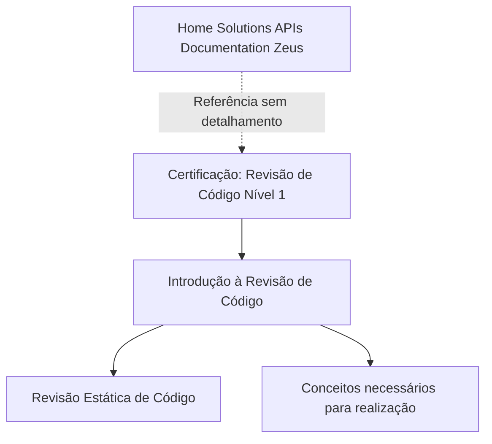

# Certificação — Revisão de Código Nível 1

## 1. Metadados do Documento
- **Arquivo de Origem:** Não identificado
- **Tipo de Documento:** Material de certificação / apresentação introdutória
- **Domínio / Sistema:** Revisão estática de código; Home Solutions APIs Documentation Zeus
- **Público-Alvo:** Profissionais em certificação de revisão de código
- **Data/Versão Identificada:** Nível 1; demais informações não identificadas

---

## 2. Resumo Executivo & Contexto de Negócio

O conteúdo disponível apresenta uma certificação de **Revisão de Código — Nível 1**. O material introduz o tema de revisão estática de código e posiciona essa introdução como base para a realização da atividade de revisão.

O documento declara que a seção de introdução identifica os conceitos necessários para executar revisão estática de código. Entretanto, o trecho extraído não especifica quais são esses conceitos, critérios de aceite, ferramentas, métricas de qualidade, responsabilidades ou processo operacional.

Também há referência a **Home Solutions APIs Documentation Zeus** e ao identificador **CF**, sem explicação adicional sobre a relação desses termos com a certificação ou com o processo de revisão de código.

---

## 3. Arquitetura, Componentes & Tecnologias Envolvidas

O conteúdo não descreve arquitetura de software, componentes técnicos, integrações, microsserviços, protocolos, tecnologias ou ambientes.



**Nota de Análise:** O documento cita “Home Solutions APIs Documentation Zeus”, mas não detalha sua função, arquitetura, endpoints, tecnologias ou relação operacional com a certificação.

---

## 4. Regras de Negócio, Especificações Funcionais & Processos

1. O material pertence à certificação denominada **Revisão de Código Nível 1**.
2. A seção apresentada é intitulada **Introdução à Revisão de Código**.
3. A introdução aborda revisão estática de código.
4. A introdução tem como propósito identificar os conceitos necessários para realizar revisão estática de código.
5. O conteúdo extraído não apresenta passos operacionais, regras de validação, critérios de aprovação/reprovação, papéis envolvidos, ferramentas, fluxos de correção ou evidências exigidas.

**Nota de Análise:** Não há detalhamento suficiente para reconstruir um processo completo de revisão de código. Não foram informados métodos de análise, linguagens de programação, integrações ou padrões de qualidade.

---

## 5. Tabelas de Parâmetros, Ambientes e Estruturas de Dados

| Item / Parâmetro | Descrição / Função | Tipo / Valores / Formato | Ambiente / Observações |
| :--- | :--- | :--- | :--- |
| Certificação | Formação ou avaliação relacionada à revisão de código | Revisão de Código — Nível 1 | Detalhes de escopo não informados |
| Seção | Área temática apresentada no trecho | Introdução à Revisão de Código | Introduz revisão estática de código |
| Atividade citada | Tema que será introduzido | Revisão estática de código | Método, ferramentas e critérios não detalhados |
| Home Solutions APIs Documentation Zeus | Referência textual presente no material | Nome/identificador não explicado | Relação com a certificação não detalhada |
| CF | Sigla ou identificador presente no conteúdo | Não identificado | Sem definição no trecho extraído |
| EN | Indicador textual presente no conteúdo | Não identificado | Sem explicação adicional |

---

## 6. Bateria de Perguntas & Respostas para RAG (FAQ Sintético)

### P1: Qual é o nível da certificação apresentada no documento?
**R:** O documento apresenta a certificação **Revisão de Código Nível 1**.

### P2: Qual é o assunto da seção apresentada no material?
**R:** A seção é intitulada **Introdução à Revisão de Código**.

### P3: Qual tipo de revisão de código é citado no documento?
**R:** O conteúdo cita explicitamente a **revisão estática de código**.

### P4: Qual é o objetivo declarado da introdução à revisão de código?
**R:** O objetivo declarado é identificar os conceitos necessários para a realização da revisão estática de código.

### P5: O documento descreve um fluxo detalhado para executar revisão estática de código?
**R:** Não. O trecho disponível apenas informa que existem conceitos necessários para a realização da revisão estática de código, sem apresentar etapas, papéis, ferramentas ou critérios de avaliação.

### P6: Quais ferramentas de análise estática são indicadas pela certificação?
**R:** O documento não identifica nenhuma ferramenta de análise estática, plataforma de integração contínua ou solução de revisão de código.

### P7: O que é “Home Solutions APIs Documentation Zeus” no contexto do documento?
**R:** “Home Solutions APIs Documentation Zeus” aparece como referência textual no material, mas o documento não explica seu significado, função ou vínculo técnico com a certificação.

### P8: O documento informa critérios para aprovar ou reprovar uma revisão de código?
**R:** Não. Não há critérios de aprovação, reprovação, severidade de defeitos, métricas ou regras de bloqueio descritos no conteúdo extraído.

### P9: O documento define responsabilidades de desenvolvedores, revisores ou equipes de operação?
**R:** Não. O conteúdo não define papéis, responsabilidades ou matriz de governança para a revisão de código.

### P10: O documento apresenta APIs, contratos JSON ou métodos HTTP?
**R:** Não. Embora mencione “APIs Documentation Zeus”, o trecho não detalha APIs, endpoints, métodos HTTP, contratos JSON ou integrações.

---

## 7. Glossário de Termos, Siglas & Conceitos-Chave

- **Revisão de Código:** Tema central da certificação apresentada. O trecho não define o processo em detalhes.
- **Revisão Estática de Código:** Tipo de revisão citado no documento. Não há explicação sobre técnicas, ferramentas ou critérios.
- **Nível 1:** Nível identificado para a certificação de revisão de código.
- **CF:** Sigla ou identificador presente no conteúdo, sem significado definido.
- **EN:** Indicador presente no conteúdo, sem significado definido.
- **Home Solutions APIs Documentation Zeus:** Referência textual sem definição funcional ou técnica no trecho disponibilizado.

---

## 8. Notas Críticas, Riscos & Limitações

- O conteúdo extraído é introdutório e não contém detalhamento técnico suficiente para orientar uma implementação ou operação de revisão estática de código.
- Não foram identificados critérios de qualidade, regras de negócio, ferramentas, tecnologias, ambientes, integrações ou responsabilidades.
- Não há definição para as siglas **CF** e **EN**.
- A referência a **Home Solutions APIs Documentation Zeus** não possui contexto suficiente para estabelecer vínculo arquitetural, funcional ou operacional.
- Não é possível inferir versões de software, URLs, portas, linguagens, padrões de código ou contratos de API sem extrapolar o conteúdo original.

---

## 9. Conteúdo Bruto Estruturado (Referência Fiel)

```text
--- [PÁGINA 1 DE 1] ---

CERTIFICACIÓN - REVISIÓN DE CÓDIGO
NIVEL 1
CERTIFICACIÓN
Revisión de Código nivel
1
INTRODUCCIÓN A LA REVISIÓN DE CÓDIGO
En este apartado se encuentra la introducción a la revisión de código estático, identificando los
conceptos necesarios para su realización
 / 
 CF
Home Solutions APIs Documentation Zeus
EN
```
