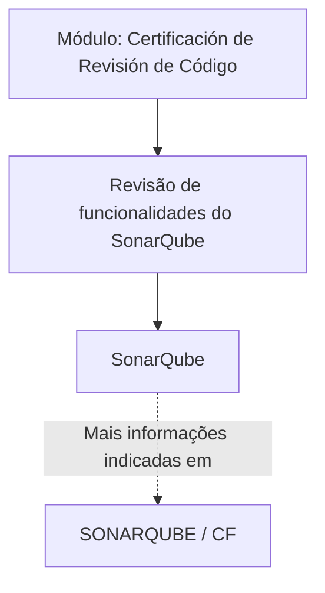

# Certificação de Revisão de Código — Revisão de Código com SonarQube

## 1. Metadados do Documento
- **Arquivo de Origem:** Não identificado; conteúdo fornecido como texto bruto.
- **Tipo de Documento:** Apresentação Executiva / Material de Treinamento.
- **Domínio / Sistema:** Certificação de revisão de código com SonarQube.
- **Público-Alvo:** Desenvolvedores e profissionais envolvidos em revisão de código.
- **Data/Versão Identificada:** Não identificada.

---

## 2. Resumo Executivo & Contexto de Negócio

O documento apresenta um módulo denominado **“Certificación de Revisión de Código - Revisión de Código con SonarQube”**. A finalidade declarada do módulo é revisar as funcionalidades fornecidas pela ferramenta SonarQube.

O conteúdo posiciona o SonarQube como o tema central da revisão de código. O objetivo explícito é que todas as funcionalidades do SonarQube sejam revisadas durante o módulo.

O material também indica a existência de uma fonte adicional de informação identificada como **“SONARQUBE / CF”**, associada aos termos de navegação ou contexto “Home Solutions APIs Documentation Zeus EN”.

**Nota de Análise:** o conteúdo fornecido é resumido e não descreve funcionalidades específicas do SonarQube, critérios de qualidade, regras de análise, integrações, projetos, linguagens, pipelines, URLs completas, credenciais ou procedimentos operacionais.

---

## 3. Arquitetura, Componentes & Tecnologias Envolvidas

| Componente / Tecnologia | Papel identificado no documento | Detalhamento disponível |
| :--- | :--- | :--- |
| SonarQube | Ferramenta cujas funcionalidades devem ser revisadas no módulo. | O documento não detalha funcionalidades, configuração ou integração. |
| Módulo de Certificação de Revisão de Código | Material ou módulo voltado à revisão das funcionalidades do SonarQube. | Não detalha carga horária, etapas, critérios de aprovação ou público formal. |
| SONARQUBE / CF | Referência indicada para obtenção de informações adicionais. | O documento não apresenta URL, conteúdo ou significado de “CF”. |
| Home Solutions APIs Documentation Zeus EN | Termos presentes na referência de navegação exibida no documento. | Não há explicação sobre relação funcional entre esses termos e o SonarQube. |



**Nota de Análise:** o diagrama representa apenas a relação explicitamente declarada entre o módulo, a revisão de funcionalidades do SonarQube e a referência adicional. O documento não fornece uma arquitetura técnica de integração.

---

## 4. Regras de Negócio, Especificações Funcionais & Processos

### Objetivo declarado do módulo
1. O módulo tem a finalidade de revisar as funcionalidades disponibilizadas pela ferramenta SonarQube.
2. Todas as funcionalidades do SonarQube devem ser revisadas.

### Processo identificável no conteúdo
1. Acessar ou utilizar o módulo de certificação de revisão de código.
2. Revisar as funcionalidades do SonarQube.
3. Consultar a referência “SONARQUBE / CF” para informações adicionais, quando aplicável.

### Restrições e ausências de especificação
- O documento não lista quais funcionalidades do SonarQube devem ser revisadas.
- O documento não define sequência de atividades, responsáveis, prazos ou critérios de conclusão.
- O documento não especifica regras de qualidade de código, perfis de qualidade, quality gates, métricas, vulnerabilidades, bugs, code smells ou cobertura de testes.
- O documento não descreve métodos HTTP, APIs, contratos de integração, repositórios, pipelines de CI/CD ou ambientes.

---

## 5. Tabelas de Parâmetros, Ambientes e Estruturas de Dados

| Item / Parâmetro | Descrição / Função | Tipo / Valores / Formato | Ambiente / Observações |
| :--- | :--- | :--- | :--- |
| Objetivo do módulo | Revisar as funcionalidades fornecidas pelo SonarQube. | Texto descritivo. | Não especificado. |
| Ferramenta principal | SonarQube. | Ferramenta de revisão de código citada pelo documento. | Não especificado. |
| Escopo de revisão | Todas as funcionalidades do SonarQube. | Escopo declarado. | As funcionalidades individuais não foram listadas. |
| Fonte adicional | SONARQUBE / CF. | Referência textual. | Não há URL nem detalhamento do conteúdo. |
| Termos de navegação apresentados | Home, Solutions, APIs, Documentation, Zeus, EN. | Texto exibido no documento. | O relacionamento com o módulo não é explicado. |

---

## 6. Bateria de Perguntas & Respostas para RAG (FAQ Sintético)

### P1: Qual é o objetivo do módulo “Certificación de Revisión de Código - Revisión de Código con SonarQube”?
**R:** O objetivo do módulo é revisar as funcionalidades fornecidas pela ferramenta SonarQube.

### P2: Qual ferramenta é o foco da revisão de código apresentada no documento?
**R:** A ferramenta central do documento é o SonarQube.

### P3: O documento exige a revisão de apenas algumas funcionalidades do SonarQube?
**R:** Não. O documento declara que será necessário revisar todas as funcionalidades do SonarQube, mas não enumera quais são essas funcionalidades.

### P4: O material apresenta instruções detalhadas para configurar o SonarQube?
**R:** Não. O conteúdo fornecido não apresenta instruções de instalação, configuração, autenticação, criação de projetos ou parametrização do SonarQube.

### P5: Quais métricas de qualidade de código devem ser avaliadas no SonarQube?
**R:** O documento não especifica métricas de qualidade, como cobertura de testes, bugs, vulnerabilidades, duplicação, dívida técnica ou code smells.

### P6: Existe uma referência adicional para obter mais informações sobre SonarQube?
**R:** Sim. O documento informa que mais informações podem ser encontradas em uma referência identificada como “SONARQUBE / CF”.

### P7: O que significa a sigla “CF” na referência “SONARQUBE / CF”?
**R:** O significado de “CF” não é definido no conteúdo fornecido.

### P8: O documento descreve integração entre SonarQube e pipelines de CI/CD?
**R:** Não. Não há descrição de pipelines de CI/CD, repositórios de código, ferramentas de build ou mecanismos de integração.

### P9: O documento define responsáveis ou equipes encarregadas da revisão de código?
**R:** Não. O conteúdo não identifica equipes, papéis, responsáveis ou fluxos de aprovação.

### P10: Há URLs de ambientes, servidores ou portas do SonarQube no documento?
**R:** Não. O conteúdo não fornece URLs completas, nomes de servidores, ambientes, portas ou credenciais.

### P11: Quais termos adicionais aparecem na área de referência do documento?
**R:** A área de referência apresenta os termos “Home”, “Solutions”, “APIs”, “Documentation”, “Zeus” e “EN”, sem explicar seus significados ou vínculos técnicos com o módulo.

---

## 7. Glossário de Termos, Siglas & Conceitos-Chave

- **SonarQube:** ferramenta mencionada no documento como objeto da revisão de código.
- **Revisión de Código:** revisão de código; tema da certificação e do módulo apresentados.
- **CF:** sigla presente na referência “SONARQUBE / CF”; significado não identificado no conteúdo.
- **APIs:** termo exibido na referência de navegação; o documento não apresenta sua expansão ou relação com SonarQube.
- **Zeus:** termo exibido na referência de navegação; o documento não define seu significado.
- **EN:** termo exibido na referência de navegação; o documento não define seu significado.

---

## 8. Notas Críticas, Riscos & Limitações

- O conteúdo fornecido é extremamente sucinto e não detalha o escopo operacional da revisão de SonarQube.
- Não há lista das funcionalidades do SonarQube que devem ser revisadas.
- Não foram fornecidos critérios de certificação, critérios de aprovação, responsáveis, cronograma ou evidências exigidas.
- Não há parâmetros técnicos de configuração, ambientes, URLs, integrações, credenciais ou regras de quality gate.
- A referência “SONARQUBE / CF” não contém URL completa nem explicação sobre “CF”.
- Os termos “Home Solutions APIs Documentation Zeus EN” aparecem no material, mas não possuem detalhamento adicional.

---

## 9. Conteúdo Bruto Estruturado (Referência Fiel)

```text
--- [PÁGINA 1 DE 1] ---

CERTIFICACIÓN de REVISIÓN de CÓDIGO -
Revisión de Código con SonarQube
OBJETIVO
La finalidad de este módulo es repasar las funcionalidades que proporciona la herramienta
SonarQube.
SonarQube
SonarQube
Será necesario revisar todas las funcionalidades de SonarQube.
Podemos encontrar más información en: SONARQUBE
 / 
 CF
Home Solutions APIs Documentation Zeus
EN
```
