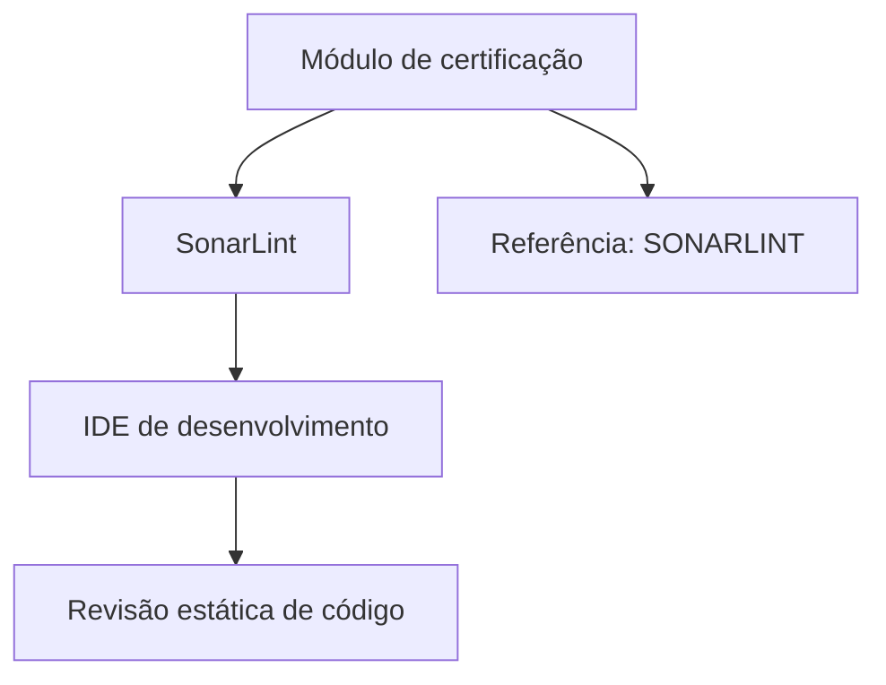

# Certificação de Revisão de Código com SonarLint

## 1. Metadados do Documento
- **Arquivo de Origem:** `Não identificado`
- **Tipo de Documento:** `Apresentação Executiva / Material de Treinamento`
- **Domínio / Sistema:** `Certificação de Revisão de Código — SonarLint`
- **Público-Alvo:** `Desenvolvedores`
- **Data/Versão Identificada:** `Não identificada`

---

## 2. Resumo Executivo & Contexto de Negócio

O documento apresenta um módulo de certificação sobre revisão de código utilizando o plugin SonarLint. O objetivo declarado é revisar as funcionalidades disponibilizadas pelo SonarLint.

O conteúdo posiciona o SonarLint como uma ferramenta para revisão estática de código diretamente no ambiente de desenvolvimento integrado (IDE) do desenvolvedor. A abordagem indicada é educacional: o módulo pretende explicar como o plugin funciona.

O documento também aponta a existência de uma fonte adicional de informações identificada como “SONARLINT”. Entretanto, o texto extraído não fornece uma URL completa, detalhes técnicos da documentação, instruções de instalação, regras de qualidade ou exemplos de uso.

---

## 3. Arquitetura, Componentes & Tecnologias Envolvidas

Os elementos explicitamente citados são:

| Componente / Tecnologia | Papel identificado no documento |
| :--- | :--- |
| Módulo de certificação | Material voltado à revisão das funcionalidades do plugin SonarLint. |
| SonarLint | Plugin utilizado para realizar revisão estática de código. |
| IDE de desenvolvimento | Ambiente no qual o plugin SonarLint atua. |
| SONARLINT | Referência apontada como fonte de mais informações. |



**Nota de Análise:** o documento não detalha a arquitetura interna do SonarLint, integrações com servidores, linguagens suportadas, regras de análise, configurações de IDE ou fluxo de correção de problemas identificados.

---

## 4. Regras de Negócio, Especificações Funcionais & Processos

O documento estabelece os seguintes pontos funcionais:

1. A finalidade do módulo é revisar as funcionalidades fornecidas pelo plugin SonarLint.
2. O módulo abordará como funciona o plugin SonarLint.
3. O SonarLint permite executar revisão estática de código dentro do IDE de desenvolvimento.
4. Há uma referência externa denominada “SONARLINT” para consulta de informações adicionais.

**Nota de Análise:** não foram identificadas regras de negócio corporativas, critérios de aprovação, limiares de qualidade, severidades, políticas de bloqueio de entrega, comandos operacionais, contratos de API ou procedimentos detalhados de remediação.

---

## 5. Tabelas de Parâmetros, Ambientes e Estruturas de Dados

| Item / Parâmetro | Descrição / Função | Tipo / Valores / Formato | Ambiente / Observações |
| :--- | :--- | :--- | :--- |
| SonarLint | Plugin para revisão estática de código. | Plugin | Utilizado no IDE de desenvolvimento. |
| IDE de desenvolvimento | Ambiente no qual ocorre a revisão estática de código com SonarLint. | Ambiente de desenvolvimento | Nome do IDE não identificado. |
| Módulo de certificação | Conteúdo destinado a revisar as funcionalidades do SonarLint. | Material de treinamento | Sem versão ou data identificada. |
| SONARLINT | Fonte indicada para obter mais informações. | Referência documental | URL ou localização completa não identificada. |
| “CF Home Solutions APIs Documentation Zeus EN” | Texto presente na extração bruta. | Elemento textual / navegação aparente | O documento não explica o significado ou relação desses termos com SonarLint. |

---

## 6. Bateria de Perguntas & Respostas para RAG (FAQ Sintético)

### P1: Qual é o objetivo do módulo de certificação de revisão de código?
**R:** O objetivo do módulo é revisar as funcionalidades disponibilizadas pelo plugin SonarLint.

### P2: Qual ferramenta é abordada no documento?
**R:** O documento aborda o plugin SonarLint.

### P3: Para que o SonarLint é utilizado segundo o documento?
**R:** Segundo o documento, o SonarLint permite realizar revisão estática de código no IDE de desenvolvimento.

### P4: Onde o SonarLint realiza a revisão estática de código?
**R:** O SonarLint realiza a revisão estática de código no IDE de desenvolvimento do usuário.

### P5: O documento informa como o plugin SonarLint funciona?
**R:** O documento declara que será revisado como o plugin SonarLint funciona, mas o trecho extraído não apresenta o detalhamento técnico desse funcionamento.

### P6: O documento fornece instruções para instalar o SonarLint?
**R:** Não. O conteúdo extraído não apresenta instruções de instalação, configuração ou ativação do plugin SonarLint.

### P7: O documento especifica quais IDEs são compatíveis com SonarLint?
**R:** Não. O documento cita genericamente um IDE de desenvolvimento, sem informar nomes de IDEs compatíveis.

### P8: Onde encontrar mais informações sobre SonarLint?
**R:** O documento indica que mais informações podem ser encontradas em uma referência denominada “SONARLINT”, mas não apresenta uma URL completa ou outro identificador de acesso verificável.

### P9: O documento define regras de qualidade de código analisadas pelo SonarLint?
**R:** Não. O documento informa apenas que o SonarLint permite revisão estática de código; regras, métricas, severidades e critérios de qualidade não são detalhados.

### P10: O que significa “revisão estática de código” no contexto do documento?
**R:** No contexto apresentado, revisão estática de código é a capacidade atribuída ao plugin SonarLint de revisar código diretamente no IDE de desenvolvimento. O documento não fornece uma definição técnica adicional.

---

## 7. Glossário de Termos, Siglas & Conceitos-Chave

- **SonarLint:** plugin citado no documento para realizar revisão estática de código em um IDE de desenvolvimento.
- **IDE:** ambiente de desenvolvimento integrado; o documento o menciona como o local de uso do plugin SonarLint.
- **Revisão estática de código:** atividade mencionada como funcionalidade permitida pelo SonarLint no IDE.
- **CF:** termo presente no conteúdo bruto, sem significado definido no documento.
- **Zeus:** termo presente no conteúdo bruto, sem significado definido no documento.

---

## 8. Notas Críticas, Riscos & Limitações

- O texto extraído é breve e não detalha o funcionamento técnico do SonarLint.
- Não foram identificadas versões do SonarLint, IDEs compatíveis, linguagens de programação, configurações ou requisitos de instalação.
- Não há regras de qualidade, padrões de codificação, severidades, métricas, políticas de exceção ou critérios de aprovação descritos.
- A referência “SONARLINT” não contém URL completa no conteúdo extraído.
- Os termos “CF Home Solutions APIs Documentation Zeus EN” aparecem no texto bruto, mas não possuem contextualização suficiente para associação confiável ao módulo.
- **Nota de Análise:** o documento lista o SonarLint como plugin de revisão estática, porém não detalha regras analisadas, resultados produzidos ou ações esperadas do desenvolvedor após uma análise.

---

## 9. Conteúdo Bruto Estruturado (Referência Fiel)

```text
--- [PÁGINA 1 DE 1] ---

CERTIFICACIÓN de REVISIÓN de CÓDIGO -
Revisión de Código con SonarLint
OBJETIVO
La finalidad de este módulo es repasar las funcionalidades que proporciona el plugin SonarLint.
SonarLint
SonarLint
Se revisará cómo funciona el plugin SonarLint, que nos permite hacer revisión de código estático en
nuestro IDE de desarrollo.
Podemos encontrar más información en: SONARLINT
 / 
 CF
Home Solutions APIs Documentation Zeus
EN
```
