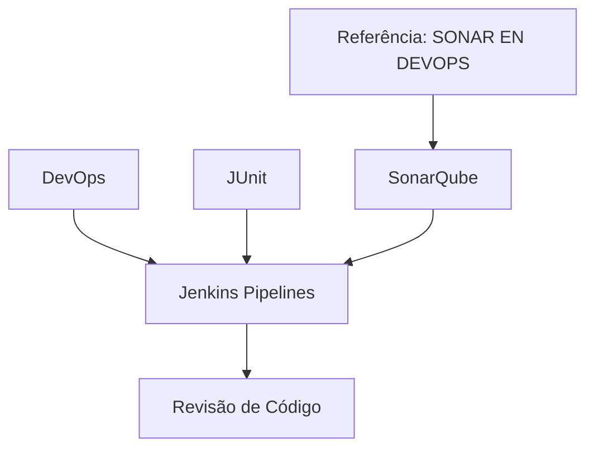

# Certificação de Revisão de Código com DevOps — Integração de JUnit, SonarQube e Jenkins

## 1. Metadados do Documento
- **Arquivo de Origem:** Não identificado no conteúdo fornecido
- **Tipo de Documento:** Material de capacitação / apresentação técnica
- **Domínio / Sistema:** Certificação de Revisão de Código com DevOps
- **Público-Alvo:** Desenvolvedores e profissionais de DevOps
- **Data/Versão Identificada:** Não identificada

---

## 2. Resumo Executivo & Contexto de Negócio

O documento apresenta o módulo **“Certificación de Revisión de Código - Revisión de Código con DevOps”**. A finalidade declarada é revisar a integração de testes unitários e revisão de código no contexto de DevOps.

O conteúdo cita especificamente a integração de **JUnit** e **SonarQube** em pipelines de **Jenkins**. A associação entre testes unitários, análise de código e pipelines indica um foco em automatizar ou revisar práticas de qualidade de código durante o processo de entrega.

O documento também aponta a existência de uma fonte adicional denominada **“SONAR EN DEVOPS”**, referenciada no ambiente ou navegação “Home Solutions APIs Documentation Zeus”. O conteúdo fornecido não detalha a localização, o formato ou os tópicos dessa documentação complementar.

O material extraído é resumido e não fornece detalhes sobre configuração de pipelines, regras de qualidade, métricas SonarQube, versões de ferramentas, métodos de integração ou critérios de aprovação de revisão de código.

---

## 3. Arquitetura, Componentes & Tecnologias Envolvidas

Os componentes explicitamente mencionados são:

- **DevOps:** contexto no qual testes unitários e revisão de código são tratados.
- **JUnit:** ferramenta ou framework citado para integração de testes unitários.
- **SonarQube:** ferramenta citada para revisão ou análise de código.
- **Jenkins:** plataforma de pipelines na qual a integração de JUnit e SonarQube será revisada.
- **SONAR EN DEVOPS:** referência documental adicional.
- **Home Solutions APIs Documentation Zeus:** texto de navegação ou contexto de acesso à documentação complementar.



> **Nota de Análise:** O documento informa que JUnit e SonarQube serão integrados em pipelines Jenkins, mas não descreve etapas do pipeline, comandos, plugins, arquivos de configuração, métricas ou políticas de bloqueio.

---

## 4. Regras de Negócio, Especificações Funcionais & Processos

1. O módulo tem como finalidade revisar a integração de testes unitários e revisão de código em DevOps.
2. A revisão proposta abrange a integração de **JUnit** e **SonarQube** em pipelines de **Jenkins**.
3. O documento referencia uma fonte adicional de informação denominada **“SONAR EN DEVOPS”**.
4. Não são especificados critérios de qualidade, limiares de cobertura, regras de SonarQube, tipos de testes, responsáveis pela revisão ou condições de aprovação/reprovação do pipeline.
5. Não são apresentados contratos de integração, configurações técnicas, URLs, credenciais, ambientes ou parâmetros operacionais.

---

## 5. Tabelas de Parâmetros, Ambientes e Estruturas de Dados

| Item / Parâmetro | Descrição / Função | Tipo / Valores / Formato | Ambiente / Observações |
| :--- | :--- | :--- | :--- |
| Certificación de Revisión de Código | Módulo relacionado à revisão de código com DevOps. | Módulo de capacitação / revisão técnica. | Não há versão ou data identificada. |
| JUnit | Componente citado para integração de testes unitários. | Ferramenta ou framework de testes unitários. | Integrado a pipelines Jenkins, conforme o documento. |
| SonarQube | Componente citado para revisão ou análise de código. | Ferramenta de análise de código. | Integrado a pipelines Jenkins, conforme o documento. |
| Jenkins | Plataforma de pipelines mencionada no material. | Plataforma de automação de pipelines. | Recebe integração de JUnit e SonarQube. |
| SONAR EN DEVOPS | Referência para informações adicionais. | Nome de documentação ou recurso referenciado. | Sem URL, localização ou conteúdo detalhado. |
| Home Solutions APIs Documentation Zeus | Texto associado à referência de documentação. | Contexto de navegação/documentação. | O significado de “CF” e “Zeus” não é detalhado. |

---

## 6. Bateria de Perguntas & Respostas para RAG (FAQ Sintético)

### P1: Qual é a finalidade do módulo “Revisión de Código con DevOps”?
**R:** A finalidade do módulo é revisar a integração de testes unitários e revisão de código no contexto de DevOps.

### P2: Quais ferramentas de qualidade são citadas no documento?
**R:** O documento cita JUnit e SonarQube como componentes cuja integração será revisada em pipelines de Jenkins.

### P3: Em qual plataforma ocorre a integração de JUnit e SonarQube?
**R:** A integração de JUnit e SonarQube é mencionada no contexto de pipelines de Jenkins.

### P4: O documento descreve como configurar JUnit no Jenkins?
**R:** Não. O documento informa que a integração de JUnit será revisada em pipelines Jenkins, mas não apresenta configuração, comandos, plugins ou arquivos de pipeline.

### P5: O documento informa quais métricas do SonarQube devem ser usadas?
**R:** Não. Não são fornecidas métricas, quality gates, limiares de cobertura, regras de análise ou critérios de aprovação associados ao SonarQube.

### P6: Qual é a relação entre testes unitários e revisão de código no material?
**R:** O documento apresenta testes unitários e revisão de código como temas integrados ao contexto de DevOps, com JUnit e SonarQube sendo revisados em pipelines Jenkins.

### P7: Onde o documento indica que podem ser encontradas informações adicionais?
**R:** O documento indica que mais informações podem ser encontradas na referência denominada “SONAR EN DEVOPS”.

### P8: A referência “SONAR EN DEVOPS” possui URL explícita?
**R:** Não. O conteúdo fornecido menciona “SONAR EN DEVOPS” e o texto “Home Solutions APIs Documentation Zeus”, mas não apresenta uma URL completa.

### P9: Há ambientes, servidores ou credenciais documentados?
**R:** Não. O material não apresenta ambientes, servidores, endereços, portas, credenciais ou variáveis de configuração.

### P10: O documento define etapas detalhadas de um pipeline Jenkins?
**R:** Não. A existência de pipelines Jenkins é mencionada, porém as etapas, gatilhos, artefatos, critérios de falha e sequência de execução não são detalhados.

---

## 7. Glossário de Termos, Siglas & Conceitos-Chave

- **DevOps:** Contexto citado para a integração de testes unitários e revisão de código.
- **JUnit:** Componente mencionado para testes unitários em pipelines Jenkins.
- **SonarQube:** Componente mencionado para revisão ou análise de código em pipelines Jenkins.
- **Jenkins:** Plataforma de pipelines mencionada para integrar JUnit e SonarQube.
- **SONAR EN DEVOPS:** Referência indicada pelo documento para informações adicionais.
- **CF:** Sigla exibida no conteúdo bruto, sem significado definido no documento fornecido.
- **Zeus:** Termo exibido na referência “Home Solutions APIs Documentation Zeus”, sem definição adicional no documento.

---

## 8. Notas Críticas, Riscos & Limitações

- O conteúdo fornecido é resumido e não descreve a implementação técnica da integração entre JUnit, SonarQube e Jenkins.
- Não há informações sobre versões, dependências, plugins Jenkins, arquivos de configuração, credenciais ou permissões.
- Não são apresentados critérios operacionais para revisão de código, tais como quality gates, cobertura de testes, severidade de vulnerabilidades ou condições de falha do pipeline.
- A referência **“SONAR EN DEVOPS”** não possui URL ou conteúdo complementar disponível no texto extraído.
- **Nota de Análise:** O documento lista JUnit, SonarQube e Jenkins, porém não detalha métodos de integração, contratos, parâmetros ou responsabilidades operacionais.

---

## 9. Conteúdo Bruto Estruturado (Referência Fiel)

```text
--- [PÁGINA 1 DE 1] ---

CERTIFICACIÓN de REVISIÓN de CÓDIGO -
Revisión de Código con DevOps
OBJETIVO
La finalidad de este módulo es repasar la integración de pruebas unitarias y revisión de código en
DevOps.
Sonar en DevOps
Sonar en DevOps
Se revisará las integración de JUnit y SonarQube en los pipelines de Jenkins.
Podemos encontrar más información en: SONAR EN DEVOPS
 / 
 CF
Home Solutions APIs Documentation Zeus
EN
```
