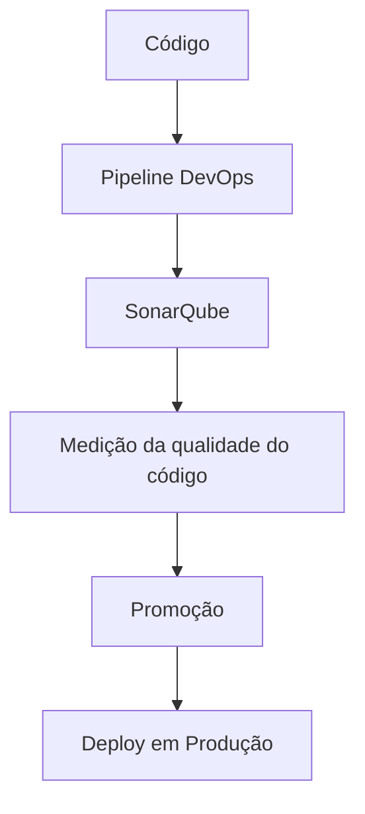

# Certificação de Revisão de Código Nível 4 com DevOps e SonarQube

## 1. Metadados do Documento
- **Arquivo de Origem:** Não identificado
- **Tipo de Documento:** Apresentação Executiva
- **Domínio / Sistema:** Certificação de Revisão de Código; DevOps; SonarQube
- **Público-Alvo:** Desenvolvedores, Arquitetos e equipes DevOps
- **Data/Versão Identificada:** Nível 4; demais versão e data não identificadas

---

## 2. Resumo Executivo & Contexto de Negócio

O documento apresenta o tema de certificação de **Revisão de Código Nível 4**, com foco em revisão de código integrada a práticas de **DevOps**. O conteúdo indica um temário destinado à incorporação do SonarQube em pipelines DevOps.

O objetivo explicitamente declarado é medir a qualidade do código antes da promoção e do deploy em Produção. Dessa forma, o SonarQube é posicionado como um componente de avaliação de qualidade dentro do processo de entrega de software.

O documento não descreve métricas específicas de qualidade, regras de bloqueio, quality gates, métodos de integração, formatos de relatório ou contratos técnicos. Também não identifica os pipelines, repositórios, ambientes intermediários ou responsáveis operacionais envolvidos.

---

## 3. Arquitetura, Componentes & Tecnologias Envolvidas

Componentes e conceitos citados:

| Componente / Conceito | Papel declarado no documento |
| :--- | :--- |
| Revisão de Código | Tema da certificação de nível 4. |
| DevOps | Contexto dos pipelines nos quais o SonarQube será integrado. |
| SonarQube | Ferramenta a ser integrada aos pipelines DevOps para medir a qualidade do código. |
| Pipelines DevOps | Fluxo de automação que recebe a integração com SonarQube antes da promoção e do deploy. |
| Produção | Ambiente de destino após promoção e deploy do código. |
| Home Solutions APIs Documentation Zeus | Texto de navegação ou identificação apresentado no conteúdo bruto; a relação arquitetural com a certificação não é detalhada. |
| CF | Sigla exibida no conteúdo bruto sem definição contextual. |



**Nota de Análise:** O documento afirma que o SonarQube deve ser integrado aos pipelines DevOps para medir a qualidade antes da promoção e do deploy em Produção. O documento não detalha critérios de aprovação, ações em caso de falha, interfaces de integração, tecnologias de pipeline ou ambientes anteriores à Produção.

---

## 4. Regras de Negócio, Especificações Funcionais & Processos

1. O conteúdo aborda a certificação de **Revisão de Código nível 4**.
2. O temário inclui revisão de código com DevOps.
3. O SonarQube deve ser integrado aos pipelines DevOps.
4. A integração com SonarQube tem a finalidade de medir a qualidade do código.
5. A medição da qualidade deve ocorrer antes da promoção do código.
6. A medição da qualidade deve ocorrer antes do deploy em Produção.

Fluxo funcional identificado:

1. O código passa pelo pipeline DevOps.
2. O pipeline DevOps integra o SonarQube.
3. O SonarQube mede a qualidade do código.
4. A medição ocorre antes da promoção.
5. A medição ocorre antes do deploy em Produção.

**Nota de Análise:** Não foram identificados no documento critérios numéricos de qualidade, thresholds, métricas de cobertura, severidades, políticas de exceção ou condições explícitas para aprovar ou bloquear a promoção.

---

## 5. Tabelas de Parâmetros, Ambientes e Estruturas de Dados

| Item / Parâmetro | Descrição / Função | Tipo / Valores / Formato | Ambiente / Observações |
| :--- | :--- | :--- | :--- |
| Nível de certificação | Identifica o nível da certificação de revisão de código. | Nível 4 | Declarado no título do conteúdo. |
| SonarQube | Ferramenta integrada ao pipeline para medir a qualidade do código. | Ferramenta de qualidade de código | Método de integração não informado. |
| Pipeline DevOps | Pipeline que incorpora o SonarQube. | Pipeline de automação | Tecnologia, plataforma e configuração não informadas. |
| Promoção | Etapa posterior à medição da qualidade do código. | Processo de promoção | Critérios de promoção não detalhados. |
| Produção | Destino do deploy mencionado no documento. | Ambiente | URL, servidor e configuração não informados. |
| Home Solutions APIs Documentation Zeus | Texto exibido no conteúdo bruto. | Referência de navegação ou identificação | Não há detalhamento da função no processo de certificação. |
| CF | Sigla exibida no conteúdo bruto. | Não identificado | Significado não informado. |

---

## 6. Bateria de Perguntas & Respostas para RAG (FAQ Sintético)

### P1: Qual é o tema principal da certificação apresentada no documento?
**R:** O documento apresenta a certificação de **Revisão de Código nível 4**, incluindo o tópico de revisão de código com DevOps.

### P2: Qual ferramenta deve ser integrada aos pipelines DevOps?
**R:** O documento declara que o **SonarQube** deve ser integrado aos pipelines DevOps.

### P3: Qual é a finalidade da integração do SonarQube ao pipeline DevOps?
**R:** A finalidade declarada é medir a qualidade do código antes da promoção e do deploy em Produção.

### P4: Em qual momento a qualidade do código deve ser medida?
**R:** A qualidade do código deve ser medida antes da promoção do código e antes do deploy em Produção.

### P5: O documento especifica quais métricas do SonarQube devem ser utilizadas?
**R:** Não. O documento menciona a medição da qualidade do código com SonarQube, mas não especifica métricas, limites, indicadores ou quality gates.

### P6: O documento descreve como configurar o SonarQube no pipeline?
**R:** Não. O documento informa que o SonarQube deve ser integrado aos pipelines DevOps, mas não detalha configuração, comandos, plugins, credenciais ou tecnologia de pipeline.

### P7: O documento define critérios para bloquear uma promoção para Produção?
**R:** Não. O documento estabelece somente que a qualidade do código deve ser medida antes da promoção e do deploy em Produção; critérios de bloqueio ou aprovação não são descritos.

### P8: Qual ambiente é mencionado como destino do deploy?
**R:** O ambiente explicitamente mencionado é **Produção**.

### P9: O que significa a sigla CF exibida no documento?
**R:** O significado de **CF** não é definido no conteúdo fornecido.

### P10: A expressão “Home Solutions APIs Documentation Zeus” identifica uma arquitetura ou sistema detalhado?
**R:** Não. A expressão aparece no conteúdo bruto, mas o documento não explica sua relação com a certificação, o SonarQube, os pipelines DevOps ou o deploy em Produção.

---

## 7. Glossário de Termos, Siglas & Conceitos-Chave

- **DevOps:** Contexto dos pipelines nos quais o SonarQube será integrado para medir a qualidade do código.
- **SonarQube:** Ferramenta citada para medição da qualidade do código nos pipelines DevOps.
- **Pipeline DevOps:** Fluxo de automação no qual o SonarQube deve ser integrado.
- **Promoção:** Etapa mencionada como posterior à medição de qualidade do código.
- **Produção:** Ambiente citado como destino do deploy.
- **CF:** Sigla presente no conteúdo bruto, sem significado definido no documento.
- **Home Solutions APIs Documentation Zeus:** Texto apresentado no conteúdo bruto sem definição ou detalhamento funcional.

---

## 8. Notas Críticas, Riscos & Limitações

- O documento possui conteúdo resumido e não detalha a implementação técnica da integração entre SonarQube e pipelines DevOps.
- Não há definição de métricas de qualidade, thresholds, quality gates, severidades ou políticas de aprovação.
- Não há informações sobre plataformas de CI/CD, repositórios de código, linguagens, versões, URLs, portas, servidores ou credenciais.
- Não foram identificados procedimentos de tratamento para falhas na análise de qualidade.
- As referências a **CF** e **Home Solutions APIs Documentation Zeus** não possuem explicação adicional no conteúdo fornecido.
- Não é possível inferir se a medição de qualidade bloqueia automaticamente a promoção ou o deploy em Produção.

---

## 9. Conteúdo Bruto Estruturado (Referência Fiel)

```text
--- [PÁGINA 1 DE 1] ---

CERTIFICACIÓN - REVISIÓN DE CÓDIGO
NIVEL 4
CERTIFICACIÓN
Revisión de Código nivel
4
REVISIÓN DE CÓDIGO CON DEVOPS
En este apartado se encuentra el temario para integrar SonarQube en los pipelines de DevOps,
de forma que podamos medir la calidad de nuestro código antes de su promoción y despliegue
en Producción
 / 
 CF
Home Solutions APIs Documentation Zeus
EN
```
