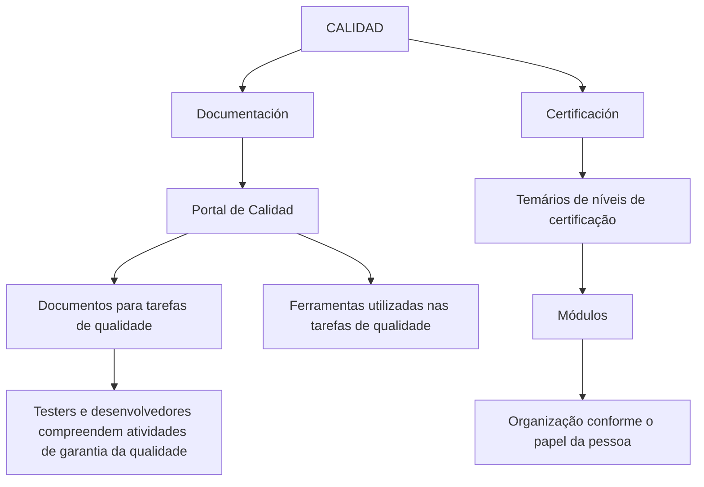

# CALIDAD — Documentação e Certificação para Qualidade de Produtos

## 1. Metadados do Documento
- **Arquivo de Origem:** Não identificado
- **Tipo de Documento:** Manual Operacional
- **Domínio / Sistema:** CALIDAD / Portal de Calidad
- **Público-Alvo:** Testers, desenvolvedores e pessoas que realizam tarefas de qualidade de produto
- **Data/Versão Identificada:** Não identificada

---

## 2. Resumo Executivo & Contexto de Negócio

O conteúdo apresenta a seção **CALIDAD**, destinada a disponibilizar documentação para aquisição de conhecimentos funcionais e técnicos relacionados à qualidade de produtos. A informação é organizada sob duas perspectivas explícitas: **Documentación** e **Certificación**.

A perspectiva de **Documentación** fornece acesso ao **Portal de Calidad**. Nesse portal estão localizados documentos que apoiam a execução das tarefas de qualidade de um produto e o conhecimento das ferramentas utilizadas nessas atividades.

O público indicado pelo conteúdo inclui testers e desenvolvedores. Esses profissionais podem utilizar o Portal de Calidad para compreender as atividades necessárias para garantir a qualidade do produto.

A perspectiva de **Certificación** reúne os conteúdos programáticos dos diferentes níveis de certificação. Os temas são divididos em módulos e organizados conforme o papel da pessoa que executa as tarefas.

---

## 3. Arquitetura, Componentes & Tecnologias Envolvidas

Os componentes e áreas explicitamente mencionados são:

| Componente / Área | Papel descrito |
| :--- | :--- |
| CALIDAD | Seção que concentra documentação para conhecimentos funcionais e técnicos. |
| Documentación | Perspectiva que direciona ao Portal de Calidad e aos documentos de apoio à qualidade. |
| Certificación | Perspectiva que disponibiliza conteúdos de certificação divididos por nível, módulo e papel. |
| Portal de Calidad | Local de acesso aos documentos e às ferramentas relacionadas às tarefas de qualidade de produto. |
| Home | Elemento de navegação citado no conteúdo bruto. |
| Solutions | Elemento de navegação citado no conteúdo bruto. |
| APIs | Elemento de navegação citado no conteúdo bruto. |
| Documentation | Elemento de navegação citado no conteúdo bruto. |
| Zeus | Elemento de navegação citado no conteúdo bruto. |
| EN | Indicador citado no conteúdo bruto. |



> **Nota de Análise:** O conteúdo não detalha arquitetura técnica, integrações, tecnologias de implementação, URLs, métodos HTTP, contratos de API, ambientes ou mecanismos de autenticação para o Portal de Calidad.

---

## 4. Regras de Negócio, Especificações Funcionais & Processos

### Organização da informação da seção CALIDAD
1. A seção CALIDAD disponibiliza documentação para aquisição de conhecimentos funcionais e técnicos.
2. A informação é organizada em duas perspectivas: **Documentación** e **Certificación**.

### Perspectiva: Documentación
1. A área Documentación contém acesso ao **Portal de Calidad**.
2. O Portal de Calidad reúne documentos que ajudam na realização das tarefas de qualidade de um produto.
3. O Portal de Calidad também permite conhecer as ferramentas utilizadas para a realização das tarefas de qualidade.
4. Testers e desenvolvedores podem compreender, por meio desse conteúdo, as atividades necessárias para garantir a qualidade do produto.

### Perspectiva: Certificación
1. A área Certificación contém os temários de diferentes níveis de certificação.
2. Os temários de certificação são divididos por módulos.
3. A organização dos temas considera o papel da pessoa que realiza as tarefas.

> **Nota de Análise:** O documento não apresenta critérios de aprovação, nomes dos níveis de certificação, conteúdo dos módulos, regras de elegibilidade, duração, responsáveis ou fluxos de inscrição.

---

## 5. Tabelas de Parâmetros, Ambientes e Estruturas de Dados

| Item / Parâmetro | Descrição / Função | Tipo / Valores / Formato | Ambiente / Observações |
| :--- | :--- | :--- | :--- |
| CALIDAD | Seção que disponibiliza documentação para conhecimentos funcionais e técnicos. | Área documental | Não detalhado. |
| Documentación | Perspectiva que concentra o acesso ao Portal de Calidad. | Perspectiva de conteúdo | Não detalhado. |
| Certificación | Perspectiva que concentra temários de certificação. | Perspectiva de conteúdo | Não detalhado. |
| Portal de Calidad | Local onde se encontram documentos e informações sobre ferramentas para tarefas de qualidade de produto. | Portal | URL não informada. |
| Documentos de qualidade | Materiais que ajudam a realizar tarefas de qualidade de um produto. | Documentação | Formato e localização específica não informados. |
| Ferramentas de qualidade | Ferramentas utilizadas para a realização das tarefas de qualidade. | Ferramentas | Nomes e versões não informados. |
| Temarios | Conteúdos dos diferentes níveis de certificação. | Conteúdo de certificação | Detalhamento não informado. |
| Módulos | Divisão dos temários de certificação. | Estrutura curricular | Nomes dos módulos não informados. |
| Rol | Critério de organização dos temários para a pessoa que realiza as tarefas. | Papel profissional | Papéis específicos não informados. |
| Home / Solutions / APIs / Documentation / Zeus / EN | Elementos presentes no rodapé ou navegação do conteúdo extraído. | Navegação / rótulos | Relação funcional não detalhada. |

---

## 6. Bateria de Perguntas & Respostas para RAG (FAQ Sintético)

### P1: Qual é o propósito da seção CALIDAD?
**R:** A seção CALIDAD disponibiliza documentação para adquirir conhecimentos funcionais e técnicos relacionados à qualidade de produtos. O conteúdo é organizado nas perspectivas Documentación e Certificación.

### P2: Quais são as duas perspectivas de organização da informação em CALIDAD?
**R:** A informação da seção CALIDAD é organizada em duas perspectivas: **Documentación** e **Certificación**.

### P3: O que pode ser encontrado na área Documentación?
**R:** A área Documentación contém o acesso ao Portal de Calidad, onde estão documentos que ajudam na realização das tarefas de qualidade de um produto e informações sobre as ferramentas utilizadas nessas tarefas.

### P4: Qual é a função do Portal de Calidad?
**R:** O Portal de Calidad reúne documentos que apoiam a execução das tarefas de qualidade de produto e permite conhecer as ferramentas utilizadas para realizá-las.

### P5: Quem pode utilizar o conteúdo do Portal de Calidad?
**R:** O conteúdo informa que testers e desenvolvedores podem utilizar o Portal de Calidad para compreender as atividades necessárias para garantir a qualidade do produto.

### P6: O que significa a perspectiva Certificación no contexto do documento?
**R:** Certificación é a perspectiva que reúne os temários dos diferentes níveis de certificação, divididos em módulos e organizados conforme o papel da pessoa que realiza as tarefas.

### P7: Como os conteúdos de certificação são estruturados?
**R:** Os conteúdos de certificação são estruturados por diferentes níveis, divididos em módulos e organizados em função do papel da pessoa que executa as tarefas.

### P8: O documento informa quais ferramentas de qualidade são usadas?
**R:** Não. O documento afirma que o Portal de Calidad permite conhecer as ferramentas utilizadas nas tarefas de qualidade, mas não identifica os nomes, versões ou finalidades específicas dessas ferramentas.

### P9: O documento detalha os níveis e módulos de certificação?
**R:** Não. O documento informa que existem diferentes níveis de certificação e que os temários são divididos por módulos, porém não apresenta os nomes dos níveis, os módulos ou seus conteúdos.

### P10: O documento fornece a URL do Portal de Calidad?
**R:** Não. O texto menciona o Portal de Calidad, mas não fornece URL, endereço de acesso, ambiente ou instruções de autenticação.

---

## 7. Glossário de Termos, Siglas & Conceitos-Chave

- **CALIDAD:** Seção voltada à documentação para conhecimentos funcionais e técnicos relacionados à qualidade de produtos.
- **Documentación:** Perspectiva que disponibiliza acesso ao Portal de Calidad e aos documentos de apoio às tarefas de qualidade.
- **Certificación:** Perspectiva que reúne temários de diferentes níveis de certificação.
- **Portal de Calidad:** Portal citado como local de documentos e informações sobre ferramentas usadas em tarefas de qualidade.
- **Temarios:** Conteúdos programáticos dos níveis de certificação.
- **Módulos:** Divisões dos temários de certificação.
- **Rol:** Papel da pessoa que realiza as tarefas; utilizado como critério de organização dos temários.
- **APIs:** Termo listado na navegação do conteúdo bruto, sem expansão ou descrição adicional no documento.
- **Zeus:** Termo listado na navegação do conteúdo bruto, sem descrição adicional no documento.
- **EN:** Indicador listado no conteúdo bruto, sem detalhamento adicional.

---

## 8. Notas Críticas, Riscos & Limitações

- O conteúdo não identifica o arquivo de origem, a data, a versão ou o responsável pela documentação.
- Não há URL, ambiente, credenciais, método de acesso ou requisito de autenticação para o Portal de Calidad.
- Os documentos, ferramentas, níveis de certificação, módulos e papéis profissionais são mencionados sem listagem detalhada.
- Não são apresentados procedimentos operacionais passo a passo para tarefas de qualidade.
- Não há arquitetura de software, integrações, contratos de APIs, tecnologias, servidores ou parâmetros técnicos detalhados.
- Os itens “Home”, “Solutions”, “APIs”, “Documentation”, “Zeus” e “EN” aparecem no conteúdo extraído, mas sua função não é explicada.

---

## 9. Conteúdo Bruto Estruturado (Referência Fiel)

```text
--- [PÁGINA 1 DE 1] ---

CALIDAD
 En este apartado se encuentra la documentación que permite adquirir
conocimientos tanto funcionales como técnicos. La información está organizada en
dos perspectivas:
Documentación
Certificación
DOCUMENTACIÓN
En este lugar se encuentra el acceso al Portal de Calidad, dónde se ubican los documentos que
ayudan a realizar las tareas de Calidad de un Producto, así como conocer las herramientas que se
utilizan para su realización. Es un lugar donde los tester y desarrolladores pueden comprender como
se realizan las actividades necesarias para garantizar la Calidad del Producto.
CERTIFICACIÓN
Aquí se encuentran los temarios de los distintos niveles de certificación divididos por módulos, en
función del rol de la persona que realiza las tareas.
 / 
 CF
Home Solutions APIs Documentation Zeus
EN
```
