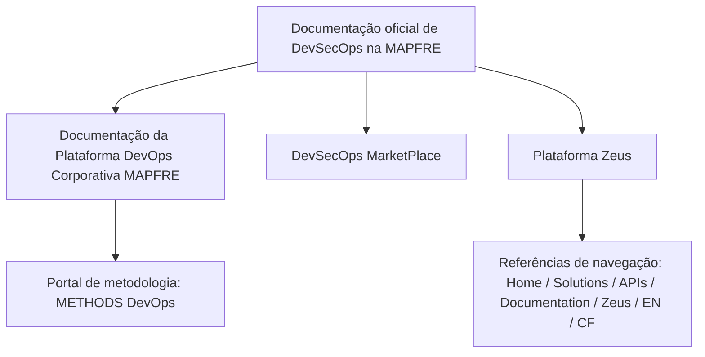

# Documentação Oficial de DevSecOps e Plataforma Zeus na MAPFRE

## 1. Metadados do Documento
- **Arquivo de Origem:** Não identificado
- **Tipo de Documento:** Procedimento / Referência de documentação
- **Domínio / Sistema:** DevSecOps, Plataforma DevOps Corporativa MAPFRE e Plataforma Zeus
- **Público-Alvo:** Desenvolvedores, Arquitetos e Operação
- **Data/Versão Identificada:** Não identificada

---

## 2. Resumo Executivo & Contexto de Negócio

O documento apresenta os pontos de acesso à documentação oficial relacionada a DevSecOps na MAPFRE. O conteúdo posiciona a documentação como referência para assuntos associados à Plataforma DevOps Corporativa MAPFRE.

A consulta à documentação da plataforma ocorre por meio do portal de metodologia **METHODS DevOps**. O documento também indica um ponto específico denominado **DevSecOps MarketPlace** para conteúdos de DevSecOps.

A **Plataforma Zeus** é apresentada como outro destino documental, identificado no texto como “Plataforma Zeus”. A navegação indicada inclui as referências “Home”, “Solutions”, “APIs”, “Documentation”, “Zeus”, “EN” e “CF”.

Não há detalhamento sobre processos DevSecOps, ferramentas técnicas, contratos de APIs, controles de segurança, ambientes, versões, responsabilidades operacionais ou URLs completas. O documento funciona como um índice resumido de localização de documentação.

---

## 3. Arquitetura, Componentes & Tecnologias Envolvidas

Os componentes e referências explicitamente citados são:

| Componente / Referência | Papel descrito no documento |
| :--- | :--- |
| DevSecOps | Tema da documentação oficial abordada. |
| Plataforma DevOps Corporativa MAPFRE | Plataforma cuja documentação relacionada é indicada pelo documento. |
| METHODS DevOps | Portal de metodologia onde se encontra a documentação relacionada à Plataforma DevOps Corporativa MAPFRE. |
| DevSecOps MarketPlace | Local indicado para DevSecOps. |
| Plataforma Zeus | Local indicado para Zeus. |
| Home / Solutions / APIs / Documentation / Zeus / EN / CF | Termos de navegação ou categorização exibidos no conteúdo bruto. O documento não explica suas funções individuais. |



**Nota de Análise:** O documento não descreve arquitetura de software, integrações, microsserviços, métodos HTTP, contratos JSON, infraestrutura, tecnologias de implementação ou fluxos de dados entre a Plataforma DevOps Corporativa MAPFRE e a Plataforma Zeus.

---

## 4. Regras de Negócio, Especificações Funcionais & Processos

O documento não especifica regras de negócio, validações, cálculos, permissões, fluxos operacionais ou procedimentos técnicos detalhados.

O único fluxo documental que pode ser extraído fielmente é:

1. Consultar a documentação oficial relacionada a DevSecOps na MAPFRE.
2. Para documentação relacionada à Plataforma DevOps Corporativa MAPFRE, acessar o portal de metodologia **METHODS DevOps**.
3. Para conteúdos de DevSecOps, consultar **DevSecOps MarketPlace**.
4. Para conteúdos relacionados a Zeus, consultar a **Plataforma Zeus**.
5. Considerar as referências textuais de navegação exibidas: “Home”, “Solutions”, “APIs”, “Documentation”, “Zeus”, “EN” e “CF”.

**Nota de Análise:** O conteúdo não detalha critérios para selecionar uma documentação, requisitos de acesso, autenticação, responsáveis pelos portais, procedimentos de atualização documental ou regras de uso das APIs.

---

## 5. Tabelas de Parâmetros, Ambientes e Estruturas de Dados

| Item / Parâmetro | Descrição / Função | Tipo / Valores / Formato | Ambiente / Observações |
| :--- | :--- | :--- | :--- |
| Documentação oficial DevSecOps | Conteúdo oficial referente a DevSecOps na MAPFRE. | Referência documental | Não há URL completa nem versão identificada. |
| Plataforma DevOps Corporativa MAPFRE | Plataforma para a qual o documento indica documentação relacionada. | Plataforma corporativa | Sem detalhamento técnico adicional. |
| METHODS DevOps | Portal de metodologia indicado para localizar documentação da Plataforma DevOps Corporativa MAPFRE. | Portal | Identificado textualmente como “METHODS DevOps”. |
| DevSecOps MarketPlace | Local indicado para DevSecOps. | Referência de portal / marketplace | O documento não descreve categorias ou recursos disponíveis. |
| Plataforma Zeus | Local indicado para conteúdos relacionados a Zeus. | Plataforma | Não há informações sobre arquitetura ou operação. |
| Home | Referência textual de navegação. | Rótulo de navegação | Função não detalhada. |
| Solutions | Referência textual de navegação. | Rótulo de navegação | Função não detalhada. |
| APIs | Referência textual de navegação. | Rótulo de navegação | O documento não lista APIs, métodos ou contratos. |
| Documentation | Referência textual de navegação. | Rótulo de navegação | Função não detalhada. |
| Zeus | Referência textual de navegação. | Rótulo de navegação / plataforma | Relacionado à Plataforma Zeus. |
| EN | Referência textual exibida no conteúdo. | Sigla ou seletor | Significado não definido no documento. |
| CF | Referência textual exibida no conteúdo. | Sigla | Significado não definido no documento. |

---

## 6. Bateria de Perguntas & Respostas para RAG (FAQ Sintético)

### P1: Qual é o tema principal do documento?
**R:** O documento aborda a documentação oficial relacionada a DevSecOps na MAPFRE e aponta referências para a documentação da Plataforma DevOps Corporativa MAPFRE e da Plataforma Zeus.

### P2: Onde está a documentação relacionada à Plataforma DevOps Corporativa MAPFRE?
**R:** O documento informa que a documentação relacionada à Plataforma DevOps Corporativa MAPFRE encontra-se no portal de metodologia **METHODS DevOps**.

### P3: Onde deve ser consultado o conteúdo de DevSecOps?
**R:** O conteúdo informa que DevSecOps encontra-se no **DevSecOps MarketPlace**.

### P4: Onde deve ser consultado o conteúdo relacionado a Zeus?
**R:** O documento informa que Zeus encontra-se na **Plataforma Zeus**.

### P5: O documento fornece a URL do portal METHODS DevOps?
**R:** Não. O documento cita o portal de metodologia **METHODS DevOps**, mas não apresenta uma URL completa.

### P6: Quais elementos de navegação são exibidos para a Plataforma Zeus?
**R:** O conteúdo apresenta as referências “Home”, “Solutions”, “APIs”, “Documentation”, “Zeus”, “EN” e “CF”. O documento não explica a função de cada referência.

### P7: O documento descreve APIs da Plataforma Zeus?
**R:** Não. Embora o termo “APIs” apareça entre as referências de navegação, o documento não detalha endpoints, métodos HTTP, contratos, autenticação ou payloads.

### P8: O documento apresenta uma arquitetura técnica da Plataforma DevOps Corporativa MAPFRE?
**R:** Não. O conteúdo apenas direciona para documentação da Plataforma DevOps Corporativa MAPFRE por meio do portal METHODS DevOps; não descreve componentes técnicos, integrações ou infraestrutura.

### P9: Há informações sobre versões, datas ou responsáveis pela documentação?
**R:** Não. Nenhuma data, versão, autor, equipe responsável ou ciclo de atualização é identificado no conteúdo extraído.

### P10: O que significa a sigla CF apresentada no documento?
**R:** O significado de “CF” não é definido no documento. Ela aparece apenas como uma referência textual junto de “Home”, “Solutions”, “APIs”, “Documentation”, “Zeus” e “EN”.

---

## 7. Glossário de Termos, Siglas & Conceitos-Chave

- **DevSecOps:** Tema central da documentação oficial mencionada no documento. O texto não apresenta uma definição expandida.
- **MAPFRE:** Organização citada como contexto da documentação e da Plataforma DevOps Corporativa.
- **METHODS DevOps:** Portal de metodologia indicado para a documentação relacionada à Plataforma DevOps Corporativa MAPFRE.
- **DevSecOps MarketPlace:** Local indicado pelo documento para DevSecOps.
- **Plataforma Zeus:** Plataforma indicada como local de consulta para Zeus.
- **APIs:** Termo exibido na navegação da Plataforma Zeus; não há detalhamento das interfaces no documento.
- **EN:** Referência textual exibida; significado não definido.
- **CF:** Referência textual exibida; significado não definido.

---

## 8. Notas Críticas, Riscos & Limitações

- O conteúdo é resumido e não contém URLs completas para METHODS DevOps, DevSecOps MarketPlace ou Plataforma Zeus.
- Não há detalhamento de arquitetura, integrações, tecnologias, ambientes, servidores, credenciais, permissões ou operação.
- O documento cita “APIs”, mas não apresenta métodos HTTP, contratos, esquemas de dados ou requisitos de autenticação.
- As siglas **EN** e **CF** não são definidas.
- Não foram identificadas data, versão, autoria, responsáveis ou política de manutenção da documentação.
- **Nota de Análise:** O documento lista a Plataforma Zeus e referências de navegação, porém não detalha o escopo funcional, técnico ou operacional da Plataforma Zeus.

---

## 9. Conteúdo Bruto Estruturado (Referência Fiel)

```text
--- [PÁGINA 1 DE 1] ---

Imagen LOGO
DOCUMENTACIÓN
 En este apartado se aborda la documentación oficial de todo los
relacionado con DevSecOps en MAPFRE.
La documentación relacionada con la Plataforma DevOps Corporativa de MAPFRE se encuentra en:
El portal de metodología 🧰  METHODS DevOps
DevOps se encuetra: 🧰  DevSecOps MarketPlace
Zeus se encuentra:🧰  Plataforma Zeus
 / 
 CF
Home Solutions APIs Documentation Zeus
EN
```
