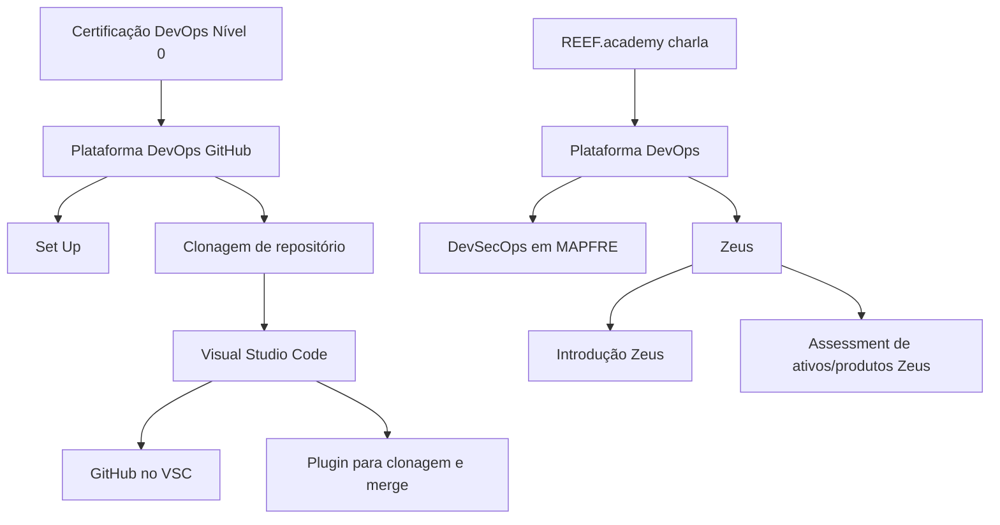
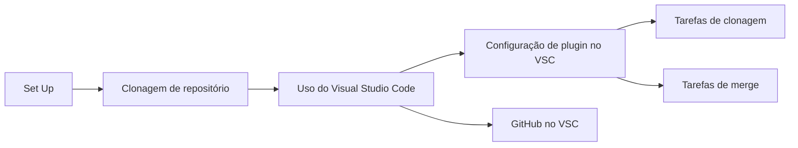

# Certificação DevOps Nível 0 e Plataforma DevOps MAPFRE — Conteúdo Introdutório

## 1. Metadados do Documento
- **Arquivo de Origem:** Não identificado no conteúdo extraído
- **Tipo de Documento:** Apresentação Executiva
- **Domínio / Sistema:** DevOps, Plataforma DevOps GitHub, DevSecOps MAPFRE, Zeus, REEF.academy
- **Público-Alvo:** Desenvolvedores e profissionais em capacitação DevOps
- **Data/Versão Identificada:** Não identificada

---

## 2. Resumo Executivo & Contexto de Negócio

O conteúdo apresenta tópicos de uma certificação de **DevOps Nível 0**, associada à **Plataforma DevOps GitHub**. A apresentação menciona atividades iniciais de configuração (*Set Up*), clonagem de repositórios e utilização do **Visual Studio Code (VSC)** como ferramenta de desenvolvimento.

A utilização do GitHub no Visual Studio Code é apresentada como parte do processo de desenvolvimento. O conteúdo indica que a configuração de plugin no VSC apoia tarefas como clonagem e *merge* de repositórios.

A apresentação também relaciona a certificação à **Plataforma DevOps MAPFRE**, ao conceito de **DevSecOps em MAPFRE** e ao sistema ou iniciativa denominada **Zeus**. Zeus é citado em tópicos de introdução e de *assessment* de ativos/produtos.

O material extraído é predominantemente composto por títulos e tópicos de apresentação. Não há detalhamento de arquitetura técnica, métodos HTTP, contratos de integração, políticas de segurança, fluxos de CI/CD, ambientes, versões de ferramentas ou procedimentos operacionais completos.

---

## 3. Arquitetura, Componentes & Tecnologias Envolvidas

### Componentes, plataformas e ferramentas citados

| Componente / Termo | Categoria | Papel identificado no conteúdo |
| :--- | :--- | :--- |
| DevOps | Prática / tema de capacitação | Tema da certificação de nível 0 e da apresentação REEF.academy. |
| Plataforma DevOps GitHub | Plataforma | Plataforma citada no contexto de *Set Up* e clonagem de repositório. |
| GitHub | Plataforma de repositórios | Citado para uso integrado ao Visual Studio Code. |
| Visual Studio Code (VSC) | Ferramenta de desenvolvimento | Ferramenta indicada para desenvolvimento e para configuração de plugin relacionado a clonagem e *merge*. |
| Plugin do VSC | Extensão de ferramenta | Mencionado como elemento de configuração para tarefas de clonagem e *merge*. O plugin não é identificado nominalmente. |
| DevSecOps MAPFRE | Tema / prática organizacional | Tópico apresentado no contexto da Plataforma DevOps MAPFRE. |
| Zeus | Sistema, produto ou iniciativa não detalhada | Citado em tópicos de introdução e *assessment* de ativos/produtos. |
| REEF.academy | Contexto de apresentação | Citado como “charla” sobre Plataforma DevOps. |
| Home Solutions APIs Documentation Zeus | Navegação ou referência textual | Expressão apresentada no conteúdo bruto, sem explicação funcional adicional. |



**Nota de Análise:** O diagrama representa somente relações temáticas explicitamente apresentadas. O conteúdo não descreve conexões de rede, integração entre sistemas, serviços, APIs, bancos de dados, pipelines ou responsabilidades técnicas entre os componentes.

---

## 4. Regras de Negócio, Especificações Funcionais & Processos

### Conteúdos e processos identificados

1. A certificação é denominada **“CERTIFICACIÓN - DevOps Nivel 0”**.
2. A **Plataforma DevOps GitHub** é um tópico do conteúdo.
3. O processo de **Set Up** é mencionado, sem etapas, pré-requisitos ou critérios de conclusão.
4. A **clonagem de repositório** é apresentada como conteúdo ou atividade.
5. O **Visual Studio Code** é indicado como ferramenta de desenvolvimento.
6. A configuração de um **plugin no Visual Studio Code** é mencionada para apoiar tarefas de:
   - Clonagem;
   - *Merge*;
   - Outras tarefas não especificadas, representadas pelo texto “etc.”.
7. **GitHub no VSC** é listado como tópico específico.
8. A apresentação REEF.academy inclui os temas:
   - Plataforma DevOps;
   - DevSecOps em MAPFRE;
   - O que é DevOps;
   - O que é a Plataforma DevOps MAPFRE;
   - DevSecOps MAPFRE;
   - Zeus;
   - Introdução Zeus;
   - Introdução e *assessment* de ativos/produtos Zeus;
   - Conteúdo relevante.

### Fluxo funcional mínimo suportado pelo conteúdo



**Nota de Análise:** O conteúdo não define comandos de clonagem, estratégia de *branching*, regras de aprovação, política de *merge*, processo de *pull request*, gestão de credenciais, requisitos de autenticação, controles DevSecOps ou critérios de *assessment* de ativos/produtos Zeus.

---

## 5. Tabelas de Parâmetros, Ambientes e Estruturas de Dados

| Item / Parâmetro | Descrição / Função | Tipo / Valores / Formato | Ambiente / Observações |
| :--- | :--- | :--- | :--- |
| Certificação | Formação citada no documento. | “DevOps Nivel 0” | Não há versão, duração ou critérios de certificação. |
| Plataforma DevOps | Plataforma abordada na certificação. | GitHub | Não há URL, organização, repositório ou configuração especificada. |
| Set Up | Atividade ou tópico inicial. | Não detalhado | Não há passos, parâmetros ou pré-requisitos. |
| Clonado | Tópico relacionado a cópia de repositório. | “Clonado de repositorio” | Não há comando, protocolo ou repositório de origem. |
| Ferramenta de desenvolvimento | Ferramenta indicada para desenvolvimento e operações GitHub. | Visual Studio Code / VSC | Versão não identificada. |
| Plugin VSC | Plugin mencionado para atividades no VSC. | Não identificado | Associado a clonagem, *merge* e outras tarefas não especificadas. |
| Integração de ferramenta | Uso do GitHub dentro do Visual Studio Code. | “GitHub en VSC” | Não há detalhes de extensão, autenticação ou configuração. |
| DevSecOps MAPFRE | Tema relacionado à Plataforma DevOps MAPFRE. | Não detalhado | Não há controles, ferramentas ou processos descritos. |
| Zeus | Sistema, ativo, produto ou iniciativa citada. | Não detalhado | O documento menciona introdução e *assessment* de ativos/produtos. |
| Assessment Zeus | Avaliação relacionada a ativos/produtos Zeus. | Não detalhado | Não há critérios, campos, responsáveis ou resultado esperado. |
| Home Solutions APIs Documentation Zeus | Texto listado no material. | Não detalhado | Não há contexto suficiente para classificá-lo como URL, menu ou sistema. |

---

## 6. Bateria de Perguntas & Respostas para RAG (FAQ Sintético)

### P1: Qual é o nível da certificação DevOps apresentada no documento?
**R:** A certificação apresentada é denominada **“CERTIFICACIÓN - DevOps Nivel 0”**. O conteúdo não informa duração, requisitos, prova, critérios de aprovação ou trilha posterior.

### P2: Qual plataforma DevOps é citada na certificação?
**R:** A certificação cita a **Plataforma DevOps GitHub**. O documento não fornece URL da plataforma, nomes de organizações GitHub, repositórios ou procedimentos de acesso.

### P3: Quais atividades de Git são mencionadas para o Visual Studio Code?
**R:** O documento menciona a configuração de um plugin no **Visual Studio Code (VSC)** para realizar tarefas de **clonagem** e **merge**. Não são apresentados comandos, fluxos de aprovação ou políticas de integração de código.

### P4: O documento identifica qual plugin do Visual Studio Code deve ser utilizado?
**R:** Não. O conteúdo apenas informa que existe a configuração de “seu plugin” para tarefas de clonagem, *merge* e outras atividades. O nome, a versão, o fornecedor e o método de instalação do plugin não são detalhados.

### P5: O que significa “GitHub en VSC” no contexto do material?
**R:** “GitHub en VSC” é um tópico listado na certificação DevOps Nível 0. Pelo contexto, está relacionado ao uso do GitHub dentro do Visual Studio Code, mas o documento não descreve funcionalidades, configurações, permissões ou fluxos específicos dessa integração.

### P6: Quais temas da Plataforma DevOps MAPFRE são listados na apresentação REEF.academy?
**R:** A apresentação REEF.academy lista os temas Plataforma DevOps, DevSecOps em MAPFRE, o que é DevOps, o que é a Plataforma DevOps MAPFRE, DevSecOps MAPFRE e Zeus.

### P7: O que o documento informa sobre Zeus?
**R:** O documento menciona **Zeus**, uma “Introducción Zeus” e uma “Introducción y assesstment activos/productos Zeus”. Não há informação suficiente para determinar se Zeus é uma aplicação, uma plataforma, um processo, uma API ou outro tipo de ativo corporativo.

### P8: Quais critérios são usados no assessment de ativos/produtos Zeus?
**R:** O documento somente menciona a existência de um *assessment* de ativos/produtos Zeus. Não apresenta critérios de avaliação, escala de classificação, responsáveis, evidências necessárias, formulário, resultados ou processo de decisão.

### P9: O material descreve um pipeline de CI/CD?
**R:** Não. Embora o conteúdo trate de DevOps, Plataforma DevOps GitHub e DevSecOps MAPFRE, ele não descreve etapas de integração contínua, entrega contínua, implantação, testes automatizados, segurança de pipeline ou ferramentas de CI/CD.

### P10: Há ambientes, servidores, URLs ou portas técnicas definidos no documento?
**R:** Não. O conteúdo extraído não informa ambientes de desenvolvimento, homologação ou produção, nem servidores, URLs técnicas, portas, credenciais, variáveis de configuração ou caminhos de logs.

### P11: O documento estabelece regras de merge ou governança de repositórios?
**R:** Não. O *merge* é citado como uma tarefa possível com plugin no Visual Studio Code, mas não há regras sobre *branches*, *pull requests*, revisões, aprovações, proteção de *branch* ou tratamento de conflitos.

### P12: Qual é a relação explicitamente apresentada entre DevSecOps MAPFRE e Zeus?
**R:** Ambos aparecem como tópicos da apresentação sobre Plataforma DevOps. O documento não descreve integração, dependência, comunicação técnica ou relação operacional direta entre DevSecOps MAPFRE e Zeus.

---

## 7. Glossário de Termos, Siglas & Conceitos-Chave

- **DevOps:** Termo apresentado como tema central da certificação e da plataforma. O documento não fornece uma definição formal.
- **DevSecOps:** Termo citado como “DevSecOps em MAPFRE” e “DevSecOps MAPFRE”. O conteúdo não detalha práticas, ferramentas ou controles de segurança.
- **GitHub:** Plataforma citada no contexto da Plataforma DevOps GitHub e do uso integrado ao Visual Studio Code.
- **VSC:** Abreviação usada no documento para **Visual Studio Code**, ferramenta de desenvolvimento.
- **Visual Studio Code:** Ferramenta de desenvolvimento citada para configuração de plugin e uso do GitHub.
- **Clonagem de repositório:** Atividade citada como “Clonado de repositorio”. O documento não informa o comando, protocolo ou origem do repositório.
- **Merge:** Operação citada como tarefa suportada pelo plugin do Visual Studio Code. O conteúdo não descreve regras ou estratégia de *merge*.
- **Zeus:** Termo citado no material, relacionado a introdução e *assessment* de ativos/produtos, sem definição adicional.
- **Assessment:** Termo utilizado no contexto de ativos/produtos Zeus. Os critérios e o processo não são especificados.
- **REEF.academy:** Contexto identificado na expressão “REEF.academy charla”.
- **MAPFRE:** Organização ou contexto corporativo citado nas expressões “DevSecOps en MAPFRE” e “plataforma DevOps MAPFRE”.

---

## 8. Notas Críticas, Riscos & Limitações

- O conteúdo extraído contém principalmente títulos e tópicos, sem desenvolvimento explicativo suficiente para derivar procedimentos completos.
- Não foram identificadas versões de ferramentas, requisitos de instalação, políticas de acesso, URLs, ambientes ou parâmetros técnicos.
- O plugin do Visual Studio Code não é nomeado; portanto, não é possível afirmar qual extensão deve ser instalada.
- A referência a GitHub não especifica organização, repositórios, modelo de autenticação, permissões ou estratégias de ramificação.
- A referência a DevSecOps MAPFRE não detalha controles de segurança, ferramentas de análise, esteiras de qualidade ou requisitos de conformidade.
- Zeus é mencionado, mas sua natureza funcional e técnica não é definida pelo conteúdo disponível.
- O *assessment* de ativos/produtos Zeus é citado sem critérios, entradas, responsáveis, resultados ou fluxo de aprovação.
- A expressão “Home Solutions APIs Documentation Zeus” não dispõe de contexto suficiente para ser classificada com segurança como URL, menu, portal ou produto.

---

## 9. Conteúdo Bruto Estruturado (Referência Fiel)

```text
--- [PÁGINA 1 DE 2] ---

CERTIFICACIÓN - DevOps Nivel 0
 
CERTIFICACIÓN nivel 0
DevOps
Plataforma DevOps GitHub
Set Up
Set Up
Clonado
Clonado de repositorio
Visual Studio Code como herramienta de desarrollo: (VSC como herramienta de
desarrollo y la configuración de su plugin para hacer las tareas de clonado,
merge, etc.)
GitHub en VSC
Contenidos adicionales
 / 
 CF
Home Solutions APIs Documentation Zeus
EN


--- [PÁGINA 2 DE 2] ---

REEF.academy charla
Plataforma DevOps
DevSecOps en MAPFRE
Qué es DevOps
Que és la plataforma DevOps MAPFRE
DevSecOps MAPFRE
Zeus
Introducción Zeus
Introducción y assesstment activos/productos Zeus
Contenido relevante
```
