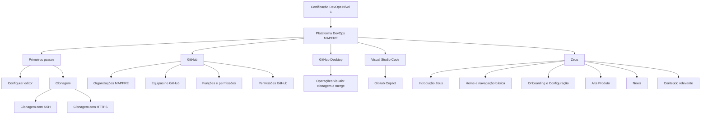

# Certificação DevOps Nível 1 — Plataforma DevOps MAPFRE

## 1. Metadados do Documento
- **Arquivo de Origem:** Não informado
- **Tipo de Documento:** Apresentação Executiva
- **Domínio / Sistema:** Certificação DevOps Nível 1; Plataforma DevOps MAPFRE; GitHub; Zeus
- **Público-Alvo:** Desenvolvedores, profissionais em onboarding e usuários da Plataforma DevOps
- **Data/Versão Identificada:** Não identificada

---

## 2. Resumo Executivo & Contexto de Negócio

O conteúdo apresenta a **Certificação DevOps Nível 1**, associada à Plataforma DevOps MAPFRE. A apresentação lista temas introdutórios para utilização de GitHub, GitHub Desktop, Visual Studio Code, GitHub Copilot, organizações, equipas, permissões e o modelo operacional da plataforma.

O material cobre atividades iniciais de trabalho com repositórios, incluindo configuração de editor, clonagem e alternativas de clonagem por SSH ou HTTPS. GitHub Desktop é citado como ferramenta visual para operações como clonagem e *merge*, especialmente quando o utilizador não trabalha com Visual Studio Code.

A apresentação também referencia a plataforma **Zeus**, incluindo introdução, página inicial, navegação básica, onboarding/configuração, cadastro de produto, notícias e conteúdo relevante. O documento não detalha fluxos operacionais, critérios de certificação, contratos técnicos, permissões específicas, nem procedimentos passo a passo.

> **Nota de Análise:** O documento apresenta tópicos resumidos de uma apresentação. Não foram fornecidas Notas do Apresentador nem explicações adicionais para os itens listados.

---

## 3. Arquitetura, Componentes & Tecnologias Envolvidas

Os componentes, ferramentas e conceitos explicitamente citados são:

- **Plataforma DevOps MAPFRE:** plataforma apresentada no contexto da certificação e do modelo operacional.
- **GitHub:** plataforma mencionada para organizações, equipas, funções e permissões.
- **GitHub Desktop:** ferramenta visual para clonagem e *merge*.
- **Visual Studio Code:** ferramenta de desenvolvimento mencionada como VSC.
- **GitHub Copilot:** ferramenta citada junto ao Visual Studio Code.
- **Zeus:** plataforma com conteúdos de introdução, navegação, onboarding/configuração, alta de produto, notícias e conteúdo relevante.
- **Formação Microsoft: Introdução GitHub:** conteúdo opcional com duração indicada de `1h32m`.
- **SSH / HTTPS:** alternativas listadas para clonagem.



> **Nota de Análise:** O documento não especifica arquitetura de software, integrações, APIs, microsserviços, versões, URLs, ambientes, servidores, logs ou contratos de dados.

---

## 4. Regras de Negócio, Especificações Funcionais & Processos

### 4.1 Conteúdos da Certificação DevOps Nível 1

1. A Certificação DevOps Nível 1 aborda a Plataforma DevOps MAPFRE.
2. GitHub Desktop é apresentado como ferramenta visual para operações como clonagem e *merge*.
3. O uso de GitHub Desktop é indicado no texto para cenários em que não se trabalha com VSC.
4. Visual Studio Code é citado como ferramenta de desenvolvimento.
5. GitHub Copilot é citado no contexto de desenvolvimento com Visual Studio Code.
6. A clonagem é apresentada com duas modalidades: SSH e HTTPS.
7. Organizações MAPFRE, equipas no GitHub, funções e permissões são conteúdos adicionais.
8. A formação Microsoft “Introdução GitHub”, com duração de `1h32m`, é opcional.

### 4.2 Plataforma DevOps e Zeus

1. O conteúdo lista os tópicos **DevOps Setup**, **Roles DevOps**, **Modelo operativo** e **Qué es la plataforma DevOps MAPFRE**.
2. Zeus é apresentado com introdução, página inicial e navegação básica.
3. Zeus inclui tópicos de onboarding e configuração, alta de produto, notícias e conteúdo relevante.
4. O documento não descreve os passos, responsáveis, regras de validação, entradas, saídas ou critérios de conclusão dos processos de DevOps Setup, onboarding, configuração ou alta de produto.

---

## 5. Tabelas de Parâmetros, Ambientes e Estruturas de Dados

| Item / Parâmetro | Descrição / Função | Tipo / Valores / Formato | Ambiente / Observações |
| :--- | :--- | :--- | :--- |
| Certificação DevOps Nível 1 | Conteúdo de certificação referido no documento. | Nível `1`. | Sem critérios de aprovação ou avaliação detalhados. |
| Plataforma DevOps MAPFRE | Plataforma abordada na certificação. | Plataforma; detalhes técnicos não informados. | O documento cita setup, roles e modelo operacional. |
| GitHub Desktop | Ferramenta visual para operações de repositório. | Ferramenta visual. | São citadas clonagem e *merge*. |
| Visual Studio Code | Ferramenta de desenvolvimento. | Ferramenta de desenvolvimento. | Referida como VSC. |
| GitHub Copilot | Ferramenta citada no contexto de desenvolvimento. | Ferramenta; funcionamento não detalhado. | Associada textualmente ao Visual Studio Code. |
| Clonagem com SSH | Modalidade de clonagem listada. | SSH. | Configuração e pré-requisitos não detalhados. |
| Clonagem com HTTPS | Modalidade de clonagem listada. | HTTPS. | Configuração e pré-requisitos não detalhados. |
| Organizações MAPFRE | Conteúdo adicional relacionado ao GitHub. | Organização; detalhes não informados. | Sem nomes, estruturas ou regras descritas. |
| Roles e permissões | Tópico relacionado à Plataforma DevOps. | Funções e permissões; valores não informados. | A matriz de permissões não foi apresentada. |
| Permissões GitHub | Conteúdo adicional listado. | Permissões; valores não informados. | Sem perfis, escopos ou regras de concessão. |
| Equipas no GitHub | Conteúdo adicional listado. | Equipas; estrutura não informada. | Sem equipas ou membros identificados. |
| Formação Microsoft: Introdução GitHub | Formação opcional. | Duração: `1h32m`. | O conteúdo programático não foi detalhado. |
| DevOps Setup | Tópico apresentado. | Processo/configuração; não detalhado. | Não há passos operacionais no texto. |
| Roles DevOps | Tópico apresentado. | Funções; não detalhadas. | Não há definição de responsabilidades. |
| Modelo operativo | Tópico apresentado. | Modelo operacional; não detalhado. | Não há descrição de fluxos. |
| Zeus | Plataforma citada. | Plataforma; tecnologia não informada. | Abrange introdução, navegação e outros tópicos. |
| Alta Produto | Tópico associado a Zeus. | Processo; detalhes não informados. | Não há dados, campos ou validações descritos. |
| News | Tópico associado a Zeus. | Conteúdo/notícias. | Sem detalhamento adicional. |
| Conteúdo relevante | Tópico associado a Zeus. | Conteúdo. | Critérios de relevância não informados. |

---

## 6. Bateria de Perguntas & Respostas para RAG (FAQ Sintético)

### P1: Qual é o tema central da Certificação DevOps Nível 1?
**R:** A Certificação DevOps Nível 1 aborda a Plataforma DevOps MAPFRE e lista conteúdos introdutórios relacionados a GitHub, GitHub Desktop, Visual Studio Code, GitHub Copilot, permissões, equipas, modelo operacional e Zeus.

### P2: Para que serve o GitHub Desktop segundo o documento?
**R:** GitHub Desktop é apresentado como uma ferramenta visual para executar operações como clonagem e *merge*. O texto indica seu uso quando não se trabalha com VSC.

### P3: Quais métodos de clonagem são mencionados na certificação?
**R:** A apresentação lista clonagem com SSH e clonagem com HTTPS. O documento não especifica passos de configuração, autenticação ou critérios para escolher entre SSH e HTTPS.

### P4: O documento detalha como configurar o editor para trabalhar com GitHub Desktop?
**R:** Não. “Configurar editor com GitHub Desktop” aparece como tópico de primeiros passos, mas não há instruções operacionais, parâmetros ou pré-requisitos descritos.

### P5: Quais conteúdos relacionados a permissões no GitHub são apresentados?
**R:** O documento cita “Roles y permisos”, “Permisos GitHub” e “Equipos en GitHub”. Porém, não apresenta matriz de perfis, níveis de acesso, regras de aprovação ou permissões específicas.

### P6: Qual formação opcional é indicada no material?
**R:** O material indica a formação opcional Microsoft “Introducción GitHub”, com duração de `1h32m`.

### P7: Quais tópicos da Plataforma DevOps são listados?
**R:** São listados DevOps Setup, Roles DevOps, Modelo operativo, uma explicação sobre o que é a Plataforma DevOps MAPFRE e uma introdução à plataforma.

### P8: Quais funcionalidades ou áreas de Zeus são mencionadas?
**R:** Zeus é citado com os tópicos Introdução Zeus, Home e navegação básica, Onboarding & Configuração, Alta Produto, News e Conteúdo relevante.

### P9: O documento descreve o fluxo de alta de produto em Zeus?
**R:** Não. “Alta Producto” é somente um tópico listado sob Zeus; o texto não descreve etapas, responsáveis, campos, regras de validação ou resultados do processo.

### P10: O documento informa URLs, ambientes ou tecnologias da Plataforma DevOps MAPFRE?
**R:** Não. Não há URLs, nomes de ambientes, servidores, versões, APIs, integrações ou tecnologias de implementação especificadas no conteúdo fornecido.

---

## 7. Glossário de Termos, Siglas & Conceitos-Chave

- **DevOps:** Termo presente no nome da certificação e da plataforma; o documento não fornece uma definição.
- **GitHub:** Plataforma mencionada no contexto de organizações, equipas e permissões.
- **GitHub Desktop:** Ferramenta visual citada para clonagem e *merge*.
- **VSC:** Abreviação usada no texto para Visual Studio Code.
- **Visual Studio Code:** Ferramenta de desenvolvimento citada no material.
- **GitHub Copilot:** Ferramenta mencionada junto a Visual Studio Code.
- **SSH:** Modalidade de clonagem listada.
- **HTTPS:** Modalidade de clonagem listada.
- **Merge:** Operação de repositório citada como exemplo de uso do GitHub Desktop.
- **Zeus:** Plataforma citada com tópicos de navegação, onboarding, configuração, alta de produto, notícias e conteúdo relevante.
- **DevOps Setup:** Tópico listado, sem detalhamento operacional.
- **Roles DevOps:** Tópico de funções DevOps, sem responsabilidades definidas.
- **Modelo operativo:** Tópico listado, sem descrição de processo ou governança.

---

## 8. Notas Críticas, Riscos & Limitações

- **Baixa granularidade operacional:** a apresentação lista tópicos, mas não descreve procedimentos passo a passo.
- **Permissões não especificadas:** não há matriz de autorização, perfis de utilizador, escopos de acesso ou regras de aprovação.
- **Clonagem sem orientação técnica:** SSH e HTTPS são mencionados, mas os requisitos de credenciais, chaves, configuração ou segurança não são apresentados.
- **Zeus sem detalhamento funcional:** onboarding, configuração e alta de produto são citados sem processos, regras, campos ou validações.
- **Ausência de arquitetura técnica:** não foram identificadas informações sobre APIs, microsserviços, integrações, ambientes, logs, URLs, servidores ou contratos.
- **Sem critérios de certificação:** o documento não informa pré-requisitos, duração total, avaliação, nota mínima ou evidências de conclusão.

---

## 9. Conteúdo Bruto Estruturado (Referência Fiel)

```text
--- [PÁGINA 1 DE 2] ---

CERTIFICACIÓN - DevOps Nivel 1
 
CERTIFICACIÓN nivel 1
DevOps
Plataforma DevOps GitHub
GitHub desktop: (Github desktop como herramienta visual para hacer (clonado,
merge, etc) si no se trabaja con VSC)
Primeros pasos
Configurar editor con GitHub Desktop
Clonado
Clonning with ssh
Clonning with https
Visual Studio Code como herramienta de desarrollo Copilot
GitHub Copilot
 / 
 CF
Home Solutions APIs Documentation Zeus
EN


--- [PÁGINA 2 DE 2] ---

Contenidos adicionales
Organizaciones MAPFRE
Roles y permisos
Permisos GirHub
Equipos en GitHub
Opcional: Formación Microsoft: Introducción GitHub (1h32m)
Plataforma DevOps
DevOps Setup
DevOps Setup
Roles DevOps
Modelo operativo
Que és la plataforma DevOps MAPFRE
Introducción plataforma
Concepto de Entrega continua
Zeus
Introducción Zeus
Home y navegación básica
Onbording & Configuración
Alta Producto
News
Contenido relevante
```
