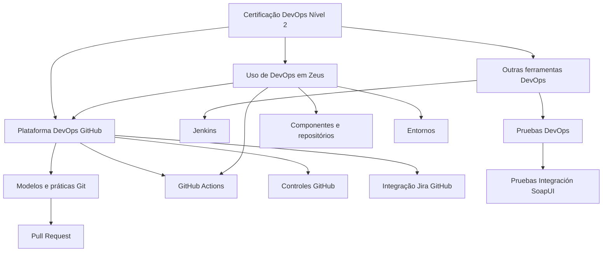

# Certificação DevOps Nível 2 — Plataforma DevOps GitHub, GitFlow e Zeus

## 1. Metadados do Documento
- **Arquivo de Origem:** Não identificado no conteúdo fornecido
- **Tipo de Documento:** Apresentação Executiva / Material de Certificação
- **Domínio / Sistema:** DevOps, GitHub, GitFlow, Jenkins, SoapUI e Zeus
- **Público-Alvo:** Desenvolvedores, profissionais DevOps e equipes que utilizam Zeus
- **Data/Versão Identificada:** Não identificada

---

## 2. Resumo Executivo & Contexto de Negócio

O documento apresenta o conteúdo associado à **Certificação DevOps Nível 2**, centrada na plataforma DevOps baseada em GitHub. A apresentação relaciona práticas de controle de código-fonte, modelos de fluxo Git, versionamento, Pull Requests, GitHub Actions, controles de plataforma e integração com Jira.

A certificação aborda os modelos **GitFlow**, **GitHub Flow Modelo simple** e **GitHub Flow Modelo Releases**, além de boas práticas relacionadas ao GitFlow. O conteúdo também menciona padrões de versionamento, nomenclatura de versões, padrões gerais e SemVer, sem detalhar regras específicas de aplicação.

O material inclui ferramentas e práticas complementares de DevOps: Jenkins, configuração inicial, configuração de pipeline, biblioteca comum, testes contínuos e testes de integração com SoapUI. O sistema Zeus aparece como contexto de uso de DevOps, incluindo integração com GitHub, ambientes, componentes, repositórios e ações.

O documento funciona como uma visão de tópicos de capacitação e não como uma especificação técnica detalhada. Não há detalhamento de pipelines, contratos de integração, configurações, URLs, permissões, métodos HTTP, estruturas de repositório ou critérios de aprovação de Pull Requests.

---

## 3. Arquitetura, Componentes & Tecnologias Envolvidas

Os elementos explicitamente citados são:

- **GitHub:** Plataforma DevOps abordada pela certificação.
- **GitFlow:** Modelo de fluxo Git e tema de boas práticas.
- **GitHub Flow Modelo simple:** Modelo de fluxo mencionado sem detalhamento.
- **GitHub Flow Modelo Releases:** Modelo de fluxo mencionado sem detalhamento.
- **Pull Request:** Tema de colaboração e revisão de código.
- **GitHub Actions:** Tema de automação, incluindo introdução, IC actions e implementação de actions.
- **Jira:** Sistema citado para integração com GitHub.
- **Jenkins:** Ferramenta DevOps citada para configuração inicial e configuração de pipeline.
- **SoapUI:** Ferramenta citada para testes de integração.
- **Zeus:** Contexto de uso de DevOps, com integração GitHub, ambientes, componentes, repositórios e ações.
- **Home Solutions APIs Documentation:** Referência textual presente no material, sem contexto técnico adicional.
- **CF:** Sigla presente na expressão “Git / CF”, sem expansão ou explicação.



> **Nota de Análise:** O diagrama representa a organização temática explicitamente apresentada. O documento não descreve integrações técnicas, sequências de execução, protocolos, interfaces ou fluxos de dados entre GitHub, Jenkins, Jira, SoapUI e Zeus.

---

## 4. Regras de Negócio, Especificações Funcionais & Processos

### Certificação DevOps Nível 2
A apresentação lista os seguintes temas para a certificação:

1. Plataforma DevOps GitHub.
2. Modelo GitFlow.
3. GitHub Flow Modelo simple.
4. Boas práticas GitFlow.
5. GitHub Flow Modelo Releases.
6. Versionado.
7. Nomenclatura de versiones.
8. Estándares.
9. SemVer.
10. Pull Request.
11. Documentação oficial GitHub Pull Request.
12. Actions GitHub.
13. Introdução Actions GitHub.
14. IC actions.
15. Implementação actions.
16. Controles GitHub.
17. Sistema de nomeação de commits.
18. Integração Jira GitHub.
19. Jenkins.
20. Configuração inicial.
21. Configuração Pipeline.
22. Libreria común.
23. Pruebas DevOps.
24. Pruebas continuas.
25. Pruebas Integración SoapUI.
26. Uso de DevOps em Zeus.
27. Integração GitHub.
28. Entornos.
29. Alta.
30. Detalle.
31. Componentes.
32. Componentes e repositorios.
33. Acciones / actions.
34. Contenido relevante.

### Restrições de fidelidade documental

- O documento **não define** branches, nomenclaturas de branch, políticas de merge ou ciclos de release para GitFlow ou GitHub Flow.
- O documento **não descreve** a semântica, o formato ou a política de versionamento SemVer.
- O documento **não apresenta** configurações de GitHub Actions, arquivos YAML, gatilhos, jobs, runners, secrets ou workflows.
- O documento **não apresenta** parâmetros de Jenkins, estágios de pipeline, bibliotecas comuns ou credenciais.
- O documento **não apresenta** cenários, endpoints ou evidências de execução de testes SoapUI.
- O documento **não detalha** ambientes, componentes, repositórios ou ações do Zeus.
- O documento **não especifica** como a integração Jira GitHub deve ser configurada ou operada.

---

## 5. Tabelas de Parâmetros, Ambientes e Estruturas de Dados

| Item / Parâmetro | Descrição / Função | Tipo / Valores / Formato | Ambiente / Observações |
| :--- | :--- | :--- | :--- |
| Certificação DevOps Nível 2 | Tema central do material. | Certificação / capacitação. | Não há versão ou data. |
| Plataforma DevOps GitHub | Plataforma DevOps mencionada. | Plataforma. | Sem URL ou configuração. |
| GitFlow | Modelo de fluxo Git citado. | Modelo de versionamento e colaboração. | Regras não detalhadas. |
| GitHub Flow Modelo simple | Modelo GitHub Flow citado. | Modelo de fluxo. | Sem detalhamento adicional. |
| GitHub Flow Modelo Releases | Modelo GitHub Flow com releases citado. | Modelo de fluxo. | Sem detalhamento adicional. |
| Versionado | Tema de versionamento. | Prática / processo. | Critérios não definidos. |
| Nomenclatura de versiones | Tema de nomeação de versões. | Convenção. | Formato não definido. |
| Estándares | Tema de padrões. | Diretriz. | Padrões não especificados. |
| SemVer | Termo relacionado a versionamento. | Padrão citado. | Regras não apresentadas. |
| Pull Request | Tema de colaboração e revisão. | Recurso do GitHub. | Processo de aprovação não definido. |
| Documentación oficial GitHub Pull Request | Referência a documentação oficial. | Referência documental. | URL não fornecida. |
| Actions GitHub | Tema de automação no GitHub. | Ferramenta / recurso. | Workflows não descritos. |
| IC actions | Item apresentado no bloco GitHub Actions. | Termo / tópico. | Significado e implementação não detalhados. |
| Implementación actions | Implementação de actions. | Atividade / tópico. | Sem exemplos de configuração. |
| Controles GitHub | Controles associados ao GitHub. | Controle / tópico. | Tipos de controle não informados. |
| Sistema de nombrado de commits | Sistema de nomeação de commits. | Convenção. | Convenção concreta não informada. |
| Integración Jira GitHub | Integração entre Jira e GitHub. | Integração. | Método e configuração não informados. |
| Jenkins | Ferramenta DevOps adicional. | Ferramenta. | Sem versão, servidor ou URL. |
| Configuración Inicial | Item associado a Jenkins. | Configuração. | Parâmetros não informados. |
| Configuración Pipeline | Item associado a Jenkins. | Pipeline. | Estágios e configuração não informados. |
| Libreria común | Biblioteca comum citada. | Biblioteca / componente. | Sem nome técnico ou localização. |
| Pruebas DevOps | Tema de testes DevOps. | Processo de teste. | Sem escopo detalhado. |
| Pruebas continuas | Testes contínuos. | Processo de teste. | Ferramenta ou gatilhos não informados. |
| Pruebas Integración SoapUI | Testes de integração com SoapUI. | Processo de teste. | Cenários e serviços não identificados. |
| Zeus | Sistema ou contexto de utilização de DevOps. | Sistema / domínio. | Sem arquitetura detalhada. |
| Integración GitHub em Zeus | Integração GitHub no contexto Zeus. | Integração. | Mecanismo não especificado. |
| Entornos | Ambientes mencionados para Zeus. | Ambientes. | Nomes e URLs não informados. |
| Alta | Item presente no bloco de ambientes. | Tópico. | Sem explicação adicional. |
| Detalle | Item presente no bloco de ambientes. | Tópico. | Sem explicação adicional. |
| Componentes | Componentes relacionados a Zeus. | Componentes. | Não enumerados. |
| Componentes y repositorios | Componentes e repositórios no contexto Zeus. | Estrutura organizacional. | Não detalhados. |
| Acciones / actions | Ações no contexto Zeus. | Automação / tópico. | Não detalhadas. |
| Home Solutions APIs Documentation | Texto de referência presente na primeira página. | Referência / documentação. | Relação com os demais tópicos não esclarecida. |
| Git / CF | Texto presente na primeira página. | Referência textual. | A sigla CF não é explicada. |

---

## 6. Bateria de Perguntas & Respostas para RAG (FAQ Sintético)

### P1: Qual é o objetivo principal da Certificação DevOps Nível 2?
**R:** A Certificação DevOps Nível 2 aborda a plataforma DevOps GitHub, modelos GitFlow e GitHub Flow, versionamento, Pull Requests, GitHub Actions, controles GitHub, integração Jira GitHub, Jenkins, testes DevOps, SoapUI e uso de DevOps em Zeus.

### P2: Quais modelos de fluxo Git são mencionados no material?
**R:** O material menciona o Modelo GitFlow, o GitHub Flow Modelo simple e o GitHub Flow Modelo Releases. O documento também cita boas práticas GitFlow, mas não apresenta regras operacionais, branches ou políticas de merge para esses modelos.

### P3: O documento define uma convenção de versionamento ou nomenclatura de versões?
**R:** Não. O documento apresenta os tópicos “Versionado”, “Nomenclatura de versiones”, “Estándares” e “SemVer”, mas não fornece sintaxe de versões, critérios de incremento, exemplos ou regras de validação.

### P4: O que é abordado sobre Pull Requests na apresentação?
**R:** A apresentação inclui Pull Request e uma referência à documentação oficial GitHub Pull Request. Entretanto, não especifica critérios de aprovação, quantidade de revisores, políticas de proteção de branches ou procedimentos de merge.

### P5: Quais tópicos de GitHub Actions estão presentes?
**R:** O documento menciona Actions GitHub, Introdução Actions GitHub, IC actions e Implementación actions. Não há arquivos de workflow, exemplos YAML, eventos de disparo, jobs, runners ou configurações técnicas.

### P6: Como a integração entre Jira e GitHub é descrita?
**R:** A integração Jira GitHub é apresentada como um tópico de conteúdo. O documento não descreve autenticação, configuração, sincronização de issues, formato de links ou regras de rastreabilidade entre commits, Pull Requests e itens Jira.

### P7: Qual é o papel de Jenkins no documento?
**R:** Jenkins é listado na seção “Plataforma DevOps Otras herramientas”, juntamente com Configuración Inicial, Configuración Pipeline e Libreria común. O material não fornece detalhes de instalação, pipelines, agentes, bibliotecas ou integrações.

### P8: Quais práticas de teste DevOps são citadas?
**R:** O documento cita Pruebas DevOps, Pruebas continuas e Pruebas Integración SoapUI. Não informa quais aplicações são testadas, quais cenários são executados, quais serviços são integrados nem como os resultados são publicados.

### P9: O que o documento informa sobre o uso de DevOps em Zeus?
**R:** O documento apresenta “Uso de DevOps en Zeus” e associa esse contexto a integração GitHub, entornos, alta, detalle, componentes, componentes y repositorios, acciones e contenido relevante. Não há detalhamento técnico dos ambientes, componentes ou repositórios Zeus.

### P10: Existem URLs, servidores, portas ou credenciais para GitHub, Jenkins, Jira, SoapUI ou Zeus?
**R:** Não. O conteúdo fornecido não contém URLs de ambientes, nomes de servidores, portas, credenciais, tokens, variáveis de configuração ou caminhos de logs.

### P11: O que significa a sigla CF na expressão “Git / CF”?
**R:** O documento apresenta a expressão “Git / CF”, mas não expande ou explica a sigla CF. Portanto, o significado de CF não pode ser determinado com base no conteúdo fornecido.

### P12: Há treinamentos opcionais indicados no material?
**R:** Sim. O material cita como opcional a formação Microsoft “Introducción Action GitHub (30m)” e também a formação Microsoft “Cambios y PullRequest (45m)”.

---

## 7. Glossário de Termos, Siglas & Conceitos-Chave

- **DevOps:** Termo central da certificação e das práticas apresentadas; o documento não fornece definição formal.
- **GitHub:** Plataforma DevOps citada no documento.
- **GitFlow:** Modelo de fluxo Git mencionado.
- **GitHub Flow:** Modelo de fluxo Git citado nas variantes “Modelo simple” e “Modelo Releases”.
- **Pull Request:** Recurso/tópico GitHub mencionado para colaboração e mudanças.
- **GitHub Actions:** Recurso/tópico de automação GitHub mencionado.
- **IC actions:** Termo apresentado no bloco GitHub Actions; significado não detalhado.
- **Jira:** Ferramenta citada no tópico de integração Jira GitHub.
- **Jenkins:** Ferramenta DevOps mencionada.
- **SoapUI:** Ferramenta mencionada para testes de integração.
- **SemVer:** Termo citado no contexto de versionamento; o documento não apresenta definição.
- **Zeus:** Sistema ou contexto de uso de DevOps citado no documento.
- **CF:** Sigla presente em “Git / CF”; significado não identificado no conteúdo.
- **Home Solutions APIs Documentation:** Referência textual apresentada sem explicação contextual adicional.

---

## 8. Notas Críticas, Riscos & Limitações

- O conteúdo é predominantemente uma lista de tópicos de capacitação, não uma especificação operacional ou arquitetural completa.
- Não existem instruções implementáveis para GitFlow, GitHub Flow, Pull Requests, GitHub Actions, Jenkins ou SoapUI.
- Não há definição de responsabilidades, matriz de permissões, critérios de governança, políticas de segurança ou processo de aprovação.
- Não há informações sobre URLs, ambientes, servidores, repositórios, branches, pipelines, logs, métricas ou alertas.
- A integração entre GitHub, Jira, Jenkins, SoapUI e Zeus é apenas citada; o documento não descreve mecanismos técnicos de integração.
- Os itens “Alta”, “Detalle”, “IC actions”, “CF” e “Home Solutions APIs Documentation” não possuem detalhamento suficiente para interpretação precisa.

> **Nota de Análise:** O documento lista Zeus, componentes, repositórios e ações, porém não detalha os componentes Zeus, os métodos de integração, os contratos técnicos ou os fluxos de implantação.

---

## 9. Conteúdo Bruto Estruturado (Referência Fiel)

```text
--- [PÁGINA 1 DE 3] ---

CERTIFICACIÓN - DevOps Nivel 2
 
CERTIFICACIÓN nivel 2 DevOps
Plataforma DevOps GitHub
Modelo GitFlow
GitHub Flow Modelo simple
Buenas prácticas GitFlow
GitHub Flow Modelo Releases
Versionado
Nomenclatura de versiones
Estándares
SemVer
Git
 / 
 CF
Home Solutions APIs Documentation Zeus
EN


--- [PÁGINA 2 DE 3] ---

Pull Request
Pull Request
Documentación oficial GitHub Pull Request: Pull Request GitHub
Actions GitHub
Introducción Actions GitHub
IC actions
Implementación actions
Opcional Formación Microsoft: Introducción Action GitHub (30m)
Controles GitHub
Controles GitHub
Contenidos adicionales
Sistema de nombrado de commits
Integración Jira GitHub
Opcional: Formación Microsoft: Cambios y PullRequest (45m)
Plataforma DevOps Otras herramientas
Jenkins
Configuración Inicial
Configuración Pipeline
Libreria común
Pruebas DevOps
Pruebas continuas
Pruebas Integración SoapUI
Zeus
Herramientas


--- [PÁGINA 3 DE 3] ---

Uso de DevOps en Zeus
Integración GitHub
Entornos:
Alta
Detalle
Componentes
Componentes y repositorios
Acciones
Acciones (actions)
Contenido relevante
```
