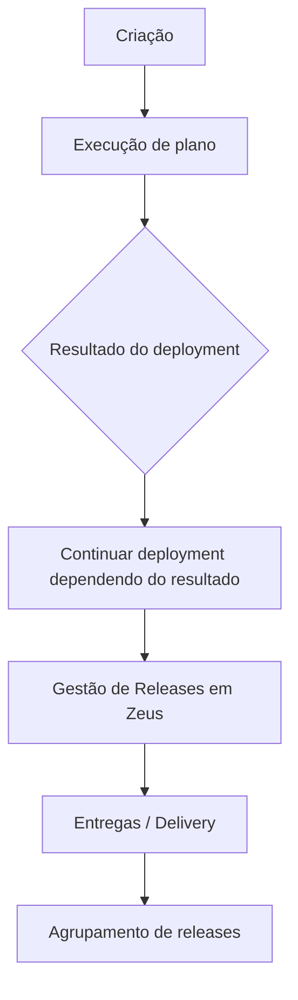

# Certificação DevOps Nível 3 — Plataforma DevOps, GitHub, Zeus e Integrações

## 1. Metadados do Documento
- **Arquivo de Origem:** `Não identificado no conteúdo fornecido`
- **Tipo de Documento:** Apresentação Executiva
- **Domínio / Sistema:** Certificação DevOps Nível 3; Plataforma DevOps; GitHub; Zeus
- **Público-Alvo:** Desenvolvedores, Arquitetos, Operação
- **Data/Versão Identificada:** Não identificada

---

## 2. Resumo Executivo & Contexto de Negócio

O conteúdo apresenta tópicos associados à **Certificação DevOps Nível 3**, com foco na utilização de uma Plataforma DevOps que inclui funcionalidades do GitHub, bibliotecas comuns, automação de CI/CD, gestão de segredos, infraestrutura como código, testes, monitorização e processos de deployment.

No âmbito do GitHub, o documento cita a utilização de **Issues**, documentação oficial sobre Issues, acesso e autenticação de API, limites de utilização e Personal Token. Também são mencionadas GitHub Actions, gestão de execuções de actions e formações opcionais da Microsoft relacionadas a Actions GitHub.

A apresentação também referencia componentes e capacidades de integração, incluindo **GAIA BOOT**, Azure KeyVault, deploy de contas AWS, IAC em Google e AWS, integração com Octane, integração com UFT, monitorização DevOps, DORA Metrics e indicadores.

O sistema **Zeus** é citado em relação a APIs, documentação, planos de deployment em ambientes, gestão de releases e entregas. As entregas (Delivery) são descritas como um agrupamento de releases.

**Nota de Análise:** O material apresenta principalmente tópicos e nomes de ferramentas. Não detalha contratos técnicos, métodos HTTP, versões, URLs completas, credenciais, configurações de CI/CD, critérios de aprovação ou implementações de integração.

---

## 3. Arquitetura, Componentes & Tecnologias Envolvidas

| Componente / Tecnologia | Contexto citado no documento |
| :--- | :--- |
| Certificação DevOps Nível 3 | Tema central da apresentação. |
| Plataforma DevOps | Plataforma associada a GitHub, bibliotecas, funções, testes, monitorização e deployment. |
| GitHub | Plataforma DevOps citada para Issues, API e Actions. |
| GitHub Issues | Funcionalidade citada para uso de Issues no GitHub. |
| API GitHub | Citada em relação a início rápido, autenticação, limites, Personal Token e acesso à API. |
| GitHub Actions | Citada para gestão de execuções de actions e formações opcionais Microsoft. |
| GAIA BOOT | Citado em “Librerias comunes”, “Funciones” e exemplo de CI/CD. |
| Azure KeyVault | Citado como KeyVault. |
| AWS | Citado para deploy de contas e IAC. |
| Google | Citado para IAC. |
| Octane | Citado para integração de testes. |
| UFT | Citado para integração de testes. |
| Monitorização DevOps | Capacidade de monitorização citada. |
| DORA Metrics | Métricas citadas no contexto de monitorização e indicadores. |
| Zeus | Citado para APIs, documentação, planos de deployment, gestão de releases e entregas. |
| Delivery | Agrupamento de releases no Zeus. |



**Nota de Análise:** O diagrama representa a sequência textual apresentada para criação, execução de plano, continuação de deployment, gestão de releases e Delivery. O documento não detalha resultados possíveis, condições de decisão, responsáveis ou interfaces entre essas etapas.

---

## 4. Regras de Negócio, Especificações Funcionais & Processos

### Certificação e Plataforma DevOps
- O documento está associado à **Certificação DevOps Nível 3**.
- A Plataforma DevOps inclui tópicos de GitHub, bibliotecas, funções, GAIA BOOT, KeyVault, deploy, IAC, testes, monitorização, DORA Metrics, indicadores e planos de deployment.

### GitHub Issues e API
- O documento menciona o uso de **Issues em GitHub**.
- É citada documentação oficial do GitHub sobre Issues.
- A API GitHub é abordada pelos tópicos:
  - Uso de API;
  - Início rápido;
  - Autenticação API;
  - Limites;
  - Personal Token;
  - Acesso ao API.
- O conteúdo não detalha endpoints, permissões, métodos HTTP, payloads, scopes de token ou regras de rate limiting.

### GitHub Actions
- O documento cita **Actions GitHub**.
- Existe referência à gestão de execuções de actions.
- São listadas formações opcionais da Microsoft:
  - Introdução Action GitHub, com duração indicada de 30 minutos;
  - Action GitHub, com duração indicada de 5 horas.
- O conteúdo não descreve workflows, gatilhos, runners, pipelines, actions reutilizáveis ou regras de falha.

### Bibliotecas, Funções e GAIA BOOT
- São citadas bibliotecas comuns.
- São citadas funções.
- **GAIA BOOT** é mencionado como componente ou tema relacionado.
- Existe referência a um exemplo de **GAIA BOOT CI/CD**.
- O documento não detalha bibliotecas, funções, dependências, artefatos, comandos ou configuração do exemplo de CI/CD.

### Segredos, Deploy e Infraestrutura como Código
- **Azure KeyVault** é citado.
- Há referência a **Deploy Cuentas AWS**.
- Há referência a **IAC en Google**.
- Há referência a **IAC en AWS**.
- O documento não especifica ferramentas de IAC, contas, regiões, templates, repositórios, pipelines, permissões ou políticas de gestão de segredos.

### Testes e Monitorização
- São citadas integrações com **Octane** e **UFT**.
- É citada a capacidade de monitorizar DevOps.
- **DORA Metrics** e indicadores são mencionados.
- O conteúdo não apresenta métricas específicas, fórmulas, metas, limiares, dashboards ou mecanismos de coleta.

### Zeus, Planos, Releases e Entregas
- **Zeus** é citado como contexto de APIs e documentação.
- O documento menciona planos de deployment em ambientes.
- O processo listado contém:
  1. Criação;
  2. Execução de plano;
  3. Continuação do deployment conforme o resultado;
  4. Gestão de releases em Zeus;
  5. Entregas (Delivery), definidas como agrupamento de releases.
- O documento não detalha ambientes, aprovações, critérios de continuidade, regras de rollback, responsáveis, URLs ou contratos da API Zeus.

---

## 5. Tabelas de Parâmetros, Ambientes e Estruturas de Dados

| Item / Parâmetro | Descrição / Função | Tipo / Valores / Formato | Ambiente / Observações |
| :--- | :--- | :--- | :--- |
| Issues GitHub | Uso de Issues no GitHub. | Funcionalidade GitHub | Sem detalhamento adicional. |
| Documentação Issues GitHub | Documentação oficial sobre Issues. | Referência documental | URL não informada no conteúdo. |
| Uso API | Uso de API no contexto GitHub. | Capacidade / tópico | Endpoints não informados. |
| Início rápido | Tópico relacionado à API. | Material ou etapa | Sem detalhamento adicional. |
| Autenticação API | Tópico de autenticação para API. | Segurança / acesso | Método de autenticação não informado. |
| Limites | Tópico relativo à API. | Restrições de utilização | Valores ou políticas não informados. |
| Personal Token | Token pessoal citado para acesso à API. | Credencial | Scopes, armazenamento e rotação não informados. |
| Acesso ao API | Acesso à API. | Capacidade | API não detalhada além do contexto GitHub. |
| Gestão de execuções actions | Gestão de execuções de GitHub Actions. | Processo operacional | Workflow e runners não informados. |
| Introdução Action GitHub | Formação Microsoft opcional. | Formação | Duração indicada: 30m. |
| Action GitHub | Formação Microsoft opcional. | Formação | Duração indicada: 5h. |
| Librerias comunes | Bibliotecas comuns. | Componente / tópico | Bibliotecas não enumeradas. |
| Funciones | Funções. | Componente / tópico | Funções não enumeradas. |
| GAIA BOOT | Componente ou tema citado. | Tecnologia / componente | Sem detalhamento técnico adicional. |
| Exemplo GAIA BOOT CI/CD | Exemplo de CI/CD associado a GAIA BOOT. | Pipeline / exemplo | Etapas e ferramentas não informadas. |
| Azure KeyVault | KeyVault citado. | Gestão de segredos | Configuração não detalhada. |
| Deploy Cuentas AWS | Deploy de contas AWS. | Processo de deployment | Contas e procedimentos não informados. |
| IAC en Google | IAC em Google. | Infraestrutura como código | Ferramenta e recursos não informados. |
| IAC en AWS | IAC em AWS. | Infraestrutura como código | Ferramenta e recursos não informados. |
| Integração Octane | Integração com Octane. | Integração de testes | Fluxo e configuração não informados. |
| Integração UFT | Integração com UFT. | Integração de testes | Fluxo e configuração não informados. |
| Monitorizar DevOps | Monitorização de DevOps. | Observabilidade / operação | Ferramentas e métricas não informadas. |
| DORA Metrics | Métricas DORA. | Indicadores | Indicadores concretos não detalhados. |
| Zeus | Plataforma ou sistema citado. | Sistema / plataforma | Associado a APIs, documentação, planos e releases. |
| Planos de despliegue en entornos | Planos de deployment em ambientes. | Processo de deployment | Ambientes não identificados. |
| Creación | Criação de plano ou processo. | Etapa processual | Objeto criado não detalhado. |
| Ejecución de plan | Execução de plano. | Etapa processual | Plano não detalhado. |
| Continuar despliegue dependiendo del resultado | Continuação do deployment conforme resultado. | Regra de fluxo | Resultados e condições não informados. |
| Gestión Releases en Zeus | Gestão de releases em Zeus. | Processo de release | Regras de release não informadas. |
| Entregas (Delivery) | Agrupamento de releases. | Entidade / agrupamento | Critérios de agrupamento não informados. |

---

## 6. Bateria de Perguntas & Respostas para RAG (FAQ Sintético)

### P1: Qual é o tema central do documento?
**R:** O documento trata da **Certificação DevOps Nível 3** e apresenta tópicos relacionados à Plataforma DevOps, GitHub, GitHub Actions, GAIA BOOT, Azure KeyVault, AWS, Google, testes, monitorização, DORA Metrics e Zeus.

### P2: Quais tópicos de GitHub são abordados?
**R:** O documento cita o uso de Issues no GitHub, documentação oficial sobre Issues, uso de API, início rápido, autenticação API, limites, Personal Token, acesso à API, GitHub Actions e gestão de execuções de actions.

### P3: O documento especifica quais endpoints da API GitHub devem ser utilizados?
**R:** Não. O documento apenas cita uso de API, início rápido, autenticação, limites, Personal Token e acesso à API. Não há endpoints, métodos HTTP, payloads ou contratos JSON descritos.

### P4: Que formações opcionais de GitHub Actions são mencionadas?
**R:** São mencionadas duas formações opcionais da Microsoft: **Introdução Action GitHub**, com duração indicada de 30 minutos, e **Action GitHub**, com duração indicada de 5 horas.

### P5: Qual é o papel de GAIA BOOT no documento?
**R:** GAIA BOOT é citado no contexto de bibliotecas comuns, funções e um exemplo de CI/CD. O documento não fornece detalhes técnicos sobre a arquitetura, configuração, comandos ou dependências de GAIA BOOT.

### P6: Quais recursos de infraestrutura e deployment são mencionados?
**R:** O documento cita Azure KeyVault, deploy de contas AWS, IAC em Google, IAC em AWS e planos de deployment em ambientes. Não há detalhamento sobre ferramentas de infraestrutura como código, ambientes, contas ou regiões.

### P7: Quais integrações de testes são listadas?
**R:** O documento menciona integração com **Octane** e integração com **UFT**. Não apresenta configuração, fluxos de execução, resultados de testes ou contratos de integração.

### P8: O que o documento informa sobre observabilidade e métricas?
**R:** O conteúdo menciona monitorização DevOps, DORA Metrics e indicadores. Contudo, não identifica métricas concretas, fórmulas de cálculo, metas, dashboards ou fontes de dados.

### P9: Como o Zeus é relacionado ao processo de deployment?
**R:** Zeus é citado em relação a APIs, documentação, planos de deployment em ambientes e gestão de releases. A sequência textual também relaciona a gestão de releases em Zeus às entregas, ou Delivery.

### P10: O que são Entregas (Delivery) segundo o documento?
**R:** O documento define **Entregas (Delivery)** como um agrupamento de releases.

### P11: Qual fluxo de deployment é apresentado?
**R:** O fluxo textual apresentado é: criação, execução de plano, continuação do deployment dependendo do resultado, gestão de releases em Zeus e entregas ou Delivery como agrupamento de releases. O documento não detalha as condições associadas aos resultados do deployment.

### P12: O documento define critérios para continuar ou interromper um deployment?
**R:** Não. O documento cita “Continuar despliegue dependiendo del resultado”, mas não especifica resultados possíveis, condições de aprovação, condições de falha, responsáveis ou procedimentos de rollback.

---

## 7. Glossário de Termos, Siglas & Conceitos-Chave

- **API:** Interface de programação citada no contexto de GitHub e Zeus; o documento não detalha contratos ou endpoints.
- **AWS:** Plataforma citada para deploy de contas e infraestrutura como código.
- **CI/CD:** Termo citado no exemplo “GAIA BOOT CI/CD”; o documento não expande a sigla nem descreve o pipeline.
- **Delivery:** Entrega definida no documento como agrupamento de releases.
- **DevOps:** Contexto de certificação, plataforma, monitorização e práticas de deployment.
- **DORA Metrics:** Métricas DORA citadas no contexto de monitorização e indicadores; métricas específicas não são detalhadas.
- **GAIA BOOT:** Componente ou tema citado em bibliotecas, funções e exemplo de CI/CD.
- **GitHub Actions:** Funcionalidade citada para gestão de execuções de actions.
- **IAC:** Termo usado para infraestrutura como código em Google e AWS; o documento não expande a sigla.
- **KeyVault:** Azure KeyVault, citado como capacidade relacionada a segredos.
- **Octane:** Ferramenta ou sistema citado para integração de testes.
- **Personal Token:** Token pessoal mencionado no contexto de acesso à API.
- **Release:** Elemento gerido no Zeus e agrupado em entregas.
- **UFT:** Ferramenta ou sistema citado para integração de testes.
- **Zeus:** Sistema citado para APIs, documentação, planos de deployment, gestão de releases e Delivery.

---

## 8. Notas Críticas, Riscos & Limitações

- O conteúdo é predominantemente uma lista de tópicos de apresentação e não oferece especificações técnicas detalhadas.
- Não foram identificadas URLs completas, versões de ferramentas, ambientes nomeados, portas, repositórios, credenciais ou configurações.
- A referência a Personal Token não informa scopes, método de armazenamento, rotação, expiração ou procedimentos de revogação.
- O documento menciona limites de API, mas não informa valores, políticas nem mecanismos de tratamento.
- O fluxo de deployment indica continuação conforme resultado, porém não define critérios de decisão, aprovações, rollback ou responsáveis.
- As integrações com Octane e UFT são apenas citadas, sem detalhamento de conectores, formatos, gatilhos ou resultados esperados.
- DORA Metrics e indicadores são mencionados sem métricas específicas, metas, cálculo ou fonte de dados.
- **Nota de Análise:** O documento lista GAIA BOOT, Azure KeyVault, AWS, Google e Zeus, mas não descreve as integrações técnicas ou dependências entre esses elementos.

---

## 9. Conteúdo Bruto Estruturado (Referência Fiel)

```text
--- [PÁGINA 1 DE 3] ---

CERTIFICACIÓN - DevOps Nivel 3
CERTIFICACIÓN nivel 3
DevOps
Plataforma DevOps GitHub
Issues
Uso de Issues en GitHub
Documentación oficial GitHub sobre Issues: Issues GitHub
Uso API
Inicio rápido
Autenticación API
Límites
Personal Token
Acceso al API
 / 
 CF
Home Solutions APIs Documentation Zeus
EN


--- [PÁGINA 2 DE 3] ---

Actions GitHub
Actions GitHub Gestión de ejecuciones actions Opcional Formación Microsoft: Introducción Action
GitHub (30m) Opcional Formación Microsoft: Action GitHub (5h)
Plataforma DevOps
Librerias
Librerias comunes
Funciones
GAIA BOOT
Ejemplo GAIA BOOT CI/CD
KeyVault
Azure KeyVault
 Deploy
Deploy Cuentas AWS
IAC en Google
IAC en AWS
Pruebas
Integración Octane
Integración UFT
Monitorización:
Monitorizar DevOps
DORA Metrics
Indicadores
Zeus
 Planes de despliegue en entornos


--- [PÁGINA 3 DE 3] ---

Creación
 Ejecución de plan
Continuar despliegue dependiendo del resultado
Gestión Releases en Zeus
Entregas (Delivery) agrupación releases
Contenido relevante
```
